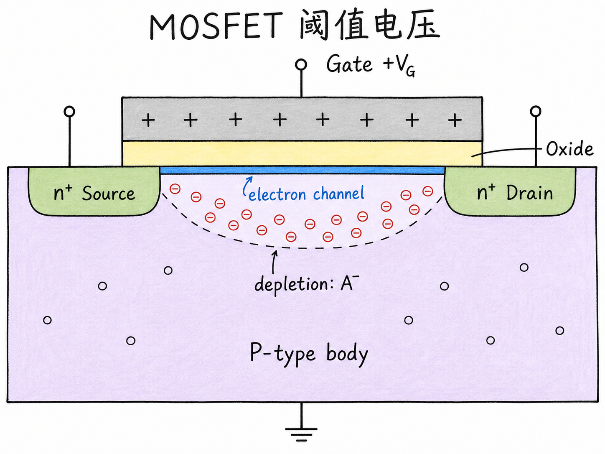
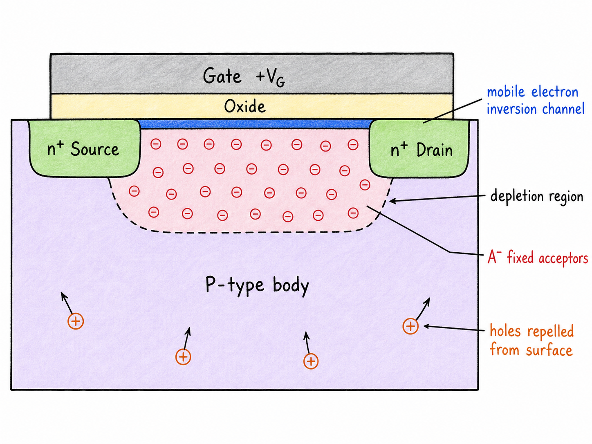
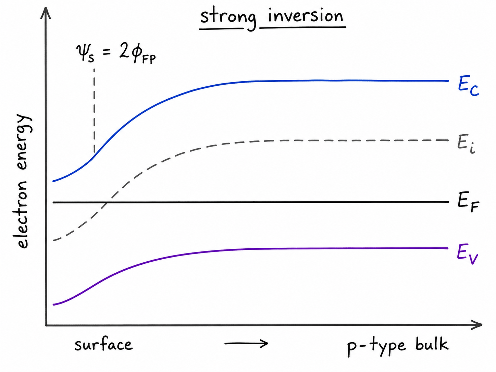
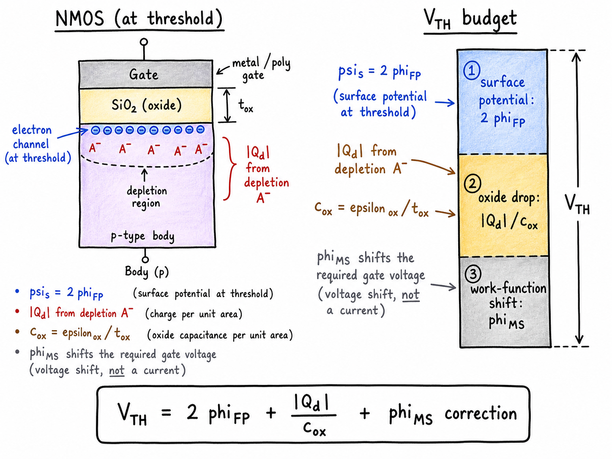

# MOSFET 阈值电压：栅压到底要把表面推到什么程度？

MOSFET 的栅极不是一个普通开关。它和半导体之间隔着氧化层，没有直流电流直接穿过去，但它能靠电场把 P 型硅表面一步步改造成“像 N 型一样”的表面。问题是：栅压加到多大，才算这个表面真的可以当沟道用？

这个电压就是阈值电压。它不是“有一点电子出现”的电压，也不是“耗尽区刚刚出现”的电压，而是表面进入强反型、栅下形成可导电电子沟道所需要的栅压。本系列里用 $V_{TH}$ 表示它，避免和热电压 $V_T=kT/q$ 混淆。

读完这篇，你会知道

- 为什么正栅压会先排斥空穴、形成耗尽区，最后吸引电子形成沟道
- 为什么阈值条件不是随便定的，而是 $\psi_s=2\phi_{FP}$
- 阈值电压公式里三项分别来自哪里：表面电势、耗尽电荷、功函数差
- 为什么氧化层固定电荷和金属-半导体功函数差会移动阈值电压
- 阈值电压为什么是 MOS 电容物理走向 MOSFET 电流公式的分界线

## 从 P 型表面开始：正栅压先赶走空穴

先看最基本的结构：上面是 gate，中间是 oxide，下面是 P 型 body。P 型体区里，多数载流子是空穴。源极和漏极如果已经做出来，通常是两个 $n^+$ 区，但在理解阈值电压时，核心先看栅氧下面这片 P 型表面。

当 gate 相对 body 加正电压时，电场穿过氧化层进入半导体。正栅压会排斥表面附近的空穴。空穴被推离表面之后，原来被空穴中和的离化受主 $A^-$ 留在原地，它们不能移动，于是表面下面出现一层固定负空间电荷区，这就是耗尽区。

这一步还不是 MOSFET “打开”。耗尽区里主要是固定离子，不是能横向导电的移动电子层。它只是说明栅压已经改变了半导体表面的电荷分布。

继续增大正栅压，能带弯曲继续加深，表面开始吸引电子。电子是 P 型体区的少数载流子，也可以从源漏附近补给到表面。当表面电子浓度足够高时，栅氧正下方会出现一层可移动电子层。对 NMOS 来说，这层电子层把 $n^+$ source 和 $n^+$ drain 连起来，就成为导电沟道。

阈值电压要描述的，就是从“只有耗尽区”走到“强反型沟道形成”的那一点。

## 反型不是看电荷感觉，而是看表面电势

判断阈值最稳的量是表面电势 $\psi_s$。它表示半导体表面相对准中性体区的电势变化。对 P 型 body 加正栅压时，$\psi_s>0$，电子能量带边向下弯曲。

P 型体区远离表面时，费米能级 $E_F$ 位于本征能级 $E_i$ 下方。这个距离对应 P 型费米电势 $\phi_{FP}$：

$$
\phi_{FP}=\phi_T\ln\left(\frac{N_A}{n_i}\right)
$$

其中 $\phi_T=kT/q$ 是热电压，$N_A$ 是受主掺杂浓度，$n_i$ 是本征载流子浓度。$N_A$ 越高，P 型体区越“P”，$\phi_{FP}$ 越大。

强反型条件可以这样理解：表面不只是少量电子增多，而是表面电子浓度已经达到体区空穴浓度同量级。也就是说，表面处的半导体在载流子意义上看起来像一个同等掺杂浓度的 N 型区域。

在能带图上，这对应一个很清楚的条件：从 P 型体区到反型表面，本征能级相对费米能级要跨过两倍的费米电势。所以阈值点满足：

$$
\psi_s = 2\phi_{FP}
$$

这就是阈值电压公式的核心。只要接受这个条件，后面的推导就不是重新求解 MOS 电容，而是在栅压预算里代入一个已知的表面电势。

## 栅压花到哪里去了？

栅极加上的电压不是全部掉在氧化层上，也不是全部用来弯曲半导体能带。它可以拆成几部分：

$$
V_G = V_{ox} + \psi_s + \text{功函数差修正}
$$

在阈值点，$\psi_s=2\phi_{FP}$。所以栅压的第一笔预算很明确：你至少要把半导体表面势推到 $2\phi_{FP}$。

第二笔预算是氧化层电压 $V_{ox}$。为什么需要它？因为半导体里形成了耗尽区，耗尽区里有固定负电荷 $Q_d$。gate 侧必须感应出相应正电荷，氧化层像一个电容，承受这部分电荷导致的电压降。

单位面积氧化层电容写作：

$$
c_{ox}=\frac{\varepsilon_{ox}}{t_{ox}}
$$

P 型 body 耗尽时，耗尽电荷 $Q_d\lt0$。按耗尽近似，其大小为：

$$
|Q_d|=\sqrt{2\varepsilon_{si}qN_A\psi_s}
$$

所以氧化层电压为：

$$
V_{ox}=\frac{|Q_d|}{c_{ox}}
$$

代入阈值条件 $\psi_s=2\phi_{FP}$：

$$
V_{ox,TH}=\frac{\sqrt{2\varepsilon_{si}qN_A(2\phi_{FP})}}{c_{ox}}
$$

这项的物理含义很直接：体区掺杂越高，耗尽区电荷越多，gate 要支撑的电荷越多，阈值电压通常越高；氧化层越薄，$c_{ox}$ 越大，同样电荷需要的氧化层电压越小，阈值电压会降低。

## 阈值电压公式：三项拼起来

把表面电势预算、氧化层电压预算和金属-半导体功函数差放在一起，理想 NMOS 在 P 型 body 上的阈值电压可以写成：

$$
V_{TH}=2\phi_{FP}
+\frac{\sqrt{2\varepsilon_{si}qN_A(2\phi_{FP})}}{c_{ox}}
-|\phi_{MS}|
$$

这个式子里，第一项 $2\phi_{FP}$ 是把表面推到强反型所需的半导体表面电势；第二项是为了平衡耗尽区固定受主离子而产生的氧化层电压；第三项来自 metal 和 semiconductor 的功函数差，它决定了不加外压时能带本来就偏向哪边。

需要注意，$\phi_{MS}$ 的符号不是靠背公式解决的。它取决于金属费米能级和半导体费米能级对齐后，能带自然弯曲的方向。如果功函数差本来就帮助表面向反型方向弯曲，外部 gate 需要提供的电压就少一些；如果它把能带往相反方向弯，外部 gate 就要补更多电压。

所以更可靠的记法不是死记最后一个正负号，而是问一句：这项是在帮助表面达到 $\psi_s=2\phi_{FP}$，还是在阻碍它？

## 氧化层固定电荷会让阈值漂移

真实氧化层里可能有固定正电荷，比如钠离子 $Na^+$ 或其他氧化层陷阱电荷。它们不能像沟道电子那样自由移动，但会参与电场分布。

如果氧化层里已经有正电荷 $Q_{ox}$，gate 金属需要额外提供的正电荷就会减少。等效到电压预算上，氧化层电压项会变成：

$$
V_{ox} - \frac{Q_{ox}}{c_{ox}}
$$

因此，固定正氧化层电荷通常会把 NMOS 的阈值电压往更低方向推。工艺上这件事很重要，因为阈值电压不是只由掺杂和氧化层厚度决定；界面电荷、氧化层电荷、功函数工程都会改变它。

这也是为什么现代 CMOS 里阈值电压是一个工艺设计量，而不只是课堂公式。你想要低功耗，就要控制关断漏电；你想要高速度，就希望器件容易打开。$V_{TH}$ 正好卡在这两件事之间。

## 最后把图像收住

阈值电压的本质可以压缩成一句话：对 P 型 body 的 NMOS，$V_{TH}$ 是正栅压把表面从空穴主导推过耗尽，直到强反型电子沟道形成所需的电压。

公式只是把这件事拆账：半导体表面要弯到 $2\phi_{FP}$，氧化层要承受耗尽电荷，功函数差和固定电荷会提前或推迟这个过程。理解了这张账，后面讲三端 MOSFET、体效应和电流公式时，阈值电压就不再是一个神秘常数，而是栅极真正把沟道“做出来”的边界。
