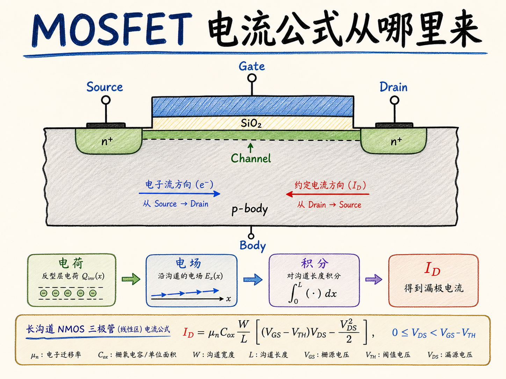
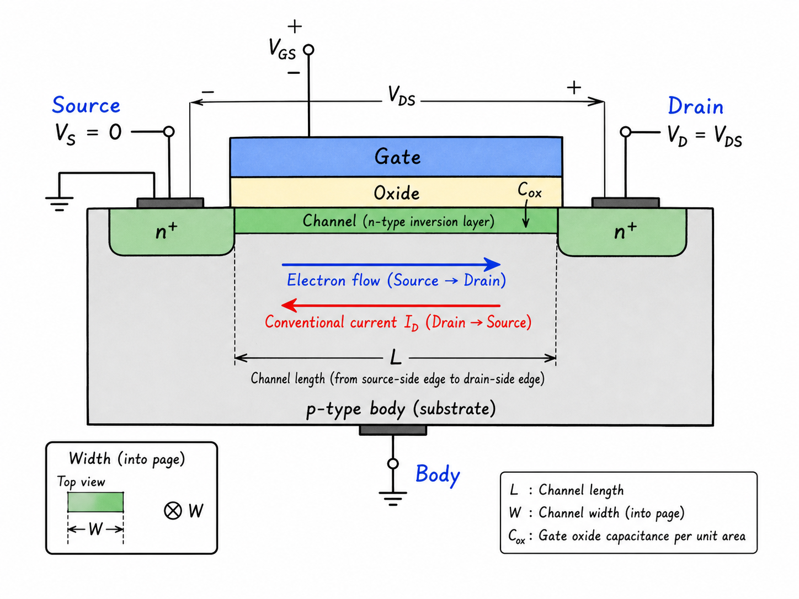
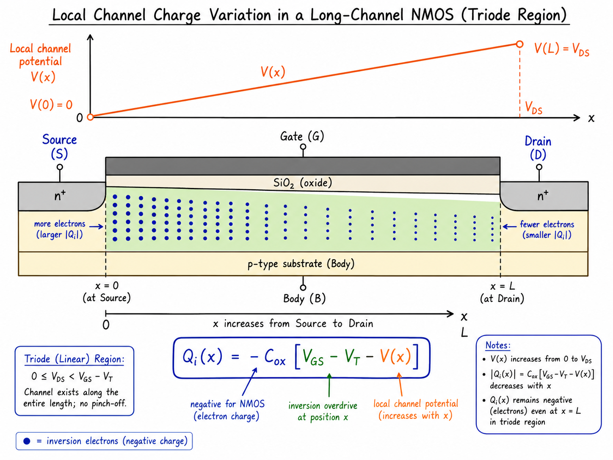
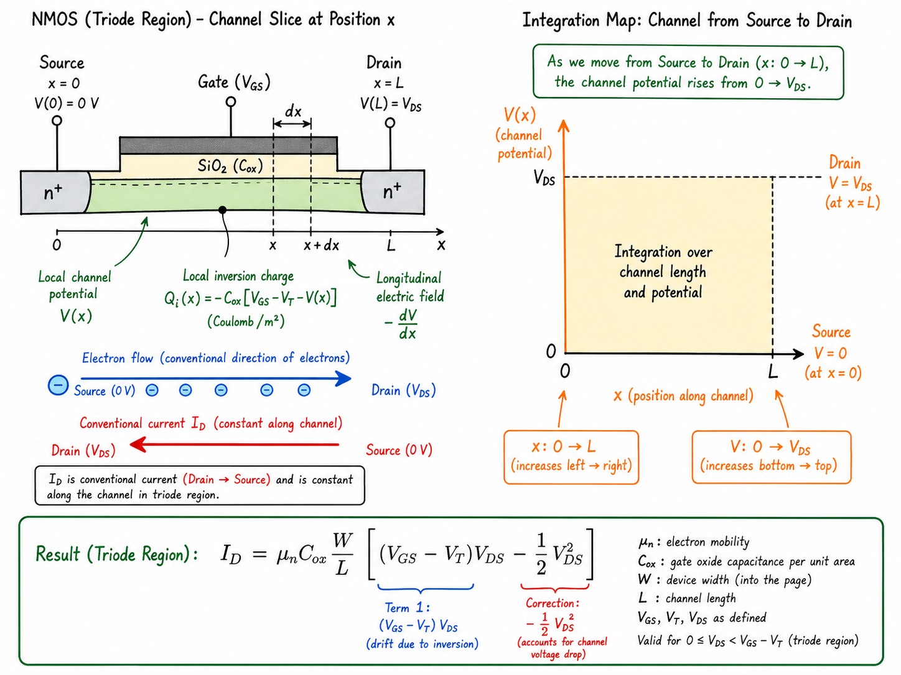

# MOSFET 电流公式从哪里来

很多人第一次见 MOSFET 三极区电流公式时，感受不是“我懂了”，而是“先背下来”。式子长这样：

$$
I_D=\mu_n C_{ox}\frac{W}{L}\left[(V_{GS}-V_T)V_{DS}-\frac{1}{2}V_{DS}^2\right]
$$

它看起来像一串符号拼出来的经验公式。但这个式子真正想说的，其实很朴素：栅压决定沟道里有多少电子，漏源电压决定这些电子怎样被拉着走，而沟道从源到漏的电势不是常数，所以要沿着沟道积分。本篇沿用这条推导里的常见写法，用 $V_T$ 表示 MOSFET 阈值电压；它不是热电压。

读完这篇，你会知道

- 为什么 MOSFET 三极区公式可以从“电容电荷”开始推出来
- 为什么沟道电荷不能只用一个固定值表示，而必须写成 $Q_i(x)$
- 公式里的 $-\frac{1}{2}V_{DS}^2$ 从哪里来
- 长沟道模型、线性区和渐变沟道近似到底在假设什么
- 怎样区分电子流方向和约定漏电流 $I_D$ 方向

## 先把模型边界说清楚

这里讨论的是 NMOS 的长沟道模型，并且工作在三极区，也常叫线性区。所谓长沟道，不是说器件真的很长，而是说我们暂时忽略短沟道效应：漏端电场不会把源端势垒强烈拉低，速度饱和、沟道长度调制、DIBL 这些现象先不进入推导。

三极区的关键条件是：

$$
0\le V_{DS}\lt V_{GS}-V_T
$$

也就是说，从源端到漏端，整个沟道仍然有反型电荷，没有在漏端夹断。若 $V_{DS}$ 增加到 $V_{GS}-V_T$，漏端沟道电荷会趋近于零，模型就到达饱和边界。

还有一个更隐含但更关键的假设：渐变沟道近似。它说沟道沿 $x$ 方向的电势变化相对缓慢，所以每一个很薄的沟道切片，都可以近似看成一个局部 MOS 电容。这样我们就能在位置 $x$ 上写出局部反型电荷。

## 栅压先决定“有多少电荷”

MOSFET 最容易理解的一面，是它像一个由栅压控制的电容。栅极、栅氧、半导体表面构成一个电容结构。对 NMOS 来说，当栅源电压超过阈值以后，P 型衬底表面出现电子反型层。

如果只看源端附近，沟道电势近似为 $0$，栅对沟道的有效电压大约是 $V_{GS}$。超过阈值的那一部分 $V_{GS}-V_T$，才真正用来增加反型层电子。因此源端单位面积反型电荷可以写成：

$$
Q_i(0)=-C_{ox}(V_{GS}-V_T)
$$

这里的负号不能省略成“无所谓”。$Q_i$ 是半导体表面的反型电荷，NMOS 的反型载流子是电子，所以电荷本身为负。电流公式最后写成正的 $I_D$，是因为 $I_D$ 采用从 drain 到 source 的传统电流方向；电子实际漂移方向是从 source 到 drain。

## 沟道电荷为什么要写成 $Q_i(x)$

漏端加上正电压以后，沟道每个位置的电势都不一样。把源端设为 $0$，沿着 source 到 drain 的方向定义坐标 $x$，局部沟道电势记为 $V(x)$。在三极区内：

$$
V(0)=0,\qquad V(L)=V_{DS}
$$

栅极电压是全局施加的，但局部沟道电势抬高以后，栅对该位置沟道的有效电压会变小。因此局部反型电荷应为：

$$
Q_i(x)=-C_{ox}\left[V_{GS}-V_T-V(x)\right]
$$

这就是整条推导的核心。越靠近 drain，$V(x)$ 越高，$V_{GS}-V_T-V(x)$ 越小，反型电子越少。只要 $V_{DS}\lt V_{GS}-V_T$，漏端仍有电荷：

$$
Q_i(L)=-C_{ox}(V_{GS}-V_T-V_{DS})
$$

当 $V_{DS}=V_{GS}-V_T$，漏端 $Q_i(L)=0$，这就是三极区走到饱和边界的物理图像。

## 电荷怎么变成电流

电流不是电荷本身，而是电荷移动的速率。对沟道里一小段电子来说，漂移速度由电场决定：

$$
v_n(x)=-\mu_n E_x
$$

如果坐标 $x$ 从 source 指向 drain，电势 $V(x)$ 从 $0$ 增加到 $V_{DS}$，电场 $E_x=-dV/dx$，所以电子漂移方向沿 $+x$，也就是从 source 到 drain。传统电流方向与电子相反，因此正的漏电流 $I_D$ 按 drain 到 source 计。

把符号约定整理到常用形式，可以写出沟道电流：

$$
I_D=-W\mu_n Q_i(x)\frac{dV}{dx}
$$

这个式子值得停一下。$W$ 是沟道宽度，$Q_i(x)$ 是单位面积反型电荷，$WQ_i(x)$ 给出单位长度沟道里的电荷量；$\mu_n dV/dx$ 给出由局部电势梯度导致的漂移强度。前面的负号把“电子负电荷”和“漏电流约定方向”统一起来。

代入 $Q_i(x)$：

$$
I_D=\mu_n C_{ox}W\left[V_{GS}-V_T-V(x)\right]\frac{dV}{dx}
$$

在稳态长沟道模型里，$I_D$ 沿沟道不随 $x$ 变。否则某处电荷会持续堆积，系统就不是稳态。

## 积分给出那一项二次项

把上式移项：

$$
I_D\,dx=\mu_n C_{ox}W\left[V_{GS}-V_T-V\right]dV
$$

从 source 到 drain 积分，左边 $x$ 从 $0$ 到 $L$，右边 $V$ 从 $0$ 到 $V_{DS}$：

$$
\int_0^L I_D\,dx=\mu_n C_{ox}W\int_0^{V_{DS}}\left[V_{GS}-V_T-V\right]dV
$$

左边是 $I_DL$。右边第一项给出 $(V_{GS}-V_T)V_{DS}$，第二项给出 $-\frac{1}{2}V_{DS}^2$。因此：

$$
I_DL=\mu_n C_{ox}W\left[(V_{GS}-V_T)V_{DS}-\frac{1}{2}V_{DS}^2\right]
$$

两边除以 $L$，得到：

$$
I_D=\mu_n C_{ox}\frac{W}{L}\left[(V_{GS}-V_T)V_{DS}-\frac{1}{2}V_{DS}^2\right]
$$

这里的 $-\frac{1}{2}V_{DS}^2$ 不是代数技巧，而是“沟道电荷沿 source 到 drain 逐渐减少”的积分结果。如果错误地把整个沟道电荷当成一个固定值，只会得到近似的线性电阻关系，得不到这个二次修正。

## 中点电压近似为什么有用，但不能当成严格推导

视频里还用了一个很直观的说法：把沟道想成两个相等电阻串联，那么沟道中点电压大约是 $(V_S+V_D)/2$。这样可以快速得到一个平均有效栅控电压：

$$
V_{GC,\text{avg}}\approx V_{GS}-\frac{V_{DS}}{2}
$$

再乘上 $V_{DS}$，也会得到：

$$
I_D\propto \left(V_{GS}-V_T-\frac{V_{DS}}{2}\right)V_{DS}
$$

展开以后同样出现 $-\frac{1}{2}V_{DS}^2$。这个近似很适合帮助记忆：漏端电压越高，沟道平均反型电荷越少，所以电流不会永远随 $V_{DS}$ 线性增加。

但严格推导应使用 $Q_i(x)$ 和积分。原因是沟道不是先验均匀电阻；沟道电荷密度本身就随着 $V(x)$ 改变。先假设相等电阻，再用它推出电流公式，逻辑上只是教学近似，不是模型的根基。

## 这个公式告诉我们什么

把公式拆开看，几何、材料和偏压各自有清楚的位置：

$$
I_D=\mu_n C_{ox}\frac{W}{L}\left[(V_{GS}-V_T)V_{DS}-\frac{1}{2}V_{DS}^2\right]
$$

$\mu_n$ 越高，电子在同样电场下走得越快；$C_{ox}$ 越大，同样栅压能拉出更多反型电荷；$W/L$ 越大，沟道越宽、越短，电流越大。偏压项则说明：$V_{GS}-V_T$ 提供沟道电荷，$V_{DS}$ 提供横向驱动力，而 $-\frac{1}{2}V_{DS}^2$ 修正了漏端附近电荷减少这件事。

所以这不是一个需要硬背的式子。你只要记住四步：局部电容给出 $Q_i(x)$，横向电场推动电子，电流沿沟道守恒，最后从 $V=0$ 积到 $V=V_{DS}$。MOSFET 的三极区公式，本质上就是“电容控制的电荷”乘上“电场驱动的漂移”，再对一条逐渐变薄的沟道求和。

下一篇谈 body effect 时，阈值电压本身会变成变量。那时你会看到：本篇暂时当作常数的 $V_T$，其实还会被 body 和 source 之间的偏压重新调整。

