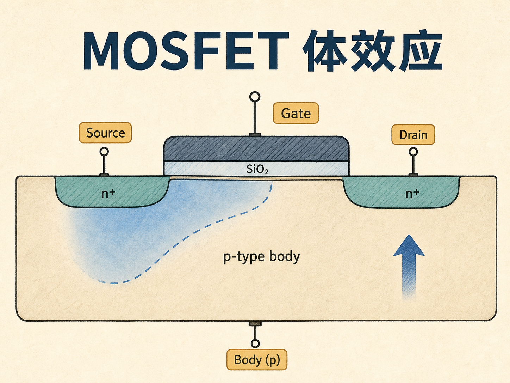
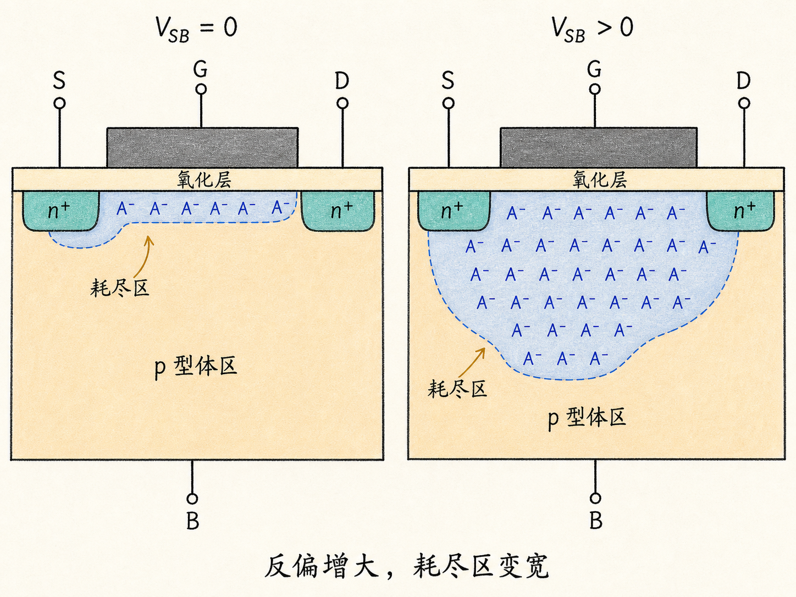
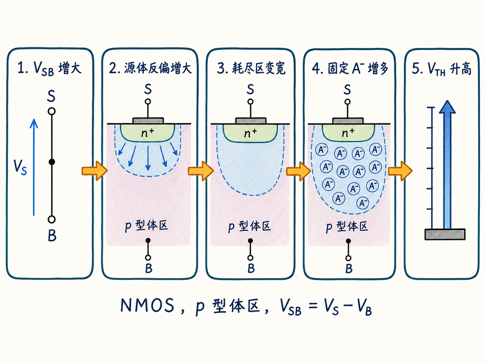
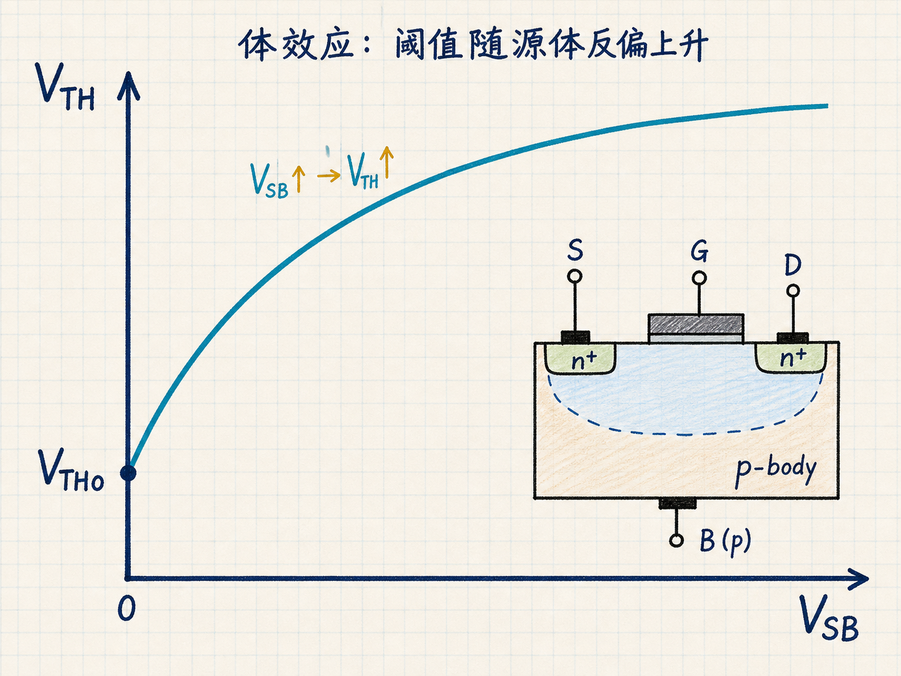
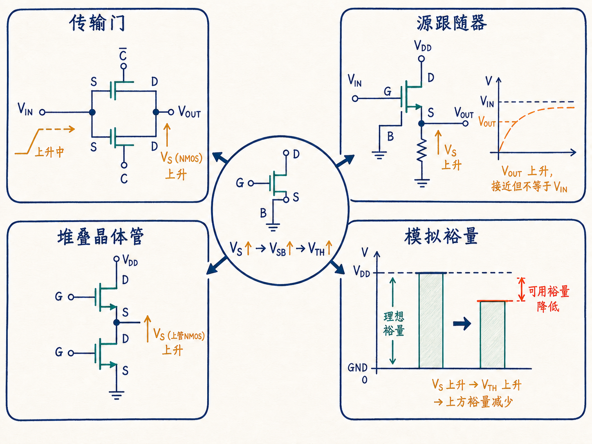

# 源极一抬高，MOSFET 为什么更难打开？——MOSFET 体效应

同一只 NMOS，栅源电压 $V_{GS}$ 明明没有变，把源极从地抬高以后，它却可能变得更难导通。在源跟随器、堆叠晶体管或传输门里，这不是罕见的边角现象，而是会直接吃掉电压裕量的设计约束。

原因不在栅氧突然改变，也不是沟道变短了。真正变化的是源极与体区之间的偏置：它把 p 型体区的耗尽层拉得更宽，让栅极在形成反型沟道之前，必须先补偿更多固定空间电荷。这就是 MOSFET 的体效应（body effect），也叫衬底偏置效应。

读完这篇，你会知道

- 为什么 MOSFET 不能只看成栅、源、漏三个端子
- 为什么 NMOS 中 $V_{SB}>0$ 会让阈值电压升高
- 体区耗尽电荷怎样把源体偏置传递到栅极阈值
- 体效应公式里的每个符号和适用条件是什么
- 它为什么会影响传输门、源跟随器、堆叠晶体管和模拟电路裕量

## 三端画法隐藏了第四个端子

画电路图时，MOSFET 常被简化成栅极、源极、漏极三个端子。可从器件物理看，它还有一个体端（body，也称衬底端）。对建立在 p 型体区上的 NMOS，源极和漏极是 n 型区，它们分别与 p 型体区形成 PN 结。

此前推导 MOS 阈值时，最自然的参考是栅极相对于体区的电压 $V_{GB}$：栅极电场穿过栅氧，先耗尽表面空穴，再建立足够的表面势，最后形成电子反型层。电路设计却更习惯用 $V_{GS}$，因为源极才是沟道载流子进入器件的参考端。

当源极与体端短接时，$V_S=V_B$，所以 $V_{GS}$ 与 $V_{GB}$ 的参考差异不会带来额外修正。一旦源极电位升高而体端仍固定在较低电位，两者就不再等价。

## 先把符号方向说清楚

本文只使用源体电压

$$
V_{SB}=V_S-V_B
$$

不把它与方向相反的 $V_{BS}$ 混用。对默认讨论的 NMOS 和 p 型体区：

- body 更负，或者 source 相对 body 更高，都意味着 $V_{SB}>0$；
- 源—体 PN 结的反向偏置增强；
- 体区耗尽层变宽；
- 阈值电压升高。

这里讨论的不是短沟道效应，也不是重新做一遍普通 MOS 电容阈值推导。问题只有一个：在栅极仍用源极作电压参考时，源体偏置怎样修正原来的阈值。

## 反偏为什么会让耗尽层变宽

把栅极下方靠近源端的一小段剖面放大来看。正栅压会排斥 p 型体区表面的空穴，留下不能自由移动的离化受主 $A^-$。这些固定负电荷构成耗尽区空间电荷。

如果 $V_{SB}=0$，源区与体区等电位，达到强反型时所需的耗尽宽度由掺杂和表面势决定。如果源极升高而体端保持不变，源—体 PN 结反偏增大。结区为了承受更大的电势差，必须向 p 型体区扩展更宽的耗尽区。

在耗尽近似下，单位面积耗尽电荷约为

$$
Q_d\approx-qN_AW_d
$$

其中 $N_A$ 是受主掺杂浓度，$W_d$ 是从半导体表面量到准中性体区的耗尽宽度。因为 $A^-$ 位于硅体区内，所以 $W_d$ 增大时，$Q_d$ 会变得更负，耗尽电荷的绝对值 $|Q_d|$ 增大。它们不会跑进栅氧，也不是可移动空穴。

栅极要建立电子反型层，就必须先用更多正栅电荷平衡这些新增的固定负电荷。于是，在其他条件相同时，需要更高的栅源电压才能达到阈值：$V_{TH}$ 上升。

这条因果链可以压缩成一句话：

> $V_{SB}$ 增大 → 源体反偏增大 → p-body 耗尽区变宽 → 固定 $A^-$ 总量增多 → 栅极需要提供更多电荷 → $V_{TH}$ 升高。

## 公式只是把这条因果链压缩起来

为避免与热电压混淆，本文把阈值电压记作 $V_{TH}$。在长沟道、均匀 p 型掺杂、耗尽近似成立，并且源—体结保持反偏的常用模型下，源端阈值可写成

$$
V_{TH}=V_{TH0}+\gamma\left(\sqrt{2\phi_F+V_{SB}}-\sqrt{2\phi_F}\right)
$$

其中：

- $V_{TH0}$ 是 $V_{SB}=0$ 时的阈值电压；
- $\phi_F$ 是 p 型体区费米势的正值幅度，因此强反型条件对应 $2\phi_F$；
- $V_{SB}=V_S-V_B$，本文只采用这个方向；
- $\gamma$ 是体效应系数，均匀掺杂时

$$
\gamma=\frac{\sqrt{2q\varepsilon_{si}N_A}}{c_{ox}}
$$

- $c_{ox}=\varepsilon_{ox}/t_{ox}$ 是单位面积栅氧电容。

有些教材把阈值电压简写为 $V_T$，同一关系就写成

$$
V_T=V_{T0}+\gamma\left(\sqrt{2\phi_F+V_{SB}}-\sqrt{2\phi_F}\right)
$$

此处的 $V_T$ 指阈值电压，不是载流子统计里的热电压 $kT/q$。

公式中的平方根来自耗尽电荷对表面势的依赖：耗尽宽度与 $\sqrt{\psi_s}$ 成正比，而源体偏置使源端附近的有效表面势由 $2\phi_F$ 变为 $2\phi_F+V_{SB}$。所以 $V_{SB}$ 越大，阈值越高；但由于平方根关系，$V_{TH}$ 随 $V_{SB}$ 上升的斜率会逐渐减小。

这个式子不是所有情形下都能原样使用。若源体结被正向偏置、沟道很短、掺杂显著不均匀，或漏极电场已经强烈改变源端势垒，就需要更完整的器件模型。漏源电压较大时，沟道电势还会沿长度方向变化；上式描述的是常用长沟道近似下、以源端为参考的阈值修正。

## 同一个 $V_{GS}$，为什么导通程度变了

器件是否容易形成沟道，取决于栅源过驱动

$$
V_{OV}=V_{GS}-V_{TH}
$$

假设 $V_{GS}$ 保持不变，源极抬高使 $V_{SB}$ 增大，继而让 $V_{TH}$ 增大，那么 $V_{OV}$ 就会减小。也就是说，即使电路图上看到的 $V_{GS}$ 没变，沟道反型程度和漏电流仍会下降。

如果 body 能始终跟着 source 一起移动，保持 $V_{SB}=0$，这项修正就消失。但在普通集成电路里，许多 NMOS 共用 p 型衬底或 p-well，体端往往接固定的最低电位，不能让每只器件的 body 都自由跟随 source。独立阱结构可以提供更多体端控制，但会带来面积、隔离和工艺方面的代价。

## 电路里会在哪里遇到它

### 传输门与通路晶体管

NMOS 传递上升电平时，它作为“源端”的一侧电位会升高，而 body 通常仍固定在低电位，于是 $V_{SB}$ 增大、$V_{TH}$ 上升，器件逐渐更难继续传高。CMOS 传输门用并联 PMOS 改善满摆幅传输，但体效应仍会使导通电阻随信号电平变化，影响延迟和模拟线性度。

### 源跟随器

源跟随器的输出就是源极电位。输出升高时，$V_{SB}$ 同步增大，阈值也随之升高。因此输出不能简单地按一个固定阈值写成 $V_G-V_{TH0}$；体效应会进一步压低可达到的输出电位，并改变小信号增益。

### 堆叠晶体管

串联堆叠中，上方 NMOS 的源极不再位于地电位。越往上，源极越可能被抬高，而 body 仍共接低电位。上方器件因更大的 $V_{SB}$ 具有更高阈值，需要更多栅压或更长时间才能提供相同电流。

### 模拟电路裕量

在电流镜、共源共栅、差分对尾管和其他模拟结构中，体效应会改变偏置点、跨导关系和所需的电压余量。电源电压越低，额外增加的几十到几百毫伏阈值就越不能忽略，因为它可能直接决定某只晶体管能否保持预期工作区。

## 最后记住这条链

体效应不是栅氧里的额外电荷，也不是短沟道效应。它来自 MOSFET 的第四个端子：当 NMOS 的 source 相对固定 body 升高时，$V_{SB}>0$ 让源体反偏增强，p-body 耗尽区变宽，固定负受主电荷增多，最终把阈值电压推高。

所以，看到源极不是地时，不要只问“$V_{GS}$ 有多大”，还要问一句：“body 在哪里，$V_{SB}$ 又是多少？”
