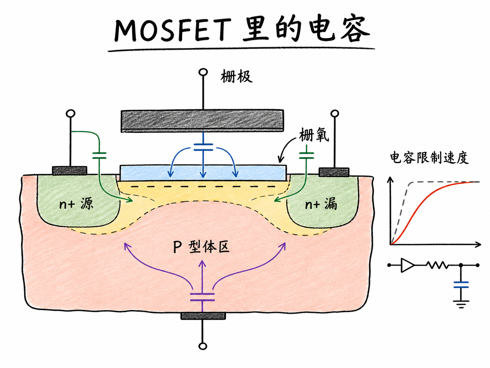
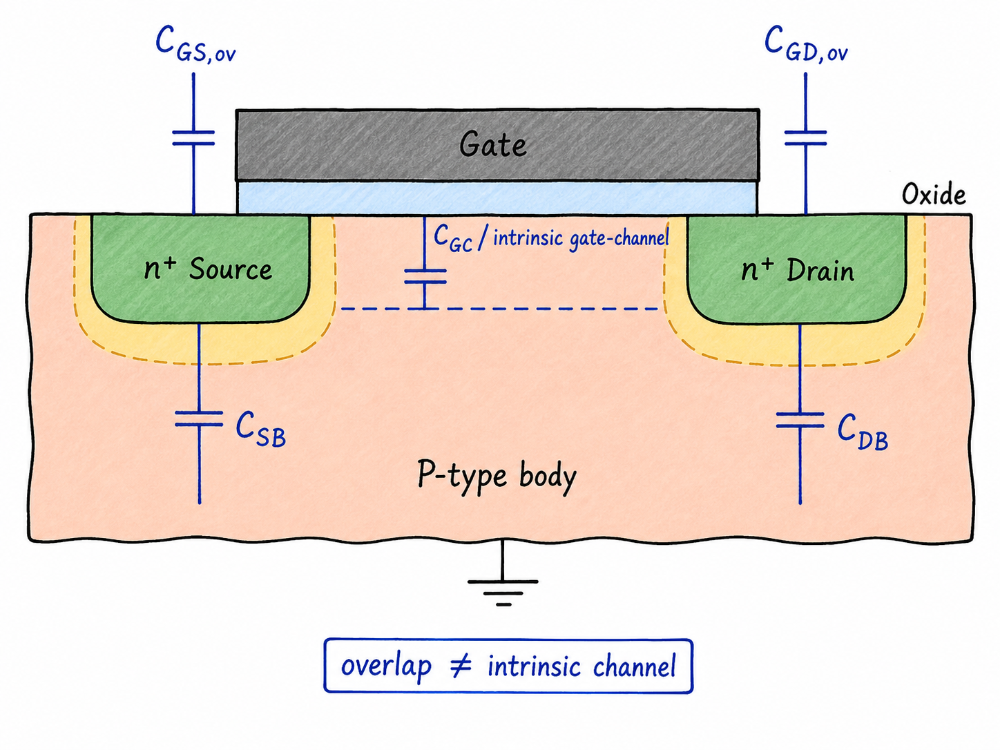
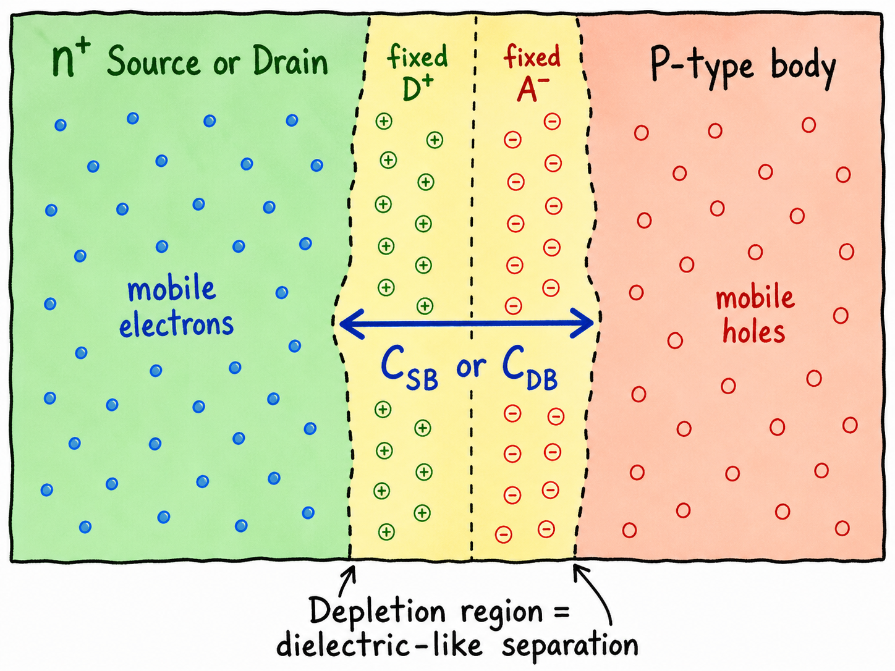
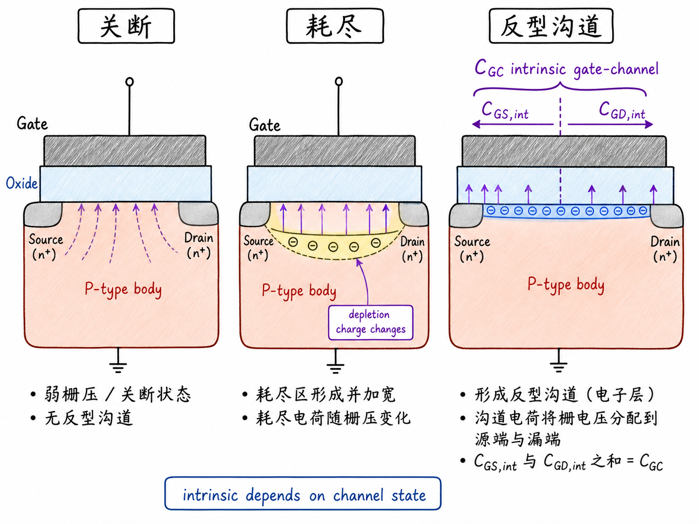

# MOSFET 里的电容到底藏在哪里

MOSFET 看起来像一个受栅压控制的开关：栅压一变，沟道打开或关闭，电流跟着变化。问题是，真实电路里的这个开关不可能瞬间动作。你想把一个节点从低电平拉到高电平，或者从高电平拉到低电平，总要先把某些电荷搬走、再把另一些电荷搬进来。

这些需要搬运的电荷，就藏在 MOSFET 的各种电容里。所以 MOSFET 电容不是一个附属小细节，它直接决定电路能切换多快。器件做宽一点，导通能力会变强，但通常电容也会变大；驱动更强和速度更慢之间的取舍，就是电路设计绕不开的现实。

读完这篇，你会知道

- MOSFET 里主要有哪几类电容，它们分别位于哪里
- 为什么栅源、栅漏重叠区会形成真实电容
- 源/体和漏/体 PN 结为什么也表现为电容
- 栅到沟道的电容为什么最直观、也最难分析
- 为什么理解电容，就是理解 MOSFET 开关速度限制的入口

## 先把问题放在电路速度上

如果只看直流，MOSFET 很容易被讲成一个“栅压控制电流”的器件：$V_{GS}$ 超过阈值电压 $V_{TH}$，沟道出现；再加上 $V_{DS}$，漏源之间就有电流。

但电路工作在开关状态时，问题不止是“最后能不能导通”，还包括“需要多久才能导通到位”。一个反相器、一个传输门、一个模拟开关，都不可能无限快。原因不是某个抽象的“速度上限”，而是每一次电压变化都要给电容充放电。

最简单的直觉是：节点电容越大，同样的驱动电流下，电压变化越慢。用一句近似关系说，就是 $I=C\,dV/dt$。如果 $C$ 变大，想保持同样的 $dV/dt$，就需要更大的电流；如果电流给不了，速度就下降。

所以这篇先不急着推公式。我们先做一件更基础的事：把 MOSFET 里的电容一块一块找出来。

## 一只 nMOS 的结构地图

先看最普通的三端 nMOS。上面是金属栅，金属栅下面是栅氧，栅氧下面是 P 型 body，也可以叫 bulk 或 substrate。左右两边是重掺杂的 $n^+$ 源区和 $n^+$ 漏区。

这里源和漏的名字在结构上很像，因为两边都是 $n^+$ 区；在实际工作中，哪个端子是 source、哪个端子是 drain，取决于偏压和载流子流动方向。对这篇的电容地图来说，重要的是它们分别和栅、体区形成了哪些电荷分离结构。

电容的底层定义很朴素：两个能提供可移动电荷的区域，中间隔着一段没有自由通过路径的区域。这个隔离层可以是氧化层，也可以是耗尽区。只要电压变化会让两侧电荷重新分布，就会有电容效应。

## 第一类：栅源和栅漏重叠电容

先看栅极边缘。真实工艺里，栅金属或多晶硅栅通常会和源漏扩散区有一点横向重叠。于是，在源端一侧，栅电极和 $n^+$ 源区之间隔着很薄的氧化层；在漏端一侧，栅电极和 $n^+$ 漏区之间也有类似结构。

这就是栅源重叠电容和栅漏重叠电容。常见端子写法可以记为 $C_{GS,ov}$ 和 $C_{GD,ov}$，其中 $ov$ 表示 overlap。它们的物理图像接近平行板电容：上板是栅电极，下板是 $n^+$ 源区或 $n^+$ 漏区，中间是氧化层。

这里容易低估的一点是：这个区域看起来很窄，但不能因为窄就直接忽略。集成电路里器件很多，节点很多，任何一块电容都会参与充放电。尤其是栅漏重叠电容，它连接输入端和输出端，还可能通过电压增益表现出更强的动态影响。

所以第一条规则是：只要栅和源/漏有几何重叠，而且中间隔着氧化层，就有重叠电容。它属于端子电容 $C_{GS}$、$C_{GD}$ 的一部分，但不要把它和沟道形成后的本征栅电容混在一起。

## 第二类：源/体和漏/体 PN 结电容

再看源区和漏区的边界。$n^+$ 源区嵌在 P 型 body 里，$n^+$ 漏区也嵌在 P 型 body 里。每一个 $n^+$ 区和 P 型体区之间，都是一个 PN 结。

在常见 nMOS 偏置下，body 通常接最低电位，源/体和漏/体 PN 结多半处于零偏或反偏。反偏 PN 结会形成耗尽区。耗尽区里不是“什么都没有”，而是可移动载流子被扫空，只剩下固定的离化杂质电荷。

这时，PN 结两侧的准中性区域仍然能提供可移动载流子：$n^+$ 区里有大量电子，P 型体区里有空穴。中间的耗尽区像一层随偏压改变厚度的介质，于是源和体之间有结电容 $C_{SB}$，漏和体之间有结电容 $C_{DB}$。

需要注意方向：对 nMOS 的 P 型 body 来说，耗尽区围绕 $n^+$ 源/漏结扩展，P 侧耗尽区里是固定的离化受主 $A^-$，N 侧耗尽区里是固定的离化施主 $D^+$。不要把耗尽区画成短路导体，也不要把固定空间电荷画成可以自由流动的板上电荷。

结电容的大小会随反向偏压变化。反偏越强，耗尽区通常越宽；隔离距离越大，电容越小。这和固定氧化层厚度形成的重叠电容不同，是后续分析体结电容时要抓住的区别。

## 第三类：栅到沟道的本征电容

最后看最直观的一块：栅和栅下半导体之间。金属栅在上方，栅氧在中间，P 型 body 在下方。只看这个结构，它当然像一个 MOS 电容。

但 MOSFET 里这块电容最难分析，因为栅下面的半导体不是固定状态。栅压较低时，表面可能是 P 型多数载流子积累；栅压升高后，表面先进入耗尽；再继续升高，表面形成电子反型沟道。也就是说，下板到底是 body、耗尽区边缘，还是源漏连接起来的反型沟道，要看偏压和工作区。

为了不混淆，可以把这部分先叫栅到沟道电容 $C_{GC}$，或者在端子模型里分解成 $C_{GB}$、$C_{GS}$、$C_{GD}$ 的本征部分。这里的“本征”强调它来自栅下沟道电荷随栅压变化，而不是来自栅边缘的几何重叠。

这也是 MOSFET 电容难的根本原因：重叠电容主要由几何尺寸和氧化层决定；PN 结电容主要由结面积、耗尽区和反偏决定；栅沟道电容却要跟着沟道状态变化。器件处于关断、线性区、饱和区时，栅电荷如何分配到 source、drain、body，并不是同一个答案。

## 电容不是只属于“金属板”

很多人第一次学电容，会把它想成两块金属板中间夹一层绝缘体。这个图像有用，但太窄。

MOSFET 里，电容板可以是金属，也可以是重掺杂半导体，也可以是带有可移动空穴的 P 型区域，还可以是偏压形成的反型沟道。关键不是材料名字，而是这个区域里有没有可移动电荷能响应外加电压。

即使两边看起来都是同一种载流子，也不妨碍形成电容。比如两个 n 型区域之间隔着某种介质，电子从一侧表面稍微离开，就会在那一侧留下相对正的固定离化施主电荷；另一侧电子聚集，就表现为负电荷。电容需要的是电荷分离和电场，不要求两边材料一开始就天然写着“正板”和“负板”。

这个视角很重要，因为它能把 MOSFET 里看似复杂的电容统一起来：氧化层隔开移动电荷，是电容；耗尽区隔开移动电荷，也是电容；栅压让沟道载流子重新分布，仍然是电容。

## 回到速度：为什么器件越大不一定越快

现在可以回到开头的问题：为什么 MOSFET 电容会限制速度？

假设你把 MOSFET 宽度 $W$ 做大。好处是沟道更宽，导通时能提供更大的电流。坏处是很多电容也跟着增大：栅下有效面积变大，栅氧相关电容变大；源漏扩散面积和边界变大，结电容也可能变大；重叠边长增加，重叠电容也会增加。

于是，做大器件不是免费的。它能增强驱动能力，也会增加被驱动节点和输入端需要充放电的电荷量。电路设计里的速度取舍，很多时候就是在问：我增加的电流，是否足以抵消我增加的电容？

这篇先建立地图。MOSFET 的主要电容可以先记成三组：栅源/栅漏重叠电容，源体/漏体结电容，栅到沟道或体区的本征电容。后面真正推导每一项时，不要先背符号，先问它对应哪两个可移动电荷区域，中间隔着氧化层还是耗尽区，以及这个隔离距离会不会随偏压改变。

只要这张地图清楚，MOSFET 电容就不再是一堆端子符号，而是开关速度背后那张具体的电荷账单。
