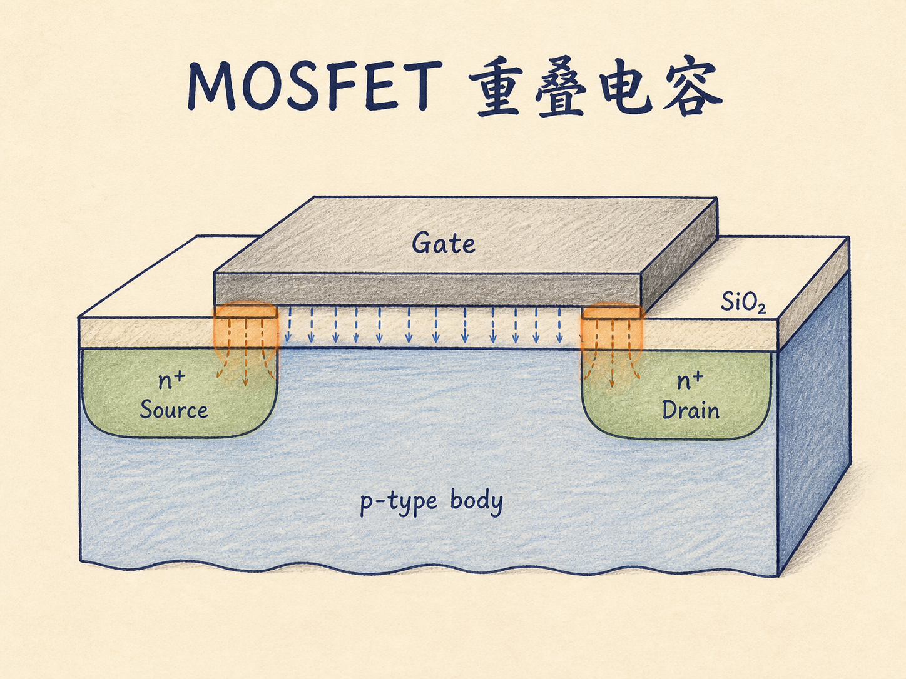
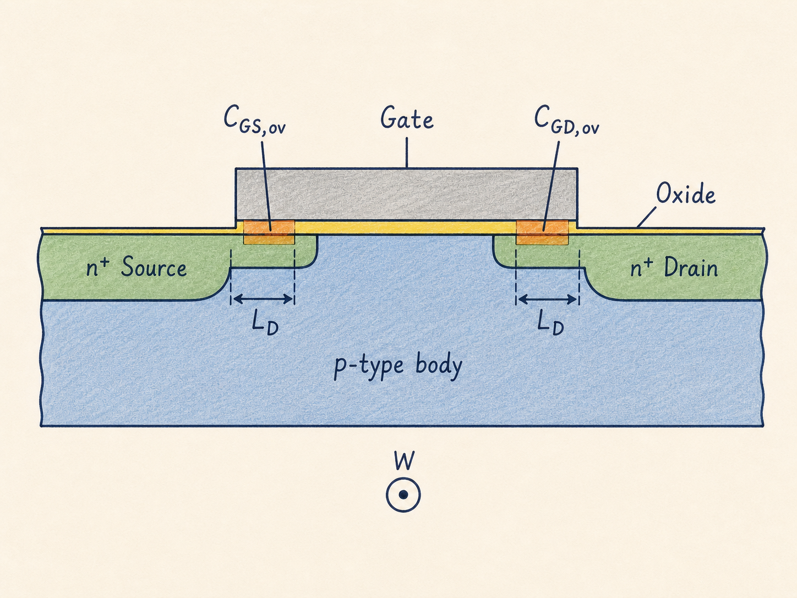
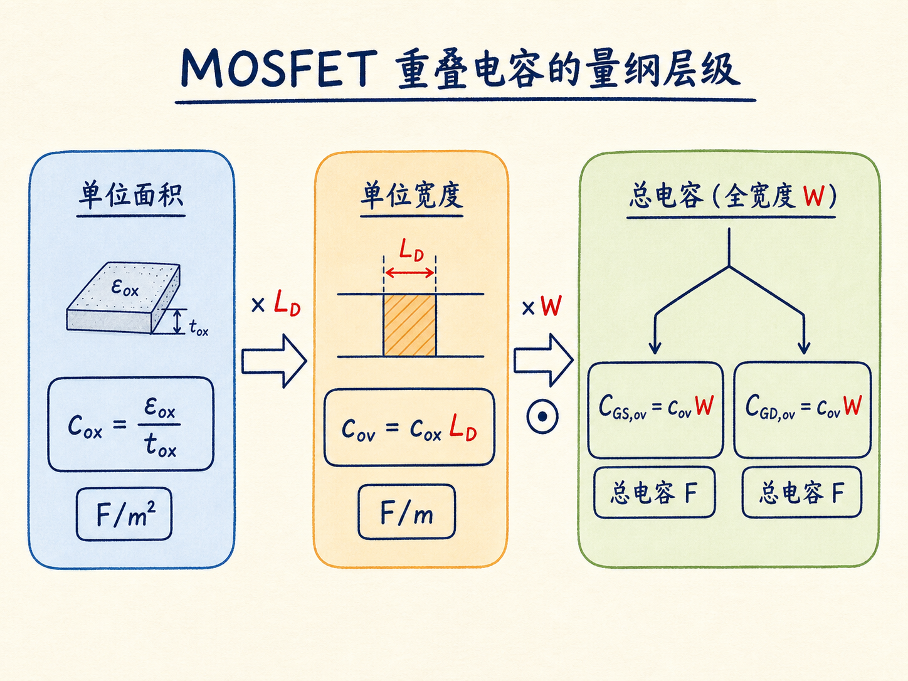

# MOSFET 重叠电容：一小段几何重叠，怎样变成可计算的寄生电容

理想的 MOSFET 剖面图里，栅极似乎刚好停在源区和漏区之间。但真实结构需要关注一个很小的几何细节：栅金属与源、漏 n+ 区会在氧化层两侧各有一段重叠。导体之间隔着绝缘层，这一小段结构自然会储存电荷。

问题不在于“这里有没有电容”，而在于怎样把它写成不会混淆的工程参数。单位面积电容、单位宽度电容和整只器件的总电容只有一字母大小写之差，量纲却完全不同。

读完这篇，你会知道

- 栅—源与栅—漏重叠电容分别形成在哪里？
- 为什么可以先把重叠区近似成平行板电容？
- $c_{ox}$、$c_{ov}$ 与 $C_{GS,ov}$、$C_{GD,ov}$ 分别是什么量？
- 为什么常用可测量的单位宽度参数 $c_{ov}$，而不直接依赖 $L_D$？

## 先把结构和端口说清楚

考虑一只 p 型体区上的 n 沟道 MOSFET。体区记为 body，左右两侧是重掺杂 n 型的源区和漏区，上方依次是氧化层与栅金属。四个端子的电势分别记为 $V_G$、$V_S$、$V_D$ 与 $V_B$。

这里把左侧标为 source、右侧标为 drain。源和漏的结构可以互换，但端口电压必须始终按标签定义，例如 $V_{GS}=V_G-V_S$，而 $V_{GD}=V_G-V_D$。互换的是结构角色，不是公式中的下标含义。

栅在靠近源区的一侧覆盖了一小段 n+ 区，在靠近漏区的一侧也覆盖了一小段 n+ 区。两段重叠分别形成：

- 栅—源重叠电容 $C_{GS,ov}$；
- 栅—漏重叠电容 $C_{GD,ov}$。

下标 $ov$ 表示这里只讨论 overlap，也就是重叠贡献，不把它与栅端电容的其他组成部分混在一起。

## 为什么它可以先看成平行板电容

在任一侧的重叠区，栅金属是一块导体，n+ 源区或漏区是另一块导体，中间隔着厚度为 $t_{ox}$ 的氧化层。当两侧出现异号电荷时，电场跨过氧化层建立，这正是电容储存电荷的基本结构。

因此，第一步可以使用平行板近似。氧化层介电常数记为 $\varepsilon_{ox}$，单位面积栅氧电容定义为：

$$
c_{ox}=\frac{\varepsilon_{ox}}{t_{ox}}
$$

$c_{ox}$ 的单位是 F/m²。小写 $c$ 在这里很重要：它还没有乘任何面积，所以不是某一只器件的总电容。

## 从面积拆出设计者真正使用的参数

设单侧栅与 n+ 区沿沟道方向的重叠长度为 $L_D$，器件宽度为 $W$。$W$ 垂直于剖面图所在的纸面方向，因此单侧重叠面积近似为 $L_DW$。

把面积乘回单位面积电容，就得到单侧总重叠电容的首阶表达式：

$$
C\approx c_{ox}L_DW
$$

也就是：

$$
C\approx\frac{\varepsilon_{ox}L_DW}{t_{ox}}
$$

这个式子已经给出完整的面积关系，但工程上还会再做一次分组。定义单位宽度重叠电容：

$$
c_{ov}=c_{ox}L_D=\frac{\varepsilon_{ox}L_D}{t_{ox}}
$$

量纲检查可以直接防止混淆：

$$
\left[\frac{\mathrm{F}}{\mathrm{m}^2}\right]
\left[\mathrm{m}\right]
=
\left[\frac{\mathrm{F}}{\mathrm{m}}\right]
$$

所以 $c_{ov}$ 的单位是 F/m，工程上也常写成 fF/μm。它表示“每单位器件宽度对应多少重叠电容”，仍然不是总电容。

最后乘以器件宽度 $W$，才得到两侧各自的器件总量：

$$
C_{GS,ov}=c_{ov}W
$$

$$
C_{GD,ov}=c_{ov}W
$$

这里采用对称的单侧重叠长度 $L_D$，所以两式形式相同。大小写与下标是本篇的明确约定：$c_{ox}$ 是单位面积量，$c_{ov}$ 是单位宽度量，大写的 $C_{GS,ov}$ 和 $C_{GD,ov}$ 才是整只器件对应端子间的总电容。

## 为什么常把 $L_D$ 收进 $c_{ov}$

$\varepsilon_{ox}$ 与 $t_{ox}$ 由所采用的制造技术决定，器件设计者不能针对某一只 MOSFET 单独改变它们。重叠长度 $L_D$ 同样难以单独控制、测量和准确预测。相比之下，器件宽度 $W$ 是明确的设计变量。

这就是 $c_{ov}$ 更实用的原因：可以改变 $W$，测量总电容怎样随宽度变化，再把这种线性关系表示成单位宽度参数。计算一只具体器件的单侧重叠电容时，仍然落回端子明确的两式：

$$
\begin{cases}
C_{GS,ov}=c_{ov}W\\
C_{GD,ov}=c_{ov}W
\end{cases}
$$

因此，总重叠电容随 $W$ 线性增加。若题目给出 $L_D$ 和 $c_{ox}$，先算 $c_{ov}=L_Dc_{ox}$；若给出 $\varepsilon_{ox}$、$t_{ox}$ 与 $L_D$，也可以从定义逐步得到同一个参数。

## 首阶模型的边界

平行板近似抓住了重叠面积、氧化层厚度和介电常数之间的主要关系：

$$
C\approx\frac{\varepsilon_{ox}L_DW}{t_{ox}}
$$

这里的约等号提醒我们，这是一阶几何模型。真实器件还可能包含边缘和其他寄生分量；在当前层次，只需知道它们没有被这个简单面积式展开描述，不能把首阶表达式误当成所有电容分量的精确总和。

## 最后把三层量记成一条链

重叠电容最容易出错的地方，不是平行板公式本身，而是把三种不同层级的量混写。把它们连成一条链就清楚了：

$$
c_{ox}=\frac{\varepsilon_{ox}}{t_{ox}}
\quad\longrightarrow\quad
c_{ov}=c_{ox}L_D
\quad\longrightarrow\quad
\begin{cases}
C_{GS,ov}=c_{ov}W\\
C_{GD,ov}=c_{ov}W
\end{cases}
$$

一句话收束：单位面积的栅氧电容先乘重叠长度，得到单位宽度的重叠参数；再乘器件宽度，才得到栅—源或栅—漏的总重叠电容。
