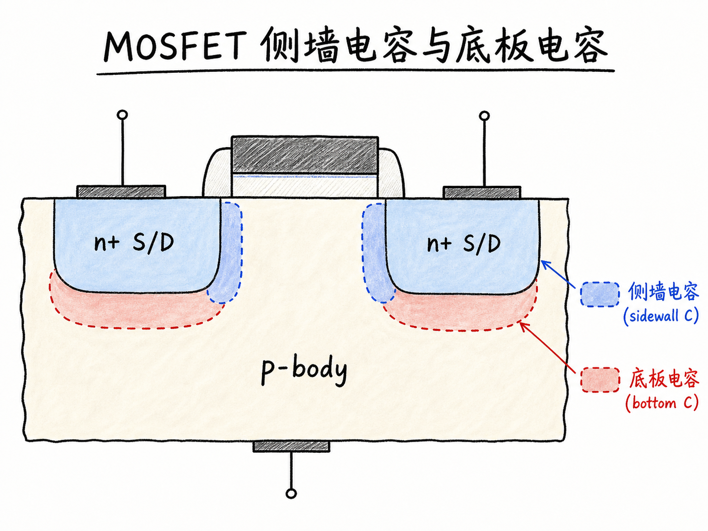
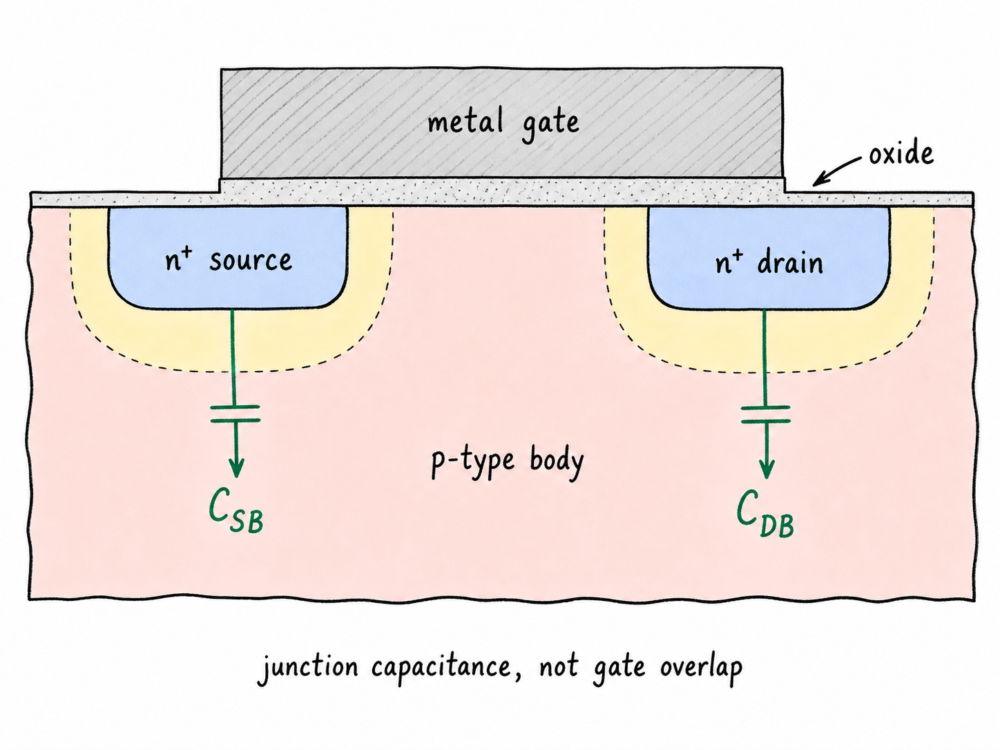
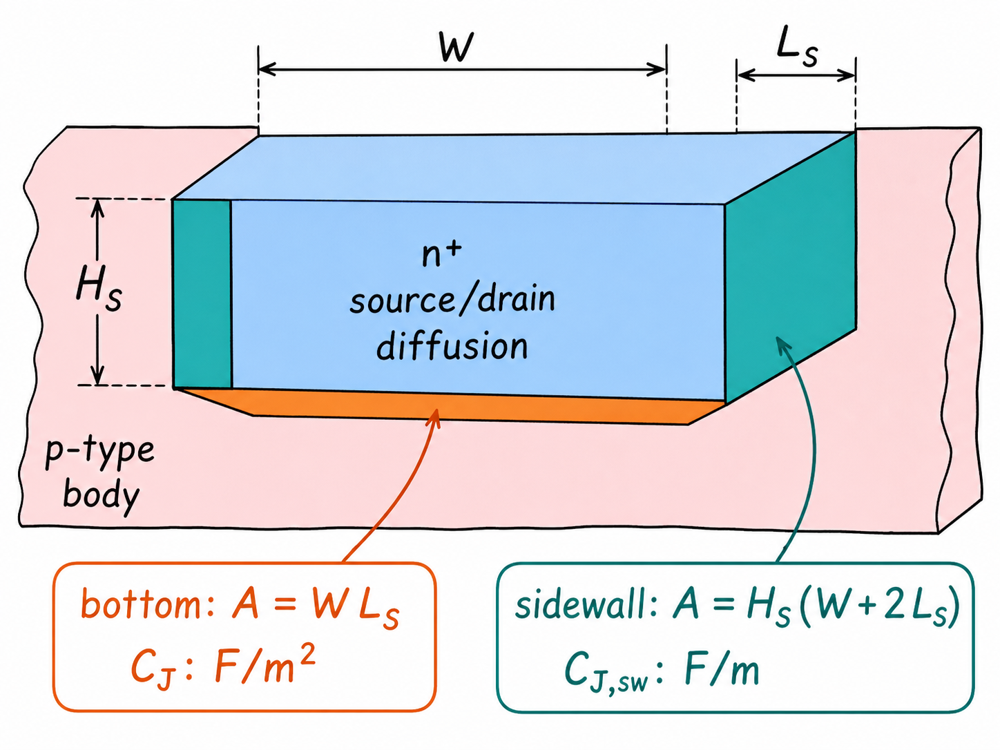
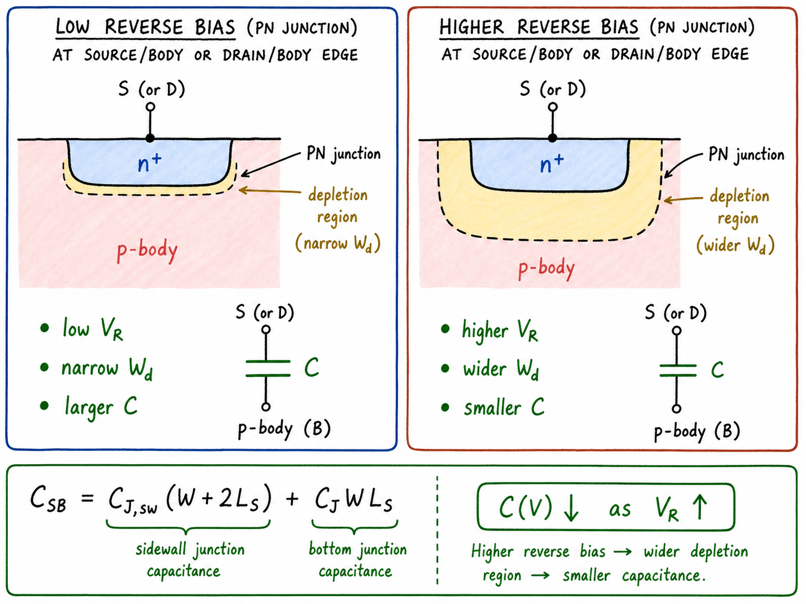

# MOSFET 的侧墙电容与底板电容：源漏扩散区为什么也是电容

讲 MOSFET 电容时，很容易把注意力放在栅氧上：栅极、氧化层、沟道，看起来天然就是一个电容。但真实 MOSFET 里还有另一类很重要的寄生电容，它不在栅氧下面，而在源极和漏极的 n+ 扩散区周围。

只要 n+ 源/漏扩散区嵌在 p 型 body 里，它们和 body 之间就形成 PN 结。这个 PN 结的耗尽区会把可移动电荷隔开，因此它本身就是电容。这就是 $C_{SB}$ 和 $C_{DB}$：source-body capacitance 与 drain-body capacitance。

读完这篇，你会知道

- 为什么 MOSFET 的源/漏 PN 结也会表现为电容
- sidewall capacitance 和 bottom-plate capacitance 分别对应哪一块几何面积
- 为什么面积项用 $C_J$，周长项用 $C_{J,sidewall}$
- 反偏电压为什么会让 $C_{SB}$、$C_{DB}$ 变小
- 这类寄生结电容为什么会拖慢开关速度和高频响应

## 先把端子归属说清楚

这一篇讨论的不是栅重叠电容，也不是栅-沟道电容。我们看的电容在源/漏扩散区和 body 之间：

$$
C_{SB}: \text{source 与 body 之间的 PN 结电容}
$$

$$
C_{DB}: \text{drain 与 body 之间的 PN 结电容}
$$

以 nMOS 为例，body 是 p 型半导体，source 和 drain 是 n+ 扩散区。n+ 区和 p 型 body 接触，就形成 PN 结。这个 PN 结在正常工作中通常是零偏或反偏，因此结附近会有耗尽区。

耗尽区不是一层普通绝缘膜，但它在小信号下会起到类似介质层的作用：一侧的可移动电子、另一侧的可移动空穴或被暴露出来的固定离子，被耗尽区隔开。电荷被隔开，电压一变，电荷分布也跟着变，于是就有电容。

## 耗尽区为什么能当成电容

先看 source-body 这一侧。假设 body 接地，源端相对 body 的电压为 $V_{SB}$。当 $V_{SB}=0$ 时，n+ 源区和 p 型 body 的交界处有一个零偏耗尽区宽度，记为 $X_{D0}$。

在最直观的近似里，可以把这段 PN 结耗尽区“摊平”来看：一边是源区中的电子，另一边是 body 中的空穴或固定受主离子，中间隔着耗尽区。于是单位面积电容近似为

$$
c_j \approx \frac{\varepsilon_{Si}}{X_{D0}}
$$

这里 $\varepsilon_{Si}$ 是硅的介电常数。这个式子的重点不是说 PN 结真的等同于理想平行板电容，而是提醒我们：结电容的第一性来源是“电荷分离距离”。耗尽区越薄，单位面积电容越大；耗尽区越宽，单位面积电容越小。

这里还要避免一个误解：电容不要求某一侧永远只能带负电、另一侧永远只能带正电。移动载流子重新分布时，会暴露固定离化受主 $A^-$ 或固定离化施主一侧的空间电荷。固定离子自己不移动，但被暴露的空间电荷仍然参与电场分布，所以小信号电容仍然成立。

## 同一个扩散区，有底板也有侧墙

源/漏扩散区不是二维线条，而是一个三维块。把 drain 或 source 的 n+ 扩散区近似成一个长方体，它和 p 型 body 形成 PN 结的界面可以分成两类：

底板 bottom plate：扩散区底部和下方 body 之间的结面积。

侧墙 sidewall：扩散区侧面和周围 body 之间的结面积。

设扩散区在版图中的宽度为 $W$，沿沟道方向伸出的长度为 $L_S$，结深为 $H_S$。底板面积最直接：

$$
A_{bottom}=WL_S
$$

所以底板结电容可以写成

$$
C_{bottom}=C_JWL_S
$$

其中 $C_J$ 是单位面积结电容，单位是 $\mathrm{F/m^2}$。真实扩散结的掺杂分布不是完美均匀，所以模型里通常不直接写成 $\varepsilon_{Si}/X_{D0}$，而是把复杂工艺信息收进 $C_J$。

侧墙项看的是周边，而不是底部面积。两个端面贡献 $2L_SH_S$，远离沟道的一侧贡献 $WH_S$。靠近沟道的一侧通常不计入这一项，因为如果沟道已经形成，n+ 扩散区与沟道电子之间没有同样的源/体 PN 结耗尽区需要计算。

因此侧墙有效面积可写成

$$
A_{sidewall}=H_S(W+2L_S)
$$

把工艺决定的结深 $H_S$ 和单位面积电容合并，就得到单位长度侧墙结电容 $C_{J,sidewall}$，单位是 $\mathrm{F/m}$：

$$
C_{sidewall}=C_{J,sidewall}(W+2L_S)
$$

这就是为什么模型里常把源/漏结电容拆成“面积相关项”和“周长相关项”。底板项跟面积 $WL_S$ 成正比；侧墙项跟周长中的 $W+2L_S$ 成正比。两者不要互换。

## 把两个分量加起来

把底板电容和侧墙电容相加，就得到源体结电容在零偏近似下的几何表达：

$$
C_{SB}=C_{J,sidewall}(W+2L_S)+C_JWL_S
$$

漏体结电容 $C_{DB}$ 的结构完全一样，只是把 source 换成 drain，把 $V_{SB}$ 换成 $V_{DB}$。

这个式子把电路设计者能控制和不能控制的东西分开了。$W$ 和 $L_S$ 是版图尺寸，设计者可以改变；$C_J$、$C_{J,sidewall}$、结深和掺杂剖面主要由工艺决定。对版图设计来说，这个拆分很有用：扩大 diffusion 面积会增加 bottom-plate capacitance；拉长周边会增加 sidewall capacitance。

## 反偏越大，结电容越小

上面的式子先把耗尽区宽度当成固定的 $X_{D0}$。但 PN 结耗尽区会随反偏变化。

对 nMOS 的 source/body 或 drain/body 结来说，反偏电压越大，耗尽区越宽。耗尽区宽度变宽以后，电荷分离距离变大，单位面积电容就下降。用突变结近似时，电压因子常写成

$$
C(V)=\frac{C(0)}{\sqrt{1+V_R/V_{bi}}}
$$

这里 $V_R$ 可以对应 $V_{SB}$ 或 $V_{DB}$，$V_{bi}$ 是内建电势。对于底部扩散结，如果掺杂剖面更接近渐变结，有时会看到 $1/3$ 次幂形式：

$$
C(V)=\frac{C(0)}{(1+V_R/V_{bi})^{1/3}}
$$

具体幂次来自掺杂分布模型，但物理方向相同：反偏越大，耗尽区越宽，结电容越小。

## 为什么这件事会影响速度

$C_{SB}$ 和 $C_{DB}$ 是寄生电容，但不是可以忽略的数学尾巴。每次源端、漏端或 body 电位变化时，这些结电容都要被充放电。充放电需要电流，也需要时间。

在开关电路里，漏结电容尤其直接：输出节点往往接在 drain 上，$C_{DB}$ 会增加输出节点总电容。节点电容越大，同样驱动电流下电压变化越慢，延迟越大。在高频电路里，这些结电容还会提供额外的交流通路，改变极点位置，限制带宽，并把本来希望隔离的端子耦合起来。

所以这篇的核心可以压缩成一句话：MOSFET 的源/漏扩散区不只是电流端子，它们还是嵌在 body 里的 PN 结；这个三维 PN 结的底部给出面积电容，侧壁给出周长电容，反偏通过改变耗尽区宽度继续调制它们。
