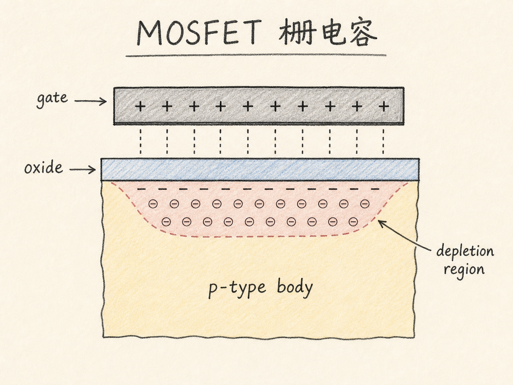
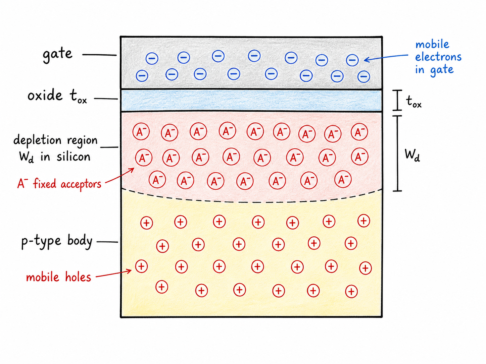
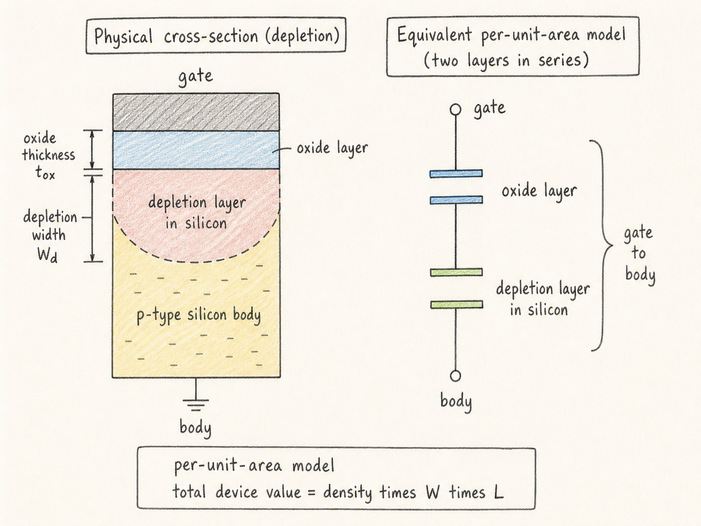
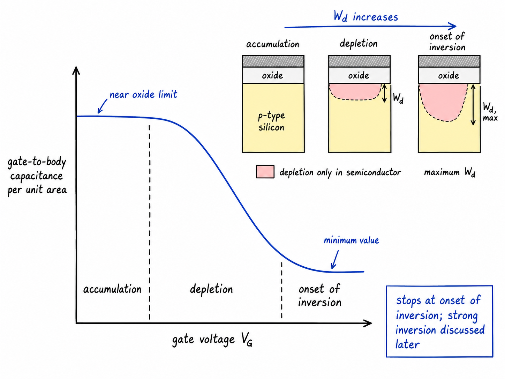

# MOSFET 栅电容：为什么一层氧化层不够解释输入电容

看 MOSFET 的时候，我们很容易把栅极想成一个理想控制旋钮：给栅极加电压，沟道就被拉出来，电流就被控制住。可是从电路角度看，栅极首先不是一个免费的旋钮，而是一个必须反复充放电的电容。每一次开关，驱动电路都要把电荷推到栅极上，再把它拿走。这个栅电容就是 MOSFET 输入电容、开关速度和驱动损耗的核心来源。

这一篇先不讨论源极和漏极，也不讨论栅电容最后怎样分配成 $C_{GS}$ 和 $C_{GD}$。我们只看最基本的一块：金属栅、氧化层和 P 型体区形成的 MOS 电容。问题是，当栅压改变时，栅到体的电容为什么不是一个固定的氧化层电容？

读完这篇，你会知道

- 为什么 MOSFET 栅电容要先从 MOS 电容结构讲起
- 为什么耗尽状态下的栅到体电容是两个电容串联
- 为什么单位面积电容用小写 $c_{GB}$、$c_{ox}$，整器件总电容用大写 $C_{GB}$、$C_{ox}$
- 为什么栅压增加会让 $c_{GB}$ 从初始值下降到 $c_{min}$
- 为什么这篇只把曲线讲到反型开始，而不把强反型端子模型提前混进来

## 先把问题缩小：只看 gate-to-body 电容

把 MOSFET 暂时拆开来看，只保留 MOS 电容部分：上面是金属栅，下面是 P 型半导体体区，中间隔着一层氧化层。栅极电压记作 $V_G$，氧化层厚度记作 $t_{ox}$，器件有效栅面积是 $WL$。

如果 $V_G=0$，半导体表面附近可能已经存在耗尽区。这里要留一个条件：有没有耗尽区还取决于金属和半导体功函数差，也就是 $V_{MS}$ 造成的初始能带弯曲。没有指定金属材料时，不能只凭 $V_G=0$ 就断言一定耗尽。本篇先讨论“已经处在耗尽状态”这个情形。

在耗尽状态里，金属栅中有可移动电子，P 型体区深处有可移动空穴。两边的可移动电荷被隔开，中间隔着的不只是氧化层，还有半导体侧的耗尽区。耗尽区在半导体里，不在氧化层里；它里面主要是固定的离化受主空间电荷，而不是一块新的绝缘氧化物。

这就是第一个关键点：栅电容不是简单用 $t_{ox}$ 一个厚度就能算完。栅极电荷和体区可移动电荷之间的有效分离距离，随着半导体里的耗尽区宽度一起变化。

## 为什么不能直接写成一个电容

最粗糙的想法是：电容等于介电常数乘面积再除以距离。距离看起来像 $t_{ox}+W_d$，其中 $W_d$ 是从半导体表面量到准中性体区的耗尽区宽度。

但这样写马上会出问题：介电常数该用谁？

氧化层用 $\varepsilon_{ox}$，硅用 $\varepsilon_{Si}$。这两层材料不同，不能把它们随手塞进一个统一的 $\varepsilon$。正确的物理图像是两个单位面积电容串联：

- 氧化层电容密度 $c_{ox}=\varepsilon_{ox}/t_{ox}$
- 耗尽层电容密度 $c_d=\varepsilon_{Si}/W_d$

于是耗尽状态下的栅到体单位面积电容是

$$
c_{GB}=\frac{c_{ox}c_d}{c_{ox}+c_d}
$$

这里所有小写 $c$ 都是单位面积电容密度，单位类似 F/cm$^2$ 或 F/m$^2$。如果要得到整只 MOSFET 的栅到体总电容，才乘以面积：

$$
C_{GB}=c_{GB}WL
$$

同理，氧化层总电容是

$$
C_{ox}=c_{ox}WL
$$

这组大小写不能混用。小写 $c_{ox}$ 是材料和厚度决定的单位面积量；大写 $C_{ox}$ 是这只器件在面积 $WL$ 下看到的总量。电路驱动关心的是总电容和总电荷，但理解 C-V 曲线时，先用单位面积量最清楚。

## 栅压越高，耗尽区越宽，电容越小

在 P 型体区上加正栅压时，半导体表面的空穴被排开，留下固定的离化受主，耗尽区向体内延伸。$W_d$ 变大，耗尽层电容密度 $c_d=\varepsilon_{Si}/W_d$ 变小。

两个串联电容里，只要其中一个变小，总电容也会被拉低。所以随着 $V_G$ 增加，耗尽状态下的 $c_{GB}$ 会下降。

这个下降可以用一条 C-V 曲线来想：

- 在积累一侧，半导体表面有多数载流子贴近氧化层界面，栅电荷主要隔着氧化层与这些可移动电荷相对，单位面积电容接近 $c_{ox}$。
- 进入耗尽后，可移动空穴被推离界面，半导体侧多出耗尽区这段额外距离，$c_{GB}$ 由 $c_{ox}$ 与 $c_d$ 串联决定，开始下降。
- 耗尽区不能无限变宽；到反型开始时，$W_d$ 达到最大值，$c_{GB}$ 降到最小值 $c_{min}$。

需要注意，这里讲的是 gate-to-body/channel 的基本电容，不是第 56 篇的 overlap capacitance，也不是第 57 篇的源漏结侧壁/底板电容。那些电容来自几何重叠或 PN 结耗尽区；本篇的电容来自栅极通过氧化层和半导体表面势控制体区电荷。

## 最小电容 $c_{min}$ 从哪里来

当表面进入反型，半导体界面开始吸引电子。这个点通常用表面电势达到 $2\phi_F$ 来定义，也就是

$$
\psi_s=2\phi_F
$$

这个定义带有约定性，但它给了我们一个清楚的计算边界：在反型开始之后，耗尽区宽度不再继续按原来的方式增长。于是耗尽区最大宽度 $W_{d,max}$ 决定了耗尽段能降到的最低电容。

把串联电容公式写成氧化层参数和最大耗尽区宽度的形式：

$$
c_{min}=\frac{c_{ox}}{1+\frac{\varepsilon_{ox}}{\varepsilon_{Si}}\frac{W_{d,max}}{t_{ox}}}
$$

这个式子很好读。分母里多出来的那一项，就是“半导体耗尽区相对于氧化层又增加了多少电荷分离效果”。$W_{d,max}$ 越大，额外分离越明显，$c_{min}$ 越低。氧化层越薄，$t_{ox}$ 越小，同样的耗尽区宽度就显得更重要。

如果继续把最大耗尽区宽度写出来，对于 P 型体区的一边耗尽近似，有

$$
W_{d,max}=\sqrt{\frac{2\varepsilon_{Si}(2\phi_F)}{qN_A}}
$$

这里 $N_A$ 是受主掺杂浓度，$q$ 是元电荷。掺杂越低，耗尽区可以伸得越深，$W_{d,max}$ 越大，最小电容越小；掺杂越高，耗尽区更薄，最小电容更接近氧化层电容。

## 这条 C-V 曲线先停在反型开始

把整个过程连起来看，$c_{GB}$ 随 $V_G$ 的趋势是：

$$
\text{accumulation: } c_{GB}\approx c_{ox}
\quad\rightarrow\quad
\text{depletion: } c_{GB}\downarrow
\quad\rightarrow\quad
\text{onset of inversion: } c_{GB}=c_{min}
$$

这篇到这里先停住。继续增大栅压以后，界面反型电子会参与栅极电荷的响应，曲线为什么会重新接近氧化层电容，以及实际测量中低频和高频 C-V 为什么会出现不同表现，要放到后续模型里讲。现在提前把它说成 $C_{GS}$、$C_{GD}$ 的端子分配，会把三个问题混在一起：栅到体电容、栅到源漏重叠电容、以及强反型沟道电荷的端子归属。

## 为什么它决定速度和驱动损耗

MOSFET 的栅极隔着氧化层，直流看起来几乎不吃电流。但开关时，驱动器必须给栅电容充放电。对整器件来说，相关量不是只有单位面积电容密度，而是总电容：

$$
C_{GB}=c_{GB}WL
$$

实际电路里，栅端还会叠加 overlap capacitance、junction 相关电容和强反型下分配到源漏的端子电容。它们共同决定输入电容、所需栅电荷、开关延迟和驱动损耗。但最底层的物理起点就是本篇这件事：栅电压改变的不是一块固定平板电容，而是氧化层电容与半导体表面状态共同决定的电容。

一句话收束：MOSFET 的栅电容之所以重要，是因为它把“栅压控制沟道”这件事变成了“驱动器必须移动多少电荷”的工程问题；而它之所以会随偏压变化，是因为半导体侧会从积累走向耗尽，再走到反型。
