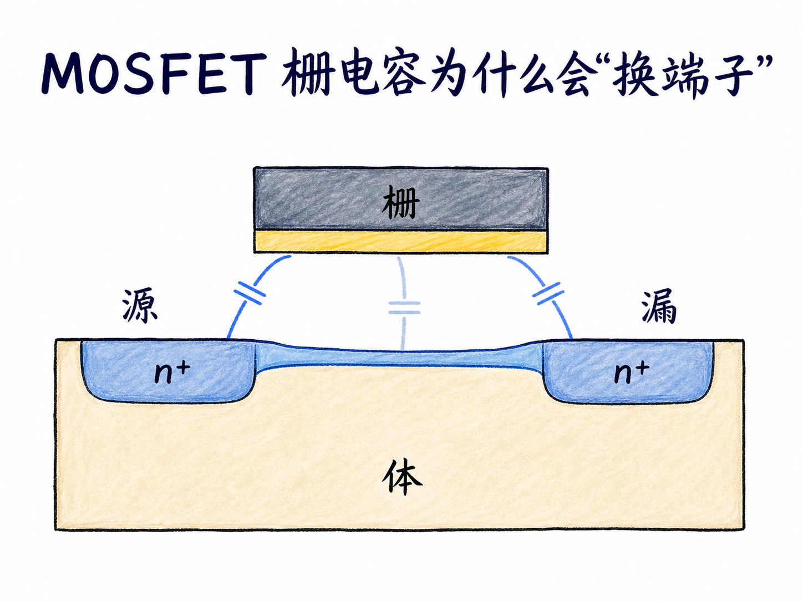
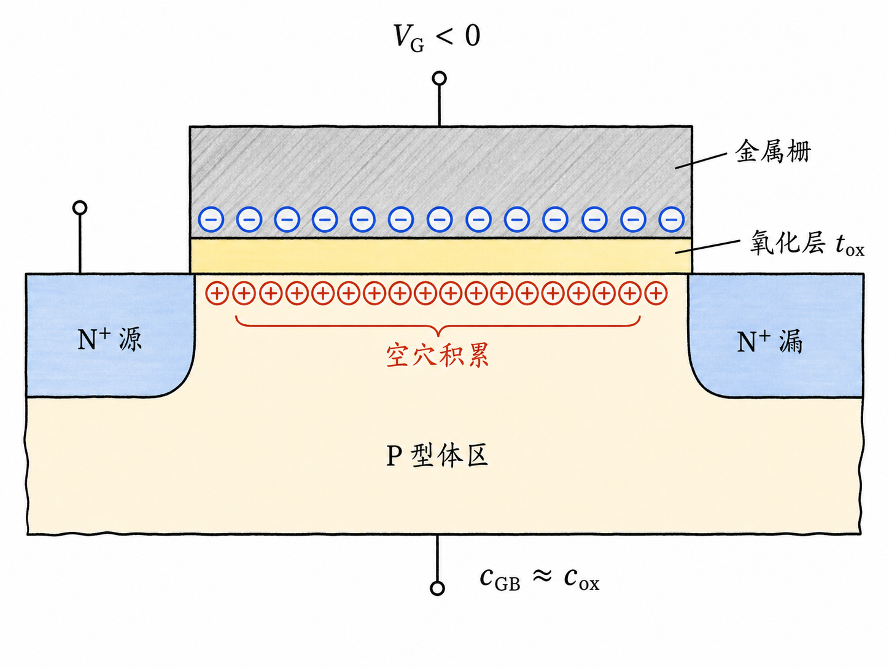
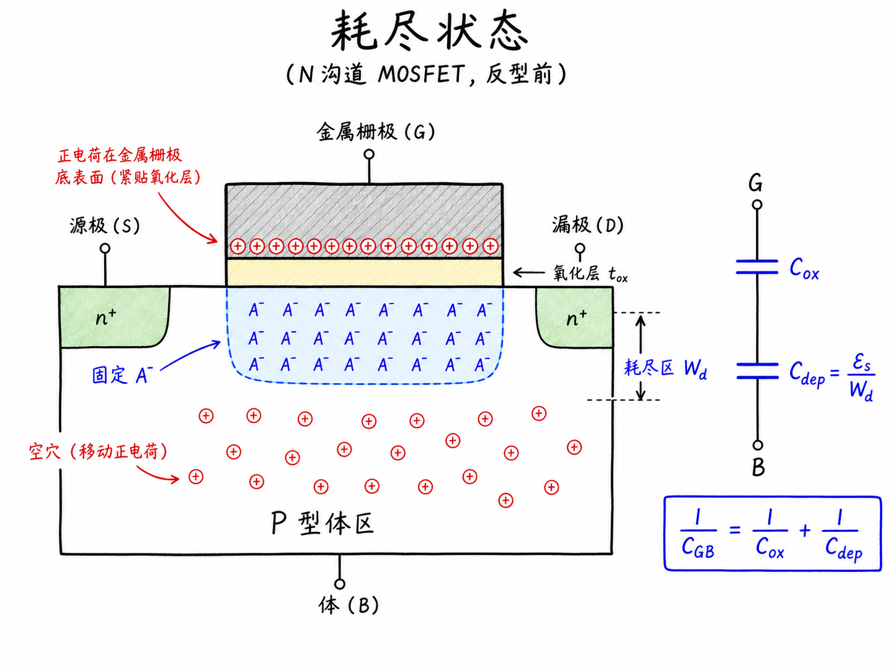
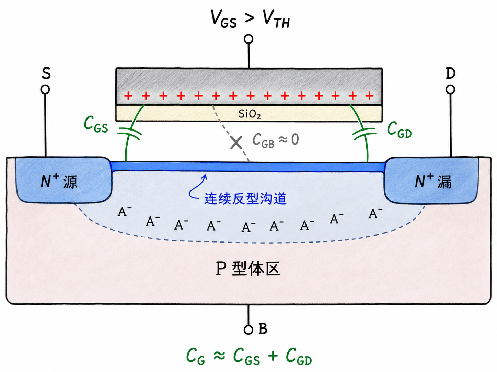
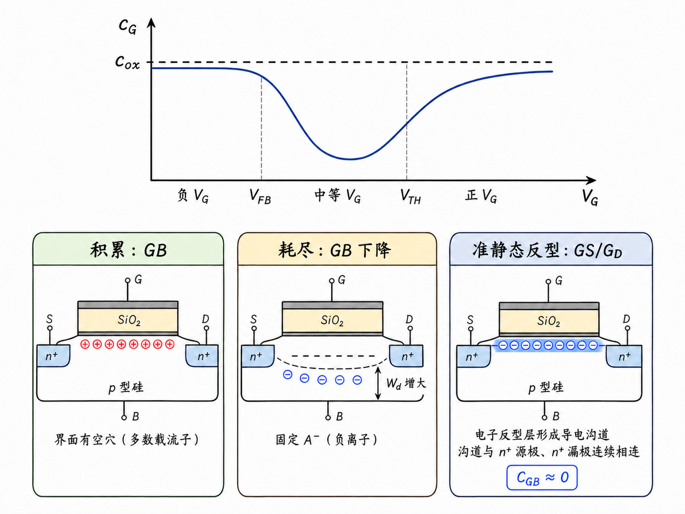

# MOSFET 栅电容为什么会“换端子”

氧化层厚度没变，栅面积也没变，MOSFET 的栅电容为什么还会随栅压改变？更反直觉的是，同一片栅极下面的电容，一会儿表现为栅—体电容，一会儿又变成栅—源和栅—漏电容。

问题不在氧化层“变了”，而在氧化层下方是谁在响应栅极电荷。表面是空穴、耗尽区，还是一条与源漏相连的电子沟道，决定了电荷相隔多远，也决定了这颗电容应该算在哪两个端子之间。

读完这篇，你会知道

- 为什么负栅压时栅—体电容接近栅氧电容
- 耗尽区变宽为什么会让电容下降
- 强反型后总栅电容为什么又接近栅氧电容
- 为什么强反型时 $C_{GB}\approx0$
- $C_{GS}$ 与 $C_{GD}$ 为什么不能在所有偏置下都简单地各算一半

## 先把“固定不变”的部分分清楚

先看一个 N 沟道 MOSFET：P 型体区中有两个 N+ 区，分别作为源极和漏极；金属栅与半导体之间隔着厚度为 $t_{ox}$ 的氧化层。假设体、源、漏暂时都接零电位，只改变栅电压。

氧化层本身给出的单位面积电容是

$$
c_{ox}=\frac{\varepsilon_{ox}}{t_{ox}}
$$

它只由氧化层介电常数 $\varepsilon_{ox}$ 和厚度 $t_{ox}$ 决定。若有效栅宽、栅长分别为 $W$ 和 $L$，器件总栅氧电容为

$$
C_{ox}=c_{ox}WL
$$

这里要先把符号分清：小写 $c_{ox}$ 是单位面积电容，大写 $C_{ox}$ 是乘上栅面积后的器件总量。它们不会因为栅压改变而改变。

真正会变的是等效电容路径。

## 负栅压：空穴贴着界面，栅极直接“看到”体区

栅极施加足够负的电压时，P 型体区中的空穴被吸引到氧化层—半导体界面。栅下进入积累状态，原有耗尽区缩小并近似消失。

此时，栅极一侧是负电荷，半导体表面一侧是积累的正电荷。两层可响应电荷之间主要只隔着氧化层，距离约为 $t_{ox}$。所以单位面积栅—体电容近似为

$$
c_{GB}\approx c_{ox}
$$

这就是栅电容曲线在积累区保持高平台的原因：不是沟道产生了什么新电容，而是电荷响应面就贴在氧化层另一侧。

## 栅压升高：耗尽区把两层电荷越推越远

把栅压从较大的负值逐渐升高，表面空穴不再被强烈吸引，开始离开界面。留下的是固定的负离化受主 $A^-$，栅下重新形成耗尽区。

这时，栅极电荷要与更深处的可响应体区电荷对应。中间不只有氧化层，还多了一段宽度为 $W_d$ 的耗尽区。可以把它理解成栅氧电容与耗尽层电容串联：

$$
\frac{1}{c_{GB}}=\frac{1}{c_{ox}}+\frac{1}{c_{dep}}
$$

其中

$$
c_{dep}=\frac{\varepsilon_s}{W_d}
$$

栅压继续升高时，$W_d$ 增大，$c_{dep}$ 变小，串联后的 $c_{GB}$ 也随之下降。当表面电势接近 $2\phi_F$、耗尽区接近最大宽度 $W_{d,\max}$ 时，电容来到低点。

这里很关键：下降的不是 $c_{ox}$，而是栅极与可响应电荷之间多出了一段耗尽区。

## 强反型：总电容回来，但端子归属变了

当 $V_{GS}$ 达到并超过阈值电压 $V_{TH}$，栅下出现大量可移动电子，形成反型沟道。新增栅电荷主要由界面附近的反型电子承担，耗尽区不再按原来的趋势持续增宽。

在反型电子能够由源漏补充、也能跟随小信号的准静态端子模型中，栅极正电荷与沟道电子之间主要只隔着 $t_{ox}$。因此，总栅电容又接近 $C_{ox}$。

但它并没有“回到原来的栅—体电容”。

反型电子组成的沟道与 N+ 源区、漏区连续相连。电路给栅极充放电时，沟道电子主要从源漏端进出，而不是从 P 型体区直接穿过强电场回到表面。因此强反型下通常有

$$
C_{GB}\approx0
$$

而总栅电容主要表现为

$$
C_G\approx C_{GS}+C_{GD}
$$

栅极下面仍是同一层氧化层，但负责响应的电荷已经从体区空穴换成了与源漏相连的沟道电子。电容的“端子归属”因此改变。

## 为什么不能永远各分一半

如果源漏结构对称、$V_{DS}$ 接近零，沟道电荷分布也近似对称。一阶模型可以把沟道相关的栅电容近似地在源漏之间各分一半：

$$
C_{GS}\approx C_{GD}\approx\frac{1}{2}C_{ox}
$$

这只是一个特定条件下的起点。只要加上明显的 $V_{DS}$，沟道电荷沿源到漏就不再均匀；进入饱和区后，漏端附近还会发生夹断。此时 $C_{GS}$ 与 $C_{GD}$ 的分配会随工作区改变。

从电路角度看，分别知道 $C_{GS}$ 与 $C_{GD}$ 比只知道一个总栅电容更有用。若把“各一半”当成所有偏置下的固定结论，就无法准确描述不同端子分别承担的沟道充放电。

## 记住一条因果链

MOSFET 栅电容的变化可以压缩成一条因果链：

栅压改变表面状态；表面状态决定哪一层电荷响应；响应电荷的位置决定等效距离；响应电荷连接到哪里，又决定电容属于体、源还是漏。

所以，“栅电容”不是一颗数值和端子都固定不变的电容。氧化层给出上限，沟道状态决定实际路径，器件偏置决定它最终怎样分配到 $C_{GB}$、$C_{GS}$ 与 $C_{GD}$。
