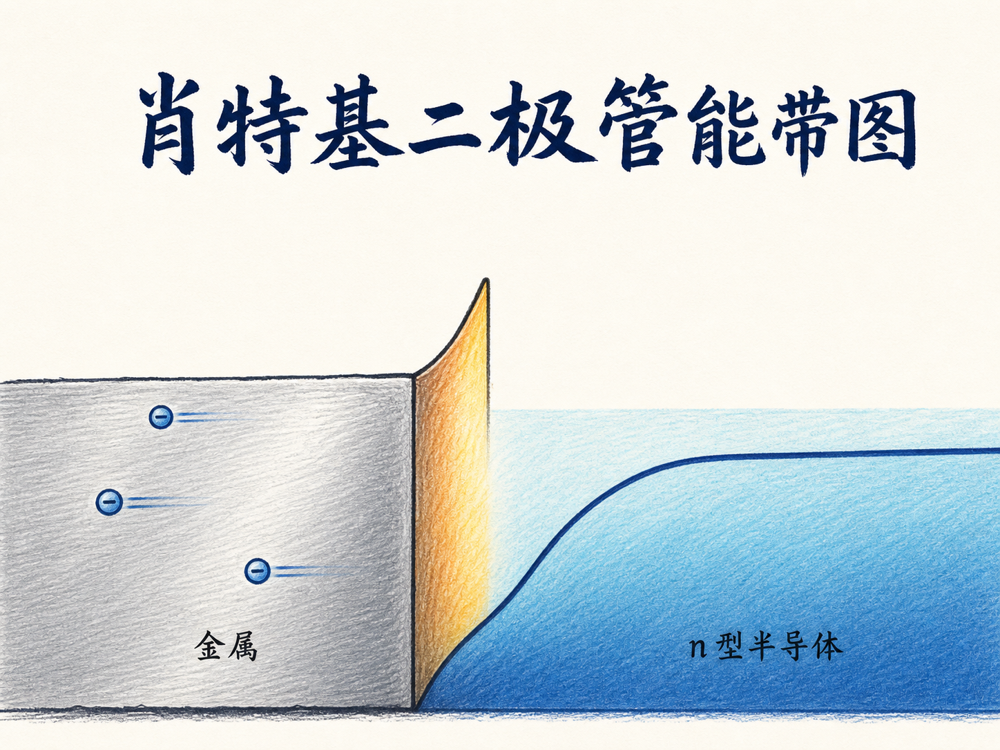
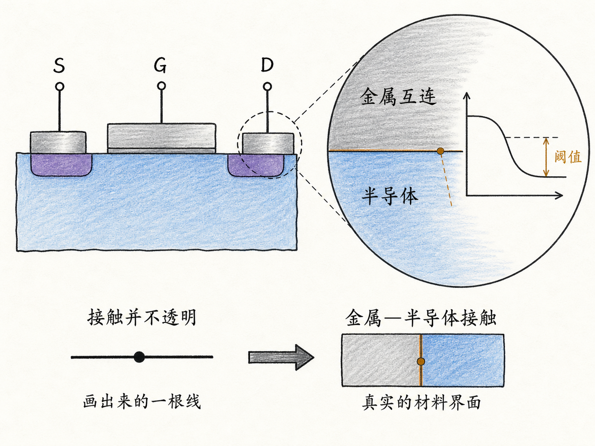
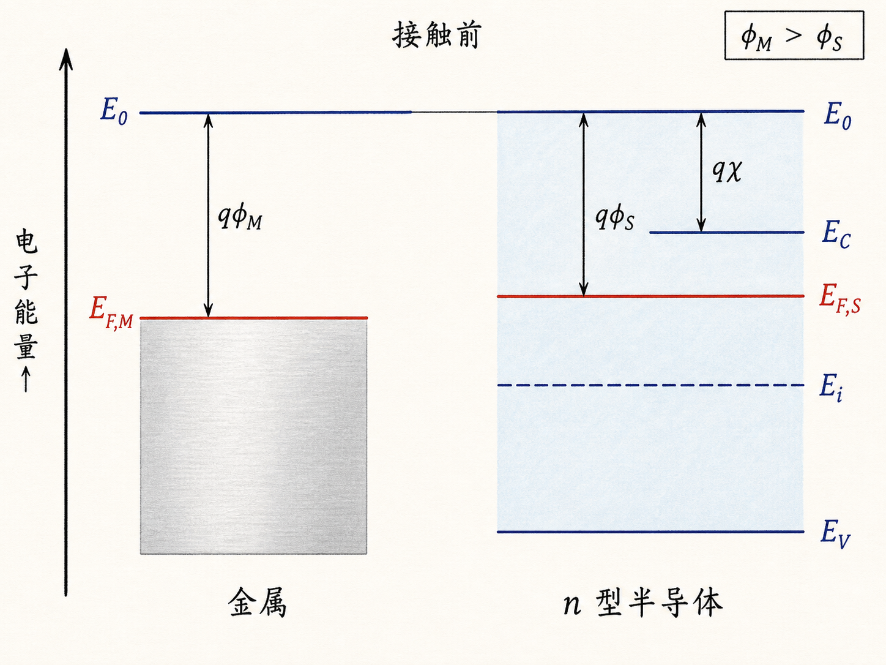
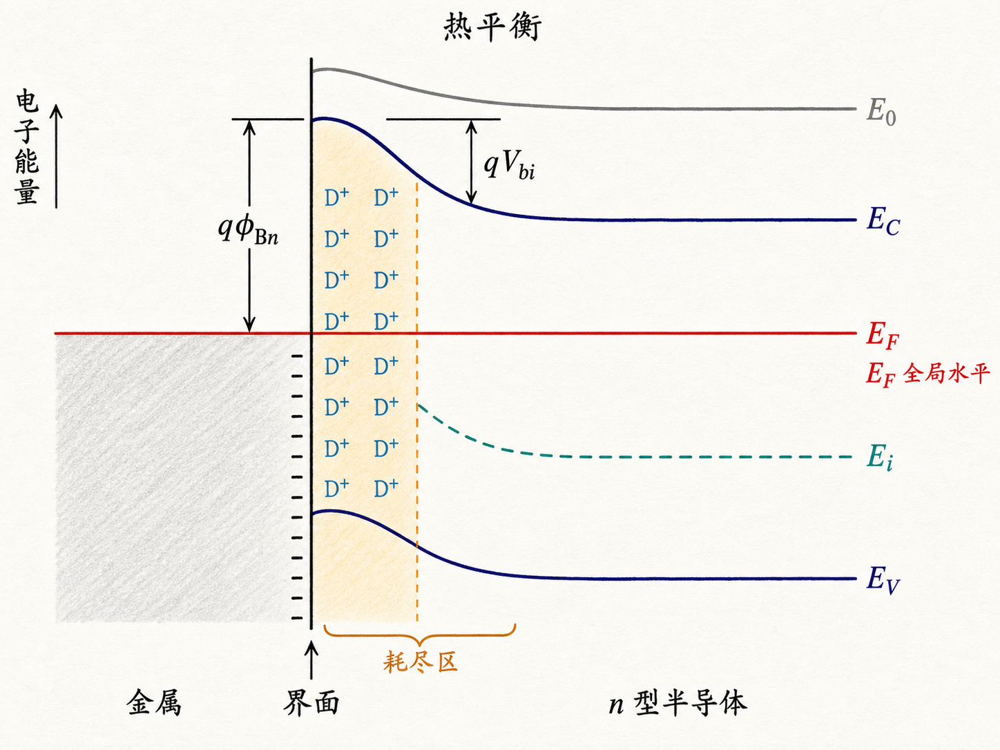
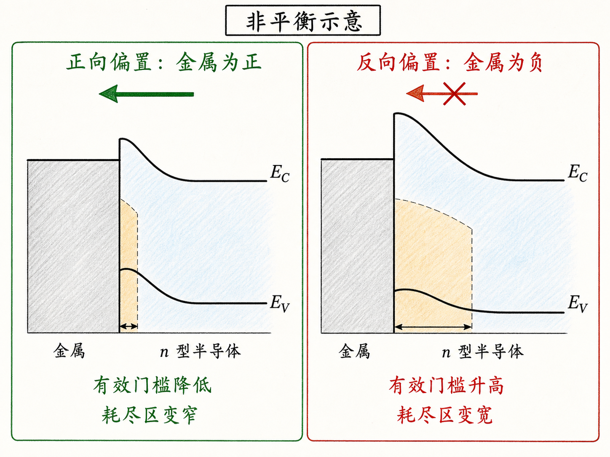

# 一根金属线接上半导体，为什么会变成二极管？

晶体管设计完成以后，我们习惯在源极、漏极和栅极上画几根线，仿佛电流自然就能从金属线进入半导体。但每一根线真正落到器件上时，都要经过一个金属—半导体界面。这个界面并不是透明的。

材料选得不对，接触本身就会挡住电子；换一种设计，我们又能故意利用这道门槛做成肖特基二极管（Schottky diode）。两种结果的起点完全相同：先把金属和半导体的能带图摆在一起。

读完这篇，你会知道

- 功函数和电子亲和势分别在量什么
- 金属与 n 型半导体接触后，为什么费米能级必须水平对齐
- n 型半导体的能带为什么会在界面附近向上弯曲
- 肖特基势垒 $\phi_{Bn}$ 与半导体内建电势 $V_{bi}$ 为什么不是同一个量
- 同一个金属—半导体接触为什么能够表现出整流

## 接触不是导线的终点，而是另一个器件

想象一只已经设计好的 MOSFET。沟道、源区和漏区都满足要求，但要把它放进真实电路，还必须让金属互连与这些半导体区域接触。

如果把界面当成一根“零阻力的线”，就跳过了一个关键问题：电子从一种材料进入另一种材料时，面对的可用能态和势能是否连续？金属—半导体接触（metal–semiconductor contact）之所以重要，不只是因为肖特基二极管常用，还因为现代器件里到处都是这种界面。接触电阻、整流特性乃至器件能否正常工作，都从这里开始。

## 先把三把能量尺认清

画能带图时，最上面可以先放一条真空能级 $E_0$。它表示电子刚好脱离材料、进入真空时的能量基准。

对金属，费米能级记作 $E_F$。真空能级与费米能级的差定义了金属功函数 $\phi_M$：

$$
q\phi_M=E_0-E_F
$$

其中 $q$ 是元电荷量。直观地说，$q\phi_M$ 就是从费米能级附近把电子移到真空所需的最小能量。

半导体还要多两条边界：导带底 $E_C$ 和价带顶 $E_V$。真空能级到导带底之间的差定义电子亲和势 $\chi$：

$$
q\chi=E_0-E_C
$$

半导体自己的功函数则仍由真空能级到费米能级决定：

$$
q\phi_S=E_0-E_F
$$

如果 $E_F$ 位于本征能级 $E_i$ 之上，半导体是 n 型。注意，$\chi$ 看的是导带底，$\phi_S$ 看的是费米能级；掺杂会移动 $E_F$，因此会改变 $\phi_S$，却不会用同样的方式改变材料的电子亲和势。

## 接触前：两块材料各有自己的费米能级

先看常见的 n 型整流接触：金属功函数大于半导体功函数，即 $\phi_M\gt\phi_S$。

若用同一条真空能级作为参考，功函数更大意味着金属的费米能级更低。因此在接触之前，n 型半导体的 $E_F$ 高于金属的 $E_F$。两块材料仍彼此独立，各自处在平衡状态，所以允许有两条不同高度的费米能级。

一旦接触，这种状态就不能保持。半导体一侧较高能量的电子会先流向金属，直到继续转移电子所产生的电场恰好阻止净扩散。

## 热平衡：费米能级拉平，半导体能带向上弯

达到热平衡以后，整个金属—半导体结构只能有一个费米能级。因此 $E_F$ 必须是一条贯穿金属与半导体的水平直线。

电子从 n 型半导体流向金属后，界面附近的自由电子浓度下降，留下不能移动的带正电离化施主。这一区域就是耗尽区。金属界面一侧则积累等量异号电荷，两侧空间电荷建立起从半导体指向金属的内建电场。

以电子能量为纵轴时，电子势能与电势变化方向相反。对 $\phi_M\gt\phi_S$ 的 n 型接触，靠近金属界面的 $E_C$、$E_i$、$E_V$ 和 $E_0$ 必须一起向上弯曲；远离界面后恢复到 n 型半导体体区的平坦能带。几条带边近似平行，带隙宽度不因弯曲而改变。

这张图里有四个不能混淆的判断：热平衡 $E_F$ 水平；n 型能带朝界面向上弯；耗尽区留下的是正离化施主；弯曲发生在半导体一侧，而金属内部的静电势变化被极短的屏蔽长度限制。

## 两道“门槛”，来源并不相同

从金属费米能级到半导体界面导带底的能量差，是电子的肖特基势垒。对理想界面，n 型半导体的势垒高度为

$$
\phi_{Bn}=\phi_M-\chi
$$

所以电子要从金属进入半导体导带，需要跨过能量 $q\phi_{Bn}$。理想模型里，它主要由金属功函数和半导体电子亲和势决定。

而半导体电子从体区走到界面时，看到的是能带弯曲形成的内建能垒：

$$
V_{bi}=\phi_M-\phi_S
$$

对应的电子能量是 $qV_{bi}$。把两式相减还能得到

$$
qV_{bi}=q\phi_{Bn}-(E_C-E_F)_{\text{bulk}}
$$

这说明 $\phi_{Bn}$ 与 $V_{bi}$ 绝不是同一个量。前者从金属费米能级量到界面导带底；后者只对应半导体内部从体区到界面的弯曲。掺杂改变 $(E_C-E_F)_{\text{bulk}}$ 和 $\phi_S$，因此会改变 $V_{bi}$，但在理想 Schottky–Mott 模型中不直接改变 $\phi_{Bn}$。

## 外加电压怎样打开或加高门槛

对 n 型肖特基二极管，金属相对半导体加正电压是正向偏置。这个电压削弱半导体侧的内建电势和能带弯曲，导带电子更容易从半导体越过界面进入金属，于是电流迅速增加。

金属相对半导体加负电压是反向偏置。它会加大半导体侧的耗尽和有效能垒，半导体多数载流子更难到达金属。反向电流因而受限，接触表现出整流。

需要注意：外加偏压下器件不再处于全局热平衡，不能继续把“全器件只有一条水平费米能级”当作严格描述。本文用水平 $E_F$ 讨论的是零偏热平衡能带图；偏置下的定量电流与势垒变化，需要进一步引入非平衡载流子统计。

## 从一张能带图走向真实接触

一根金属线接上半导体后，不会自动成为理想导线。材料的功函数差先驱动电子转移，空间电荷再建立电场，最终让费米能级在热平衡时水平对齐。对常见的 n 型整流接触，结果是半导体能带朝界面向上弯曲，并形成耗尽区与肖特基势垒。

可以把这一篇记成一句话：**费米能级必须拉平，所以能带不得不弯；能带一弯，金属接触就可能成为一道只允许电流更容易朝一个方向通过的门。**

下一步要解决的是这道门有多宽：耗尽区宽度如何由掺杂和电势决定，以及它怎样形成结电容。
