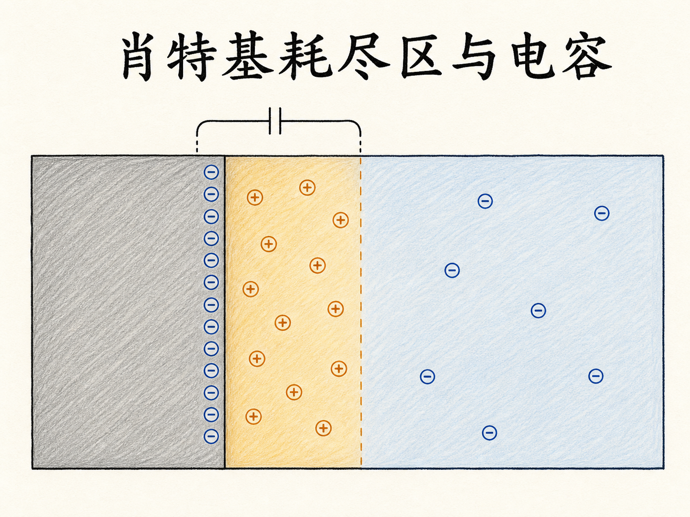
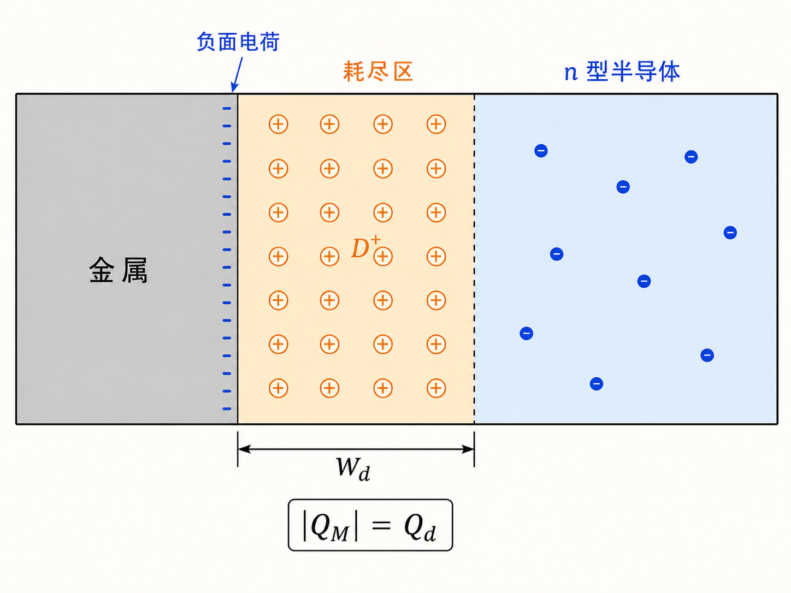
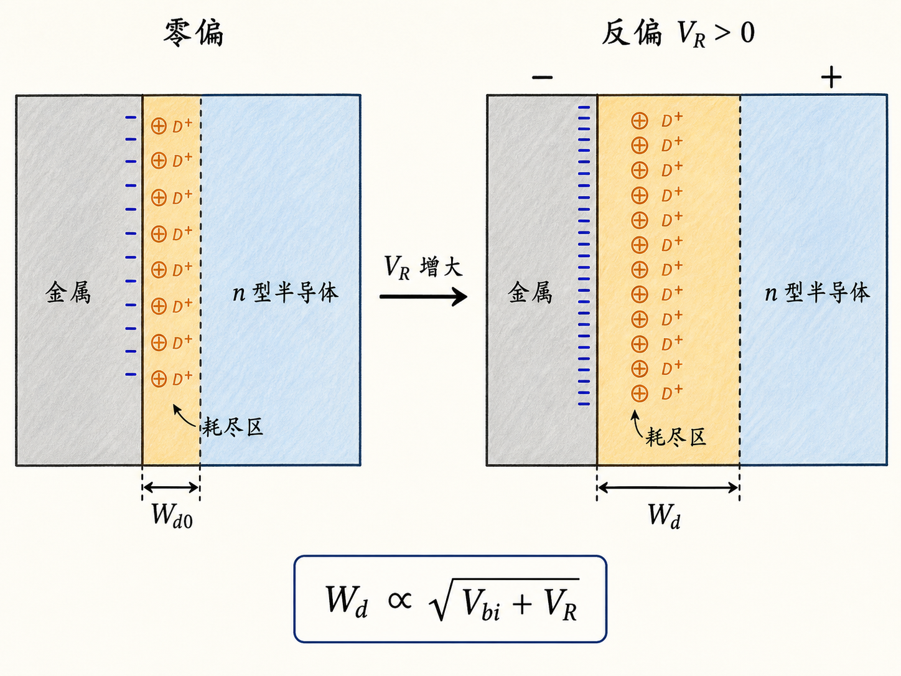
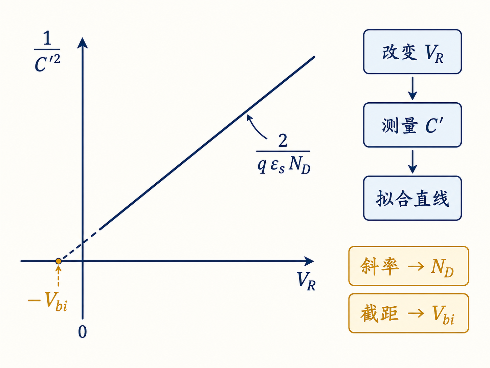

# 肖特基二极管的耗尽区与电容：一层电荷如何变成测量工具

金属与 n 型半导体只是贴在一起，为什么界面附近会出现一段几乎没有移动电子的区域？更反直觉的是，这段“空出来”的区域还能表现为电容，并帮助我们测出半导体的掺杂浓度。

答案不在金属和半导体各自的内部，而在接触后重新分布的电荷。只要把“电子往哪里走、留下什么、电势降在哪里”这条因果链理顺，耗尽宽度和结电容的公式就会变得很自然。

读完这篇，你会知道

- 肖特基耗尽区为什么只需要在半导体一侧计算？
- n 型半导体耗尽区里的正空间电荷来自哪里？
- 反向偏压为什么会让耗尽区变宽、结电容变小？
- 怎样用 $1/C'^2$–$V_R$ 直线反推出 $N_D$ 与 $V_{bi}$？

## 接触以后，电子先重新站队

考虑一个金属—n 型半导体接触（metal–semiconductor contact）。接触之前，两边各有自己的费米能级。若半导体一侧的电子能量更高，接触后电子就会从半导体扩散到金属，直到热平衡时整个结构具有统一的费米能级。

这次扩散留下了两类等量异号电荷：

- 金属表面得到额外电子，形成负面电荷；
- 半导体表面附近失去移动电子，留下固定的正离化施主 $D^+$。

这里必须分清“正离化施主”和“空穴”。n 型半导体耗尽区中的正空间电荷，是施主原子失去电子后留下的固定电荷，不是从 P 型区跑来的空穴。整个结构只有金属与 n 型半导体两部分，并不存在 P 区。

## 为什么电势几乎都降在半导体里

金属中自由电子密度很高。为保持金属内部近似没有静电场，补偿负电荷会挤在非常薄的界面层内。这个层的厚度相对于半导体耗尽区可以忽略，因此它承担的电势降也近似为零。

半导体不同。电子离开界面后，固定的 $D^+$ 会在有限宽度内形成空间电荷区。采用突变耗尽近似，设界面为 $x=0$，半导体沿 $+x$ 方向延伸，耗尽区宽度为 $W_d$，则

$$
\rho(x)=qN_D,\qquad 0\lt x\lt W_d.
$$

其中，$q$ 是元电荷量，$N_D$ 是施主掺杂浓度，$\varepsilon_s$ 是半导体介电常数。

电荷中性仍然成立。若接触面积为 $A$，半导体耗尽区内的总正电荷为

$$
Q_d=qN_DAW_d,
$$

金属表面则承担等量异号电荷 $-Q_d$。区别只在于：金属侧电荷被压缩成近似面电荷，半导体侧电荷分布在宽度为 $W_d$ 的体积里。

## 从空间电荷推到耗尽宽度

从高斯定律出发，半导体耗尽区内满足

$$
\frac{dE}{dx}=\frac{qN_D}{\varepsilon_s}.
$$

在耗尽区边界 $x=W_d$ 处，电场回到零。积分后，电场在界面处最大，并向准中性区线性减小。再对电场积分，得到耗尽区承担的总电势降

$$
V_{bi}+V_R=\frac{qN_DW_d^2}{2\varepsilon_s}.
$$

$V_{bi}$ 是零偏时的内建电势，$V_R$ 是这里定义的反向偏压：半导体电势相对金属升高。于是

$$
W_d=\sqrt{\frac{2\varepsilon_s(V_{bi}+V_R)}{qN_D}}.
$$

这个平方根关系包含两个直接结论：

1. 反向偏压 $V_R$ 增大，总电势降增加，耗尽区变宽；
2. 施主浓度 $N_D$ 越高，同样电势降只需要更窄的耗尽区就能提供足够空间电荷。

推导形式与单边突变 PN 结相似，是因为两者都在解“近似均匀空间电荷产生的电场和电势”。但相似的是数学，不是器件结构。肖特基结的另一侧是金属，不是重掺杂 P 区。

## 耗尽区为什么就是一个电容

电容的核心不是“两块几何上完全相同的金属板”，而是两组被空间隔开的等量异号电荷。肖特基结正好满足这个条件：金属表面是负电荷，半导体耗尽区是正电荷，中间的有效分隔尺度由 $W_d$ 决定。

给金属再增加一点负电荷，会排斥半导体表面的移动电子，使耗尽边界向体内推进，暴露出更多正离化施主。两侧电荷增量仍然大小相等、符号相反，因此小信号结电容的单位面积值为

$$
C'=\frac{dQ_d/A}{dV_R}=\frac{\varepsilon_s}{W_d}.
$$

代入耗尽宽度，得到

$$
C'=\sqrt{\frac{q\varepsilon_sN_D}{2(V_{bi}+V_R)}}.
$$

若结面积为 $A$，器件总电容才是

$$
C=AC'.
$$

所以，反向偏压增大时，$W_d$ 增大，而 $C'$ 减小。它与平行板电容的直觉一致：有效“板间距”越大，电容越小。

## 把电容变成掺杂测量

直接观察平方根曲线不方便，取倒数平方后关系变成直线：

$$
\frac{1}{C'^2}=\frac{2(V_{bi}+V_R)}{q\varepsilon_sN_D}.
$$

横轴取 $V_R$，纵轴取 $1/C'^2$，理想均匀掺杂下会得到一条直线。其斜率为

$$
\frac{d(1/C'^2)}{dV_R}=\frac{2}{q\varepsilon_sN_D},
$$

因此斜率可以给出 $N_D$；把直线外推到横轴，截距位于 $V_R=-V_{bi}$，可以得到内建电势。

这就是肖特基 C–V 测量的核心：施加不同反向偏压，测量每个偏压下的结电容，再把非线性的 $C'$–$V_R$ 关系变成线性的 $1/C'^2$–$V_R$ 关系。

## 从静电图像走向电流—电压关系

到这里，肖特基结的静电部分已经连成一条完整链条：电子从半导体扩散到金属，半导体一侧留下正离化施主；空间电荷产生内建电势；反向偏压增加电势降并拓宽耗尽区；耗尽宽度又决定结电容。

下一步要问的是动态问题：外加电压为正或为负时，电子如何跨过界面势垒，最终形成怎样的电流—电压关系。耗尽区与电容描述了电荷怎样重新排布，而后续的输运分析将说明这些电荷怎样真正流动。
