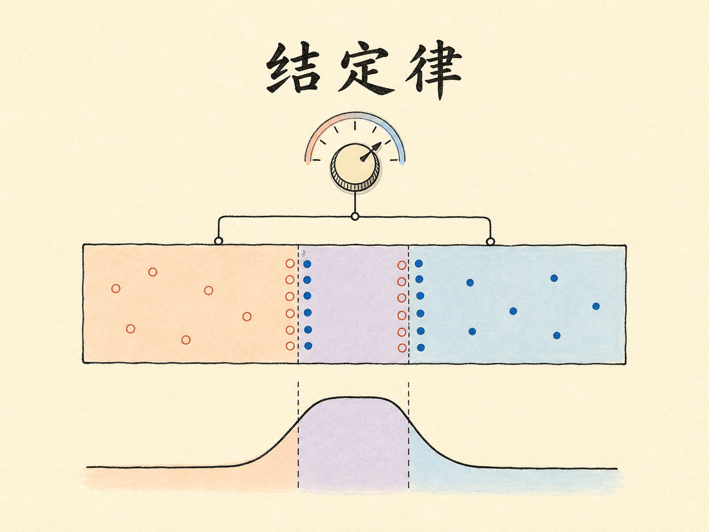
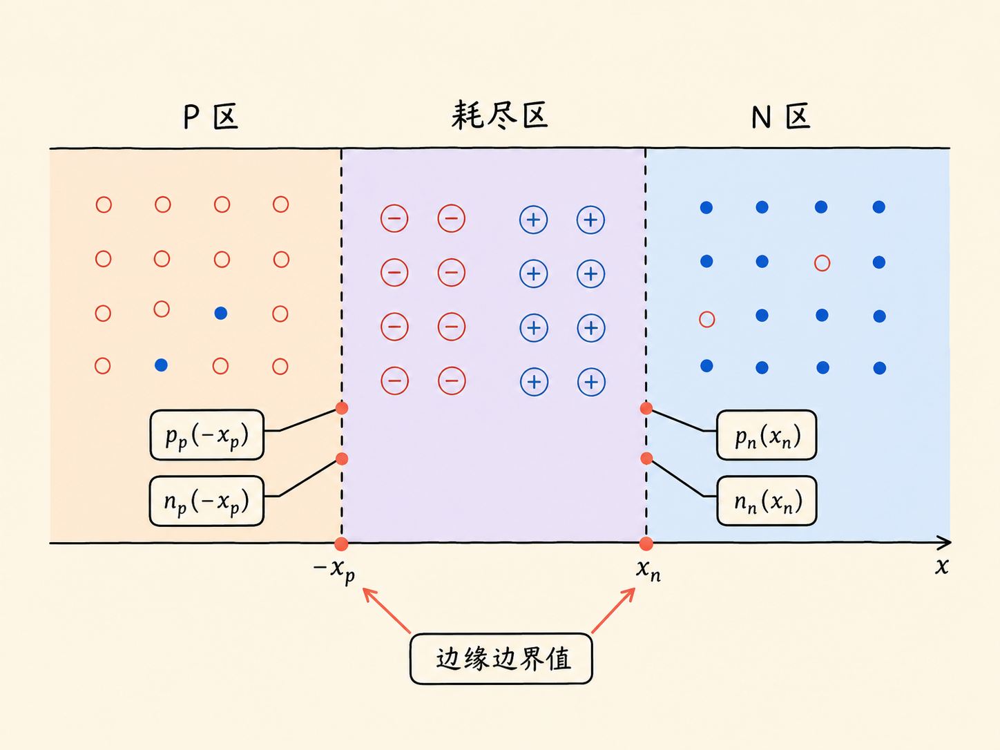
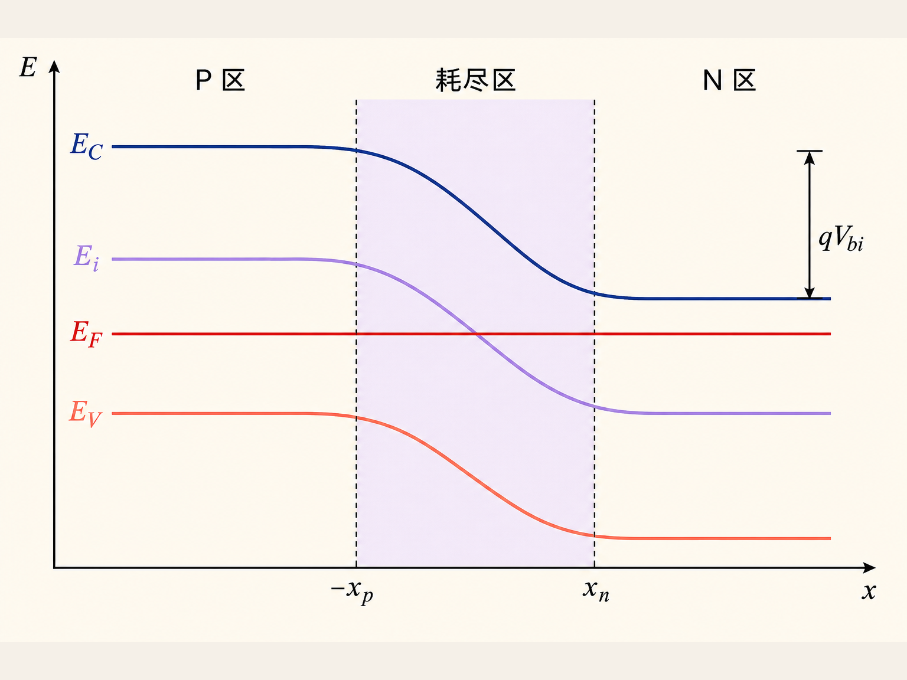
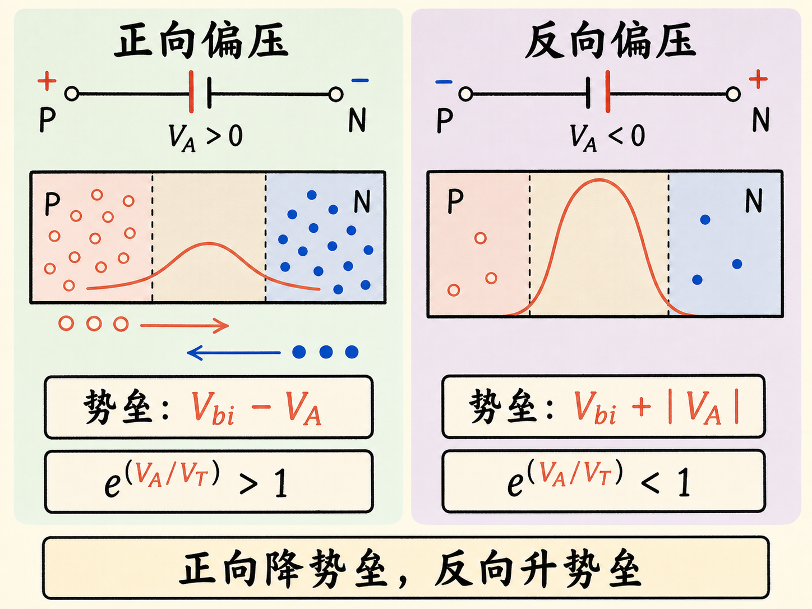
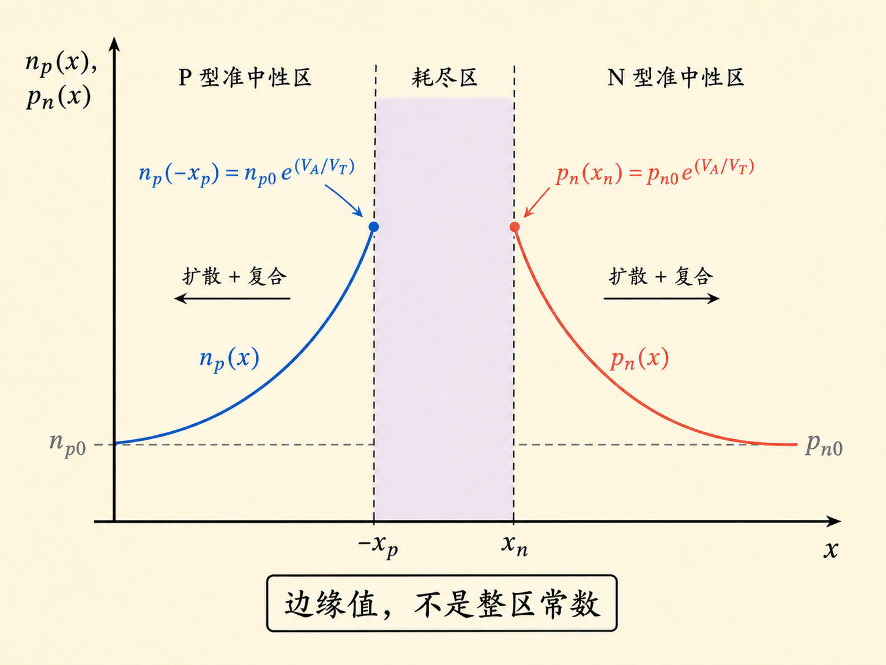
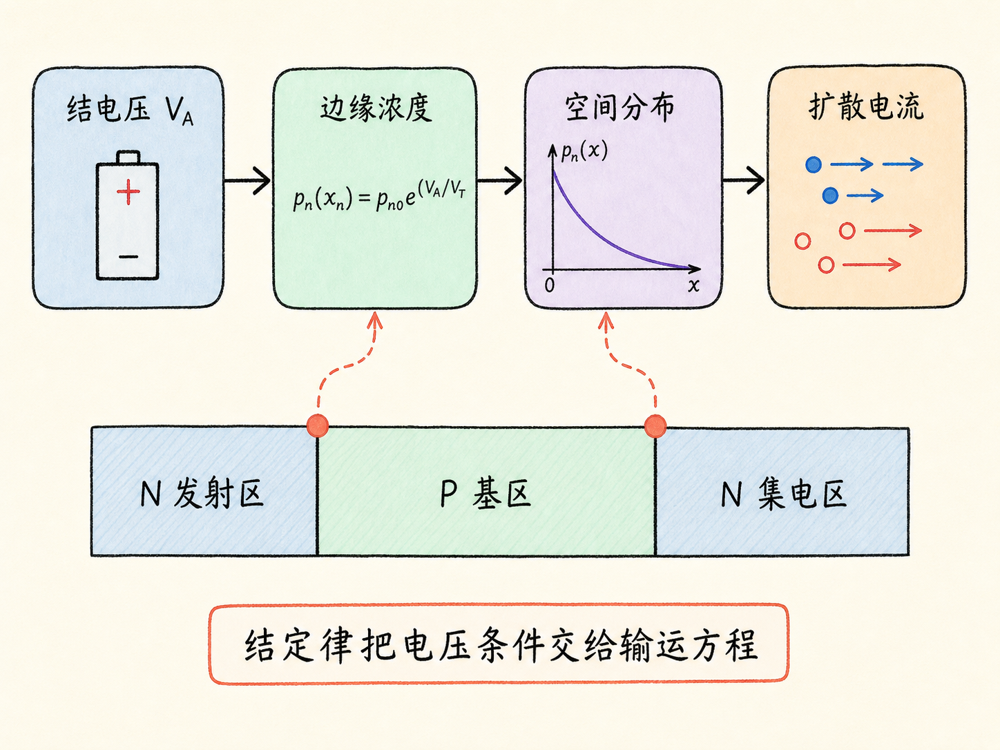

# 结定律：一个电压，如何设定 PN 结边缘的少数载流子

给 PN 结加一点正向电压，二极管电流为什么会呈指数增长？真正先被电压改变的，并不是整个 N 区或整个 P 区的载流子浓度，而是耗尽区两侧边缘的少数载流子边界值。

结定律（law of the junction）做的事情，就是把“结电压”翻译成这个边界值。它只有几行公式，却是二极管扩散电流和 BJT 载流子分布的共同入口。

读完这篇，你会知道

- 结定律究竟约束 PN 结的哪个位置
- 正向与反向偏压为什么分别降低和抬高势垒
- $p_n(x_n)=p_{n0}e^{qV_A/kT}$ 从哪里来
- 为什么耗尽区边缘浓度不能画成整个准中性区处处相同
- 这条边界条件成立需要哪些假设

## 先把位置说清楚：定律管的是“边缘”

设 P 区在左、N 区在右，耗尽区从 $x=-x_p$ 延伸到 $x=x_n$。

- $p_p(-x_p)$：P 侧耗尽区边缘的空穴浓度，空穴在这里是多数载流子。
- $p_n(x_n)$：N 侧耗尽区边缘的空穴浓度，空穴在这里是少数载流子。
- $n_p(-x_p)$：P 侧耗尽区边缘的电子浓度，电子在这里是少数载流子。
- $n_n(x_n)$：N 侧耗尽区边缘的电子浓度，电子在这里是多数载流子。

下标先说明所在区域，上标或括号中的位置再说明观察点。这样写看似繁琐，却能避免最常见的误解：N 型半导体不是“没有空穴”，只是平衡少数空穴浓度很低；P 型半导体同样不是“没有电子”。

结定律要回答的是：一旦在结上加电压，$p_n(x_n)$ 和 $n_p(-x_p)$ 会变成多少。

## 平衡能带先给出内建势垒

先看热平衡。P 型一侧的费米能级 $E_F$ 靠近价带顶 $E_V$，N 型一侧的 $E_F$ 靠近导带底 $E_C$。两块材料接触并达到热平衡后，$E_F$ 必须贯穿整个器件且保持水平，因此 $E_C$、本征能级 $E_i$ 和 $E_V$ 从 P 侧到 N 侧整体向下弯曲。

定义热电压

$$
V_T=\frac{kT}{q},
$$

其中 $k$ 是玻尔兹曼常数，$T$ 是绝对温度，$q$ 是元电荷量。

若采用非简并近似，P、N 两侧远离结区的多数载流子浓度分别为 $p_{p0}$ 与 $n_{n0}$，则平衡内建电势可以写成

$$
V_{bi}=V_T\ln\left(\frac{p_{p0}n_{n0}}{n_i^2}\right),
$$

其中 $n_i$ 是本征载流子浓度。

指数化以后，

$$
\frac{p_{p0}n_{n0}}{n_i^2}=e^{V_{bi}/V_T}.
$$

在热平衡、非简并条件下，质量作用定律给出 $np=n_i^2$。因此 N 区平衡少数空穴浓度为 $p_{n0}=n_i^2/n_{n0}$，于是

$$
p_{p0}=p_{n0}e^{V_{bi}/V_T}.
$$

这个式子说的是：平衡时，内建势垒正好对应耗尽区两边空穴浓度的指数差。

## 加电压，本质上是在改势垒

本文把外加结电压定义为

$$
V_A=V_P-V_N.
$$

正向偏压时 $V_A\gt 0$，P 侧电势高于 N 侧，载流子跨越结区所见的有效势垒降低为

$$
V_{\text{barrier}}=V_{bi}-V_A.
$$

反向偏压时 $V_A\lt 0$，同一个表达式变成 $V_{bi}+|V_A|$，势垒升高。符号、势垒和指数方向必须同时一致：

- 正向偏压：$V_A\gt 0$，势垒降低，少数载流子边界浓度增加。
- 零偏压：$V_A=0$，边界浓度回到平衡值。
- 反向偏压：$V_A\lt 0$，势垒升高，少数载流子边界浓度减小。

把平衡关系中的 $V_{bi}$ 换成 $V_{bi}-V_A$，可写出空穴在耗尽区两侧边缘的浓度比：

$$
p_p(-x_p)=p_n(x_n)
\exp\left(\frac{V_{bi}-V_A}{V_T}\right).
$$

对电子同样有

$$
n_n(x_n)=n_p(-x_p)
\exp\left(\frac{V_{bi}-V_A}{V_T}\right).
$$

这两式是“跨过耗尽区看两侧边缘”的表达。它们还没有假定整个准中性区的浓度不变。

## 常用形式：少数载流子边界值随电压指数变化

在理想低注入下，多数载流子浓度几乎不被注入扰动：

$$
p_p(-x_p)\approx p_{p0},\qquad
n_n(x_n)\approx n_{n0}.
$$

把它们代入边缘浓度比，再利用平衡关系，就得到最常用的结定律边界条件：

$$
p_n(x_n)=p_{n0}e^{V_A/V_T}
=p_{n0}e^{qV_A/kT},
$$

$$
n_p(-x_p)=n_{p0}e^{V_A/V_T}
=n_{p0}e^{qV_A/kT}.
$$

这两行公式的直觉非常直接：外加电压每增加一个热电压，耗尽区边缘的少数载流子浓度就乘上一个 $e$。

正向偏压时，P 区空穴被注入 N 区，N 区电子被注入 P 区，所以 $p_n(x_n)$ 与 $n_p(-x_p)$ 都上升。反向偏压时，指数因子小于 1，两侧边缘的少数载流子浓度都低于平衡值。

## 边界条件不是整段浓度分布

这里最容易画错。

$p_n(x_n)$ 只是 N 侧耗尽区边缘的空穴浓度。离开边缘、进入 N 型准中性区后，注入空穴会一边扩散，一边与多数电子复合。若 N 区足够长，空穴浓度会从边缘值逐渐衰减，最终回到远处的平衡值 $p_{n0}$。

用过剩少数空穴浓度表示，

$$
\Delta p_n(x_n)
=p_n(x_n)-p_{n0}
=p_{n0}\left(e^{V_A/V_T}-1\right).
$$

这仍然只是边缘处的过剩浓度。准中性区内部的 $\Delta p_n(x)$ 还要由连续性方程、扩散长度和器件边界共同决定。把 $p_n(x_n)$ 画成整个 N 区的一条水平线，相当于忽略了扩散与复合，也会直接破坏后续电流推导。

P 侧的少数电子分布完全对称：$n_p(-x_p)$ 给出左边缘边界值，继续向 P 区内部时再按自己的扩散与复合条件变化。

## 这些指数式不是无条件成立

常用的两个指数边界式依赖一组理想假设：

1. **非简并统计**：载流子浓度可以用 Boltzmann 指数关系描述。
2. **耗尽区内准平衡输运**：电子与空穴各自的准费米能级在穿过耗尽区时近似不变。
3. **耗尽区复合与产生可忽略**：载流子跨越结区后，先在边缘建立边界值，再在准中性区内扩散和复合。
4. **低注入**：注入的少数载流子不足以明显改变多数载流子浓度与空间电荷。
5. **器件存在可辨认的准中性区**：结区不能短到耗尽区几乎占满整个器件。

如果出现高注入、强复合产生、简并掺杂、明显串联电阻或非常短的中性区，仍然可以从准费米能级和输运方程出发分析，但不能不加说明地照搬理想指数边界式。

## 为什么 BJT 离不开它

BJT 可以看成两个相邻 PN 结，但关键不是“两个二极管简单串联”。真正需要跟踪的是发射结和集电结怎样分别设定基区两端的少数载流子边界值。

结定律先把两个结电压变成两个边界条件；连续性方程再把两个边界条件连接成基区内的载流子分布；载流子浓度梯度最终决定扩散电流。也就是说：

$$
\text{结电压}
\longrightarrow
\text{边缘浓度}
\longrightarrow
\text{空间分布}
\longrightarrow
\text{电流}.
$$

记住这一条因果链，就不会把结定律误解成“整个区域的浓度公式”。它真正的角色，是在耗尽区边缘把电压条件交给准中性区的输运问题。
