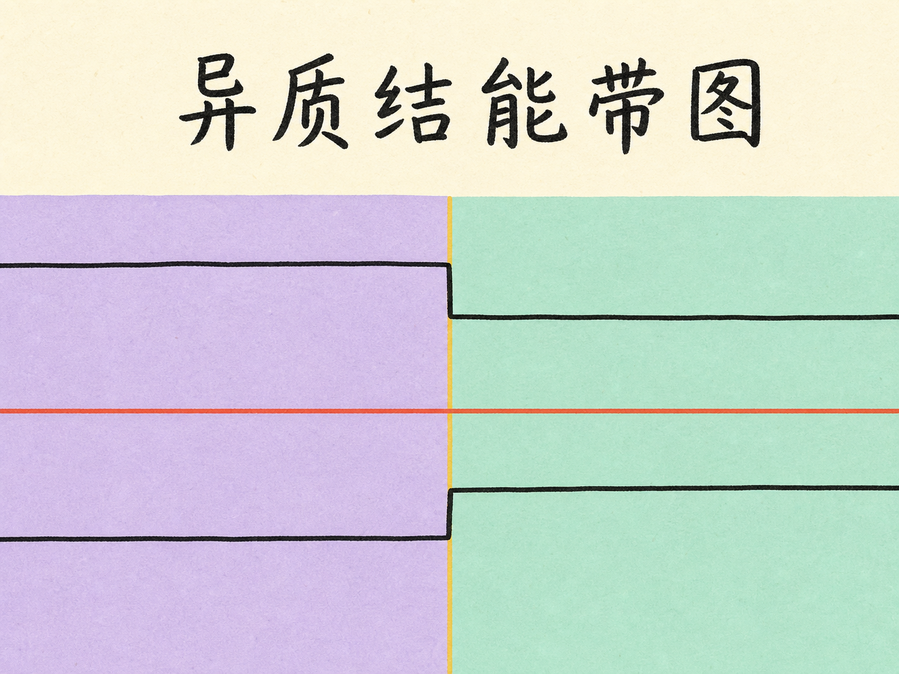
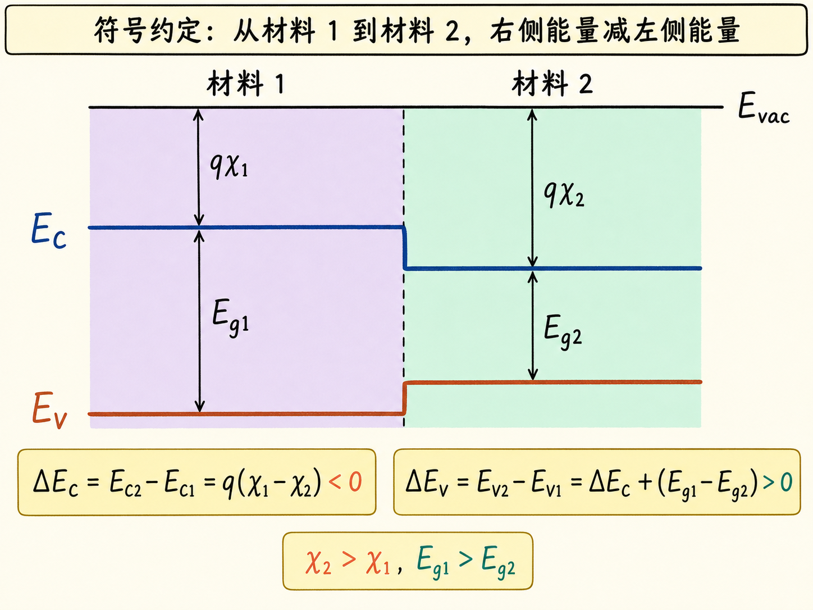
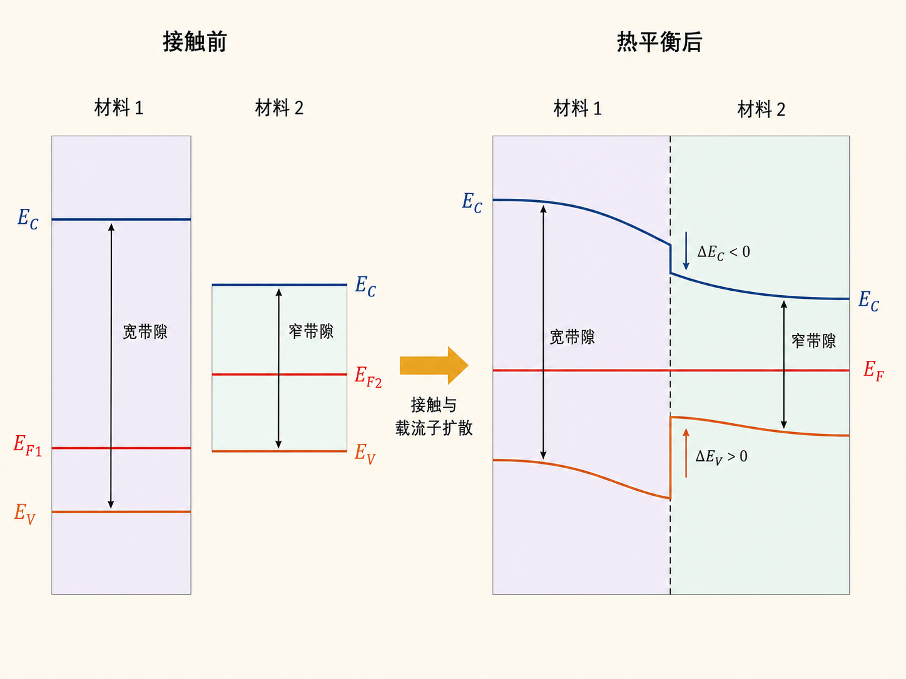
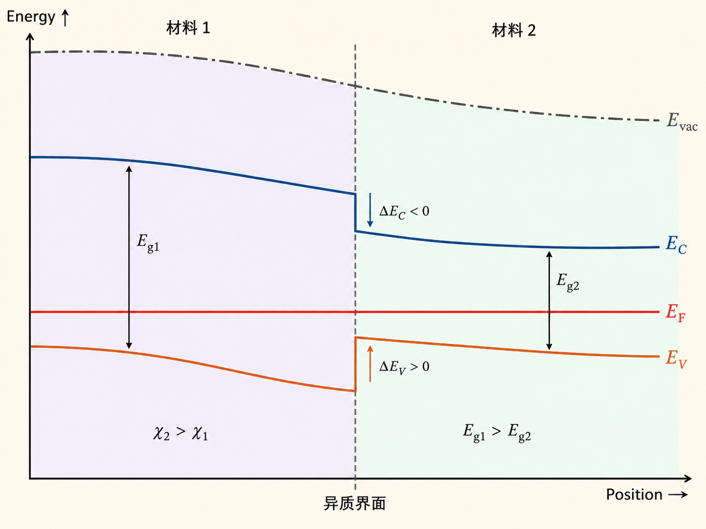
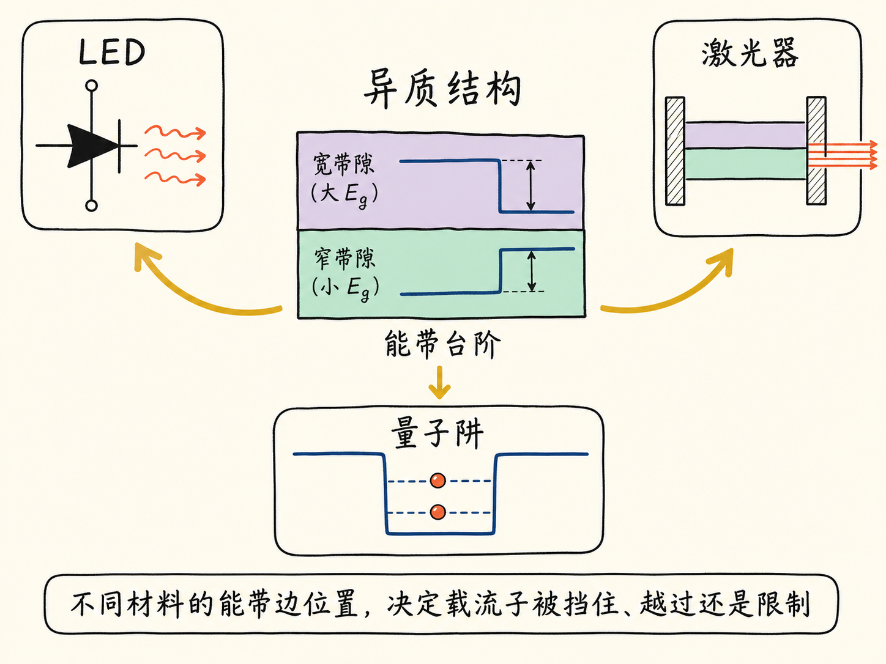

# 异质结能带图：弯曲与带阶是两件事

把两块同一种半导体接在一起，能带可以连续弯曲；但把两种不同半导体接在一起，界面上还会多出两个突然的台阶。一个在导带，一个在价带。若把这两个台阶误当成普通的能带弯曲，异质结最关键的物理信息就丢了。

LED、激光器和量子阱都依赖这种“不同材料接在一起”的结构。要理解载流子会被挡住、越过还是限制在某一侧，第一步就是把异质结能带图画对。

读完这篇，你会知道

- 异质结与同质结的能带图到底差在哪里
- 怎样由电子亲和势和带隙推导 $\Delta E_C$ 与 $\Delta E_V$
- 为什么接触前与热平衡后的图不能混在一起
- 为什么热平衡时 $E_F$ 必须水平，而导带和价带仍可在界面跳变
- 总弯曲量由什么决定，弯曲又怎样分配到界面两侧

## 先把两个动作分开：接合材料与达到平衡

异质结构（heterostructure）就是把两种不同的半导体接合在一起。例如，材料 1 放在左侧，材料 2 放在右侧。两者可以有不同的电子亲和势、不同的带隙，也可以有不同的掺杂和费米能级位置。

画图时最容易犯的错误，是直接从一条平滑弯曲的导带开始。更稳妥的顺序是先画接触前的两种独立材料，再处理接触后的热平衡。

对每种材料，先标出四个量：

- 真空能级 $E_{\mathrm{vac}}$
- 导带底 $E_C$
- 价带顶 $E_V$
- 费米能级 $E_F$

再定义电子亲和势 $\chi$：从真空能级到导带底的能量距离是 $q\chi$；带隙 $E_g$ 则是导带底到价带顶的距离。

于是，对材料 $i$ 有：

$$
E_{Ci}=E_{\mathrm{vac}}-q\chi_i
$$

$$
E_{Vi}=E_{\mathrm{vac}}-q\chi_i-E_{gi}
$$

这两式先固定了每种材料内部的带隙，再告诉我们：两种材料接到同一个界面时，导带和价带未必能连续接上。

## 界面台阶从哪里来

本文把材料 1 放在左侧、材料 2 放在右侧，并把“从左向右跨过界面后的能量减去跨越前的能量”定义为带阶：

$$
\Delta E_C\equiv E_{C2}-E_{C1}
$$

$$
\Delta E_V\equiv E_{V2}-E_{V1}
$$

用前面的能量关系相减，导带不连续量为：

$$
\Delta E_C=q(\chi_1-\chi_2)
$$

如果 $\chi_2\gt\chi_1$，那么 $\Delta E_C\lt0$。也就是说，从材料 1 跨到材料 2 时，导带底向下跳。方向不是凭“异质结通常怎样画”来猜，而是由材料排序和电子亲和势关系推出来的。

价带不连续量为：

$$
\Delta E_V=(q\chi_1+E_{g1})-(q\chi_2+E_{g2})
$$

整理后得到：

$$
\Delta E_V=\Delta E_C+(E_{g1}-E_{g2})
$$

这里能看到一个重要事实：$\Delta E_C$ 只由电子亲和势差决定，而 $\Delta E_V$ 还要把两种材料的带隙差计算进去。

假设图中材料 1 的电子亲和势较小、带隙较大，材料 2 的电子亲和势较大、带隙较小，就可能得到类似 $\Delta E_C=-0.2\ \mathrm{eV}$、$\Delta E_V=+0.1\ \mathrm{eV}$ 的示意结果。此时导带从左到右向下跳，价带却向上跳。跨越界面后，两条带边不再保持原来的间距，界面两侧的带隙也不同。这正是异质结区别于同质结的地方。

## 能带弯曲不是界面不连续

界面台阶来自材料本身的电子亲和势和带隙不同。能带弯曲则来自接触后载流子重新分布形成的静电势变化。两者的原因不同，画法也不同。

先看一个人为简化的情况：如果两种材料接触前的费米能级恰好相同，那么接触后不需要靠载流子重新分布来对齐 $E_F$。这时可以没有额外的能带弯曲，但 $\Delta E_C$ 和 $\Delta E_V$ 仍然存在。只画两个界面台阶，就已经得到一个异质结。

更一般的情况是 $E_{F1}\ne E_{F2}$。接触以后，电子会从费米能级较高的一侧向较低的一侧扩散。电荷重新分布产生电场，使真空能级、导带底和价带顶在空间中连续弯曲，直到器件达到热平衡。

此时必须同时满足两类几何关系：

1. 在每一种材料内部，$E_{\mathrm{vac}}$、$E_C$ 和 $E_V$ 随静电势一起连续弯曲；$E_C$ 与 $E_V$ 同向、等量移动，保持该材料自己的带隙不变。
2. 到达异质界面时，$E_C$ 按 $\Delta E_C$ 跳变，$E_V$ 按 $\Delta E_V$ 跳变。

能带弯曲不会创造新的材料带阶，也不会把原有带阶抹掉。因此，接触前算出的 $\Delta E_C$ 和 $\Delta E_V$，在热平衡图里仍然保持相同。

## 热平衡图的硬约束：$E_F$ 必须水平

热平衡意味着整个器件只有一个费米能级。因此，最终图中的 $E_F$ 必须是一条贯穿材料 1、界面和材料 2 的水平直线。它不能随导带一起弯曲，也不能在界面处分成两段。

画热平衡图可以按下面的顺序：

1. 先把接触前较低的一侧能级整体向上调整，把较高的一侧整体向下调整，直到两侧 $E_F$ 对齐。
2. 画一条连续弯曲的真空能级 $E_{\mathrm{vac}}$，它反映静电势随位置的变化。
3. 在材料 1 内，按 $q\chi_1$ 和 $E_{g1}$ 画出 $E_C$、$E_V$。
4. 跨过界面时，让 $E_C$ 跳变 $\Delta E_C$，让 $E_V$ 跳变 $\Delta E_V$。
5. 进入材料 2 后，继续随真空能级弯曲，同时保持材料 2 自己的 $q\chi_2$ 和 $E_{g2}$。

这样画出的图会像 PN 结能带图，因为两者都通过载流子扩散和空间电荷建立内建电场；但异质结多了导带与价带的界面不连续，而且两侧带隙不相等。

## 总弯曲量与两侧分配

两种材料接触前的费米能级差，决定了达到热平衡所需的总能带弯曲量。可以把它理解为：接触前两条 $E_F$ 之间有多大的能量落差，接触后就需要用静电势造成的总弯曲把这段落差补上。

但“总量确定”不等于“两边各弯一半”。弯曲分别落在材料 1 和材料 2 多少，取决于两侧的费米能级位置，也就是掺杂浓度 $N_A$、$N_D$，还取决于两种材料各自的介电常数。材料不同，介电常数也可以不同，所以耗尽区宽度和电势降不会自动对称分配。

本篇先把画图规则确定下来，不进一步计算两侧的具体耗尽宽度。真正需要记住的是：费米能级差决定总弯曲，材料参数和掺杂决定弯曲怎样分配。

## 为什么这张图值得画对

异质结不是在普通 PN 结上随便加两条折线。带隙不同会让导带与价带在界面形成不同方向、不同大小的势垒或势阱。载流子究竟能否进入另一种材料，首先受这些带阶控制。

这也是异质结构能够用于 LED、激光器和量子阱的基础。后续设计量子阱时，我们会利用不同材料的能带边位置，把载流子限制在特定区域。

一张正确的异质结能带图，可以用一句话复述：材料差异决定界面带阶，载流子重新分布决定空间弯曲，热平衡则要求全器件只有一条水平的费米能级。
