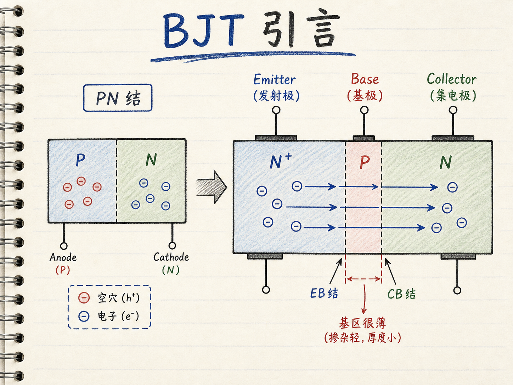
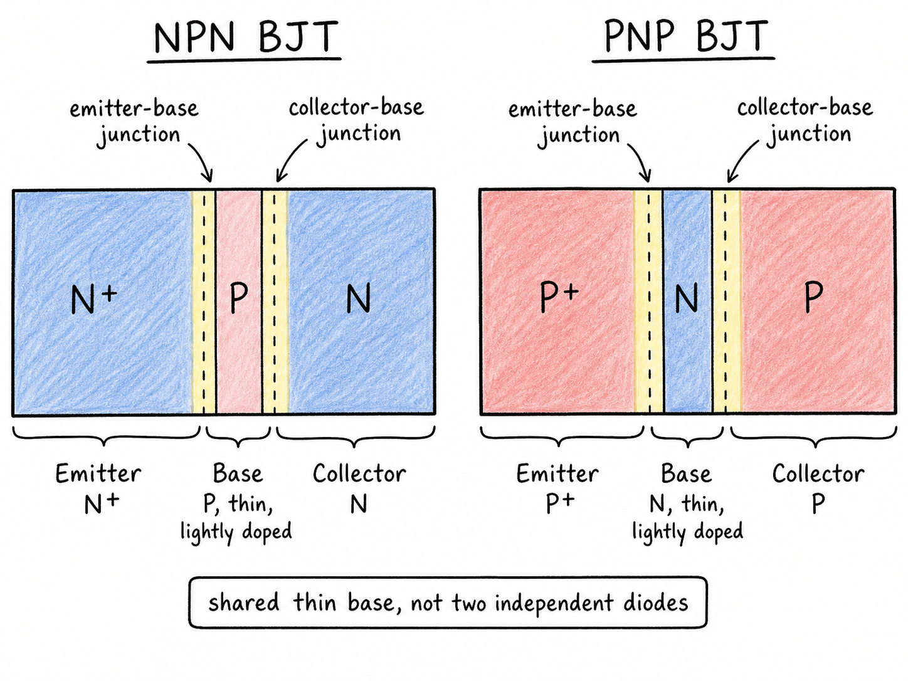
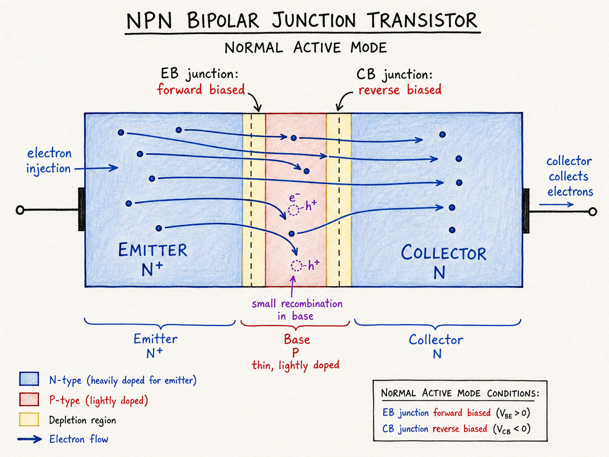

# BJT 引言：从一只二极管发明一个三端器件

前面我们花了很长时间研究 PN 结二极管：加正向电压，势垒降低，少数载流子被注入，电流按指数关系上升。现在问题变了：如果我们不只是想让一只二极管导通，而是想让一个小的控制信号去控制另一条电流通路，该怎么做？

这就是从 MOSFET 章节转入双极型晶体管的入口。MOSFET 靠栅压控制半导体表面沟道；BJT 不是这个结构。BJT 的核心不是 gate oxide，也不是栅极下方的反型沟道，而是两个 PN 结共享一个很薄的中间区，让注入进来的载流子在复合掉之前被另一侧收集。

读完这篇，你会知道

- 为什么从 PN 结二极管出发，可以自然想到 BJT？
- emitter、base、collector 三个区域分别在做什么？
- 为什么 BJT 不能简单理解成两个背靠背二极管？
- 正常有源区为什么要求 emitter-base 结正偏、collector-base 结反偏？
- 以 NPN 为主看，电子怎样从 emitter 注入 base，再被 collector 收集？

## 我们想要的不是普通二极管

一个二极管已经能做到“加电压，出电流”。如果在 P 区和 N 区之间加正向电压 $V_D$，二极管电流可以粗略写成与 $\exp(V_D/\phi_T)$ 成正比，其中 $\phi_T$ 是热电压。这里用 $\phi_T$，是为了避免和 MOSFET 的阈值电压 $V_{TH}$ 混淆。

但二极管只有两个端子。你加进去的电压，也就在同一条二端通路里推动电流。晶体管想多做一步：控制端施加一个信号，主电流尽量从另一条端口通路流过。换句话说，我们希望“控制”和“被控制的电流”不要完全挤在同一个二端器件里。

这时可以先抓住 PN 结里最有用的一件事：正向偏置会把载流子从一侧注入另一侧。

## 从 PNP 的构造看：先把会复合的区域变薄

先沿着讲课中的 PNP 例子想象。左边是 P 区，右边是 N 区，构成一个 PN 结。P 区中的空穴是多数载流子；当这个结正向偏置时，空穴会从 P 区注入到 N 区。

问题也在这里。空穴进入 N 区以后，立刻变成少数载流子。N 区里多数载流子是电子，空穴会逐渐和电子复合，所以空穴浓度会从耗尽区边缘的高值开始，沿着 N 区向内指数衰减。对普通二极管来说，这正是电流形成的一部分；但如果我们想把这些空穴“引到别处”，复合就是损失。

最直接的办法是把这个 N 区做得很薄。不是完全去掉，因为还需要它和左侧 P 区形成 emitter-base PN 结；而是让它薄到多数注入空穴还没来得及复合，就已经到达另一侧。

这个很薄的中间 N 区，就是 PNP BJT 的 base。

## 再接一个 P 区：不是多一个二极管，而是多一个收集端

现在在薄 N 型 base 的右侧再接一块 P 区。结构就从 PN 变成 PNP：左侧 P 区、中间 N 区、右侧 P 区。

左侧 P 区叫 emitter，意思是发射端。它的任务是把多数载流子空穴注入 base。右侧 P 区叫 collector，意思是收集端。它的任务是把穿过 base 的空穴收走。中间 N 区叫 base，它不是主电流希望长期停留的地方，而是一个很薄、相对轻掺杂的中转区。

需要注意，base 中的复合不是零。N 型 base 里仍有电子，也会有热产生的载流子，所以会有一小部分空穴在 base 中复合。这一部分复合对应 base 端电流。BJT 想要的是：base 足够薄、复合足够少，使大部分从 emitter 注入的载流子能到达 collector。

所以，BJT 不能被等同成“两个背靠背二极管”。如果只是把两个独立二极管背靠背接起来，中间没有共享的薄 base，也没有跨越 base 的少数载流子输运，第二个结不会自动把第一个结注入的载流子收集走。BJT 能工作，关键在于两个 PN 结共享同一个很薄的 base。

## 正常有源区：一个结负责注入，一个结负责收集

BJT 有两个 PN 结：

- emitter-base junction，也就是 emitter 和 base 之间的结；
- collector-base junction，也就是 collector 和 base 之间的结。

在正常有源区，emitter-base 结正偏，collector-base 结反偏。这个组合很关键：正偏的 emitter-base 结负责把载流子注入 base；反偏的 collector-base 结提供耗尽区电场，把已经到达 base-collector 边界附近的载流子扫进 collector。

如果继续用 PNP 语言说，空穴从 P 型 emitter 注入 N 型 base，然后被右侧 P 型 collector 收集。对 NPN BJT 来说，方向和载流子类型换过来：N 型 emitter 把电子注入 P 型 base，电子穿过很薄的 base 后，被 N 型 collector 收集。现代电路中更常以 NPN 作为直观入口，因为主导载流子是电子，迁移率通常更高。

这也解释了三个名字：

- emitter 不是随便叫“左端”，它承担注入；
- base 不是普通导线，它要薄、轻掺杂，让载流子少复合地穿过去；
- collector 不是简单接收一个端电流，它靠反偏结把穿过 base 的载流子收集起来。

## 这篇只建立入口图像

到这里，还没有进入 BJT 的完整电流公式，也没有展开各种工作区的推导。现在只需要把入口图像抓稳：

一只正向 PN 结能注入载流子；如果把接收侧做成很薄的 base，再在另一侧放一个反偏 PN 结，就能让大部分注入载流子穿过 base，被 collector 收集。这样，一个二端二极管的注入机制，就变成了三端 BJT 的控制机制。

后面继续分析 BJT 时，所有公式都要回到这张物理图：emitter-base 结决定注入，base 决定复合损失，collector-base 结决定收集。

