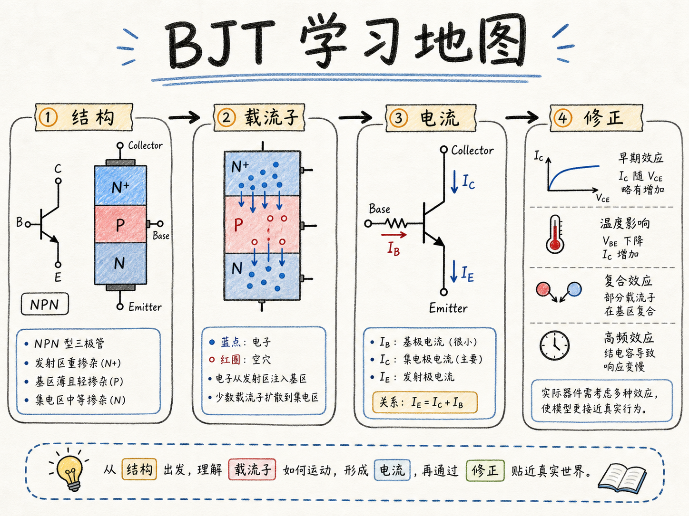
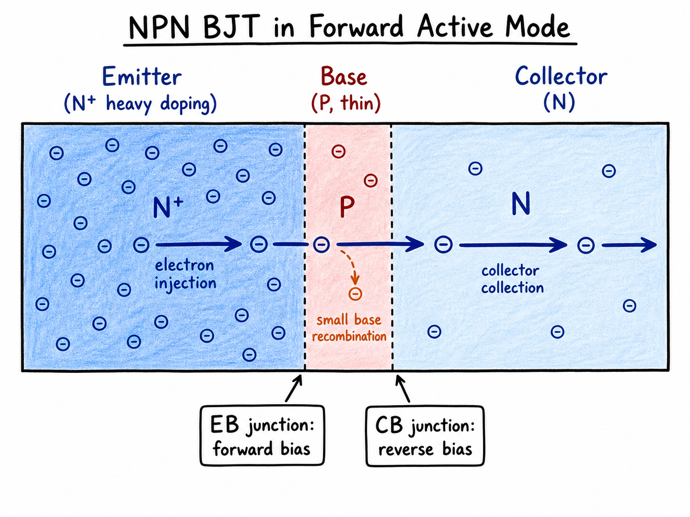
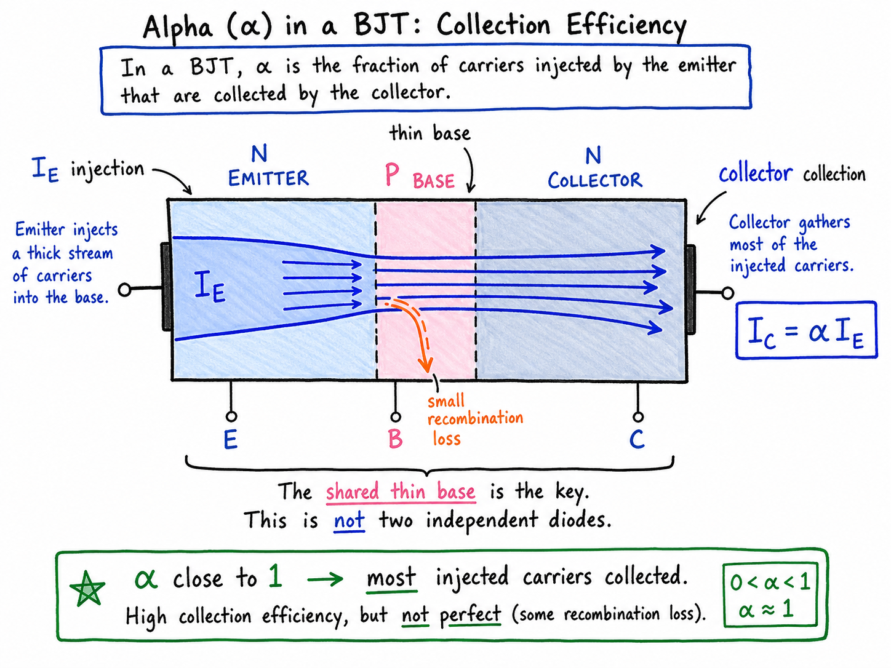
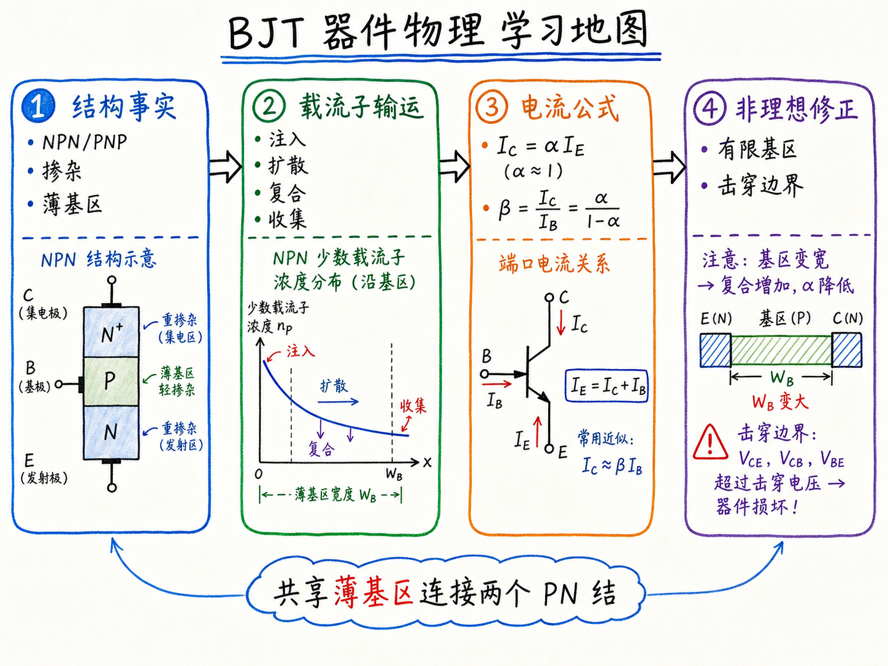

# BJT 学习地图：我们到底要弄懂什么

学 BJT，最容易犯的错误是直接冲进公式：先背 $\beta$，再背工作区，再背一堆电流表达式。这样能做题，但很难真的会用。因为工程上把一个 BJT 放进电路时，真正要问的不是“公式长什么样”，而是：我给它这些端子电压，它会进入什么状态？电流从哪里来？哪些电流被收集，哪些电流变成损失？什么时候器件会被偏压弄坏？

所以这一篇不是提前推导 BJT 的完整模型，而是先画一张学习地图。后面几篇会沿着这张地图走：从结构出发，看偏压怎样改变少数载流子分布，再由分布得到电流，最后把理想关系和非理想修正接起来。

读完这篇，你会知道

- 学 BJT 时最核心的几个问题是什么
- 为什么 BJT 不能简单看成两个背靠背二极管
- 正常有源区里，发射结和集电结分别应该怎样偏置
- 为什么少数载流子分布是推导 BJT 电流的入口
- $\alpha$、$\beta$ 和端子电流关系在学习链条里处于什么位置

## 第一件事：先问 BJT 在电路里会怎样表现

BJT，全称是双极结型晶体管（bipolar junction transistor）。从电路使用者的角度看，我们关心的第一件事很直接：把它接进电路以后，它会怎样表现？

例如给两个端子加上电压 $v_1$ 和 $v_2$，器件内部会发生什么？发射极、基极、集电极的电流分别是多少？电流方向和大小怎样随端子电压变化？

这些问题合在一起，就是 BJT 的工作模式（modes of operation）。所谓工作模式，不只是给器件贴一个名字，而是说明在某组端子偏压下，两个 PN 结分别处在什么偏置状态，以及这种偏置会让载流子怎样注入、扩散、复合和被收集。

后面几篇会详细展开工作模式。这里先抓住最重要的一种：正常有源区（forward active region）。对 NPN BJT 来说：

- 发射区是重掺杂 N 区，基区是很薄的 P 区，集电区是 N 区。
- 发射结，也就是 emitter-base junction，正向偏置。
- 集电结，也就是 collector-base junction，反向偏置。
- 电子从发射区注入到薄基区，再穿过基区，被集电区收集。

这个图像是理解 BJT 放大作用的核心。BJT 不是两个互不相干、背靠背连接的二极管。两个 PN 结共享同一个薄基区，发射区注入的少数载流子可以穿过基区到达集电区。正是这个“穿过共享薄基区并被收集”的过程，让一个端子的偏置能够控制另一个端子的电流。

## 第二件事：知道怎样不把器件弄坏

会用 BJT，不只是会让它工作，还要知道哪些偏压会让它失效。

有些端子电压会让结承受过大的电场，有些会造成过大的电流或功耗。结果可能是击穿、过热，或者其它不可逆损伤。课堂上为了建立直觉，可以先说“超过某个电压就坏”，但真实器件的限制往往不只一个数字，而是一组与结偏压、电流、功耗和温度有关的边界。

这件事对学习顺序有影响：我们研究工作模式时，不只是为了画出一张分类表，也是为了知道每种偏置状态下哪些物理过程占主导，哪些状态适合正常放大，哪些状态只是暂时可用，哪些状态会走向失效。

## 第三件事：用 $\alpha$ 看“收集效率”

电路课里常见的 BJT 指标是电流增益 $\beta$。它大致告诉我们：基极电流能控制多大的集电极电流。对电路设计来说，这是一个很有用的数。

但从器件物理出发，更自然的指标是 $\alpha$。它描述从发射极注入的电流，有多大比例最终被集电极收集。最简单的端子关系可以写成：

$$
I_C=\alpha I_E
$$

这里 $I_E$ 是发射极电流，$I_C$ 是集电极电流。$\alpha=1$ 表示理想收集：发射极注入的载流子全部到达集电极。$\alpha=0$ 表示完全没有收集：注入的载流子没有形成集电极电流。

实际 BJT 希望 $\alpha$ 非常接近 1，但不会等于 1。只要有一小部分载流子在基区复合，或者存在其它非理想电流，集电极收集到的比例就会低于 1。这个细小差别非常重要，因为 $\beta$ 和 $\alpha$ 的关系会把它放大：

$$
\beta=\frac{\alpha}{1-\alpha}
$$

所以当 $\alpha$ 从 0.99 变到 0.995，看起来只变了一点点，$\beta$ 却可能变化很多。器件物理真正要解释的是：为什么 $\alpha$ 能接近 1？又为什么它不能刚好等于 1？

## 第四件事：从结构事实走到载流子分布

要回答 $\alpha$ 从哪里来，不能只看端子符号，必须回到 BJT 的结构。

以 NPN 为例，结构事实包括三点：

- 发射区是 N 型，通常重掺杂，用来高效注入电子。
- 基区是 P 型，而且很薄，让注入进来的电子有机会在复合之前穿过去。
- 集电区是 N 型，用反向偏置的集电结把电子扫入集电极。

注意这不是 MOSFET。这里没有栅氧、没有栅极控制的表面沟道，也不是靠电场在氧化层下方拉出一条反型层。BJT 的关键变量是两个 PN 结的偏置、少数载流子的注入与扩散、以及薄基区里的复合损失。

一旦发射结正偏，NPN 的发射区会把电子注入到 P 型基区。对基区来说，这些电子是少数载流子。它们在基区中的浓度分布 $n_p(x)$ 决定了扩散电流，也决定了有多少电子能够在复合之前到达集电结边缘。

集电结反偏时，靠近集电结的电场会把到达那里的电子快速收集进集电区。于是，学习链条就变成了：

结构事实决定边界条件；边界条件决定少数载流子分布；少数载流子分布决定电流密度；各电流密度合起来决定端子电流；端子电流关系给出 $\alpha$ 和 $\beta$。

这就是后续推导的主线。

## 第五件事：理想电流之后，还要看有限基区效应

如果基区无限好，发射极注入的电子几乎全部被集电极收集，$\alpha$ 就会接近 1。但真实 BJT 的基区有有限宽度，也有复合。基区越厚，电子穿越过程中复合的机会越多；基区越薄，电子越容易被集电极收集。

这就是有限基区效应要解决的问题。它不只是一个修正项，而是把“结构尺寸”连接到“电流增益”的桥梁。

后面真正推导时，我们会看到类似这样的思路：先求基区少数载流子分布，再由浓度梯度得到扩散电流；如果考虑复合和有限基区，就会出现对理想收集的偏离。偏离越小，$\alpha$ 越接近 1；偏离越大，基极电流越大，$\beta$ 越低。

这里先不展开完整公式。对这一篇来说，重要的是知道公式会从哪里来：不是从端子定义硬背出来，而是从载流子在结构里的运动推出来。

## 把学习地图合起来

BJT 后续几篇可以按四层来读。

第一层是结构事实：NPN 或 PNP 的区域类型、掺杂强弱、薄基区，以及两个 PN 结的位置。

第二层是载流子输运：哪个结正偏，哪个结反偏；多数载流子怎样被注入；注入后在对方区域里作为少数载流子怎样扩散、复合、被收集。

第三层是电流公式：由少数载流子分布求出扩散电流，再整理为发射极、基极、集电极的端子电流关系。

第四层是非理想修正：有限基区、复合、击穿和安全工作边界，会让理想关系偏离。

如果只记住一句话，可以这样记：BJT 的放大作用来自一个共享薄基区里的载流子穿越过程。发射结负责注入，集电结负责收集，基区决定损失；$\alpha$ 和 $\beta$ 只是这个物理过程在端子电流上的表达。
