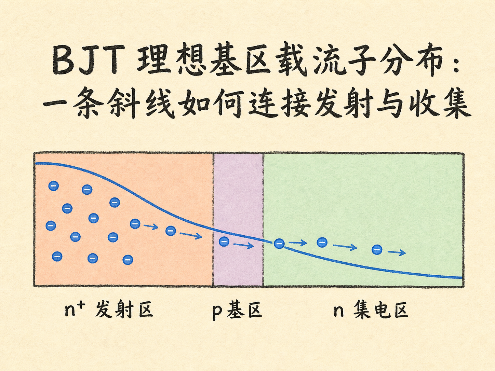
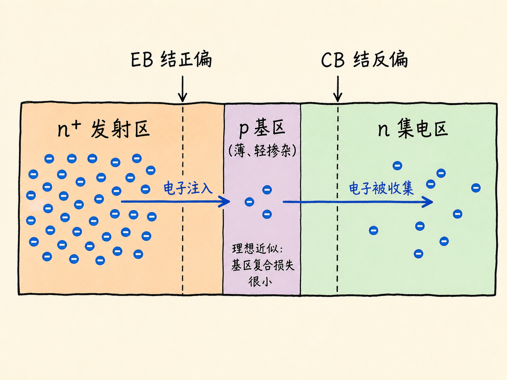
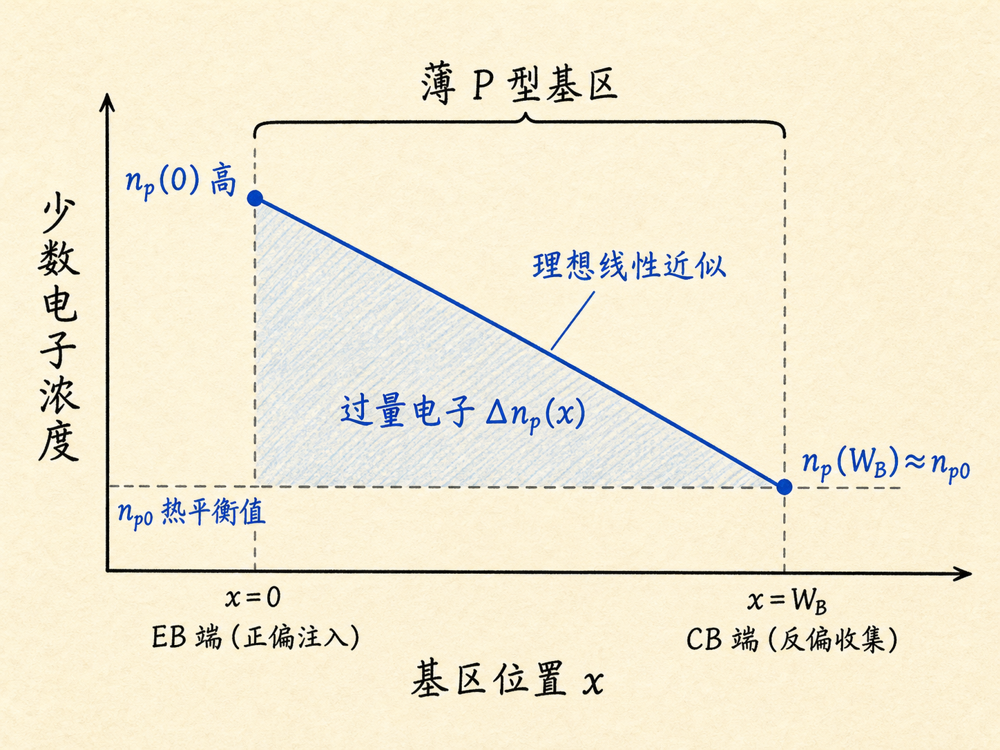
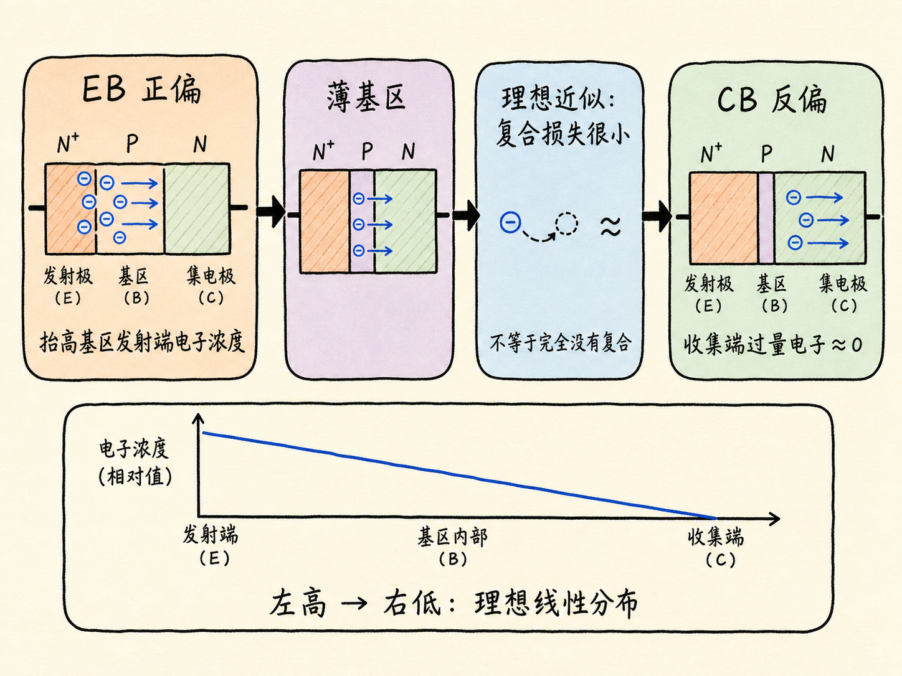

# BJT 理想基区载流子分布：一条斜线如何连接发射与收集

一个 NPN 晶体管为什么能让发射区送出的电子，大部分穿过基区，最后被集电区接走？关键不在于把 BJT 想成两个背靠背的二极管，而在于看清薄基区里少数载流子的分布。

这篇先不急着算电流。我们只做一件更基础的事：确定正常有源区中，电子在基区两端分别有多少，以及它们在两端之间如何分布。边界条件一旦清楚，后续电流关系才有可靠的出发点。

读完这篇，你会知道

- NPN BJT 在正常有源区需要怎样的偏置
- 为什么电子进入 P 型基区后变成少数载流子
- 发射结与集电结如何分别设定基区两端的电子浓度
- 为什么理想模型把基区浓度画成沿 $x$ 下降的直线
- “忽略基区复合”究竟是一种什么近似

## 先把器件和方向摆正

以 NPN BJT 为主线，沿着电子前进的方向从左到右看，三个区域依次是：

- 发射区：重掺杂的 $n^+$ 区
- 基区：很薄、相对轻掺杂的 $p$ 区
- 集电区：$n$ 区

发射区之所以采用重掺杂，是为了提供充足的电子；基区做得薄且相对轻掺杂，是为了让注入基区的电子有较大机会到达另一端；集电区则负责接收这些电子。

在正常有源区，发射极—基极结，也就是 EB 结，承受正向偏压；集电极—基极结，也就是 CB 结，承受反向偏压。两个结的职责不同：

- EB 结正偏，降低电子从 $n^+$ 发射区进入 P 型基区的势垒。
- CB 结反偏，在集电结耗尽区内建立电场，把到达基区右端的电子扫入集电区。

这不是两个彼此独立工作的二极管。两个结之间共享同一个薄基区：前一个结负责注入，后一个结负责收集，而基区内的载流子分布把这两个过程连在一起。

## 进入基区后，电子的身份变了

在 $n^+$ 发射区里，电子是多数载流子。电子越过正偏的 EB 结进入 P 型基区后，所处材料的掺杂类型变了，它们也就变成了基区中的少数载流子。

用 $n_p(x)$ 表示 P 型基区内的电子浓度，下标 $p$ 提醒我们：这里讨论的是 P 型材料中的电子。令 $x=0$ 位于 EB 耗尽区的基区边缘，$x=W_B$ 位于 CB 耗尽区的基区边缘，$W_B$ 是准中性基区宽度。

我们真正要找的，就是 $n_p(0)$、$n_p(W_B)$，以及它们之间的 $n_p(x)$。

## 左边界：正偏 EB 结把浓度抬高

结定律把结电压与耗尽区边缘的少数载流子浓度联系起来。EB 结正偏后，基区左边缘的电子浓度相对于热平衡值明显升高。若把 P 型基区的热平衡少数电子浓度记为 $n_{p0}$，理想边界关系可写成

$$
n_p(0)=n_{p0}\exp\left(\frac{V_{BE}}{V_T}\right)
$$

其中，$V_{BE}$ 是基极相对发射极的正向结电压大小，$V_T=kT/q$ 是热电压；室温下 $V_T$ 约为 $26\ \mathrm{mV}$。

这个指数关系说明：正向偏压不是把基区里的电子浓度整体抬成一个常数，而是先把 EB 耗尽区边缘的边界值抬高。基区内部如何连接到另一端，还要看右边界和基区输运。

这里还隐含低注入条件：注入产生的少数电子浓度变化，相对于基区原有的多数空穴浓度仍然较小。这样，基区的多数载流子背景和电中性近似不会被注入过程彻底改变，分析可以保持在线性、小扰动的框架内。

## 右边界：反偏 CB 结把电子收走

CB 结承受反向偏压。到达基区右边缘的电子一进入集电结耗尽区，就会在电场作用下被迅速扫向集电区。因此，在理想模型里，基区右边缘的少数电子浓度不会像左边那样积累，而是接近热平衡值：

$$
n_p(W_B)\approx n_{p0}
$$

在强正向注入使 $n_p(0)\gg n_{p0}$ 的尺度下，画“过量少数载流子浓度”

$$
\Delta n_p(x)=n_p(x)-n_{p0}
$$

会更直观。此时两个边界是

$$
\Delta n_p(0)=n_{p0}\left[\exp\left(\frac{V_{BE}}{V_T}\right)-1\right]
$$

$$
\Delta n_p(W_B)\approx0
$$

“右端近似为零”说的是过量电子浓度，而不是说基区右端物理上一个电子都没有。热平衡少数电子仍然存在；近似为零的是相对于热平衡值增加的那一部分。

## 两个边界之间，为什么是一条下降的斜线

左端由正偏 EB 结注入，过量电子浓度高；右端由反偏 CB 结收集，过量电子浓度接近零。因此，沿着从发射区指向集电区的 $x$ 方向，基区少数电子浓度必须下降，不能画成随 $x$ 增加而升高。

真实分布由扩散、复合和边界条件共同决定。理想基区模型再增加两个近似：

- 基区足够薄，可以只观察分布曲线的一小段。
- 电子穿过基区期间的复合损失很小，可以在一阶分析中近似忽略。

于是，两个边界之间的过量少数电子浓度可近似为线性下降：

$$
\Delta n_p(x)\approx\Delta n_p(0)\left(1-\frac{x}{W_B}\right)
$$

这条斜线就是理想基区载流子分布的核心图像。它代表一个从发射端高、向集电端低的浓度梯度。电子由发射区注入基区后，在这个梯度下穿过薄基区，并在右端被 CB 反偏结收集。

需要注意，“忽略复合”是为了建立理想线性分布的近似，不是宣称真实基区中完全没有复合。真实电子在基区停留得越久、基区相对于扩散长度越宽，复合的影响就越不能忽略。这里暂时不展开这些修正。

## 为什么先画分布，再谈电流

只看端口电压，还不能直接看见载流子如何穿过器件。浓度分布补上了中间机制：

1. EB 正偏设定高浓度的注入边界。
2. 薄 P 型基区让电子以少数载流子的身份跨越。
3. CB 反偏设定接近热平衡的收集边界。
4. 两个边界之间形成从左到右下降的浓度梯度。

在稳态下，这个分布不再随时间改变，但载流子仍在持续运动。“稳态”不等于“载流子静止”，而是每个位置的浓度随时间保持不变。

下一步可以由这条浓度斜率讨论理想晶体管电流；再往后，才需要检查有限基区、复合等因素如何改变线性近似。本篇先停在分布本身：NPN 正常有源区的理想基区，是一个由正偏注入端到反偏收集端逐渐降低的少数电子浓度通道。
