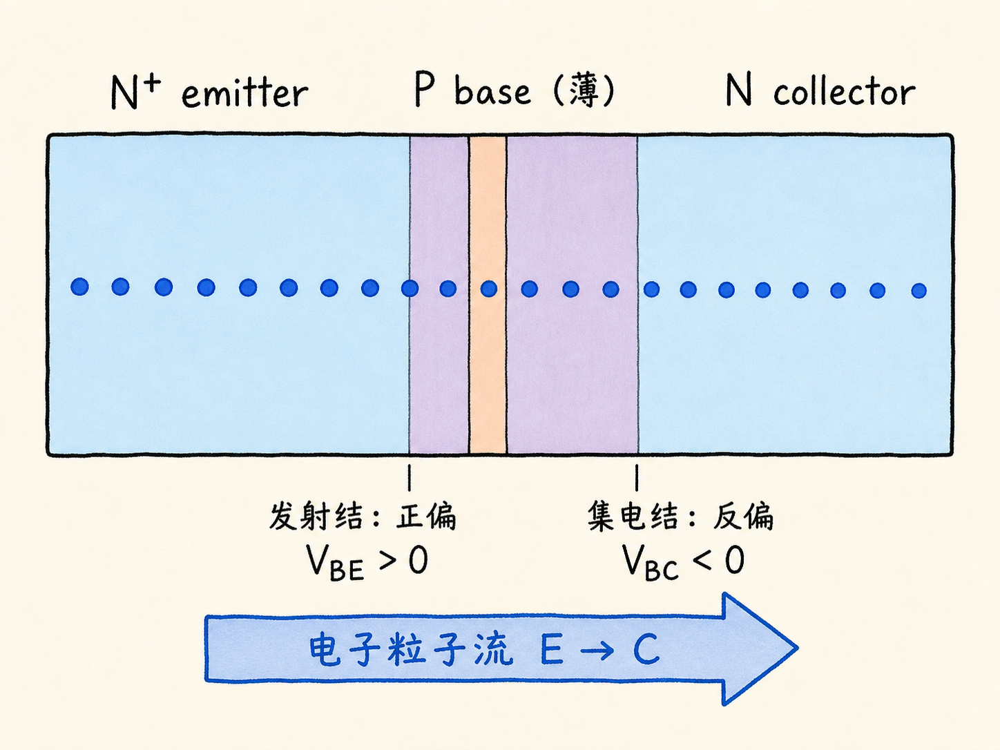
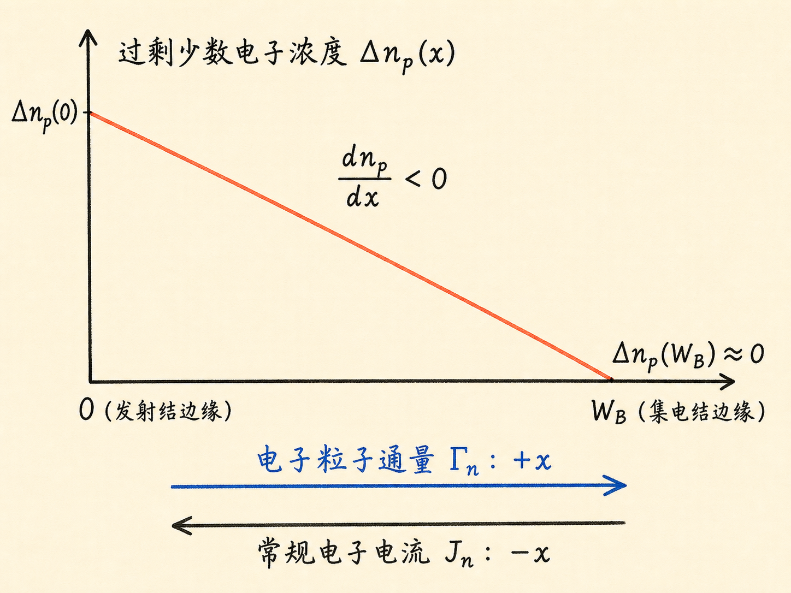
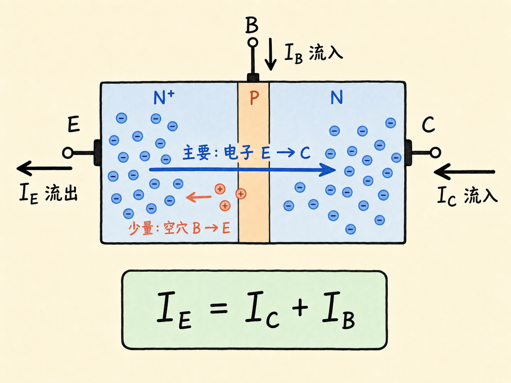
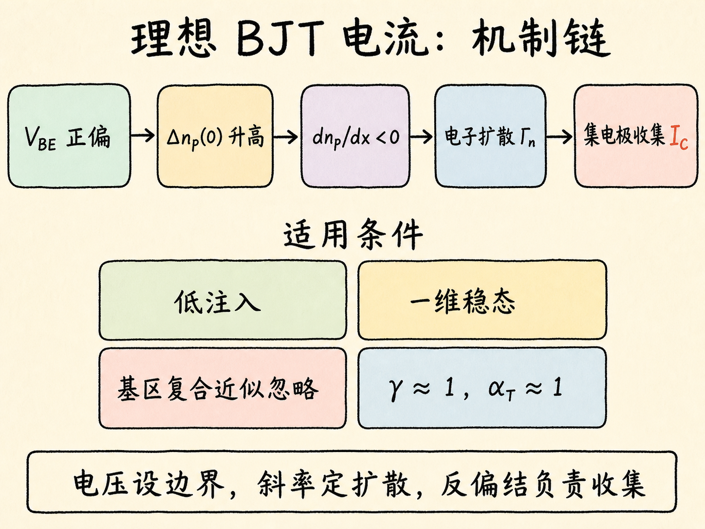

# BJT 的理想电流：一条浓度斜线如何连接发射极与集电极

把一个 NPN 晶体管画成 N–P–N，最容易产生的误解是：这不就是两个背靠背的二极管吗？发射结正向偏置会导通，集电结反向偏置几乎不导通，那么集电极电流似乎应该接近零。

真实答案恰好相反。在理想放大状态下，发射极注入的电子大多会穿过基区，最终成为集电极电流。把这件事串起来的不是“第二只二极管也导通了”，而是基区中的少数电子浓度梯度，以及集电结耗尽区的收集电场。

读完这篇，你会知道

- 为什么 BJT 不能被当成两个彼此独立的背靠背二极管
- 发射结电压怎样建立基区少数电子浓度的边界值
- 一条向下倾斜的浓度分布怎样决定电子扩散电流
- 电子流、电子电流分量和三个端子电流怎样避免方向混淆
- “理想 BJT 电流”究竟依赖哪些近似条件

## 先把器件、偏置和方向说清楚

默认讨论 NPN 管，并令横坐标 $+x$ 从发射极指向集电极。三个区域依次是重掺杂 N 型发射极、P 型基区和 N 型集电极。正常放大状态需要两个不同的结偏置：

- 发射结正向偏置，即 $V_{BE}\gt0$
- 集电结反向偏置，即 $V_{BC}\lt0$

发射结正偏降低了电子从发射极进入基区的势垒；集电结反偏则在耗尽区内建立强电场。电子先由发射极注入基区，再穿过很薄的准中性基区，最后到达集电结耗尽区并被电场扫入集电极。

这三段过程各自承担不同任务：发射结决定“注入多少”，基区扩散决定“怎样穿过去”，集电结电场决定“到边缘后怎样收走”。如果只分别套用两只孤立二极管的电流公式，中间这条连续的载流子输运路径就被切断了。

## 发射结先设定一个浓度边界

在 P 型基区中，电子是少数载流子。把热平衡少数电子浓度记作 $n_{p0}$。低注入条件下，发射结正偏使基区靠近发射结耗尽区边缘的电子浓度升高：

$$
n_p(0)=n_{p0}e^{V_{BE}/V_T}
$$

其中 $V_T=kT/q$ 是热电压。用过剩少数电子浓度 $\Delta n_p=n_p-n_{p0}$ 表示，则

$$
\Delta n_p(0)=n_{p0}\left(e^{V_{BE}/V_T}-1\right)
$$

这一步保留了二极管的指数关系：$V_{BE}$ 稍微增加，注入到基区边缘的少数电子浓度就会指数增加。但它只给出了左边界，还没有直接给出集电极电流。

在另一端，集电结反向偏置。理想分析把基区靠近集电结耗尽区边缘的过剩少数电子浓度近似取为零：

$$
\Delta n_p(W_B)\approx0
$$

$W_B$ 是准中性基区宽度。于是，基区两端的浓度边界一个高、一个低。

## 集电极电流藏在浓度分布的斜率里

理想窄基区中，如果电子在穿越基区时几乎不复合，稳态连续性要求电子通量沿基区近似不变。此时过剩少数电子浓度可以近似为一条直线：

$$
\Delta n_p(x)\approx\Delta n_p(0)\left(1-\frac{x}{W_B}\right)
$$

这条线从发射结一侧的 $\Delta n_p(0)$ 下降到集电结一侧的近似零。它的斜率处处相同：

$$
\frac{d\Delta n_p}{dx}\approx-\frac{\Delta n_p(0)}{W_B}
$$

准中性基区内的电场在突变耗尽近似下可取为零，所以基区中的漂移电流不是主角。电子主要靠扩散从高浓度处向低浓度处运动。电子粒子通量为

$$
\Gamma_n=-D_n\frac{dn_p}{dx}
$$

因为 $dn_p/dx\lt0$，所以 $\Gamma_n\gt0$：电子粒子沿 $+x$，也就是从发射极流向集电极。

电子带负电，因此电子形成的常规电流方向与电子粒子流相反。电子扩散电流密度为

$$
J_{n,\mathrm{diff}}=qD_n\frac{dn_p}{dx}
$$

在当前坐标约定下，$J_{n,\mathrm{diff}}\lt0$，它指向 $-x$。为了讨论电流大小而不反复被符号干扰，可以定义“由发射极输运到集电极的电子电流分量大小”为

$$
\left|J_{n,\mathrm{tr}}\right|
=qD_n\frac{\Delta n_p(0)-\Delta n_p(W_B)}{W_B}
\approx\frac{qD_nn_{p0}}{W_B}
\left(e^{V_{BE}/V_T}-1\right)
$$

这就是理想 BJT 集电极电子电流的核心。$V_{BE}$ 先指数改变左侧浓度边界，基区宽度再把这段浓度差变成斜率，斜率最后通过扩散系数变成电流。

若器件横截面积为 $A$，对应的电流分量大小为

$$
\left|I_{n,\mathrm{tr}}\right|
\approx\frac{qAD_nn_{p0}}{W_B}
\left(e^{V_{BE}/V_T}-1\right)
$$

所以，BJT 的指数电流并不只是“发射结像二极管”这么简单。指数边界与窄基区扩散必须一起存在，集电极才会得到这股电流。

## 集电结不是电流源，而是收集器

当电子扩散到基区右边缘，它们进入反向偏置的集电结耗尽区。耗尽区内的强电场迅速把电子扫向集电极。这个漂移过程很快，因此理想分析通常不把它当作限制电流大小的步骤。

这也解释了为什么“反偏二极管电流接近零”不能直接用于集电结。孤立二极管分析假设反偏结外没有另一端持续送来的少数载流子；BJT 中却有发射极不断向基区注入电子。集电结本身不负责创造这些电子，但会收集已经扩散到耗尽区边缘的电子。

在基区复合近似忽略时，基区内没有电子持续消失。于是从发射极进入基区的电子电流分量大小，与被集电极收集的电子电流分量大小近似相等：

$$
\left|I_{nE}\right|\approx\left|I_{nC}\right|
$$

这里的等式说的是同一股电子输运分量，而不是说三个端子的总电流完全相同。

## 三个端子电流还要加上空穴分量

发射结正偏时，载流子注入是双向的。除了电子从 N 型发射极注入 P 型基区，还会有空穴从基区注入发射极。后者不会被集电极收集，却会增加发射极总电流和基极电流。

为了把各项分开，可以把发射结电流看成两部分：

- $I_{nE}$：电子由发射极注入基区形成的电流分量
- $I_{pE}$：空穴由基区注入发射极形成的电流分量

发射效率可用两个分量的大小定义：

$$
\gamma=
\frac{\left|I_{nE}\right|}
{\left|I_{nE}\right|+\left|I_{pE}\right|}
$$

理想发射极希望 $\gamma\approx1$，也就是电子注入远大于空穴反向注入。NPN 管通常让发射极掺杂显著高于基区掺杂，目的正是压低 $I_{pE}$ 相对于 $I_{nE}$ 的比例。

另一个量是基区输运因子：

$$
\alpha_T=
\frac{\left|I_{nC}\right|}{\left|I_{nE}\right|}
$$

基区足够薄且复合可以忽略时，$\alpha_T\approx1$。综合发射效率和基区输运，可写成 $\alpha_F=\gamma\alpha_T\approx1$。它表示发射极总电流中最终成为集电极电流的比例接近 1，而不是严格等于 1。

最后约定端子常规电流方向：$I_C$ 与 $I_B$ 取流入晶体管为正，$I_E$ 取流出晶体管为正。于是基尔霍夫电流定律写成

$$
I_E=I_C+I_B
$$

对 NPN 管，电子粒子主要从发射极流向集电极，方向与常规的 $I_C$、$I_E$ 参考方向相反。只要先声明参考方向，就不会把“电子往右走”误写成“常规电流也往右走”。

在最理想的极限中，$\gamma\to1$、$\alpha_T\to1$，空穴反向注入与基区复合都趋近于零，因此 $I_B$ 很小，$I_C$ 接近 $I_E$。真实器件不会完全没有复合，也不会拥有绝对为 1 的发射效率；“理想”只是为了隔离主导机制。

## 这些结论依赖哪些理想条件

到这里的线性浓度分布和电流关系，建立在一组明确条件上：

1. **低注入**：注入少数载流子没有显著改变基区多数载流子浓度和电中性。
2. **一维稳态**：电流主要沿 emitter–base–collector 方向变化，载流子分布不随时间变化。
3. **基区复合近似忽略**：电子穿越准中性基区时损失很小，但不意味着真实器件完全无复合。
4. **窄基区**：$W_B$ 远小于基区少数电子扩散长度，因而浓度分布可近似为直线。
5. **准中性区近似无电场**：基区输运以扩散为主；耗尽区内则由强电场快速收集载流子。
6. **发射效率和输运因子接近理想**：发射极重掺杂压低空穴反向注入，薄基区让大多数注入电子到达集电极。

这些条件把问题压缩成一条清楚的因果链：

$$
V_{BE}
\longrightarrow \Delta n_p(0)
\longrightarrow \frac{d n_p}{dx}
\longrightarrow \Gamma_n
\longrightarrow I_C
$$

发射结电压决定浓度边界，浓度斜率决定扩散通量，集电结电场负责收集。只要记住这条链，就不会把 BJT 误解为两只互不相干的二极管。

## 最后收束：电流来自一条连续的输运路径

理想 NPN BJT 的集电极电流，起点是发射结正偏造成的电子注入，核心是窄基区中的少数电子扩散，终点是反偏集电结的电场收集。

一句话记住：**$V_{BE}$ 建立浓度差，基区把浓度差变成扩散电流，集电极把扩散到边缘的电子收走。**

下一步如果放松“基区复合可忽略”这个理想条件，电子浓度不再保持这条理想直线，发射极与集电极电子电流分量也不再完全相等；那属于有限基区修正的问题。
