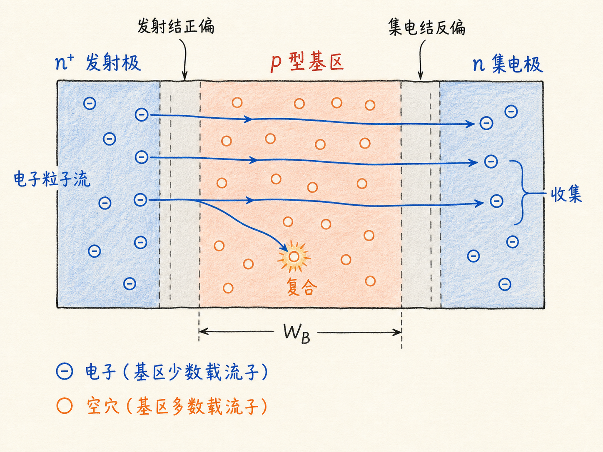
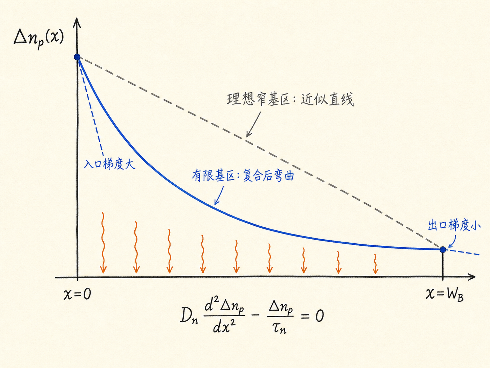
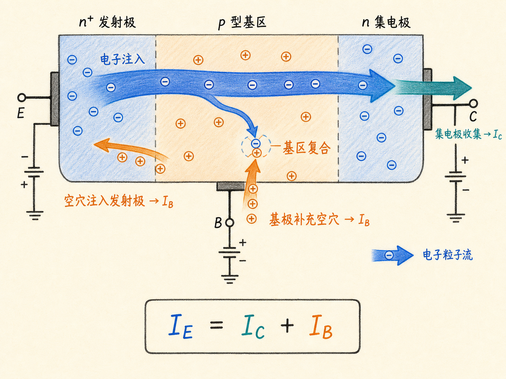
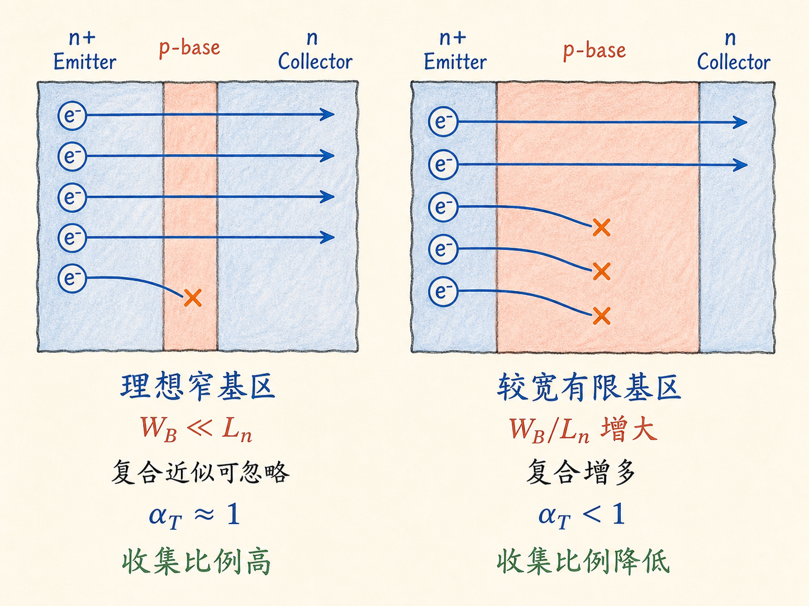

# BJT 的基区为什么必须薄：有限宽度、复合与电流增益

把 NPN 晶体管画成 $n^+$ 发射极、p 型基区和 n 型集电极的三层结构，很容易产生一个过于理想的印象：发射极把电子注入基区，集电极再把这些电子全部接走，似乎中间只是穿过一段距离。

真实的基区不是一条没有厚度的线。电子进入有限宽度的 p 型基区后，需要用有限时间扩散到集电结。在这段路上，一部分电子会与基区中的多数载流子空穴复合。于是，“从发射极注入多少”和“被集电极收集多少”不再相等，这正是理想 BJT 结果需要修正的地方。

读完这篇，你会知道

- 为什么短基区时可以近似画直线，而有限基区必须考虑弯曲的少数载流子浓度分布？
- 复合怎样改变浓度梯度，并让基区入口与出口的电子电流不同？
- 集电极电流、基极电流和发射极电流分别从哪里来？
- 基区输运因子、发射效率和 $\beta$ 为什么不是彼此独立的“魔法常数”？

## 先把 NPN 的工作状态说清楚

本文只讨论 NPN 晶体管的正向有源区：

- 发射结，也就是基极—发射极结，处于正向偏置；
- 集电结，也就是基极—集电极结，处于反向偏置；
- 发射极向 p 型基区注入电子；
- 进入集电结耗尽区的电子，被其中的电场迅速扫入集电极。

电子作为粒子的主要运动方向是从发射极穿过基区到集电极。常规电流方向与电子运动方向相反。讨论端子电流时，下面采用常规电流的幅值，并使用

$$
I_E=I_C+I_B
$$

这条关系来自端子电荷守恒，不表示每一个由发射极注入的电子都必然到达集电极。

## 理想窄基区近似遗漏了什么

设准中性基区宽度为 $W_B$，坐标 $x=0$ 位于发射结边缘，$x=W_B$ 位于集电结边缘。正偏发射结通过结定律抬高 $x=0$ 处的少数电子浓度；反偏集电结则使 $x=W_B$ 处的少数电子浓度接近平衡值。

如果 $W_B$ 远小于基区电子扩散长度 $L_n$，电子穿越基区的距离很短，复合造成的损失可以近似忽略。此时过剩少数电子浓度 $\Delta n_p(x)$ 可以近似为连接两个边界值的直线，梯度也近似恒定。上一层理想结果就是建立在这组假设上。

需要注意，“近似无复合”是短基区、低注入、一维稳态模型中的近似，不等于真实晶体管完全没有复合。只要 $W_B$ 不再远小于 $L_n$，就必须把复合项放回连续性方程。

## 有限基区把直线变成了曲线

在准中性 p 型基区内，先采用三个假设：

1. 电场主要局限在两个耗尽区，基区内漂移项可忽略；
2. 没有光照或其他额外载流子产生；
3. 器件处于稳态。

电子连续性方程化为

$$
D_n\frac{d^2\Delta n_p}{dx^2}-\frac{\Delta n_p}{\tau_n}=0
$$

其中 $D_n$ 是基区少数电子扩散系数，$\tau_n$ 是少数电子寿命。定义扩散长度

$$
L_n=\sqrt{D_n\tau_n}
$$

方程的一般解就是两个指数项的组合：

$$
\Delta n_p(x)=A e^{x/L_n}+B e^{-x/L_n}
$$

$A$ 和 $B$ 由两个结边缘的浓度边界条件决定。关键不在于记住系数，而在于看懂方程右侧的复合项：只要 $\Delta n_p$ 大于零，就有电子持续从这支过剩载流子队伍中退出。

因此，有限基区中的浓度曲线通常位于理想直线下方，并向上凸。靠近发射结时，曲线下降得更陡；靠近集电结时，曲线趋于平缓。它不只是“图形变弯了”，而是直接改变了各处的浓度梯度。

## 梯度变化就是电流变化

基区中的少数电子主要靠扩散运动。若只看电子扩散常规电流密度，

$$
J_n=qD_n\frac{dn_p}{dx}
$$

在本文坐标下，$dn_p/dx$ 为负，所以常规电子电流指向发射极；电子粒子流则指向集电极。为了比较有多少电子通过基区，使用电流幅值更直观：

$$
|J_n(x)|=qD_n\left|\frac{d\Delta n_p}{dx}\right|
$$

由于入口处斜率绝对值较大、出口处斜率绝对值较小，

$$
|J_n(0)|>|J_n(W_B)|
$$

两者之差没有凭空消失。它对应基区内的净复合：

$$
|J_n(0)|-|J_n(W_B)|
=q\int_0^{W_B}\frac{\Delta n_p(x)}{\tau_n}\,dx
$$

这条式子把“曲线、梯度、电流、复合”连成了一条因果链。基区越宽，电子平均停留和扩散的路程越长，复合积分通常越大，能够到达集电结的比例越小。

## 三个端子电流都从哪里来

先跟踪由发射极注入的电子：

- 到达集电结并被反偏电场收集的部分，构成集电极电流 $I_C$ 的主体；
- 在基区内与空穴复合的部分，必须由基极端持续补充空穴，这形成基极电流 $I_B$ 的一个来源；
- 正偏发射结还会让少量空穴从基区注入发射极，这又构成基极电流的另一来源。

因此，基极电流不是“电子莫名其妙损失后留下的账目”。它有具体的载流子过程：基区复合所需的空穴补充，以及基区向发射极的反向载流子注入。忽略漏电等次要分量后，发射极电流就是集电极电流与基极电流之和。

## $\alpha_T$、发射效率和 $\beta$ 是同一条物理链

基区输运因子（base transport factor）定义为

$$
\alpha_T=
\frac{\text{到达集电结边缘的电子电流}}
{\text{发射结边缘注入基区的电子电流}}
$$

有复合时 $\alpha_T<1$；只有在理想窄基区、复合可忽略的极限中，$\alpha_T$ 才接近 1。

但发射极电流也不全是电子从发射极注入基区。正偏发射结还伴随空穴从基区注入发射极。发射效率 $\gamma$ 描述发射极电流中“有用的电子注入”所占比例，因此通常也小于 1。

在忽略集电结漏电和其他高阶效应的一阶模型中，正向共基极电流增益可以分解为

$$
\alpha_F\approx\gamma\alpha_T
$$

共发射极电流增益则满足

$$
\beta_F=\frac{\alpha_F}{1-\alpha_F}
$$

所以 $\beta$ 不是外部指定给晶体管的常数。有限基区增大复合，使 $\alpha_T$ 下降；发射极与基区的注入不对称决定 $\gamma$；两者共同决定 $\alpha_F$，再通过端子电流关系放大成 $\beta_F$ 的变化。

## 从理想电流走向真实晶体管

理想 BJT 电流公式告诉我们，正向发射结怎样建立少数载流子边界，浓度梯度又怎样产生扩散电流。有限基区修正进一步告诉我们：梯度不是处处相同，电子电流会沿基区因复合而减少。

这一步把器件几何尺寸和材料寿命接到了端子电流上。设计更薄的基区、提高少数载流子扩散长度，目的都是让更多发射极注入电子到达集电极，让 $\alpha_T$ 更接近 1。但基区也不能在工艺、电阻、击穿和穿通约束之外无限变薄。下一步真正要计算的，就是给定 $W_B/L_n$ 后，$\alpha_T$ 究竟离 1 有多远。

