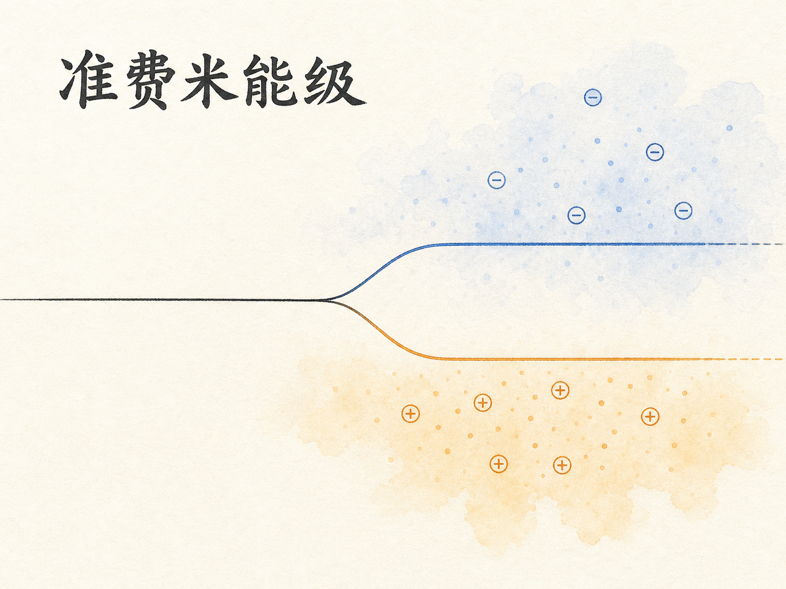
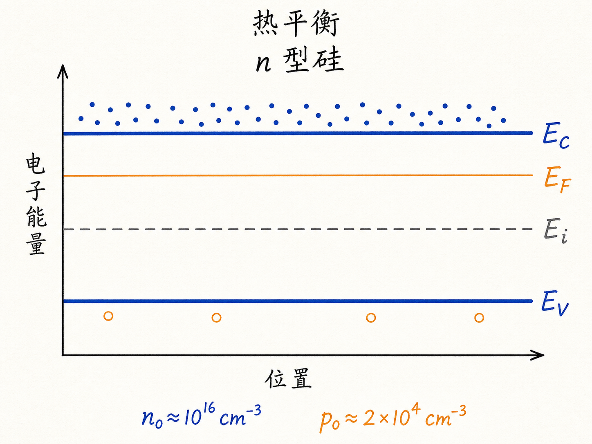
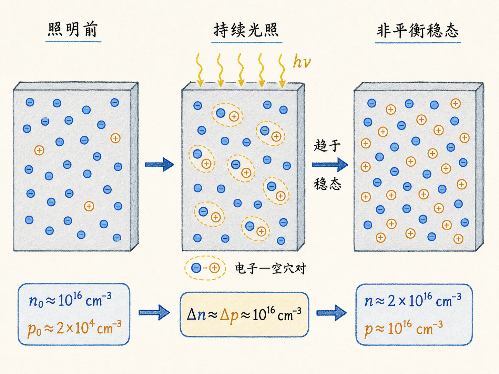
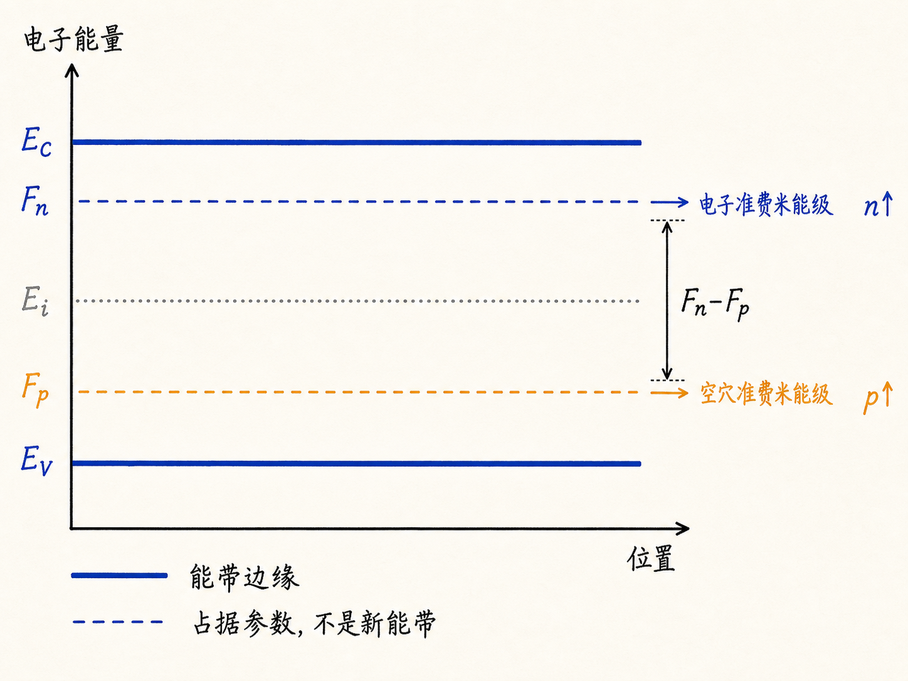
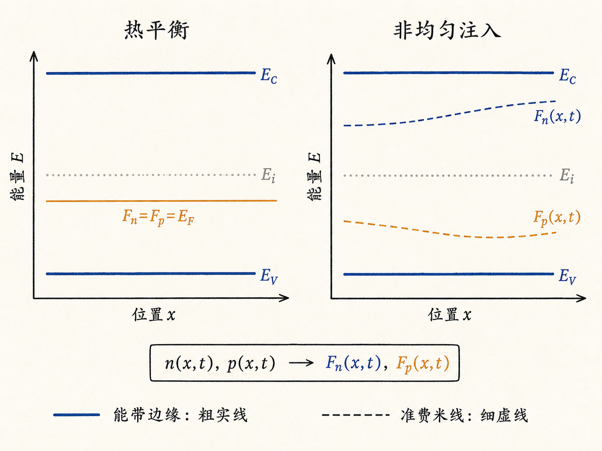

# 一条费米能级不够用了：准费米能级到底是什么

在热平衡的半导体里，一条水平的 $E_F$ 几乎像一把万能尺：看它相对 $E_C$、$E_i$ 和 $E_V$ 的位置，就能判断电子与空穴有多少；要求它在整个结构中保持水平，又能帮助我们拼出 PN 结等器件的能带图。

可是一旦持续光照或注入载流子，这把尺会给出互相矛盾的答案。电子浓度要求“费米能级靠近导带”，空穴浓度又要求“费米能级靠近价带”。半导体并没有突然多出两条新能带，真正变化的是：电子和空穴不再共享同一个占据参数。

读完这篇，你会知道

- 为什么平衡态只能有一个水平 $E_F$，非平衡态却要分别使用 $F_n$ 和 $F_p$？
- 准费米能级怎样把电子、空穴浓度重新写回熟悉的指数公式？
- “准费米能级分裂”表示什么，又不表示什么？
- 为什么持续光照、正偏 PN 结或 BJT 注入都可能产生这种分裂？
- 为什么准费米能级可以随位置和时间变化？

## 先记住平衡态的那条水平线

在非简并、接近热平衡的常用近似下，电子与空穴浓度可写成

$$
n=n_i\exp\left(\frac{E_F-E_i}{kT}\right),
$$

$$
p=n_i\exp\left(\frac{E_i-E_F}{kT}\right).
$$

这里，$n$ 和 $p$ 分别是电子与空穴浓度，$n_i$ 是本征载流子浓度，$E_i$ 是本征能级，$k$ 是玻尔兹曼常数，$T$ 是绝对温度。

两个式子共用同一个 $E_F$。把它们相乘，立刻得到平衡态的质量作用定律

$$
np=n_i^2.
$$

热平衡意味着没有持续的外部激发，也没有维持净载流子流动的外加驱动。载流子与晶格交换能量后，共享同一个化学势。于是，贯穿结构的 $E_F$ 是一条水平参考线，而不是另一条能带。

以施主浓度约 $10^{16}\,\mathrm{cm^{-3}}$ 的 n 型硅为例，电子浓度可近似为 $n_0\approx10^{16}\,\mathrm{cm^{-3}}$，空穴浓度则很低，约为 $p_0\approx2\times10^4\,\mathrm{cm^{-3}}$。一个靠近导带的 $E_F$ 可以同时解释这两个数。

## 光照让一个 $E_F$ 产生矛盾

现在持续照射这块硅。每吸收一个足够能量的光子，就可能产生一对电子和空穴。经过一段时间，产生、复合与输运达到平衡，系统进入非平衡稳态。

为了突出概念，假设过剩载流子约为

$$
\Delta n\approx\Delta p\approx10^{16}\,\mathrm{cm^{-3}}.
$$

那么总浓度大致变为

$$
n=n_0+\Delta n\approx2\times10^{16}\,\mathrm{cm^{-3}},
$$

$$
p=p_0+\Delta p\approx10^{16}\,\mathrm{cm^{-3}}.
$$

这些数只是讲清概念的近似。真实稳态浓度要由产生率、复合寿命、边界条件和连续性方程共同决定。

矛盾出现了：较大的 $n$ 要求占据参数靠近 $E_C$，较大的 $p$ 又要求占据参数靠近 $E_V$。如果坚持把两者塞进同一个 $E_F$，两个浓度公式就不可能同时成立；此时 $np$ 也已经不再等于 $n_i^2$。

## 把一把尺拆成两把：$F_n$ 与 $F_p$

解决方法不是发明新能带，而是给电子与空穴各定义一个占据参数：电子准费米能级 $F_n$ 和空穴准费米能级 $F_p$，也常写成 $E_{Fn}$ 和 $E_{Fp}$。

在玻尔兹曼近似下，定义为

$$
n=n_i\exp\left(\frac{F_n-E_i}{kT}\right),
$$

$$
p=n_i\exp\left(\frac{E_i-F_p}{kT}\right).
$$

反过来写，更容易看出它们只是浓度的另一种表达：

$$
F_n=E_i+kT\ln\left(\frac{n}{n_i}\right),
$$

$$
F_p=E_i-kT\ln\left(\frac{p}{n_i}\right).
$$

$n$ 增大时，$F_n$ 向 $E_C$ 靠近；$p$ 增大时，$F_p$ 向 $E_V$ 靠近。于是，光照后的高电子浓度与高空穴浓度都能被正确描述。

这里需要把概念边界说清楚：

- $F_n$ 和 $F_p$ 不是导带、价带，也不是新出现的允许能态。
- 它们不是某个真实粒子的离散能级。
- 它们是非平衡条件下分别描述电子、空穴占据与浓度的化学势参数。
- 把两个定义相乘，可得 $np=n_i^2\exp[(F_n-F_p)/(kT)]$；准费米能级的间距直接量化了系统偏离平衡的程度。

## 为什么电子和空穴可以“各自平衡”

“非平衡”不等于所有微观过程都杂乱无章。半导体中，电子之间、空穴之间以及载流子与晶格之间的能量弛豫通常很快；产生与复合则可能更慢。因此在合适的时间与长度尺度上，导带电子可以迅速形成接近晶格温度的分布，价带空穴也可以形成自己的近似热分布。

这就是所谓的各自近似热平衡：电子群可由 $F_n$ 描述，空穴群可由 $F_p$ 描述。但电子与空穴之间尚未通过复合恢复共同的化学势，所以 $F_n\ne F_p$。

持续光照是最直观的例子。正向偏置的 PN 结会从两侧向对方的准中性区注入少数载流子；BJT 的正偏发射结也会把大量载流子注入基区。只要外部驱动持续维持过剩载流子，电子与空穴就不再共享唯一的 $E_F$。这些器件中的具体空间分布还要结合漂移、扩散、复合与边界条件求解，本篇不提前展开。

## 分裂、合并，以及随空间和时间变化

平衡态没有过剩载流子，$n=n_0$、$p=p_0$，两个定义自动合并：

$$
F_n=F_p=E_F.
$$

注入或光生载流子后，通常会出现 $F_n\gt F_p$，称为准费米能级分裂。对于前面的 n 型硅，$F_n$ 只需从原平衡位置稍微上移，就能对应电子浓度从 $10^{16}$ 增至 $2\times10^{16}\,\mathrm{cm^{-3}}$；$F_p$ 却要明显下移，才能对应空穴浓度从约 $2\times10^4$ 增至 $10^{16}\,\mathrm{cm^{-3}}$。

如果光照、注入或复合在不同位置并不相同，$n=n(x,t)$、$p=p(x,t)$，那么准费米能级自然也是位置和时间的函数：

$$
F_n=F_n(x,t),\qquad F_p=F_p(x,t).
$$

因此，非平衡能带图里的准费米线不一定水平。它们的弯曲或斜率反映载流子浓度和输运状态的空间变化；导带底 $E_C$ 与价带顶 $E_V$ 仍然是能带边缘，两类线不能混为一谈。

## 最后把概念压缩成一句话

热平衡时，电子和空穴共享一个水平的费米能级 $E_F$；非平衡时，它们可以各自接近热平衡，却不再共享化学势，于是分别用 $F_n$ 和 $F_p$ 表示浓度与占据。准费米能级不是新能带，而是把非平衡载流子浓度重新写成熟悉统计形式的一组参数。

这组参数以后会成为理解 LED、激光器和太阳能电池的关键语言：在这些器件中，准费米能级分裂不只是画图方便，它直接联系载流子注入、复合与可输出的光电能量尺度。
