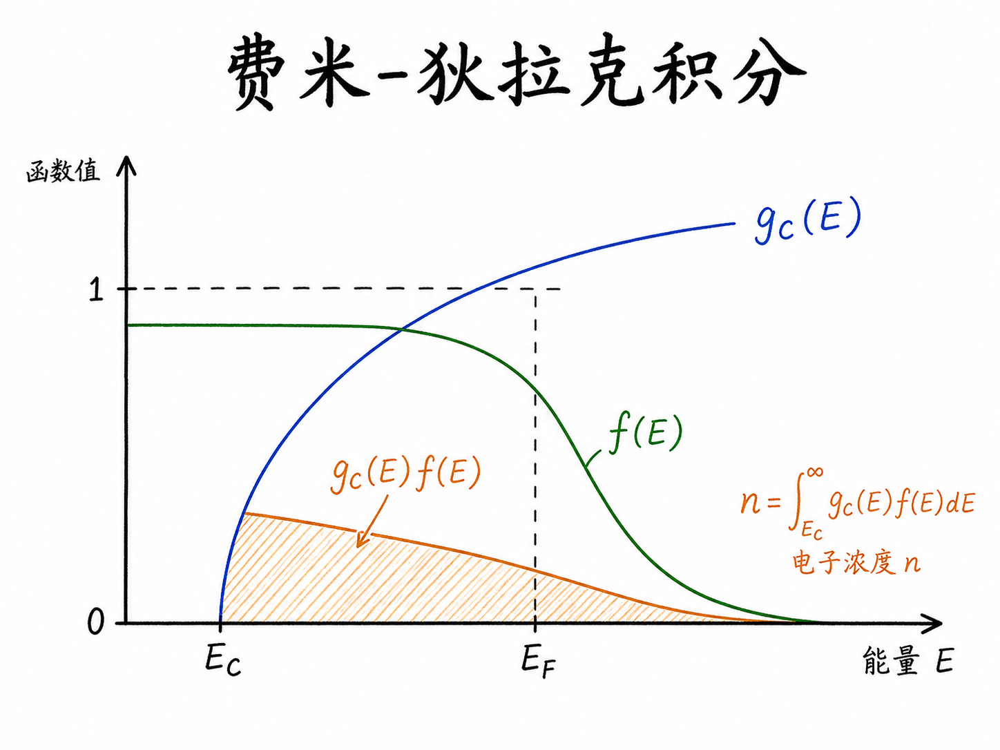
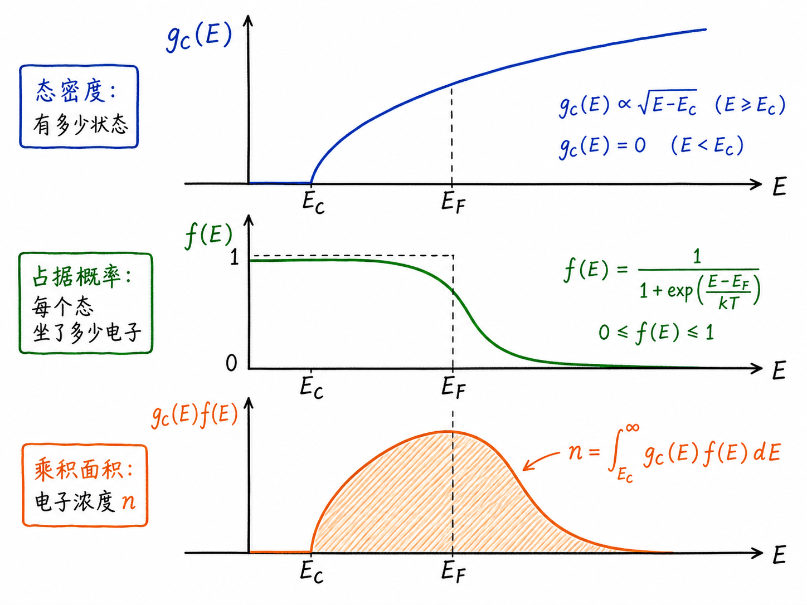
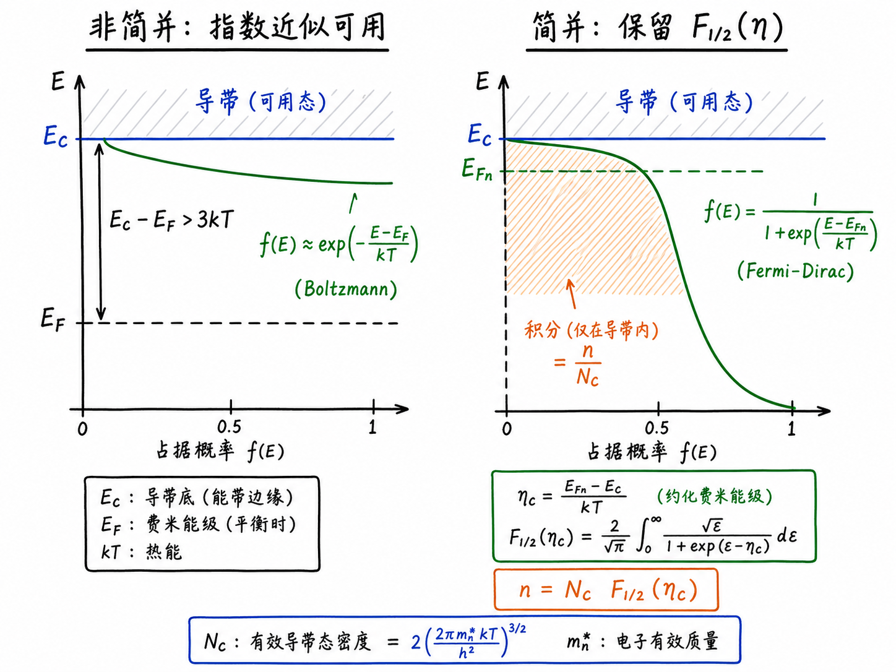

# 为什么半导体载流子浓度会遇到费米-狄拉克积分

算半导体里的电子浓度时，最容易让人误会的一步是：好像只要看费米能级离导带底多远，就能写出一个简单指数。这个想法在很多入门推导里确实成立，所以我们熟悉 $n\approx N_C\exp(-(E_C-E_F)/kT)$ 这样的形式。

但这个公式不是载流子统计的原始定义，而是一个近似。只要费米能级靠近导带底，甚至进入导带，普通 Boltzmann 指数近似就不再可靠。这时真正要计算的不是一个单独的概率，而是“有多少状态”乘以“这些状态被电子占据的概率”，再把这个乘积沿能量加起来。这个积分，就是费米-狄拉克积分出现的地方。

读完这篇，你会知道

- 为什么电子浓度不是只由 Fermi-Dirac occupation probability 决定
- 费米-狄拉克积分为什么来自态密度 $g(E)$ 与占据函数 $f(E)$ 的乘积
- 什么条件下可以退回熟悉的 Boltzmann 指数近似
- reduced Fermi level、$F_{1/2}(\eta)$ 和有效态密度 $N_C$ 各自是什么意思
- 为什么这个写法也能推广到量子阱、量子线和量子点

## 载流子浓度真正积分的是什么

电子浓度 $n$ 要回答的问题是：导带里每单位体积到底有多少电子。

导带不是只有一个能级，而是一整片能量状态。每个能量附近有多少可用状态，由态密度 density of states 决定，记作 $g_C(E)$。每个状态平均有多大概率被电子占据，由 Fermi-Dirac occupation probability 决定，记作 $f(E)$。

所以电子浓度的结构不是：

$$
n=\text{某个概率}
$$

而是：

$$
n=\int_{E_C}^{\infty} g_C(E)f(E)\,dE
$$

这里很关键：费米-狄拉克积分不是占据概率本身。占据概率 $f(E)$ 永远在 0 到 1 之间；积分里的面积来自 $g_C(E)f(E)$，表示每个能量层实际贡献的电子数密度。态密度给出“座位有多少”，占据函数给出“座位坐满了多少”，两者相乘后再积分，才是电子浓度。

在三维半导体的抛物线能带近似下，导带态密度随 $E-E_C$ 的平方根上升，因此电子浓度可以写成类似：

$$
n=\frac{4\pi}{h^3}(2m_n^*)^{3/2}\int_{E_C}^{\infty}
\frac{\sqrt{E-E_C}}{1+\exp\left(\frac{E-E_F}{kT}\right)}\,dE
$$

这个式子看起来不如 $N_C\exp(-(E_C-E_F)/kT)$ 清爽，但它更接近问题本身：从导带底 $E_C$ 开始，只对导带里的状态积分，不把积分面积画到禁带里。

## Boltzmann 近似为什么有时成立

如果费米能级 $E_F$ 比导带底 $E_C$ 低很多，比如 $E_C-E_F$ 大于大约 $3kT$，那么导带里的能量 $E$ 通常也满足 $E-E_F$ 明显大于 $kT$。这时费米占据函数

$$
f(E)=\frac{1}{1+\exp((E-E_F)/kT)}
$$

可以近似成：

$$
f(E)\approx \exp\left(-\frac{E-E_F}{kT}\right)
$$

这就是非简并 non-degenerate 情况。此时导带状态的占据概率很低，Pauli exclusion 带来的“每个态最多容纳有限电子”的限制不强，Fermi-Dirac 分布的尾巴看起来就像普通指数衰减。

把这个指数近似代回积分，平方根态密度乘以指数函数的积分可以解析化，最后得到熟悉形式：

$$
n\approx N_C\exp\left(\frac{E_F-E_C}{kT}\right)
$$

注意这个式子不是凭空来的，它是完整积分在非简并条件下的近似结果。

## 什么时候不能再偷懒

当费米能级接近导带底，或者电子准费米能级 $E_{Fn}$ 进入导带时，Boltzmann 近似就会出问题。

原因很直接：Fermi-Dirac occupation probability 不再只是一个小小的指数尾巴。导带底附近的占据概率可能已经接近 1，不能继续用指数函数把它无限外推。指数近似可能给出错误的载流子浓度，尤其在高注入、强掺杂、光电子器件或低维结构里更明显。

这时必须保留完整的费米-狄拉克积分。问题不再是“能不能写一个漂亮指数”，而是“怎样把原始积分写成一个标准函数，让它可以查表、数值计算或用成熟近似处理”。

## 把积分变成无量纲函数

原始积分里最别扭的地方，是积分变量 $E$ 带有能量单位，积分下限还是 $E_C$。为了把它整理成标准形式，我们定义一个无量纲变量：

$$
\epsilon=\frac{E-E_C}{kT}
$$

这里 $\epsilon$ 表示：当前能量比导带底高出多少个 $kT$。这样一来，积分下限从 $E=E_C$ 变成 $\epsilon=0$，积分上限仍然是无穷大。

还要定义电子的 reduced Fermi level：

$$
\eta_C=\frac{E_{Fn}-E_C}{kT}
$$

它也是无量纲量，表示电子准费米能级 $E_{Fn}$ 相对导带底 $E_C$ 高出多少个 $kT$。如果 $E_{Fn}$ 在 $E_C$ 下面，$\eta_C$ 为负；如果 $E_{Fn}$ 进入导带，$\eta_C$ 为正。

代入后，电子浓度可以整理成：

$$
n=N_C F_{1/2}(\eta_C)
$$

其中 $N_C$ 是导带有效态密度 effective density of states，单位是每单位体积，包含有效质量 $m_n^*$、温度 $T$、Planck 常数等有单位的前因子。$F_{1/2}(\eta_C)$ 是无量纲函数，只负责描述费米能级位置对积分面积的影响。

按照本文使用的归一化：

$$
F_{1/2}(\eta)=\frac{2}{\sqrt{\pi}}\int_0^\infty
\frac{\sqrt{\epsilon}}{1+\exp(\epsilon-\eta)}\,d\epsilon
$$

这里每个符号都要分清楚：

- $\epsilon=(E-E_C)/kT$ 是积分变量，无量纲。
- $\eta_C=(E_{Fn}-E_C)/kT$ 是电子的 reduced Fermi level，无量纲。
- $N_C$ 是导带有效态密度，有浓度单位。
- $F_{1/2}$ 是 $1/2$ 阶费米-狄拉克积分，本身无量纲。

不要把 $E_F-E_C$ 这样的能量差直接塞进 $F_{1/2}$。进入 $F_{1/2}$ 的必须是除以 $kT$ 后的无量纲参数。

## 空穴也有同样的结构

空穴浓度的形式与电子完全平行，只是看的是价带：

$$
p=N_V F_{1/2}(\eta_V)
$$

其中 $N_V$ 是价带有效态密度，空穴的 reduced Fermi level 定义为：

$$
\eta_V=\frac{E_V-E_{Fp}}{kT}
$$

这里 $E_{Fp}$ 是空穴准费米能级。这个定义带有符号，不只是“距离”。当 $E_{Fp}$ 在价带顶 $E_V$ 下方时，$\eta_V$ 为正；如果它靠近或进入价带，空穴统计也需要保留费米-狄拉克积分。

因此，电子和空穴的统一图像是：

$$
\text{载流子浓度}=\text{有效态密度}\times\text{费米-狄拉克积分}
$$

有效态密度负责材料、温度、有效质量这些有单位的部分；费米-狄拉克积分负责统计占据带来的无量纲修正。

## 这件事为什么不只是数学整理

把积分写成 $N_C F_{1/2}(\eta_C)$，不是为了让公式看起来高级，而是为了分清两个物理层次。

第一层是材料和能带结构。硅、锗、砷化镓的有效质量不同，$N_C$ 和 $N_V$ 就不同；三维体材料、二维量子阱、一维量子线、零维量子点的态密度形式不同，对应的有效态密度和费米-狄拉克积分阶数也会变化。

第二层是统计占据。只要费米能级远离带边，非简并近似足够好，$F_{1/2}(\eta)$ 可以退化成指数形式。只要费米能级靠近或进入能带，就必须保留完整积分，或者使用针对费米-狄拉克积分的数值表和近似公式。

这就是它在半导体器件里反复出现的原因。载流子浓度不是只看“有没有状态”，也不是只看“占据概率多大”，而是看态密度和占据函数乘起来之后，在允许能带范围内留下多少面积。

记住一句话：Boltzmann 指数近似是非简并情况下的简化版；费米-狄拉克积分才是从态密度与占据概率相乘出发的完整载流子统计表达。
