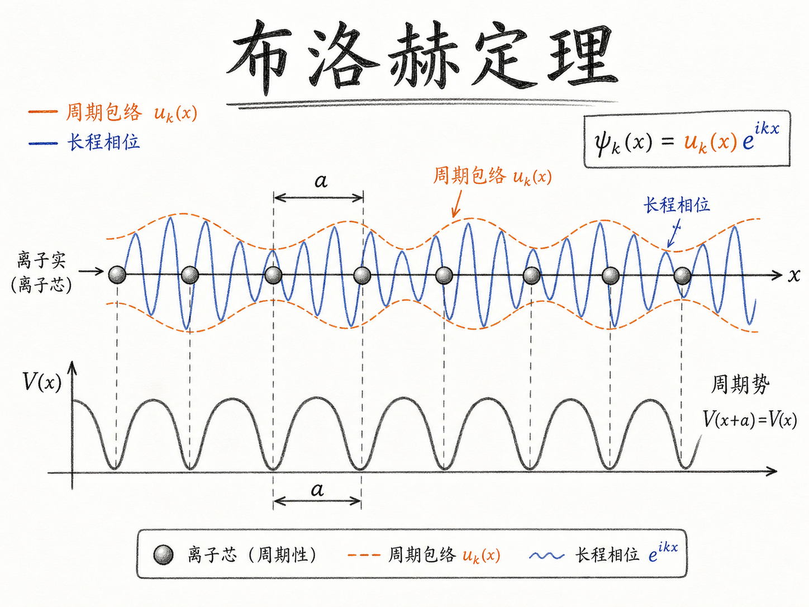
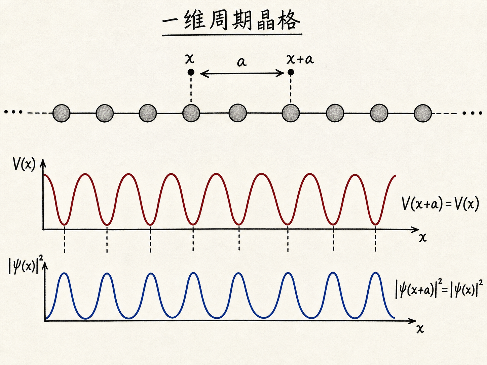
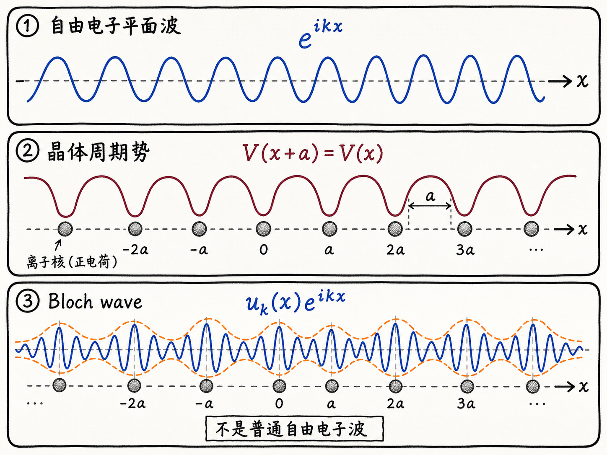
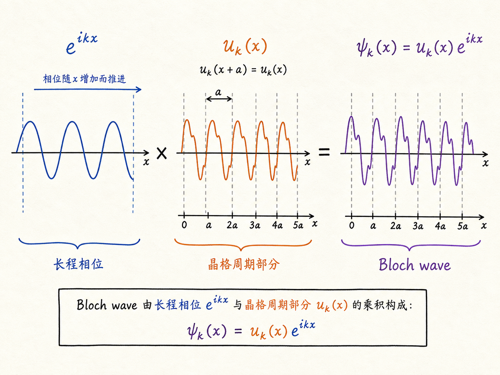

# 布洛赫定理：晶体里电子为什么不像自由电子那样简单

如果电子在真空里自由运动，它的波函数可以写成一个平面波：一路带着相位向前走，空间里没有任何东西定期拉它一下。可是晶体不是空荡荡的空间。晶体里有一排排周期排列的原子核和离子实，电子看到的是周期性势场。

问题就来了：既然势场不是常数，电子波函数还能不能保留“像波一样向远处传播”的结构？布洛赫定理回答的正是这个问题。它说，周期势场不会把电子波函数变成一团局域在某个原子附近的东西；在理想无限晶体里，波函数仍然可以保留长程相位结构，只是这个波被晶格周期性地调制了。

读完这篇，你会知道

- 为什么晶体平移一个晶格常数后，概率密度应该保持不变
- 自由电子平面波、晶体周期势和 Bloch wave 分别是什么
- 为什么 Bloch 波函数可以写成 $\psi_k(\mathbf{r})=u_k(\mathbf{r})e^{i\mathbf{k}\cdot\mathbf{r}}$
- $u_k(\mathbf{r})$ 的晶格周期性到底在物理上表示什么
- 为什么这里的 $k$ 不能简单当成经典粒子的真实动量

## 从一条无限原子链开始

先把晶体压缩成最简单的一维图像：一条无限长的原子链，相邻原子之间的距离是 $a$。这就是一维周期晶格。你站在某个原子附近，位置记为 $x$，然后沿着链移动一个晶格常数，来到 $x+a$。

如果这条链真的无限长，而且每个原子周围的环境完全一样，那么你在 $x$ 处向左看、向右看，和在 $x+a$ 处看到的局部世界没有区别。晶体没有给你一个“这是第几个原子”的标签。

电子波函数也面对同样的对称性。严格说，波函数 $\psi(x)$ 本身可以多一个相位；但可观测的概率密度 $\lvert\psi(x)\rvert^2$ 在等价晶格点上必须一样。因此有

$$
\lvert \psi(x+a)\rvert^2=\lvert\psi(x)\rvert^2
$$

这句话很关键：周期性要求概率密度重复，但不要求波函数数值完全重复。波函数可以在每平移一个晶格常数后多乘一个模长为 1 的复数相位因子。

于是可以写成

$$
\psi(x+a)=C\psi(x), \qquad |C|=1
$$

这里的 $C$ 不是改变概率大小的系数，而是记录相位如何随晶格平移推进的系数。

## 用周期边界条件逼出相位因子

为了知道 $C$ 可以取什么形式，常用一个数学技巧：周期边界条件。把一维晶体想象成一个很大的环，走到最后一个原子后再回到第一个原子。

这个图像看起来像在偷懒，因为真实的大块晶体不是一个小圆环。但它解决的是同一个局部物理问题：如果这个环足够大，我们只关心中间区域，不关心边缘，那么局部看起来就和无限直线晶格一样。周期边界条件的目的不是说电子真的从样品一端跳到另一端，而是用一个干净的数学边界来表达“没有特殊边缘”。

假设环上共有 $N$ 个原子。每向前平移一个 $a$，波函数乘一次 $C$：

$$
\psi(x+a)=C\psi(x)
$$

再平移一次：

$$
\psi(x+2a)=C^2\psi(x)
$$

走过 $N$ 个晶格常数后回到同一个位置，所以

$$
\psi(x+Na)=C^N\psi(x)=\psi(x)
$$

因此

$$
C^N=1
$$

也就是说，$C$ 必须是 1 的 $N$ 次方根，可以写成

$$
C=e^{i2\pi s/N}
$$

其中 $s$ 是整数。这说明，每跨过一个晶格常数，波函数允许积累一个固定相位。

如果把这个相位推进写成随位置变化的波，就得到类似平面波的因子：

$$
e^{ikx}
$$

这里 $k$ 记录的是相位沿晶体推进的快慢。对自由电子来说，整个波函数就可以是这个平面波。但在晶体里，事情还没结束。

## 自由电子平面波不是 Bloch 波

自由电子平面波的背景是假设空间里没有周期势场，电子看到的势能是常数。因此波函数可以简单写成 $e^{ikx}$，它的振幅不会跟着晶格位置周期性起伏。

晶体里的电子不同。它在传播时会不断感受到离子实造成的周期势场 $V(x)$，并且这个势场满足

$$
V(x+a)=V(x)
$$

所以我们不应该把晶体电子直接等同于自由电子。晶体周期势会调制波函数的局部形状：靠近原子附近和原子之间，波函数的细节可以不同；但这种细节本身也必须随晶格周期重复。

这就引出 Bloch 波的形式：

$$
\psi_k(x)=u_k(x)e^{ikx}
$$

其中 $e^{ikx}$ 是长程相位因子，表示波函数整体仍然像波一样穿过晶体；$u_k(x)$ 是周期函数，满足

$$
u_k(x+a)=u_k(x)
$$

所以 Bloch wave 不是“普通平面波换个名字”。它是“平面波相位结构”乘上“晶格周期性调制”。前者负责长距离传播的相位，后者负责把晶体内部一个个重复单元的局部环境放进波函数。

推广到三维晶体，形式写成

$$
\psi_k(\mathbf{r})=u_k(\mathbf{r})e^{i\mathbf{k}\cdot\mathbf{r}}
$$

其中 $u_k(\mathbf{r})$ 具有晶格周期性。也就是说，对任意晶格平移向量 $\mathbf{R}$，都有 $u_k(\mathbf{r}+\mathbf{R})=u_k(\mathbf{r})$。

## 周期势没有摧毁长程相位，只是把波调制了

这就是布洛赫定理的物理含义。周期势场确实改变了电子波函数，但它没有让波函数失去整体传播的相位结构。

更准确地说，晶体的平移对称性要求：平移一个晶格周期后，波函数可以只差一个相位因子。这个相位因子累积起来就是 $e^{i\mathbf{k}\cdot\mathbf{r}}$；而晶格内部那些每个周期都会重复出现的细节，被放进 $u_k(\mathbf{r})$。

可以把它想成两层信息：

- 第一层是慢慢推进的相位：$e^{i\mathbf{k}\cdot\mathbf{r}}$
- 第二层是每个晶胞里重复的形状：$u_k(\mathbf{r})$

这两层合在一起，才是晶体电子的 Bloch 波函数。它既不是完全自由的平面波，也不是局域在单个原子上的轨道图像。

## $k$ 是晶体动量相关量，不是经典真实动量

最后要特别小心 $k$。在自由电子里，$k$ 和动量关系很直接，常写成 $p=\hbar k$。但在晶体里，电子处在周期势场中，$k$ 更准确地说是晶体动量相关的量，也常叫 crystal momentum。

它可以像动量一样标记 Bloch 态，并且在能带边缘附近常常能用类似动量的方式处理。但它不是一个经典小球在空间里真实飞行时的动量。晶体不断和电子交换普通动量；真正被晶体平移对称性保护和分类的是这个 Bloch 态的 $k$。

这也是为什么后面讨论能带、有效质量和态密度时，$k$ 会变成主角。周期势场允许我们用 $k$ 标记电子态，然后讨论能量如何随 $k$ 变化，也就是 $E(k)$。但本篇先停在布洛赫定理本身：在周期晶体里，电子态的正确基本形状是

$$
\psi_k(\mathbf{r})=u_k(\mathbf{r})e^{i\mathbf{k}\cdot\mathbf{r}}
$$

一句话收束：晶体没有把电子波变成普通粒子轨道，而是让电子波在保持长程相位的同时，带上了与晶格同周期的调制。
