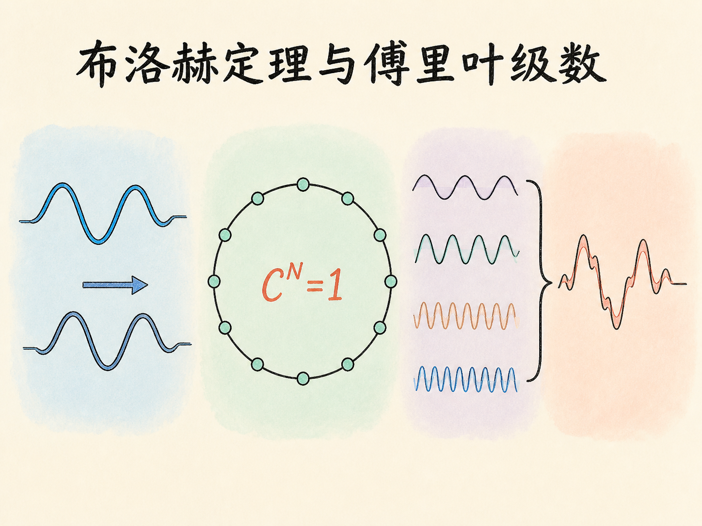
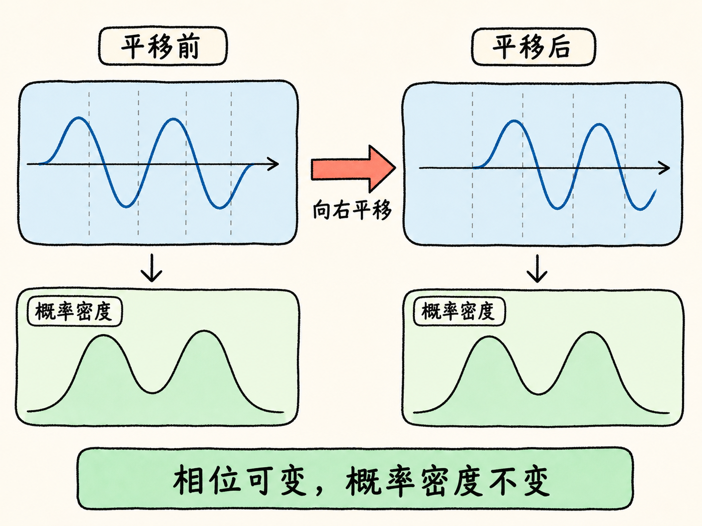
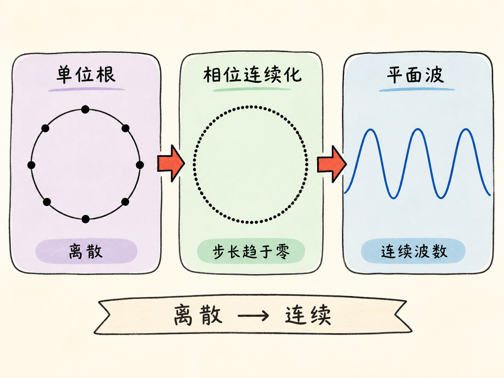
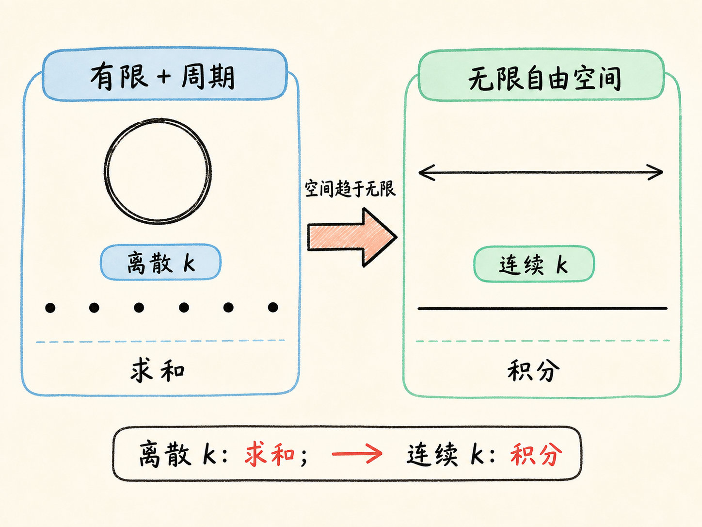
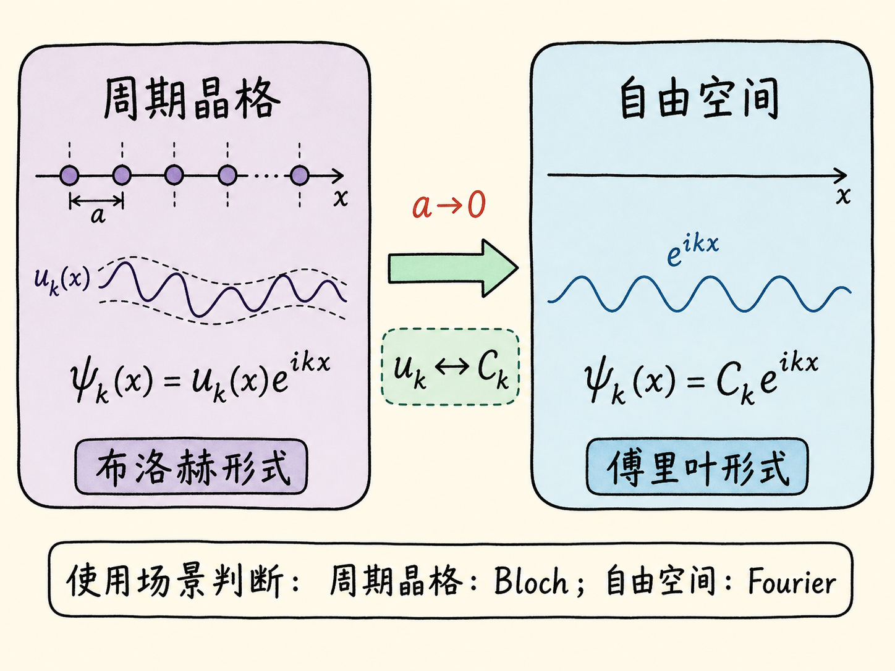

# 从平移相位到傅里叶展开：布洛赫定理与傅里叶级数

假设空间里没有任何路标。向右移动一点之后，新的位置与原来的位置完全等价。对波函数来说，这种“位置等价”并不要求波函数的复数值原封不动，却要求可观察的概率密度保持不变。

真正需要追问的是：波函数在平移后还能发生什么变化？答案会从一个模长为 1 的复系数开始，经过周期边界和单位根，最后自然走到平面波、傅里叶级数与傅里叶变换。

读完这篇，你会知道

- 连续平移对称为什么要求 $|\psi(x)|^2$ 保持不变
- 为什么要把一条直线近似成一个足够大的环
- $C^N=1$ 的单位根如何连续化为 $e^{ik\epsilon}$
- 傅里叶级数中的求和何时变成对 $k$ 的积分
- 布洛赫定理与傅里叶定理在这条推导中如何相连

## 自由空间首先限制的是概率密度

从一条没有原子、没有标记的连续直线开始。这样的空间具有连续平移对称性：任何位置都与其他位置等价。

用 $\psi(x)$ 表示位置 $x$ 处的波函数，$|\psi(x)|^2$ 是相应的概率密度。再用 $\epsilon$ 表示一次任意小的空间平移。既然 $x$ 与 $x+\epsilon$ 没有区别，平移前后的概率密度就应满足

$$
|\psi(x+\epsilon)|^2=|\psi(x)|^2.
$$

概率密度相同，不等于复数波函数本身必须完全相同。波函数可以多出一个复系数。把这个平移系数记为 $C$，就有

$$
\psi(x+\epsilon)=C\psi(x).
$$

为了让上式两边的模平方相等，$C$ 的模长只能是 1：

$$
|C|=1.
$$

因此，一次平移允许改变波函数的相位，却不能改变它的概率密度。接下来的问题是：这个相位可以取哪些值？

## 为什么要把直线弯成一个大环

在无限直线上不断向前走，不会回到起点，因此很难直接给平移相位增加“走完一圈”的约束。处理办法是给空间施加周期边界条件：把直线首尾相接，近似成一个足够大的环。

这个环不是说真实空间一定首尾相接，而是一种边界处理。环足够大时，局部看起来仍然像一条直线。对于一块有限的半导体或一段有限空间，这种近似在边缘附近可能不准确，但在远离边缘的中部可以很好地工作。

周期边界的直接作用，是让连续平移最终能够回到同一点。设每一步的距离仍为 $\epsilon$，绕环一周需要 $N$ 步，其中 $N$ 是回到起点所需的平移次数。一次平移后有

$$
\psi(x+\epsilon)=C\psi(x).
$$

两次平移后有

$$
\psi(x+2\epsilon)=C^2\psi(x).
$$

连续走完 $N$ 步，则

$$
\psi(x+N\epsilon)=C^N\psi(x).
$$

但 $N$ 步之后已经回到同一点，所以左边必须恢复成 $\psi(x)$。因此

$$
C^N=1.
$$

这就是引入周期边界的原因：它把“平移后只差一个相位”变成了一个可以求解的闭合条件。

## 单位根怎样变成连续波数

$C^N=1$ 表明 $C$ 是 $N$ 次单位根。它可以写成

$$
C=\exp\left(i\frac{2\pi s}{N}\right),
$$

其中 $s$ 是整数。对给定的 $N$，这些相位是离散的。

可是自由空间不是只允许某个固定步长。由于平移对称是连续的，$\epsilon$ 可以不断减小并趋近于零。步长越小，绕同一个大环所需的步数 $N$ 越多，单位根对应的相位取值也越密。到了连续极限，可以把一次平移的相位写成

$$
C=e^{ik\epsilon}.
$$

这里的 $k$ 是波数。因为指数 $k\epsilon$ 必须没有量纲，而 $\epsilon$ 的量纲是长度，所以 $k$ 的量纲是逆长度。

这个写法把离散单位根改写成了连续平移相位：平移距离是 $\epsilon$，相位增量就是 $k\epsilon$。于是，问题变成寻找满足下面关系的波函数：

$$
\psi(x+\epsilon)=e^{ik\epsilon}\psi(x).
$$

## 平移关系直接给出平面波

满足这个关系的一个直接形式是

$$
\psi_k(x)=e^{ikx}.
$$

把 $x$ 换成 $x+\epsilon$，就得到

$$
\psi_k(x+\epsilon)=e^{ik(x+\epsilon)}
=e^{ik\epsilon}e^{ikx}
=e^{ik\epsilon}\psi_k(x).
$$

整个波函数还可以乘上一个系数。用 $C_k$ 表示波数为 $k$ 的平面波分量所对应的系数，更一般地写成

$$
\psi_k(x)=C_k e^{ikx}.
$$

这个整体系数不会破坏平移关系，因为平移只让指数部分增加相位 $e^{ik\epsilon}$。

## 多个平面波叠加，就得到傅里叶级数

一个 $k$ 对应一个平面波解。不同 $k$ 的薛定谔方程解可以线性叠加，叠加后的结果仍然是解。因此可以对所有允许的离散 $k$ 求和：

$$
\psi(x)=\sum_k C_k e^{ikx}.
$$

这正是傅里叶级数的形式。它在这里出现并非偶然：为了让平移走完一圈，我们施加了周期边界条件；周期边界让 $\psi(x)$ 成为周期函数；周期函数又可以展开成一组离散复指数的和。

因果链可以顺着读下来：

$$
\text{周期边界}
\longrightarrow C^N=1
\longrightarrow \text{离散相位}
\longrightarrow \sum_k C_k e^{ikx}.
$$

## 空间真正无限时，求和变成积分

有限的环给出了离散的 $k$，所以使用求和。如果让环越来越大，最后回到真正无限、非周期的自由空间，允许的 $k$ 取值就由离散变为连续。此时，逐项求和改为对 $k$ 积分：

$$
\psi(x)=\int C(k)e^{ikx}\,dk.
$$

这里的 $C(k)$ 是连续波数 $k$ 对应的系数函数。这就是傅里叶变换的形式。

因此，“求和何时变成积分”的判断并不来自符号替换，而来自允许波数的性质：有限且周期的空间对应离散 $k$，使用傅里叶级数；无限自由空间对应连续 $k$，使用傅里叶变换。

## 布洛赫定理与傅里叶定理如何相连

对真正的周期晶格，布洛赫形式更适合。它可以写成

$$
\psi_k(x)=u_k(x)e^{ikx},
$$

其中 $u_k(x)$ 是与波数 $k$ 对应的周期函数。傅里叶展开则把自由空间中的波函数写成平面波 $e^{ikx}$ 的叠加，并用 $C_k$ 或连续情况下的 $C(k)$ 表示每个平面波分量的系数。

用 $a$ 表示相邻原子之间的晶格常数。当 $a\to0$ 时，布洛赫形式中的周期函数 $u_k$ 可以类比为傅里叶展开中的系数 $C_k$。沿着这条极限关系，可以把傅里叶定理看作布洛赫定理在晶格间距趋于零时的特殊情形。

两者的使用场景也由此分开：真正的周期晶格更适合用布洛赫定理；连续自由空间更常用傅里叶定理。有限的周期环对应傅里叶级数，无限自由空间对应傅里叶变换。

## 把整条推导连起来

连续平移对称先要求 $|\psi(x)|^2$ 不随平移改变，因此波函数每次平移只能多出一个模长为 1 的系数 $C$。周期边界让平移在 $N$ 步后闭合，得到 $C^N=1$。当平移步长 $\epsilon\to0$ 时，离散单位根连续化为 $e^{ik\epsilon}$，对应的波函数就是保留整体系数后的平面波 $C_k e^{ikx}$。

在有限周期空间中，对离散 $k$ 求和得到傅里叶级数；在无限自由空间中，$k$ 连续化，求和变成积分，得到傅里叶变换。这样，从“任意位置都等价”出发，平移相位、周期边界、单位根和平面波就连成了一条完整的因果链。
