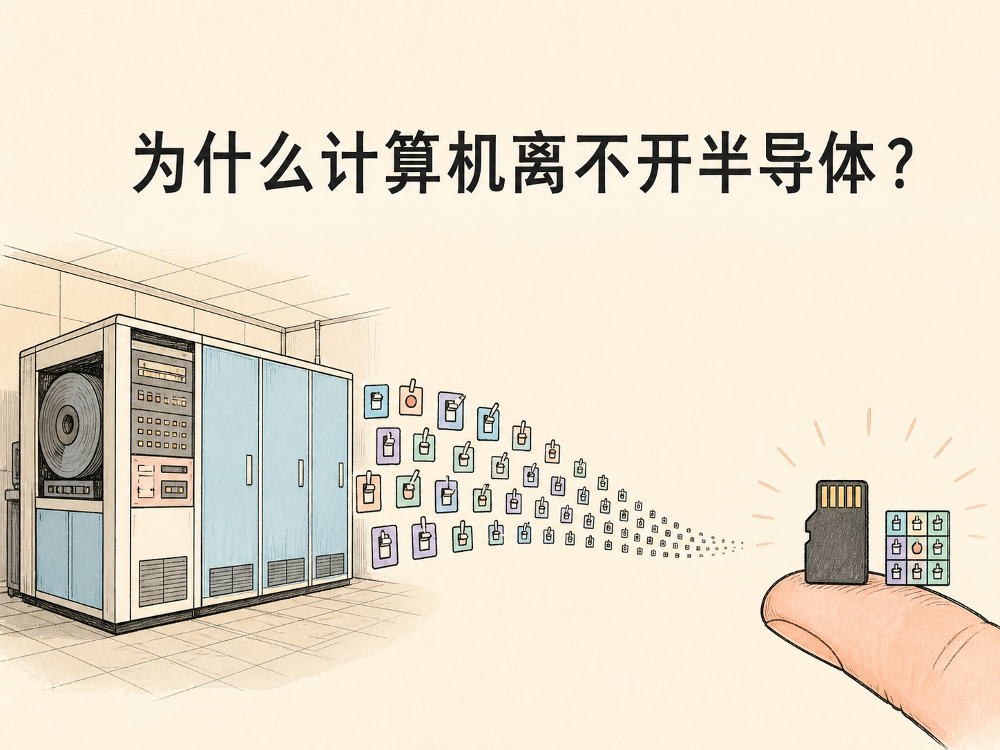
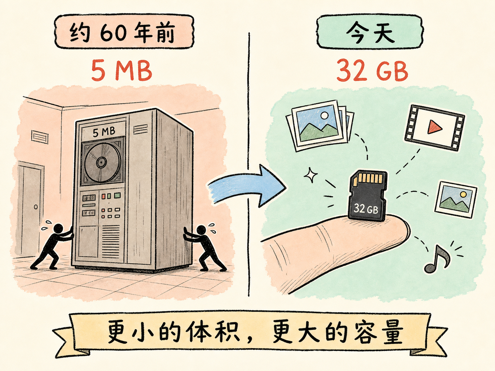
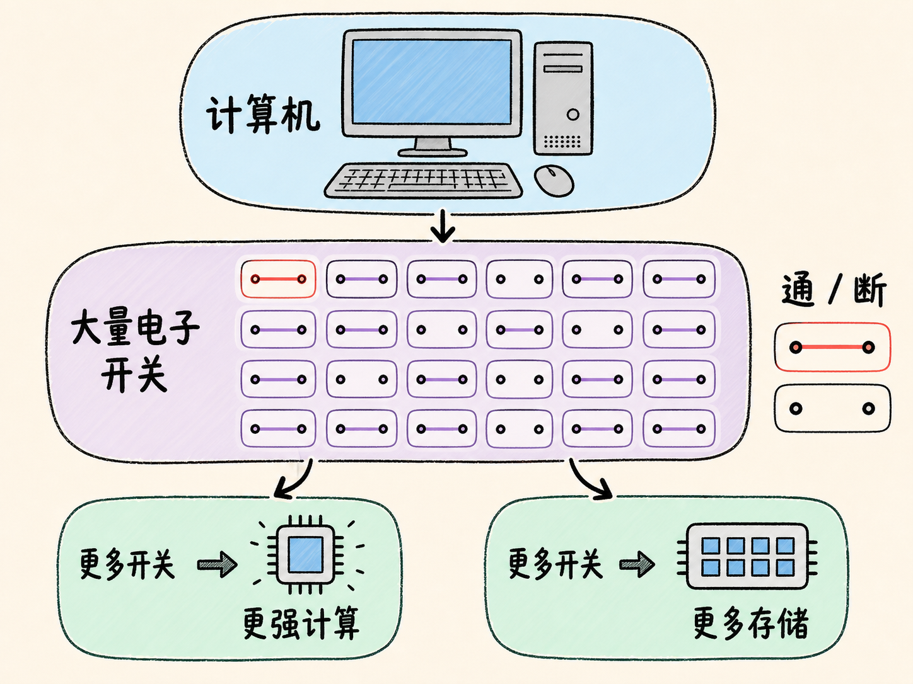
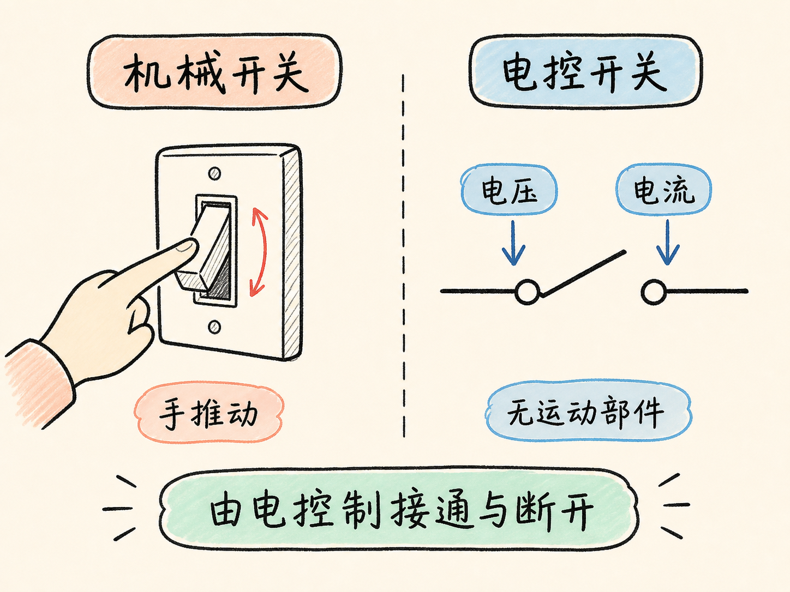
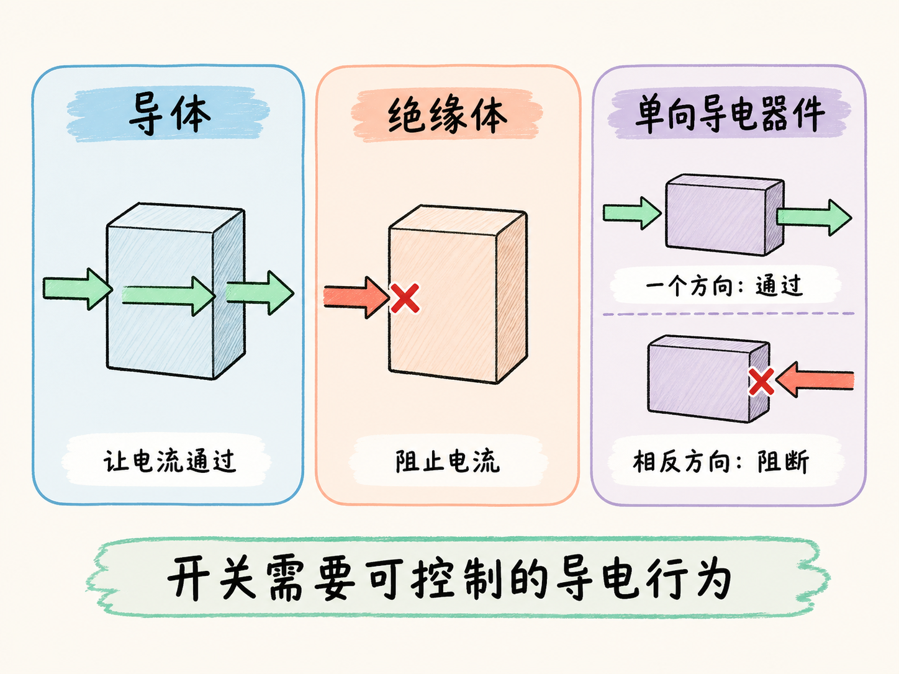
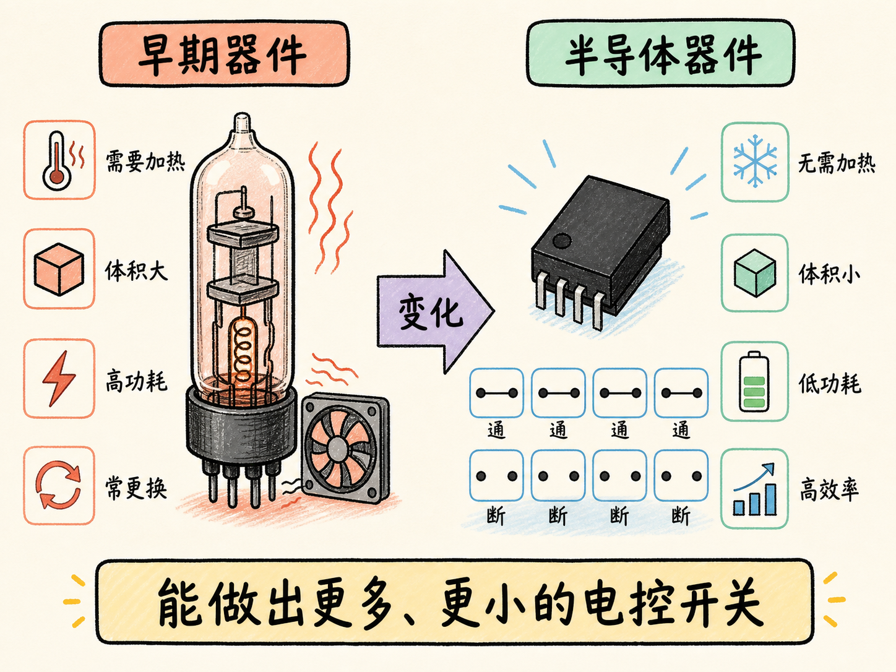
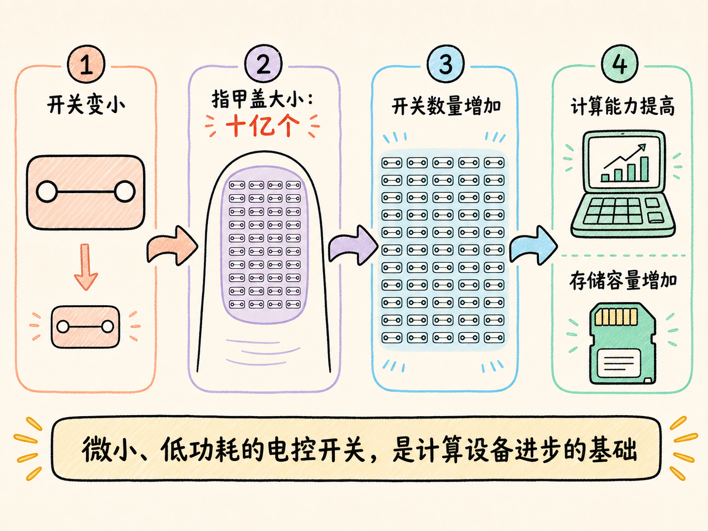

# 为什么计算机离不开半导体？

大约 60 年前，最早期的一类硬盘容量只有 5 MB，却需要几个人把它推进房间。今天，一张小小的存储卡就能装下 32 GB，足以保存大量照片、视频和其他文件。

这组对比把问题推到了计算机内部：究竟是什么发生了变化，才有可能把占据房间的设备缩到指尖大小？答案要从计算机最基本的单元——开关——讲起。

读完这篇，你会知道

- 为什么计算机可以先粗略理解成由大量开关组成
- 计算机里的开关与机械开关有什么不同
- 为什么只靠普通导体和绝缘体，很难满足这种开关的要求
- 半导体怎样帮助开关变得更小、更省电
- 开关数量为什么会影响计算能力和存储容量

## 把计算机一直拆下去，最后会看到什么？

我们熟悉 CPU、RAM、ROM 这些名称，但如果继续向下拆，计算机最基本的工作单元是什么？从最基本的功能看，可以把答案概括成两个字：开关。

开关只有两种最基本的状态：接通或者断开。计算机正是依靠数量极其庞大的开关，在不同状态之间切换，完成计算和存储。先不讨论内部的具体电路，可以用一个粗略关系理解：计算机能够容纳的开关越多，就能获得更强的计算能力和更大的存储容量。

这也解释了为什么 5 MB 硬盘和 32 GB 存储卡的对比不只是“外壳大小不同”。设备内部能够放入的基本开关数量和密度，已经发生了巨大变化。

## 计算机里的开关，为什么不能用手去按？

墙上的开关靠手指推动，内部零件发生机械运动，电路才会接通或断开。计算机里的开关不能这样工作：数量太多，切换也不可能依靠人工完成。

因此，计算机需要的是一种没有机械运动部件的开关。它不靠手去推动，而是由电压或电流控制。控制信号到来时，电流可以通过；控制条件改变时，电流又被阻止。整个过程必须由电来完成。

问题因此变成：怎样找到一种材料，让它既能“放行”电流，又能在需要时“拦住”电流？

## 导体和绝缘体，各自只擅长一件事

在最初的材料分类里，导体擅长让电荷流动，因此适合需要电流通过的地方；绝缘体会阻止电荷流动，因此适合不希望出现电流的地方。

但电控开关需要的不是永远导通，也不是永远阻断。它需要在不同条件下表现出不同的导电行为。如果材料只能固定地扮演导体或绝缘体，就很难单独承担这种任务。

一个容易理解的线索，是制造出只允许电流沿一个方向通过的器件：沿一个方向看，它像导体；反过来看，它又像绝缘体。这里关键的不是先记住某种器件名称，而是看到一种可能性——材料的导电行为可以被设计成具有明确条件，而不再只有“始终导通”或“始终阻断”两种固定选择。

有了这种能够控制电流的器件，才有可能继续构造没有机械运动部件、只由电压或电流控制的开关。

## 早期电控器件为什么难以塞进一台小计算机？

在 20 世纪早期，人们已经能利用导体和绝缘体制造电控器件，但这些器件需要加热才能工作。这一条件会同时带来几项直接后果。

首先，大量器件一起工作会产生很多热量，整台机器必须持续冷却。其次，器件本身体积很大，计算机往往要占据很大的房间。再次，持续加热需要消耗大量电能，系统功耗很高。

制造和维护也很困难。这些器件笨重、难以制造，而且可能使用几天就失效，需要经常更换。即使它们能够完成电控功能，也很难把数量极其庞大的开关可靠地装进一台紧凑设备。

所以，问题不只是“能不能做出开关”，而是能不能把开关做得足够小、功耗足够低，并且能够大量制造和使用。

## 半导体改变的是开关的尺度

半导体器件不需要依靠持续加热来工作，因此所需功耗低得多，效率也更高。它们还可以做得非常小。

较大的半导体器件已经远小于早期器件，而更小的器件甚至可以在一个指甲盖大小的面积内放入十亿个。单个开关缩小之后，同样大小的计算机就能容纳更多开关；开关数量增加，计算和存储能力也随之提高。

现在再看 5 MB 硬盘与 32 GB 存储卡的差别，背后的逻辑就清楚了：半导体使电控开关摆脱了庞大、耗能和依赖加热的限制，又把开关缩小到可以高密度集成的尺度。现代计算设备的进步，正建立在大量微小开关之上。

## 半导体为什么值得单独学习？

导体负责让电流通过，绝缘体负责阻止电流；半导体最重要的价值，则是帮助我们制造导电行为可以受条件控制的器件。正因为电流能够被放行或阻断，我们才能制造没有机械运动部件的电控开关。

后面的课程会继续追问：半导体究竟具有什么性质，为什么这些性质能够形成特定的导电行为，又怎样一步步变成真正的电子开关。

如果要用一句话复述这篇文章，可以这样说：计算机需要大量由电控制的微小开关，而半导体让这些开关能够以低功耗和极小尺寸被制造出来。
