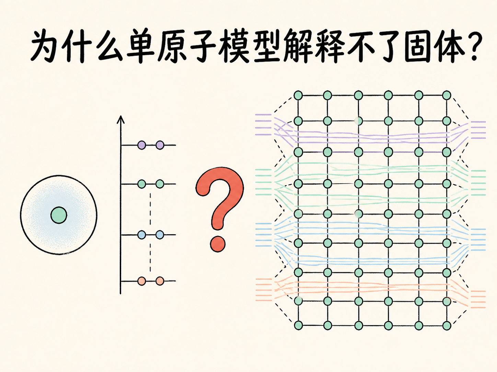
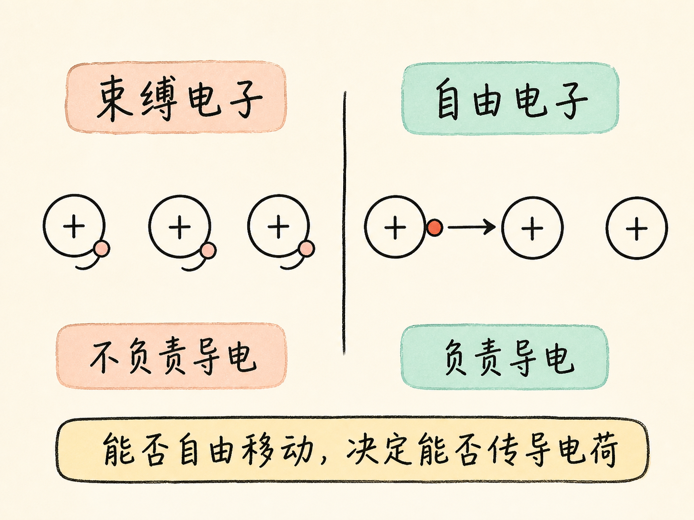
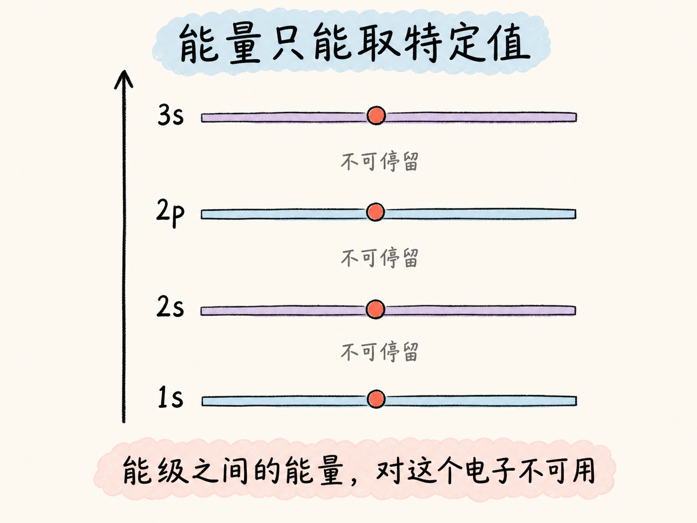
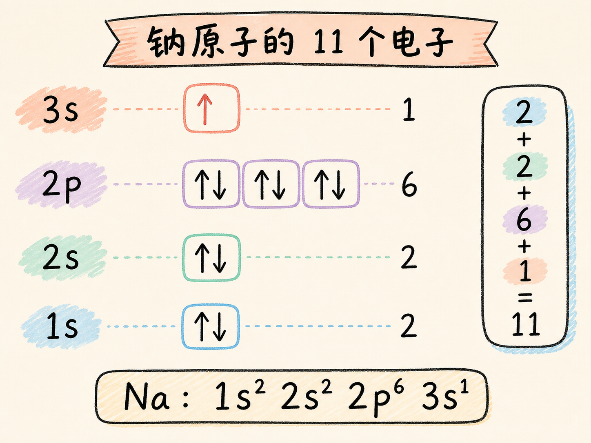
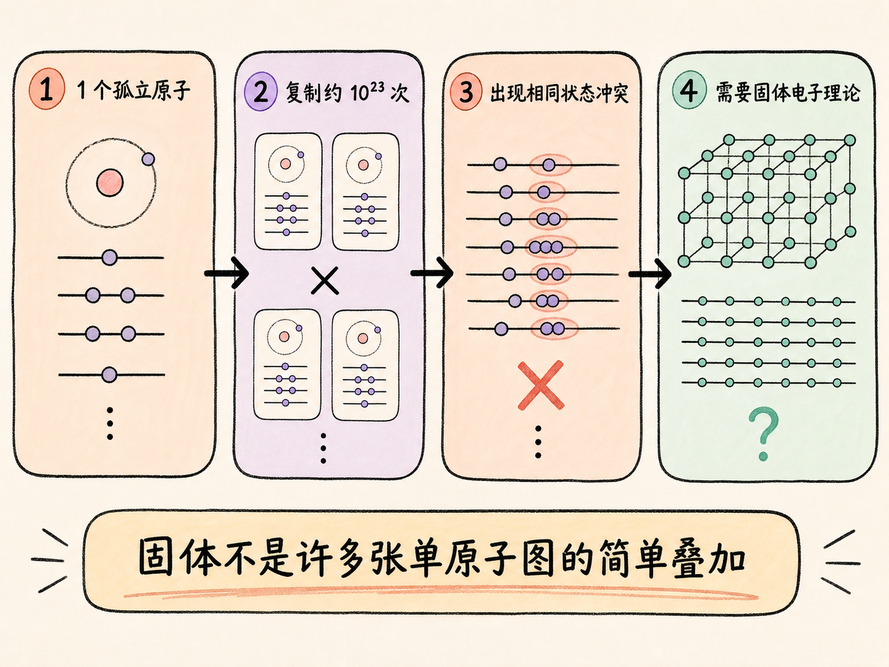

# 为什么单原子模型解释不了固体？

把一个钠原子画清楚之后，我们似乎只要把这张图复制很多份，就能得到一块钠。可当原子数量从 1 个变成约 $10^{23}$ 个时，这种做法会立刻遇到矛盾。

问题不在于原子画得不够多，而在于“孤立原子”与“固体中的原子”不是同一种电子系统。要理解半导体为什么能导电或阻止电流，必须先看清这道边界。

读完这篇，你会知道

- 束缚电子与自由电子为什么决定材料能否导电
- 为什么描述电子时，能量比经典运动轨道更有用
- 钠原子的 11 个电子怎样填入不同能级
- Pauli 不相容原理为什么阻止我们复制单原子能级图
- 为什么固体需要一套新的电子理论

## 导电问题最终会落到哪一个电子身上？

常见的入门原子图把原子核画在中央，把电子画成绕核运动的小球。这个太阳系式模型并不精确，但它可以先帮助我们区分两类电子。

一类电子被原子核紧紧束缚，称为束缚电子。它们很难离开所属原子，因此不承担材料中的导电。另一类电子受到的束缚较弱，可以从一个原子移动到另一个原子，称为自由电子或导电电子。电荷能够穿过材料，靠的正是这些可移动电子。

于是，导体、绝缘体和半导体的差别可以先转成一个问题：这种材料有多容易产生自由电子？容易产生大量自由电子的材料表现为导体；自由电子数量小到几乎可以忽略的材料表现为绝缘体；半导体则处在两者之间。

但半导体是固体。我们真正要问的不是“一个孤立原子里有没有某个电子”，而是“许多原子紧密排列之后，哪些电子能够成为自由电子”。

## 不看电子走哪条路，改看它能有多少能量

经典轨道图容易让人追问电子沿什么路径绕核运动。更适合本讲的办法，是把注意力转向电子能够具有的能量。

孤立原子中的电子不能取得任意能量，只能处在一组特定的能级上。可以把它想成一架缺了许多横档的梯子：电子能站在允许的横档上，却不能停在两档之间。这个类比只表示“能量取值离散”，并不表示电子真的站在空间中的梯子上。

这些能级按顺序记作 $1s$、$2s$、$2p$、$3s$、$3p$ 等。电子倾向于先占据较低能量，但它们还要服从另一条约束：不能占据完全相同的电子状态。

## 11 个电子怎样住进一个钠原子？

钠原子有 11 个电子。最低的 $1s$ 能级先接收两个电子：一个自旋向上，一个自旋向下。两者能量层级相同，但自旋状态不同，所以没有占据完全相同的状态。

接下来的两个电子进入 $2s$。再往上的 $2p$ 与 $s$ 能级不同：一个 $s$ 能级只有一个轨道，一个 $p$ 能级有三个轨道。每个轨道可容纳一对自旋状态不同的电子，因此 $2p$ 一共容纳六个电子。

这样算下来，$1s$ 放 2 个，$2s$ 放 2 个，$2p$ 放 6 个，总共 10 个。钠的第 11 个电子只能进入更高的 $3s$ 能级。到这里，我们得到了一张描述单个钠原子的能级与电子排布图。

这里需要注意：把 Pauli 不相容原理说成“两个电子不能有相同能量”只是课程为了入门采用的简化。真正参与约束的是完整电子状态；本讲借助自旋和轨道的差异，已经说明同一能级中的电子仍可以处于不同状态。

## 为什么两张相同的原子图不能并排摆放？

现在把两个钠原子靠得很近。若仍给每个原子复制一套完全相同的能级和电子排布，那么一个原子中的电子，就会与另一个原子中的对应电子占据相同状态。

但两个原子一旦成为同一个整体，就不能继续把电子当成分属两个互不相关的系统。Pauli 约束必须对整个体系成立，原先分别属于两个孤立原子的电子状态需要重新安排。

这正是复制法失败的地方：单原子能级图的前提，是我们只研究一个孤立原子。原子彼此接近并组成更大的体系后，这个前提已经改变。

## 从两个原子扩大到一块固体，矛盾有多大？

一块钠固体大约包含 $10^{23}$ 个紧密排列的原子。若把单原子图复制 $10^{23}$ 次，每个能级都会出现约 $10^{23}$ 份相同状态。这与整个体系必须满足的 Pauli 约束直接冲突。

因此，固体不是“许多张孤立原子图的叠加”。原子数量和相互接近这两个条件，使电子状态必须以新的方式组织。只有先建立适用于固体的电子理论，我们才有可能继续判断：哪些电子能够自由移动，材料为什么成为导体、绝缘体或半导体。

本讲停在这道门槛上，并不提前给出新理论的形式。如果要用一句话复述：单原子能级图只适用于孤立原子；当约 $10^{23}$ 个原子组成同一固体时，电子状态必须整体重排，所以不能把单原子模型直接复制到固体。

