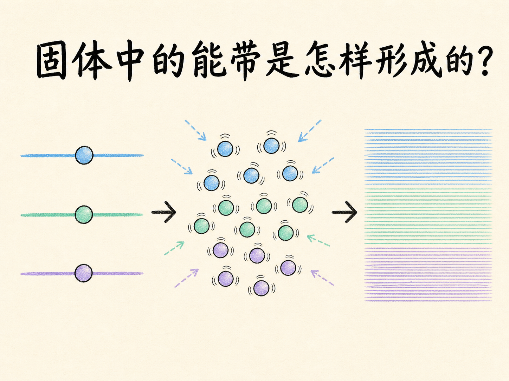
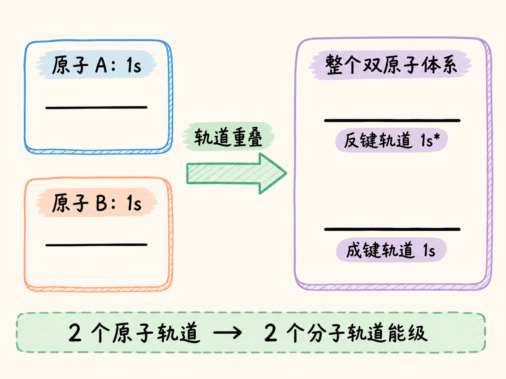
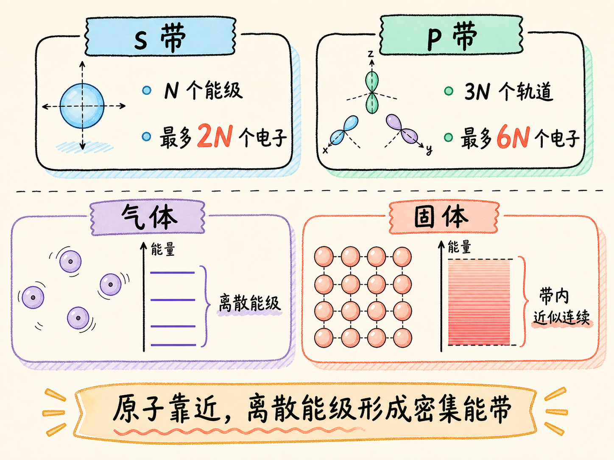

# 固体中的能带是怎样形成的？

一个孤立原子只有一组清楚分开的能级。可当约 $10^{23}$ 个原子紧密排成一块固体时，每一条原子能级都会变成约 $10^{23}$ 条挤在一起的细线。线与线的间隔小到无法逐条分辨，于是我们看到的就不再是“一级一级”，而是一整段能量范围。

这段范围就是能带。但它不是凭空出现的新结构，而是大量原子靠近后，同类电子状态逐步增多、变密的结果。

读完这篇，你会知道

- 两个原子靠近时，原子轨道怎样变成分子轨道
- 为什么两个原子会产生两个能级，$N$ 个原子会产生 $N$ 个能级
- 约 $10^{23}$ 条离散能级为什么可以近似看成连续能带
- $s$ 带与 $p$ 带分别能容纳多少电子
- 气体的离散能级与固体能带有什么差别

## 两个原子靠近，先发生什么？

两个彼此分开的钠原子，各自拥有自己的 $1s$ 原子轨道。它们距离很远时，可以分别使用单原子的能级图；一旦靠得足够近，两个 $1s$ 原子轨道就会重叠，形成属于整个双原子体系的 $1s$ 分子轨道。

“属于整个体系”是关键。原子轨道分别归属于单个原子，分子轨道则覆盖两个原子组成的整体。两个原子轨道结合后，这个分子轨道产生两个能级：较低的成键轨道 $1s$，以及较高的反键轨道 $1s^*$。

这样，原先来自两个原子的电子就不必占据两套完全相同的状态。$2s$ 原子轨道也会以同样方式组合，形成两个可区分的 $2s$ 分子轨道能级。

## 从两个能级，怎样走到 $N$ 个能级？

规律很直接：两个同类原子轨道重叠，形成两个能级；三个同类原子轨道重叠，形成三个能级。继续增加原子，能级数量也跟着增加。

如果体系中有 $N$ 个原子，那么每一类原子轨道就会对应 $N$ 个能级。这里并不是把原来的能级简单复制 $N$ 次，而是原子靠近后，属于整个体系的电子状态被重新组织为 $N$ 个可区分能级。

一块固体大约含有 $10^{23}$ 个紧密排列的原子。以 $1s$ 为例，它会对应约 $10^{23}$ 个能级。若真把这些能级一条条画出来，相邻线之间的间隔会极其微小，肉眼几乎无法区分。

## 能级很密，就等于能量真的完全连续吗？

严格说，它们仍是数量巨大的离散能级。只是当能级达到约 $10^{23}$ 条时，间隔小到可以忽略。为了描述和计算方便，我们把最低到最高能级之间的范围近似看成连续可用的能量区间。

这个区间称为能带。$1s$ 原子轨道形成 $1s$ 带，$2s$ 原子轨道形成 $2s$ 带，其他轨道也会形成相应能带。“带”并不表示离散能级真的消失，而是表示我们不再逐条分辨那些极小间隔。

这与一段看起来连续的线类似：放大后它仍由大量紧密排列的点组成。类比只说明“密到无法逐项分辨”，真实对象仍是固体中数量巨大的电子能级。

## 一条能带能装多少电子？

若固体含有 $N$ 个原子，对应的每个 $s$ 带包含 $N$ 个能级。一个 $s$ 能级可以容纳两个电子，因此这个 $s$ 带最多容纳 $2N$ 个电子。

$p$ 能级有三个轨道，每个轨道可容纳两个电子，所以单个原子的一个 $p$ 能级可容纳六个电子。对应的 $p$ 带因而可容纳 $6N$ 个电子。

现在可以看出气体与固体的分界。气体中的原子相距很远，近似为彼此独立，电子只能占据清楚分开的离散能级；固体中的原子紧密排列，同类轨道形成极其密集的能级集合，我们把它近似描述为能带。

固体能带理论由此建立。它接下来要回答的，是这些能带怎样决定自由电子能否出现，以及材料为什么分别表现为导体、绝缘体或半导体。本讲先收在形成机制上：$N$ 个紧密相邻原子的同类轨道产生 $N$ 个密集能级；当 $N$ 大到固体尺度时，这组能级就近似成为能带。

