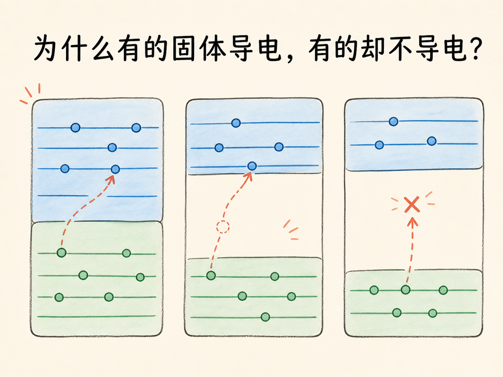
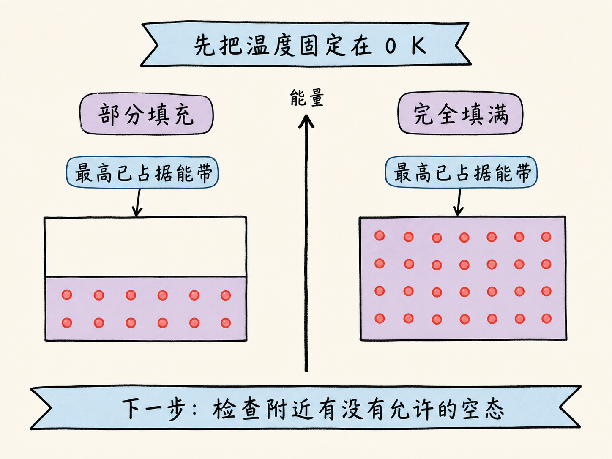
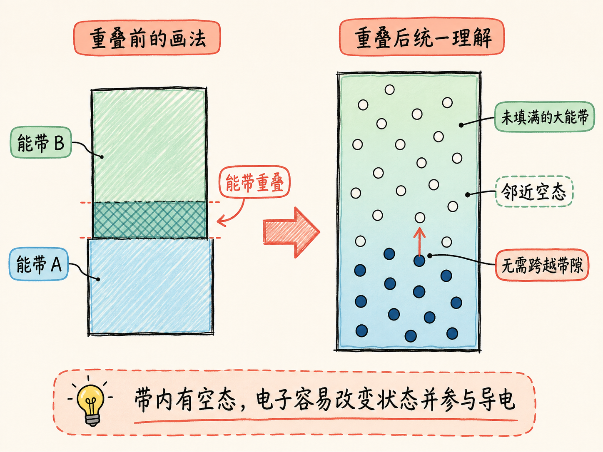
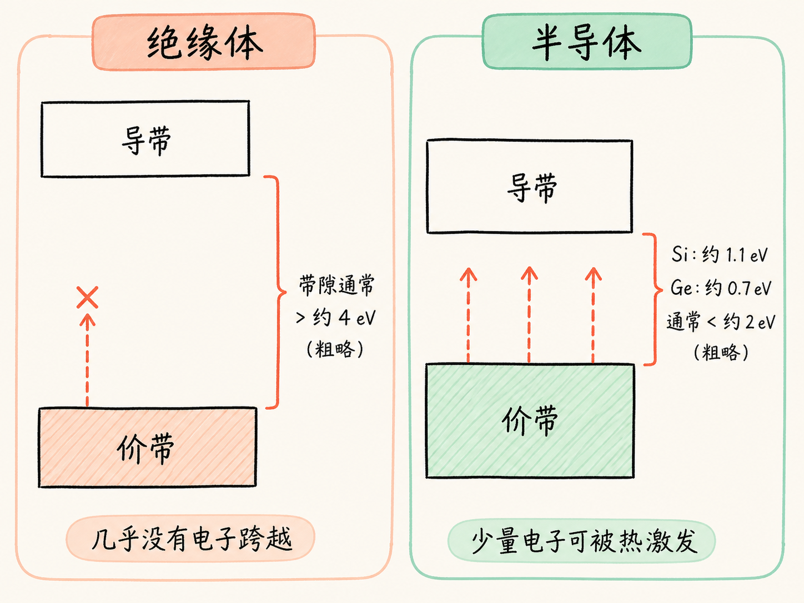
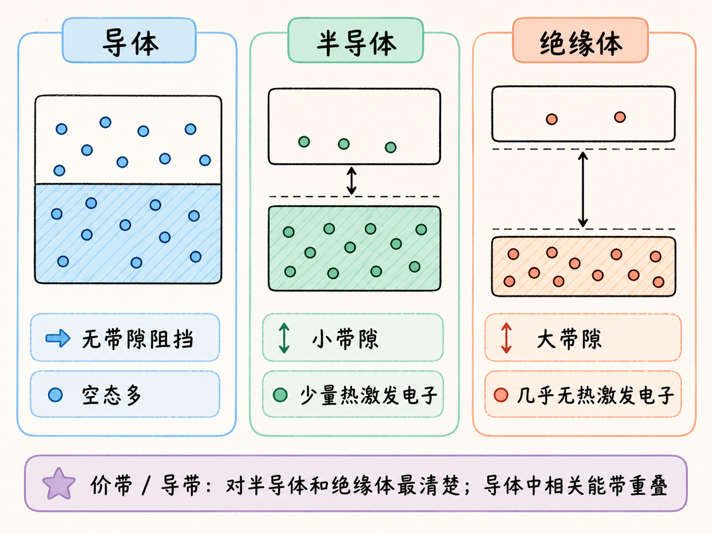

# 为什么有的固体导电，有的却不导电？

导体、绝缘体和半导体都由原子与电子组成。真正拉开差距的，不是材料“有没有电子”，而是最高能量附近有没有电子可以立刻进入的空状态，以及电子要跨过多大的能量缺口。

把三类材料的能带图放在一起，导电差异就变成了一个空间问题：前方有空位，电子就容易移动；前方隔着没有允许状态的带隙，电子就必须先获得足够能量跨过去。

读完这篇，你会知道

- 为什么要在 $0\,\text{K}$ 观察最高已占据能带
- 能带重叠为什么让导体容易导电
- 大带隙为什么让绝缘体几乎没有自由电子
- 小带隙为什么让半导体处在导体与绝缘体之间
- 价带和导带分别指什么

## 先把温度降到 $0\,\text{K}$，看清电子的起点

温度会给电子提供热能，使部分电子进入更高状态。为了先比较材料本身的能带结构，可以从最低能量状态开始，也就是 $0\,\text{K}$。

此时先找到“含有电子的最高能带”。因为电子数量有限，总会存在这样一条最高已占据带。它可能只填了一部分，也可能完全填满。接下来是否容易导电，就取决于它附近还有没有允许电子进入的空状态。

## 导体为什么不需要电子跨越带隙？

在钠、镁、铜、铁等导体中，最高已占据带与更高能带彼此重叠。重叠区域不能再视为两个完全分开的能带，而可以看成一个更大的能带。

这个大能带没有被电子填满，其中保留着许多空状态。温度稍微升高，带内电子就能进入邻近的更高空态，不必跨越一段“没有允许状态”的能量区域。

可以把未填满的能带类比成一间还有空座的教室：学生不必跳出教室，就能换到旁边座位。类比对应的真实机制是带内存在邻近空态；它不表示固体电子真的像学生一样沿座位路线移动。

## 绝缘体为什么隔着一道很难跨过的门槛？

绝缘体在 $0\,\text{K}$ 时，最高已占据带完全填满，上方的下一个能带则为空。两者之间没有任何允许电子停留的能量状态，这段区域叫带隙或禁带，记作 $E_g$。

课程用大于约 $4\,\text{eV}$ 表示绝缘体带隙的常见粗略量级，有时也会写成约 $5\,\text{eV}$。这不是严格分类边界，重要的是它远大于普通热激发容易提供的能量。

电子若要参与上方能带的导电，必须一次跨过整个带隙。室温下能完成这种跃迁的电子极少，所以上方空带中的自由电子数量几乎可以忽略，材料表现为绝缘体。

## 半导体与绝缘体只差在带隙大小吗？

硅和锗在 $0\,\text{K}$ 时的图形与绝缘体相似：下方最高已占据带填满，上方能带为空，中间也有带隙。差别是半导体带隙小得多。

硅的带隙约为 $1.1\,\text{eV}$，锗约为 $0.7\,\text{eV}$。课程用小于约 $2\,\text{eV}$ 作为半导体的粗略量级。温度升到室温后，一部分电子能够跨越这段较小带隙，进入上方能带。

因此，半导体的自由电子比绝缘体多，却远少于没有带隙阻挡的导体。三类材料的差异可以收成一条链：导体的相关能带重叠并留有空态；半导体有较小带隙；绝缘体有较大带隙。

对于绝缘体和半导体，$0\,\text{K}$ 时最高的已填满能带叫价带；它上方、电子进入后能够参与导电的能带叫导带。导体中相关能带已经重叠，价带与导带不再容易清楚分开。

如果要复述这篇文章，只需看电子前方的能量空间：有邻近空态，就容易改变状态并参与导电；隔着小带隙，少量电子可被热激发；隔着大带隙，室温下几乎没有电子能够跨过。

