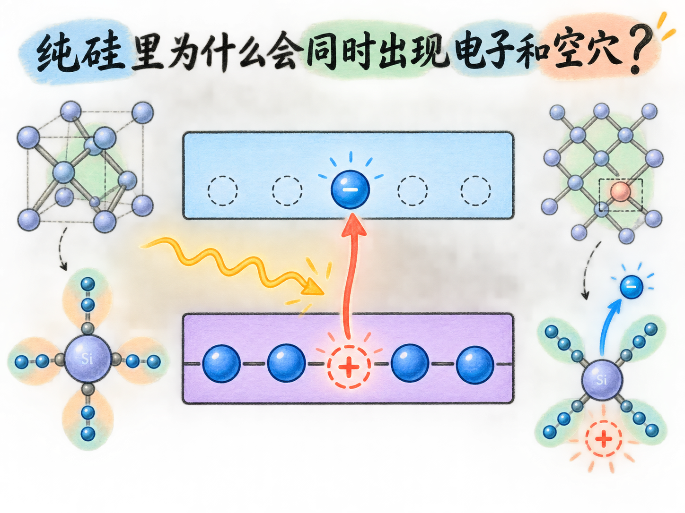
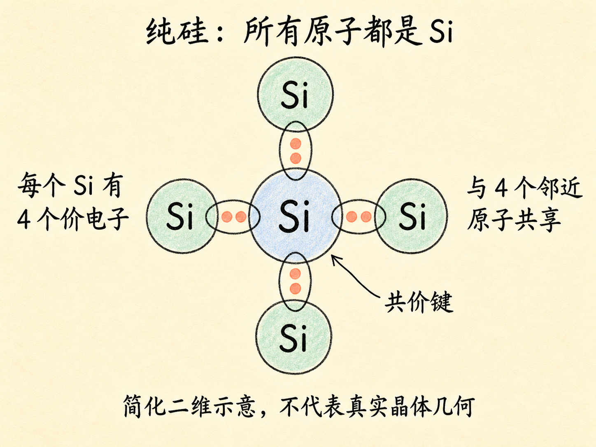
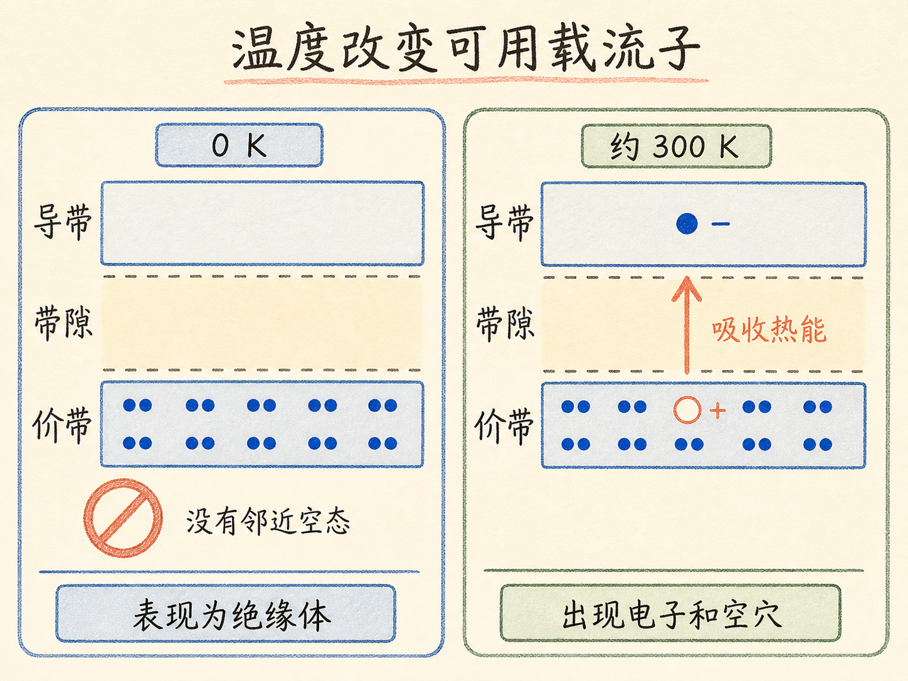

# 纯硅里为什么会同时出现电子和空穴？

一块纯硅在 $0\,\text{K}$ 时像绝缘体；升到约 $300\,\text{K}$，它却能产生少量电流。材料没有掺入新原子，电子总数也没有凭空增加。变化只来自热：一个价带电子跨过带隙，就同时制造出两种载流子。

跑到导带的电子可以移动，留在价带里的空位也会通过邻近电子依次填补而转移。我们把前者叫自由电子，把后者叫空穴。这就是本征半导体中电流有两位“搬运工”的原因。

读完这篇，你会知道

- “本征”为什么意味着材料足够纯
- 硅的 4 个价电子怎样参与共价键
- 为什么纯硅在 $0\,\text{K}$ 时不导电
- 热能怎样同时产生一个自由电子和一个空穴
- 空穴并非真实正粒子，为什么仍能作为正载流子

## 纯硅为什么能形成稳定晶体？

本征半导体就是纯净半导体：本征硅只含硅原子，本征锗只含锗原子。这里先看硅。

硅有 14 个电子，电子排布为

$$
1s^2\,2s^2\,2p^6\,3s^2\,3p^2。
$$

最外层共有 4 个价电子。相邻硅原子彼此共享这些电子，形成共价键。用课程里的简化平面图看，每个硅原子都与 4 个邻近原子共享电子，于是它周围的局部成键图景呈现八电子结构，共价键也把大量原子连接成晶体。

这里的连线只是“正在共享电子”的记号，不能把平面画法当成硅晶体真实几何结构的完整模型。

## 为什么 $0\,\text{K}$ 的纯硅像绝缘体？

在 $0\,\text{K}$ 时，价带中的允许状态全部被电子占满，导带则完全为空，两者之间隔着没有允许状态的带隙。

电子若要在电场下加速，就要增加能量；增加能量又需要一个更高的空状态。价带已经坐满，附近没有空位，导带又不是一步就能进入。因此，此时没有电子能够轻易改变状态并形成电流，纯硅表现为绝缘体。

关键并不是“硅里没有电子”，而是电子前方没有可用的能量空间。满员的价带像一排坐满人的座位：人很多，但没有空位就换不了座。类比只对应“缺少空状态”，真正的物理对象仍是能带中的允许状态。

## 升到室温后，电子和空穴怎样成对出现？

温度升到约 $300\,\text{K}$ 后，晶格中的热运动为电子提供能量。少数价带电子能够吸收足够热能，跨过带隙进入导带。

这一跳同时产生两个结果：导带多出一个可以运动的自由电子；价带少掉一个电子，留下一个空状态。也就是说，本征半导体中的电子和空穴是成对产生的。每有一个电子离开价带，价带就留下一个空穴。

导带没有填满，电子周围还有更高的空状态，所以它能在电场下改变能量并参与导电。价带中的空位虽然不是物质粒子，却也能“移动”。

## 空穴明明是空位，为什么会带来正电流？

假设价带中有一个空位。左边的相邻电子跳进这个空位后，它原来的位置就空了；再左边的电子继续来填，空位便一步步向左转移。实际移动的是带负电的电子，空穴的移动只是我们对这一连串填补过程的等效描述。

在电场中，电子的运动方向与电场相反。电子连续逆着电场填补空位，空位看起来就沿着电场方向移动。因此，把空穴当作带正电的载流子来计算和描述会非常方便。

但空穴不是晶体里单独藏着的一颗正电小球，也不是一个会主动追着电子跑的粒子。它只是“这里缺少一个价带电子”的位置。如果一个电子落入这个空位，空穴就被填上。

所以，本征半导体的导电图景可以压缩成一条因果链：热能使价带电子跨过带隙，导带得到自由电子，价带同时留下空穴；电子和空穴分别以相反方向响应电场，却都为同一个方向的常规电流作出贡献。
