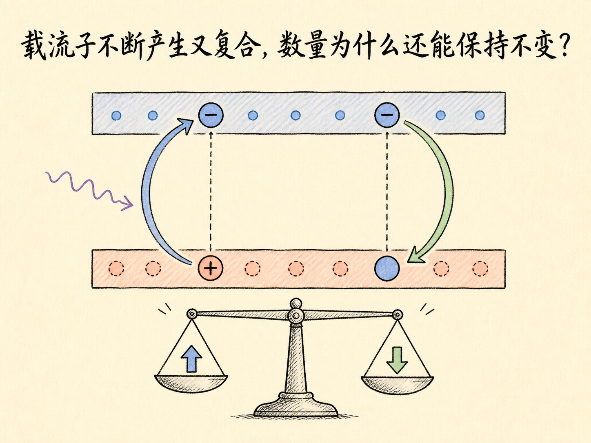
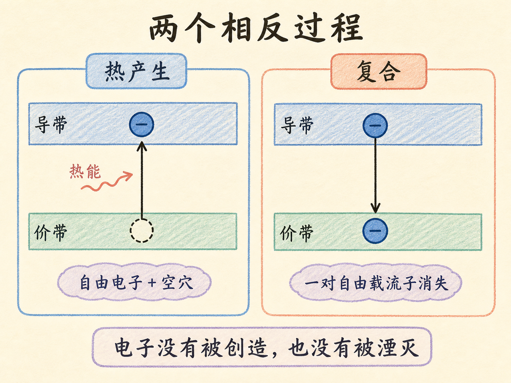
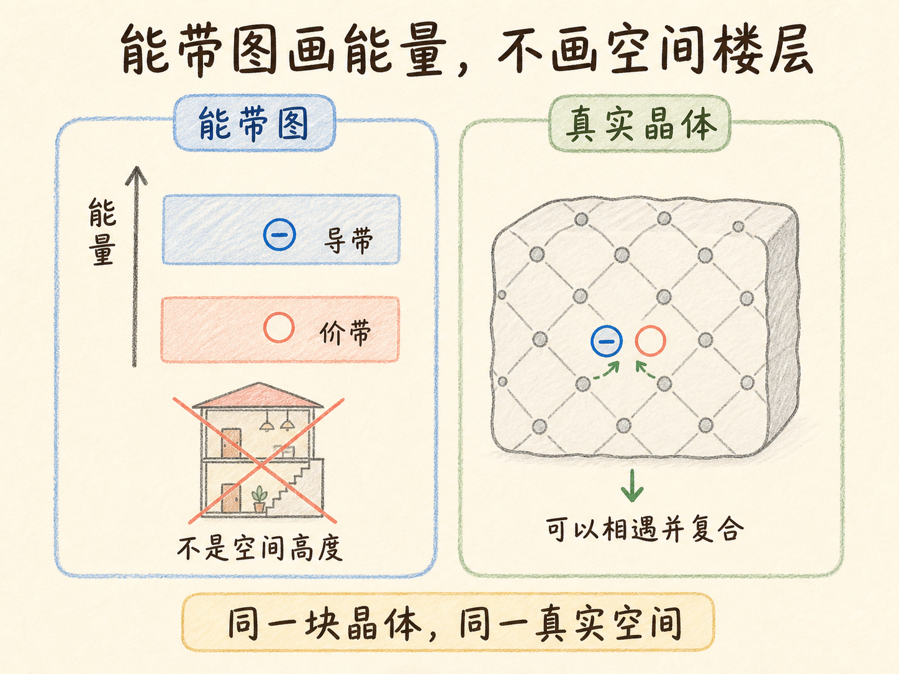
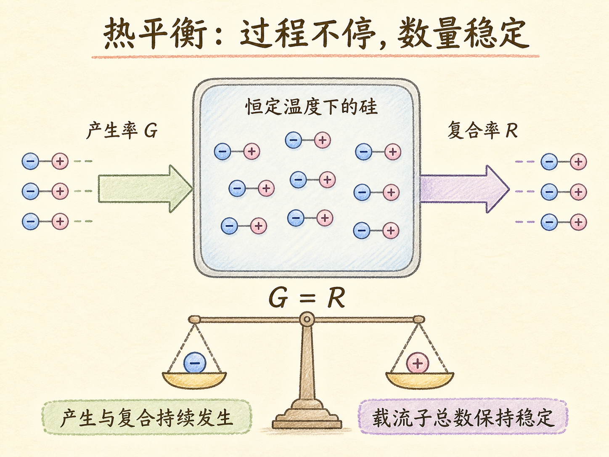
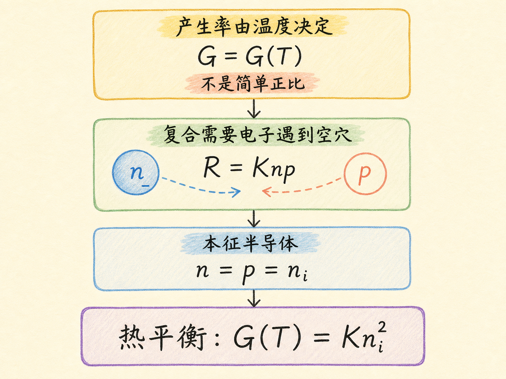
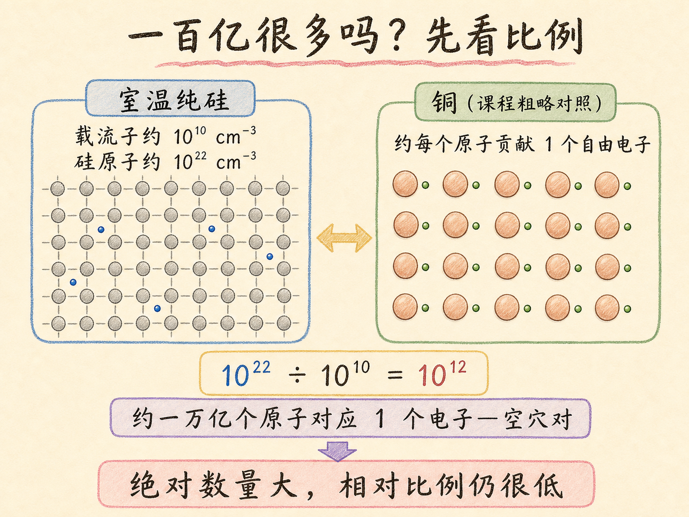

# 载流子不断产生又复合，数量为什么还能保持不变？

室温下的纯硅并不安静。每一刻，都有价带电子吸收热能进入导带，也有导带电子重新落入价带空穴。前一个过程增加自由载流子，后一个过程减少自由载流子。

奇怪的是，只要温度保持不变，电子和空穴的总数就能保持稳定。这里的“稳定”不是所有东西都停止了，而是两股相反过程达到了动态平衡：平均每产生一对载流子，就有一对载流子发生复合。

读完这篇，你会知道

- “产生”为什么没有真的创造新电子
- 电子和空穴为什么能在同一块晶体中复合
- 热平衡为什么是一种动态平衡
- 产生率和复合率分别由什么决定
- 室温纯硅的一百亿个载流子为什么仍然算少

## 什么叫产生，什么叫复合？

价带电子吸收热能，跨过带隙进入导带，就得到一个自由电子；它离开的价带状态同时变成一个空穴。这个过程叫热产生。

“产生”只表示产生了一对自由载流子，并没有创造新电子。那个电子本来就在价带里，只是原先不能自由移动；跃迁后，它进入有空状态可用的导带。

反过来，导带电子若落入一个价带空穴，自由电子不再自由，空穴也被填上。这叫复合。电子本身没有消失，消失的是“自由电子 + 空穴”这一对载流子。

## 能带图上下分层，电子和空穴怎么相遇？

能带图把导带画在上面、价带画在下面，是因为纵向表示能量高低，不是晶体中的空间高度。导带电子不住在“楼上”，价带空穴也不住在“楼下”。

它们都在同一块硅晶体中运动。随机运动让电子和空穴可能靠近；电子一旦落入空穴，就发生复合。读能带图时，把“向上、向下”理解成能量改变，不能理解成载流子在真实空间里爬楼。

## 热平衡为什么不是停止不动？

把一块纯硅保持在恒定温度。热产生仍在持续，电子—空穴对不断出现；复合也在持续，电子—空穴对不断被消除。

如果产生比复合快，载流子总数会增加；如果复合比产生快，总数会减少。只有两种过程平均一样快，总数才能稳定。因此在热平衡时，

$$
\text{产生率}=\text{复合率}。
$$

这是一种“流量相等”的动态平衡，不是两种过程同时停摆。

## 两种速率怎样决定本征载流子数量？

对给定材料，热产生来自热能，可以把产生率写成温度的某个函数：

$$
G=G(T)。
$$

温度升高，热产生通常增多；但课程明确没有把它写成正比例关系。温度变成两倍，不代表产生率也变成两倍。

复合需要电子与空穴相遇。电子数 $n$ 越多，相遇机会越多；空穴数 $p$ 越多，相遇机会也越多。课程用下面的简化关系表示：

$$
R=Knp，
$$

其中 $K$ 是与复合有关的常数。

本征半导体中的电子与空穴成对产生，所以两者数量相等：

$$
n=p=n_i。
$$

在热平衡时令 $G=R$，便得到

$$
G(T)=Kn_i^2。
$$

这条式子把微观上持续发生的产生与复合，连接到了宏观上稳定的本征载流子数量。

## 每立方厘米一百亿个载流子，为什么仍然很少？

课程给出的室温硅本征载流子浓度约为

$$
n_i\approx10^{10}\,\text{cm}^{-3}。
$$

一百亿听起来很大，但同一立方厘米硅中约有 $10^{22}$ 个原子。把两者相比：

$$
\frac{10^{22}}{10^{10}}=10^{12}。
$$

也就是约一万亿个硅原子，才对应一个自由电子—空穴对。课程用铜作粗略对照：铜大约每个原子就能贡献一个自由电子。于是，纯硅里的载流子绝对数量虽大，相对原子总数却极其稀少。

整个过程可以收成一条闭环：温度决定热产生，电子与空穴数量影响复合；热平衡要求两种速率相等，这个条件最终确定了该温度下稳定的本征载流子数量。
