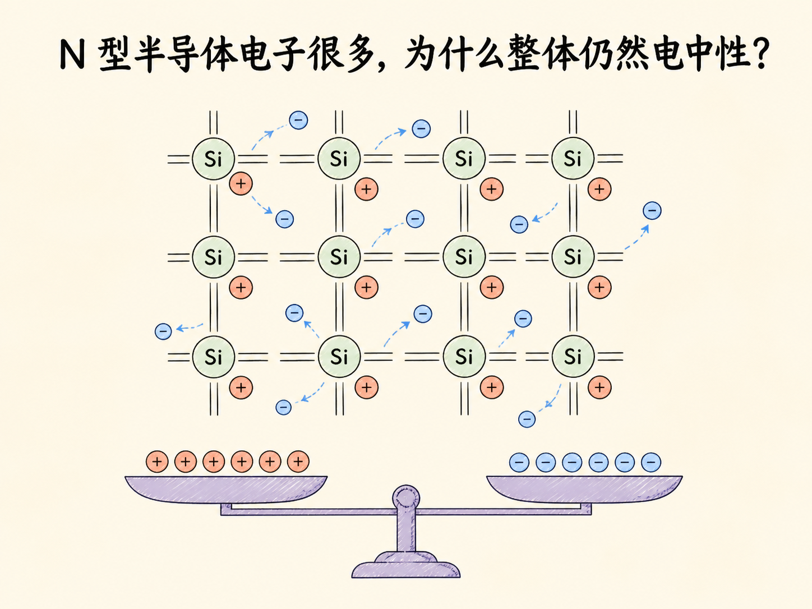
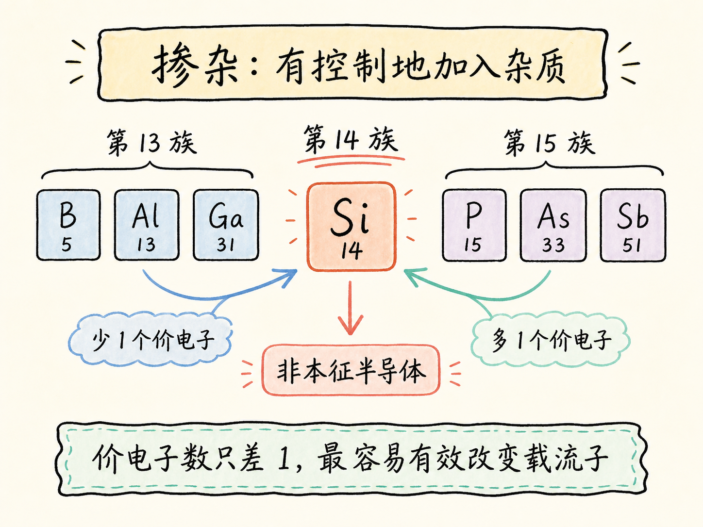
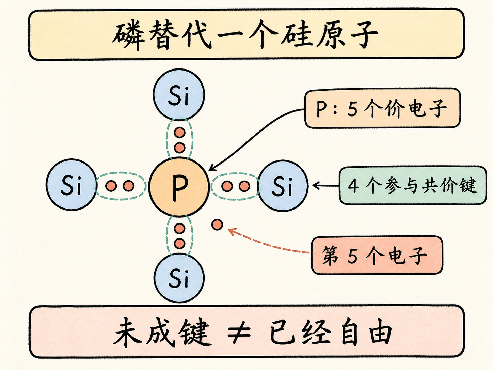
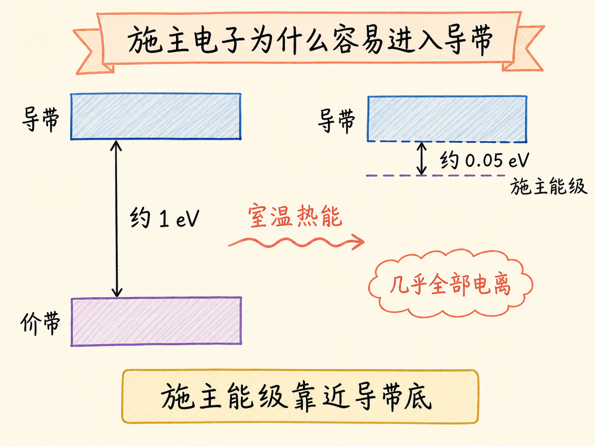
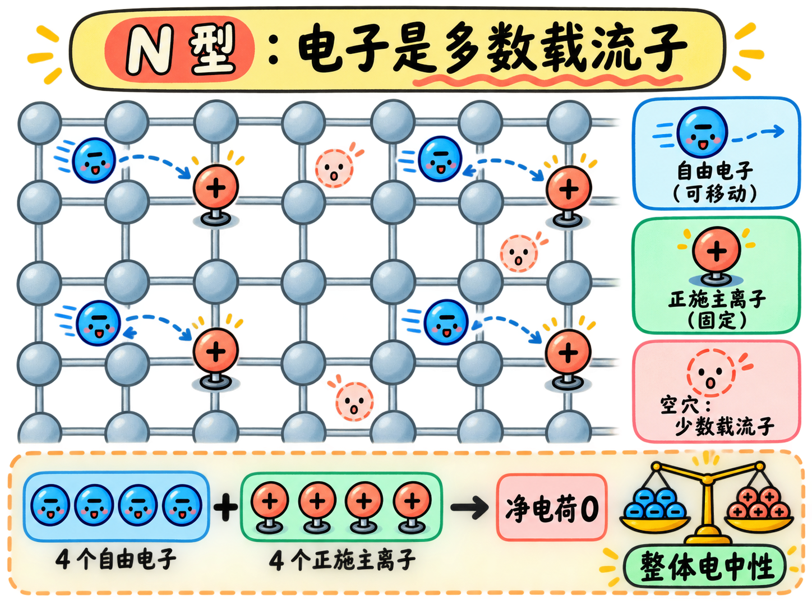
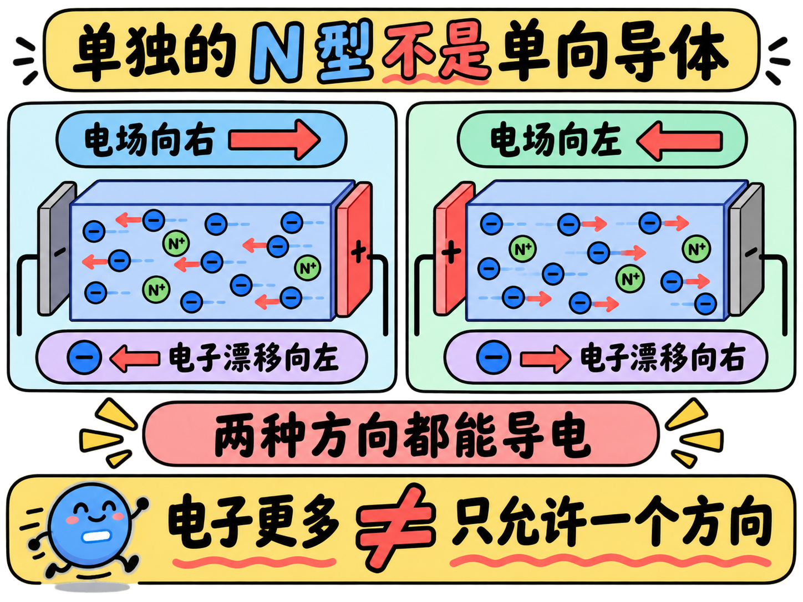

# N 型半导体电子很多，为什么整体仍然电中性？

纯硅中的电子和空穴总是成对出现，数量相等。加入少量磷以后，导带电子却会大量增加，远多于空穴。这个过程叫掺杂，得到的材料叫 N 型半导体。

但“N 型”不等于“带负电”。每个新增的自由电子背后，都留下一个固定的正施主离子。自由负电荷变多了，正负总电荷仍然严格配平。

读完这篇，你会知道

- 掺杂为什么不能随便选择任何元素
- 磷的第 5 个价电子为什么容易进入导带
- 施主能级、施主杂质和 N 型分别是什么意思
- 电子远多于空穴时，材料为什么仍然电中性
- 单独一块 N 型材料为什么还不是单向导体

## 掺杂改变的究竟是什么？

向纯硅中有控制地加入其他元素，叫掺杂；掺杂后的硅叫非本征半导体。要有效改变载流子数量，杂质的价电子结构必须与硅相差得恰到好处。

硅在第 14 族，有 4 个价电子。常用杂质来自相邻的第 13 族或第 15 族：它们分别比硅少一个或多一个价电子。这篇先看第 15 族的磷。

## 磷多出的第 5 个电子为什么还不算自由电子？

一个磷原子替代晶格中的硅原子后，4 个价电子分别与周围硅原子形成共价键，还剩第 5 个电子。

“没有进入这 4 条键”只说明它较容易被释放，不代表它已经在导带中。电子能否自由导电取决于它有没有进入允许移动的导带，因此还要看这个电子所在的能级。

这个能级位于导带底下方，叫施主能级。对于硅中的磷，它距导带底约 $0.05\,\text{eV}$；相比之下，硅的价带到导带约隔着 $1\,\text{eV}$。室温热能更容易让施主电子跨过这段很小的能量差，于是几乎所有磷原子都会贡献第 5 个电子。

## 为什么它叫 N 型，而杂质叫施主？

第 15 族杂质把大量电子送入导带，使电子远多于空穴。电子因此成为多数载流子，空穴成为少数载流子。这种非本征半导体叫 N 型半导体，其中 N 指负电载流子占多数。

磷向导带提供电子，所以磷叫施主杂质；电子被激发前所在的附加能级叫施主能级。两个名称都在描述同一条因果链：施主能级靠近导带，施主电子容易进入导带，电子因此成为多数载流子。

## 电子多了，为什么材料没有带负电？

一个中性磷原子贡献电子后，自身少了一个电子，变成带正电的施主离子。这个正离子留在晶格位置上，不能像自由电子那样漂移。

每出现一个额外自由电子，就同时留下一个固定正离子。两者电荷大小相等、符号相反，所以整块 N 型材料仍保持电中性。N 型只说明可移动载流子的构成，不说明材料净电荷为负。

## 为什么选择第 15 族，而不是价电子更多的元素？

如果只数价电子，第 16 族似乎更划算：每个杂质可能多出两个电子。但决定电子能否贡献导电的，是杂质能级离导带有多远。

第 15 族施主能级非常靠近导带底，室温热能就能让电子进入导带。更高族元素的相关能级更低，额外电子反而更难被激发。选杂质不是“多出的电子越多越好”，而是要让杂质电子足够容易进入导带。

掺杂让 N 型硅比纯硅拥有更多自由电子，却没有赋予它方向选择性。无论电场朝哪边，它都能导电。单独的 N 型材料仍不是单向导体；单向导电要等它与另一种半导体形成结以后才会出现。
