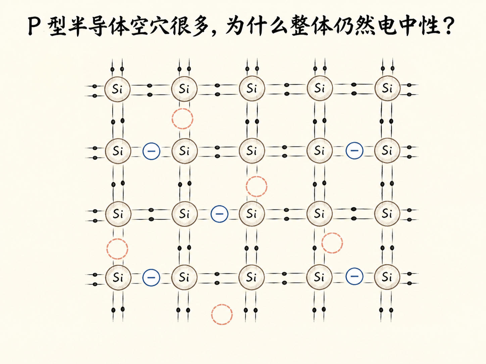
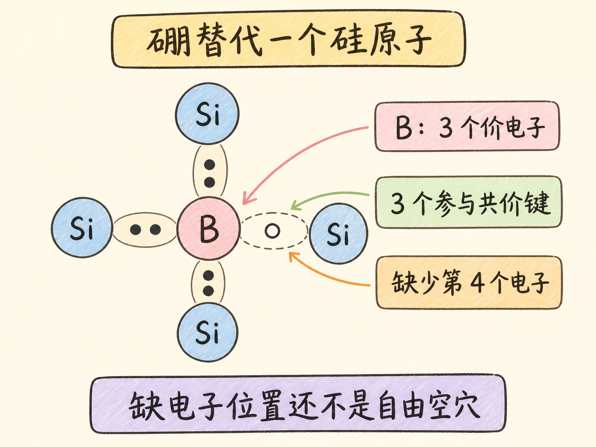
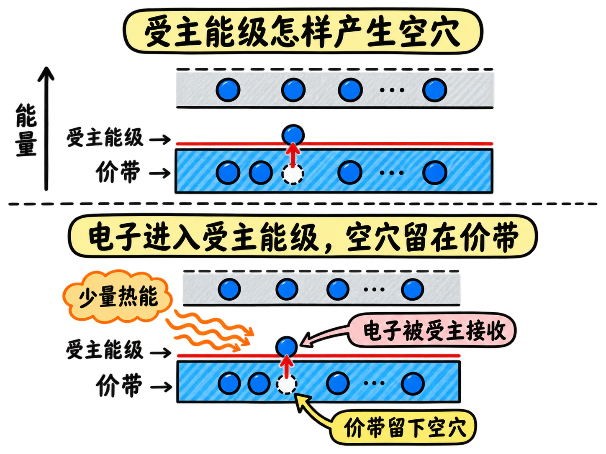
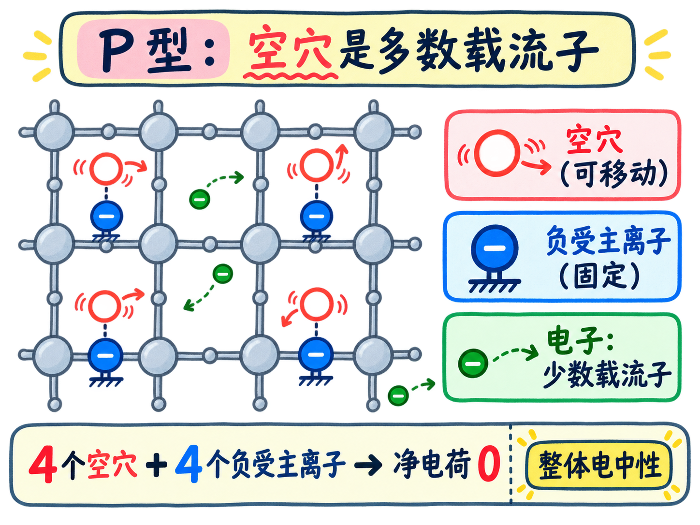
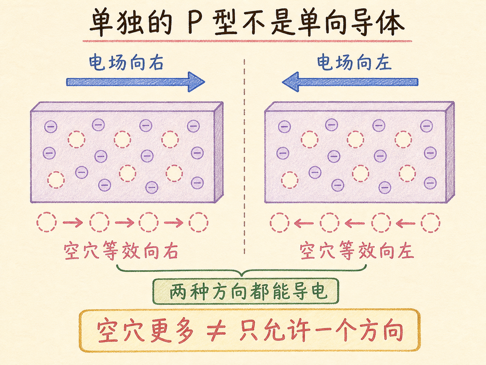

# P 型半导体空穴很多，为什么整体仍然电中性？

在纯硅里加入少量硼，价带中会出现大量空穴，数量远多于自由电子。空穴表现为正载流子，于是这种材料叫 P 型半导体。

但 P 型不是“带正电的硅”。每产生一个额外空穴，硼原子就接收一个电子并变成固定的负离子。可移动正载流子变多了，整块材料的净电荷仍为零。

读完这篇，你会知道

- 硼的 3 个价电子怎样在硅晶格中留下缺电子位置
- 受主能级为什么会让价带产生大量空穴
- 受主杂质、受主能级和 P 型分别是什么意思
- 空穴远多于电子时，材料为什么仍然电中性
- 单独一块 P 型材料为什么还不是单向导体

## 硼替代硅后，少掉的第 4 个电子去了哪里？

硅有 4 个价电子，硼只有 3 个。一个硼原子替代晶格中的硅原子后，它的 3 个价电子能完成 3 条共价键，第 4 条键则缺少一个电子。

这个缺电子位置可以接收邻近电子，但不能把它直接当成已经在价带中自由移动的空穴。电子是否会来填补，取决于这个位置对应的能级。

## 受主能级怎样把空穴留在价带？

硼引入的附加能级位于价带顶上方、而且非常靠近价带，叫受主能级。室温下，价带电子很容易获得少量热能，跃迁到受主能级并填补硼附近的缺电子位置。

电子进入受主能级时没有消失。它离开价带，在价带中留下一个空状态；邻近价带电子可以依次填补这个空状态，使空位在价带中等效移动。这个可移动空位就是空穴。

## 为什么它叫 P 型，而硼叫受主？

每个被电子占据的受主位置，都会在价带留下一个空穴。加入足够多的第 13 族杂质后，空穴远多于热产生的自由电子，成为多数载流子；电子则成为少数载流子。

空穴在电场中沿电场方向等效移动，表现得像正电荷，因此材料叫 P 型半导体。硼接收电子，所以叫受主杂质；它引入的附加能级叫受主能级。

## 空穴多了，为什么材料没有带正电？

中性硼原子接收一个电子后，自身带一个负电荷，成为受主离子。受主离子固定在晶格位置上，不能像空穴那样参与漂移。

每增加一个表现为正载流子的空穴，就同时形成一个固定负受主离子。两者电荷配平，所以整块 P 型材料仍然电中性。P 型描述的是可移动载流子以空穴为主，不是材料拥有正净电荷。

第 13 族之所以有效，也不是因为“缺电子越多越好”。它的受主能级足够靠近价带顶，价带电子在室温下容易进入。其他族即使能提供更多缺电子位置，受主能级若离价带太远，电子也难以填入。

掺杂只让空穴数量增加，没有制造方向选择性。电场向右，空穴向右等效移动；电场向左，空穴也会向左。单独的 P 型材料仍能双向导电，真正的单向特性要等 P 型与 N 型结合后才会出现。
