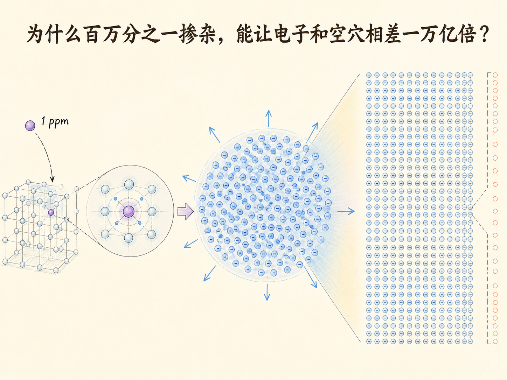
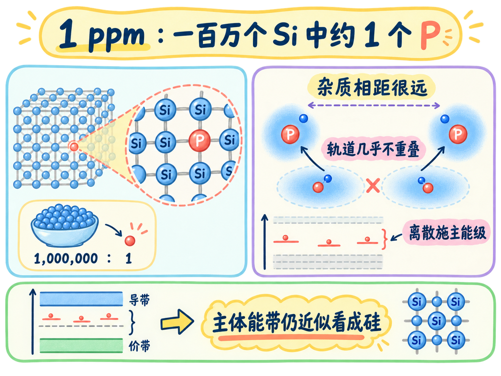
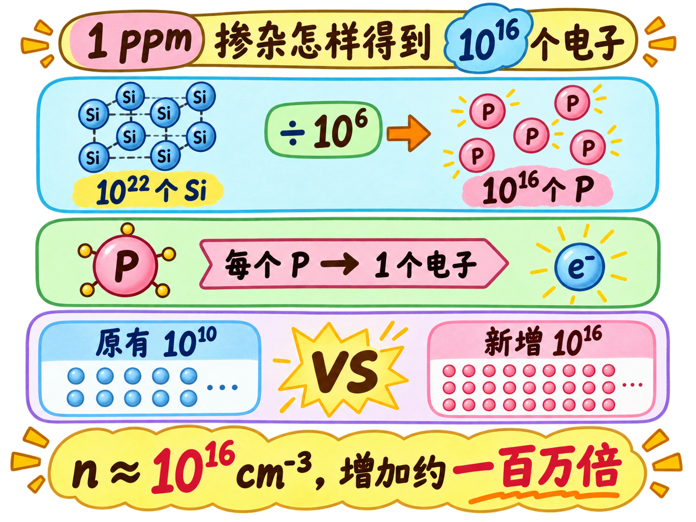
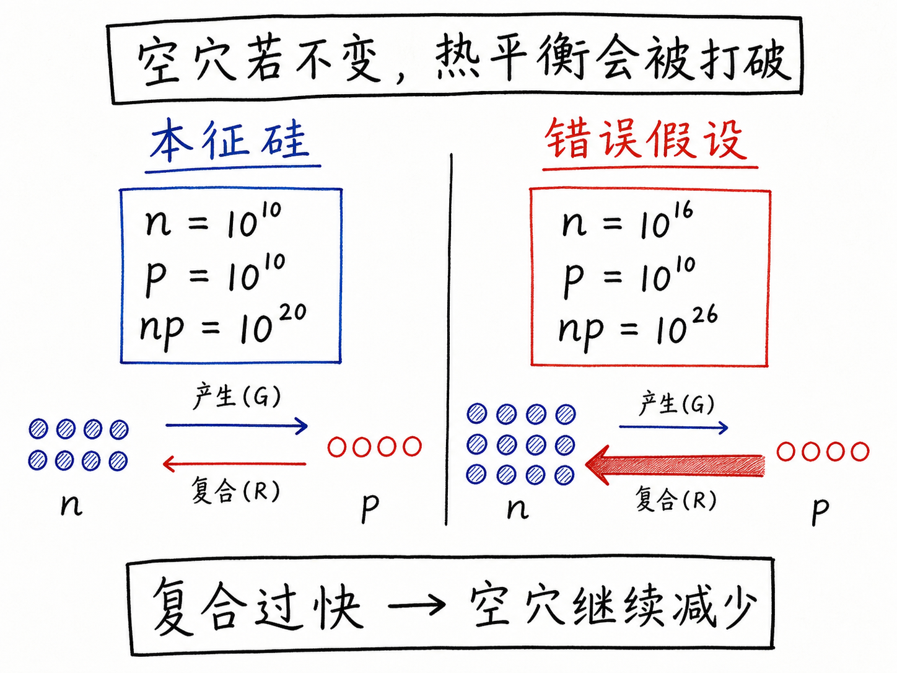
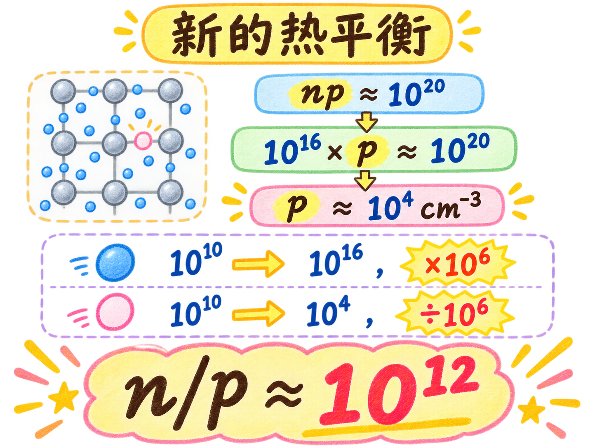

# 为什么百万分之一掺杂，能让电子和空穴相差一万亿倍？

给硅加入约 1 ppm 的磷，也就是大约一百万个硅原子里只有一个磷原子，看起来几乎没有改变材料。但室温下，自由电子能从每立方厘米约 $10^{10}$ 个增到 $10^{16}$ 个，空穴则从约 $10^{10}$ 个降到 $10^4$ 个。

一个增加一百万倍，一个减少一百万倍，最终相差约一万亿倍。这个放大效应来自热平衡：多数载流子增加后，复合会自动压低少数载流子数量。

读完这篇，你会知道

- 杂质加入后为什么还能近似使用硅的能带结构
- 1 ppm 掺杂怎样对应每立方厘米约 $10^{16}$ 个磷原子
- 电子为什么从 $10^{10}$ 增加到约 $10^{16}$
- 空穴为什么不能继续停留在 $10^{10}$
- 热平衡怎样把少数载流子压低到约 $10^4$

## 杂质已经加入，为什么能带还可以看成硅的？

1 ppm 表示大约 $10^6$ 个硅原子中只有一个磷原子。两个磷原子之间隔着大量硅原子，整块晶体从组成上看仍然几乎是硅，所以主体能带可以继续近似使用硅的能带结构。

同样因为磷原子相距很远，它们的原子轨道几乎不发生彼此重叠。施主状态因此可以近似画成单一离散能级，不需要把它画成一条由大量磷状态形成的能带。

## 1 ppm 怎样把电子数推到 $10^{16}$？

一立方厘米硅中约有 $10^{22}$ 个硅原子。按每 $10^6$ 个硅原子一个磷原子计算，磷原子数约为

$$
\frac{10^{22}}{10^6}=10^{16}\,\text{cm}^{-3}。
$$

室温下，几乎每个磷原子都贡献一个导带电子。本征硅原有的电子约为 $10^{10}\,\text{cm}^{-3}$，与 $10^{16}$ 相比可以忽略，于是 N 型硅中

$$
n\approx10^{16}\,\text{cm}^{-3}。
$$

电子浓度增加了约一百万倍。

## 磷只提供电子，为什么空穴也会减少？

如果空穴仍保持 $10^{10}\,\text{cm}^{-3}$，电子和空穴的乘积将从本征状态的约 $10^{20}$ 变成 $10^{26}$。由于复合率与 $np$ 成正比，复合会突然比同温度下的热产生快得多。

电子与空穴于是持续复合。电子数量约为 $10^{16}$，减少少量电子对这个数量级影响很小；空穴原本很少，复合会显著压低它的数量，直到产生率再次等于复合率。

## 热平衡最终把空穴压到多少？

在这节课的室温硅近似中，热平衡要求 $np$ 回到约 $10^{20}$。代入 $n\approx10^{16}$：

$$
p\approx\frac{10^{20}}{10^{16}}=10^4\,\text{cm}^{-3}。
$$

所以，约 1 ppm 的磷让电子增加一百万倍，也让空穴减少一百万倍。两者比例变成

$$
\frac{n}{p}\approx\frac{10^{16}}{10^4}=10^{12}。
$$

这不是磷直接“赶走”空穴，而是电子大量增加后，复合率随 $np$ 上升；热平衡再通过复合把空穴降到新的稳定值。少量掺杂之所以影响巨大，关键就在这条反馈链。
