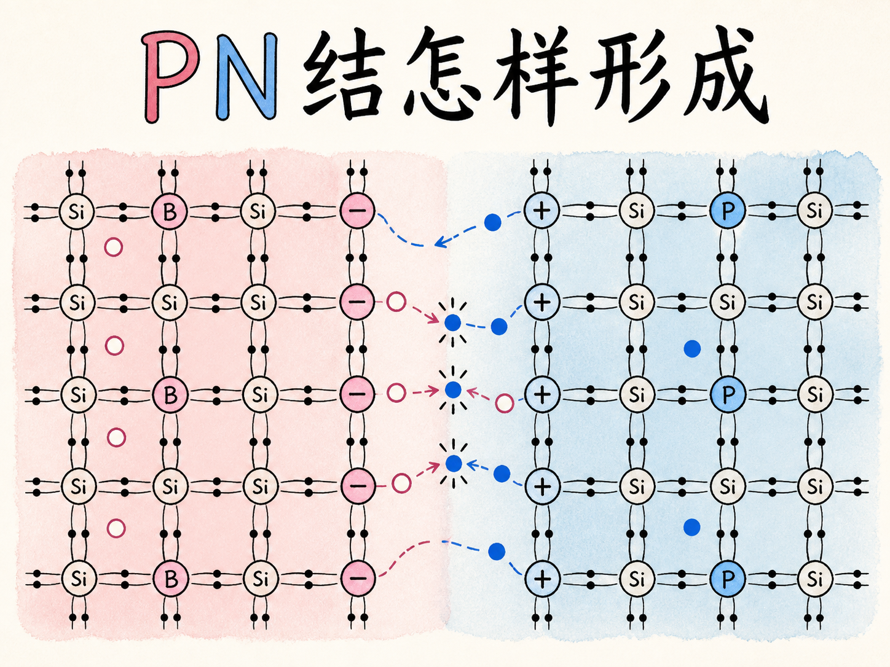
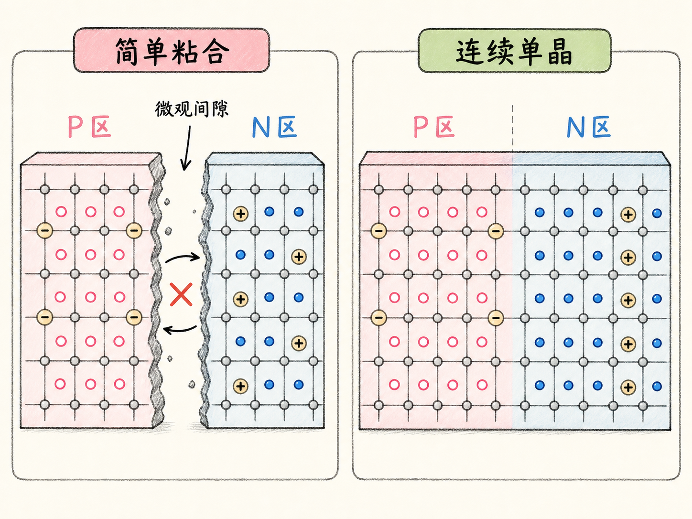
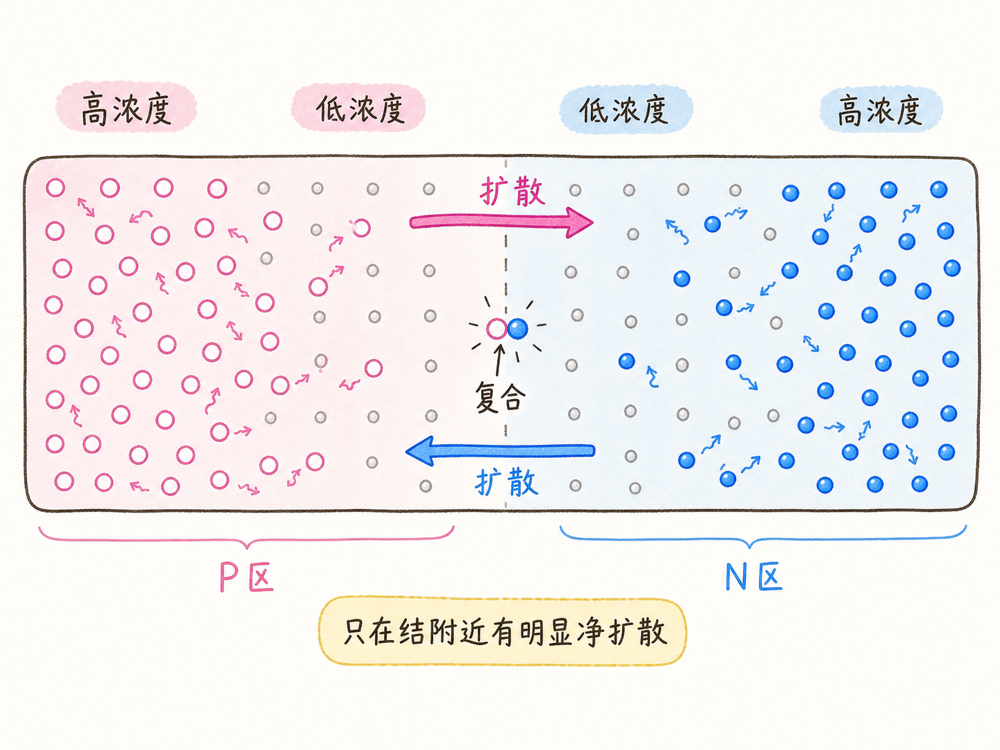
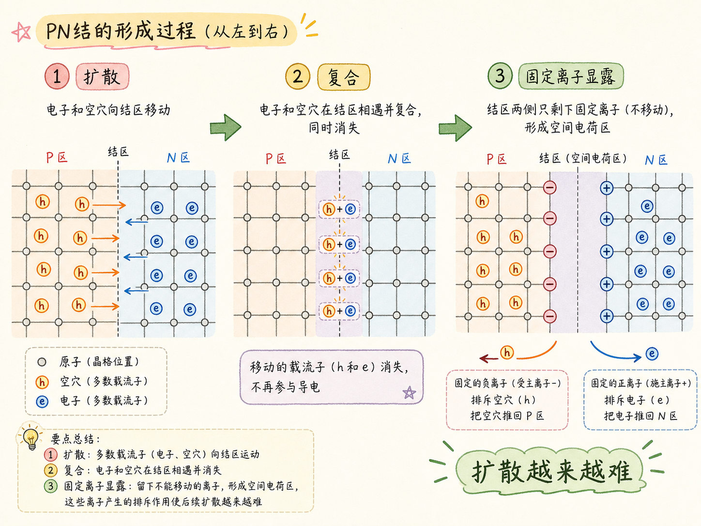
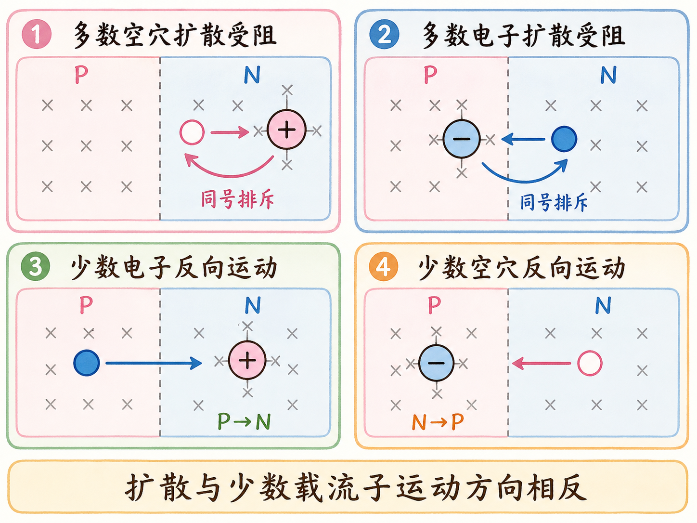
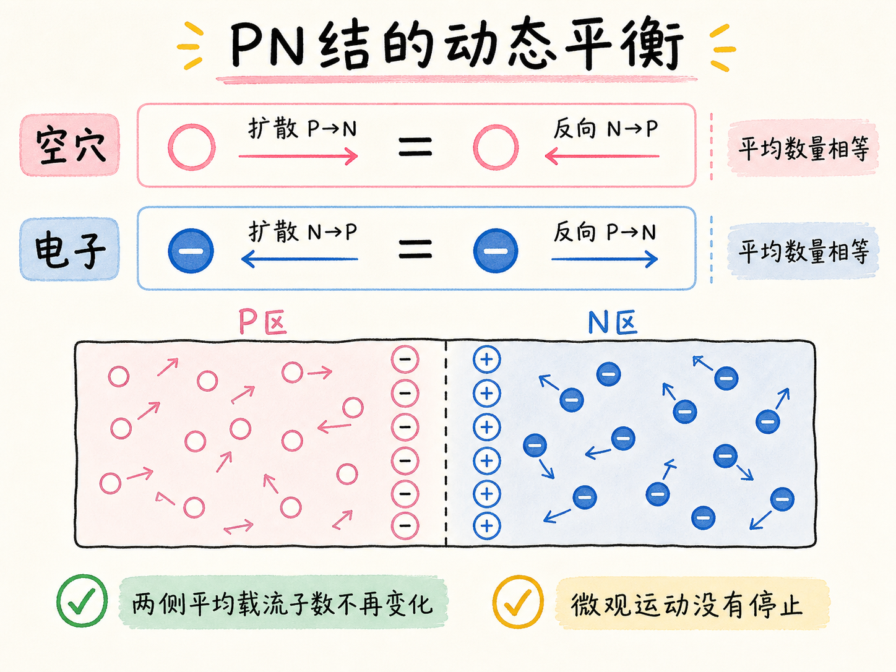

# 把 P 型和 N 型接在一起，为什么载流子不会全部复合？

P 型半导体里空穴很多，N 型半导体里电子很多。把两边做进同一块晶体，电子和空穴会在交界处相遇并复合。照这个趋势发展，它们似乎应该一直混合，直到多数载流子全部消失。

实际情况却是，复合本身会留下固定电荷。这些电荷反过来阻止进一步扩散，同时推动少数载流子朝相反方向运动。两个过程最终互相抵消，形成一个持续存在的 PN 结。

读完这篇，你会知道

- 为什么两块晶体简单粘合不等于形成 PN 结
- 电子和空穴为什么不是靠“异号相吸”开始混合
- 多数载流子的扩散怎样暴露固定杂质离子
- 固定电荷为什么既阻碍扩散，又帮助少数载流子反向运动
- PN 结的平衡为什么是动态平衡，而不是所有载流子停止运动

## 先满足一个条件：P 区和 N 区必须在同一块晶体里

P 型材料可以想成“固定的负受主离子，加上能够移动的空穴”；N 型材料则是“固定的正施主离子，加上能够移动的电子”。每一侧单独看都保持电中性。

如果只是把两块独立晶体粘在一起，接触面仍有大量微观间隙。它们更像两个没有真正打通的容器，载流子不能按后面的机制自由穿过界面。PN 结需要一块连续晶体，只是晶体的一侧掺成 P 型，另一侧掺成 N 型。

## 载流子为什么会跨过交界处？

不是因为空穴像一颗带正电的小球，主动吸引负电子。空穴本质上是共价键里缺少电子留下的空位，不能照搬两个带电小球互相吸引的图景。

真正的起点是浓度差。P 区的空穴浓度高、N 区的空穴浓度低，所以空穴的随机运动产生由 P 到 N 的净扩散。电子则相反，从电子浓度高的 N 区向 P 区净扩散。远离交界处，同一侧的浓度没有这种突变，因而不会出现同样方向明确的净扩散。

## 扩散为什么会给自己造出一道障碍？

扩散过界的电子和空穴在结附近相遇并复合。它们作为可移动载流子消失后，原来被遮蔽的杂质离子就显露出来：N 区一侧留下固定的正施主离子，P 区一侧留下固定的负受主离子。

这些离子锁在晶格中，不能跟着载流子移动，却会影响后来者。N 侧的正离子排斥继续从 P 侧扩散过来的空穴；P 侧的负离子排斥继续从 N 侧扩散过来的电子。

于是出现一条自我加强的反馈链：扩散带来复合，复合暴露更多固定电荷，更多固定电荷又让下一批多数载流子更难扩散。扩散因此越来越慢。

## 既然有障碍，扩散为什么没有彻底归零？

载流子的能量并不完全相同。即使障碍已经形成，仍会有少量能量较高的电子和空穴越过去，随后继续复合并暴露更多固定离子。所以不能把结附近想成一堵让所有粒子瞬间停下的实体墙。

与此同时，少数载流子开始走相反的路。P 区中本来就有少量电子；如果一个电子随机走到结附近，N 侧的正电荷会把它拉回 N 区。N 区中也有少量空穴；如果一个空穴来到结附近，P 侧的负电荷会把它拉回 P 区。

同一批固定电荷，对多数载流子是阻力，对少数载流子却是助力。扩散方向是空穴由 P 到 N、电子由 N 到 P；少数载流子的运动方向恰好相反。

## PN 结怎样达到平衡？

开始时浓度差很强，多数载流子的扩散占主导。随着固定电荷不断增加，扩散越来越困难，反方向的少数载流子运动则越来越重要。

最终，在一段时间的平均意义上，每有一个空穴扩散到 N 区，就有一个空穴向相反方向回到 P 区；每有一个电子扩散到 P 区，也有一个电子回到 N 区。两个方向的数量彼此抵消，两侧载流子的平均数量不再变化。

这就是 PN 结的平衡。载流子仍在随机运动，也仍有少量载流子分别向两个方向越过交界处；停止的是宏观上的净变化，而不是微观运动本身。PN 结之所以不会把多数载流子全部复合掉，正是因为最初的复合亲手造出了限制后续复合的固定电荷屏障。
