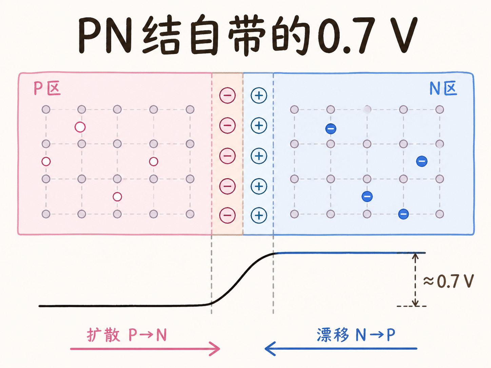
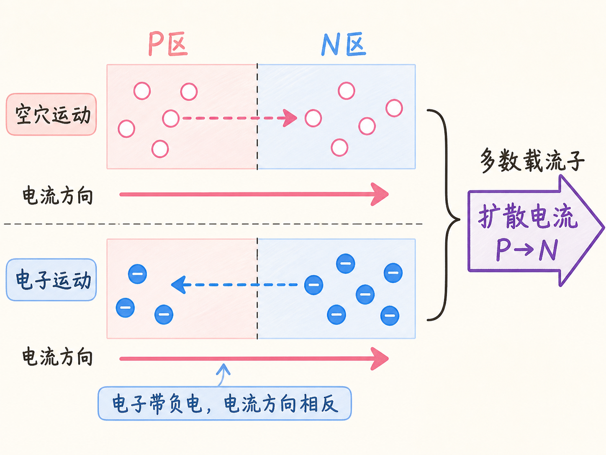
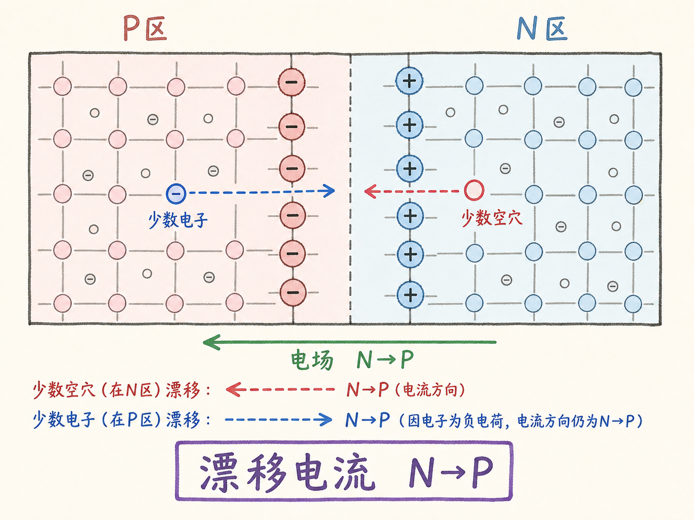
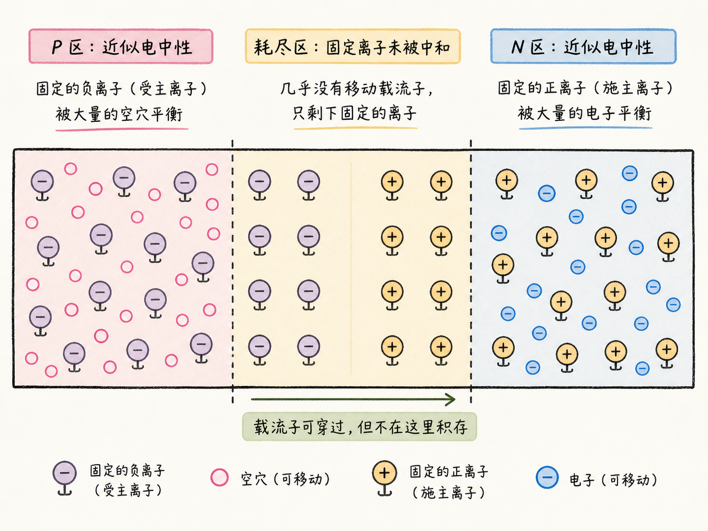
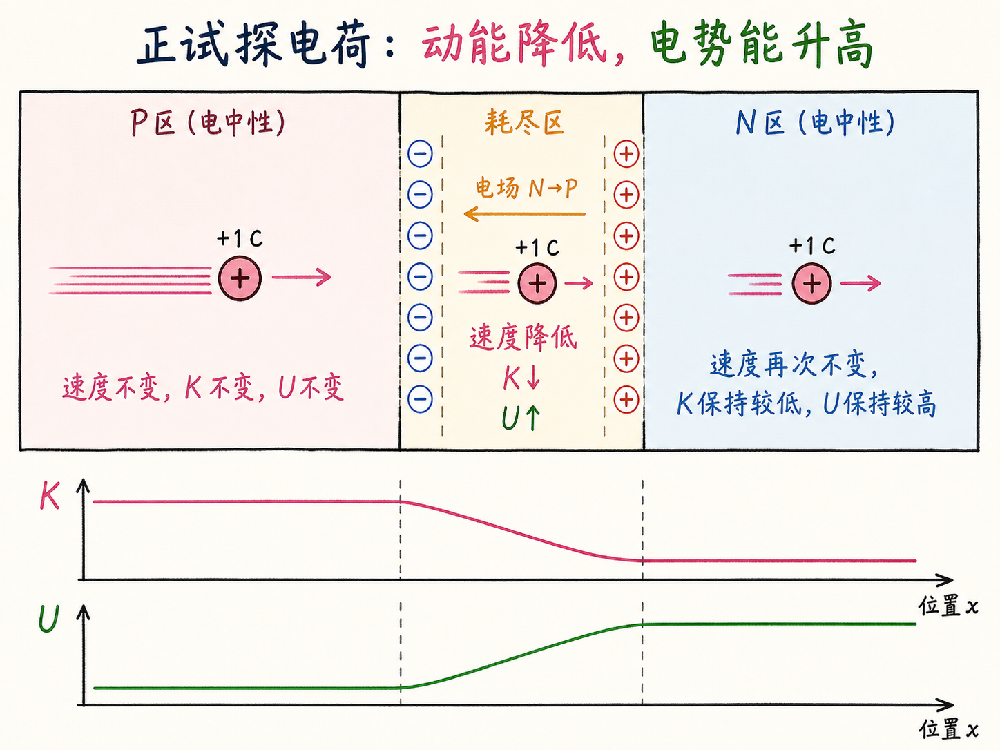
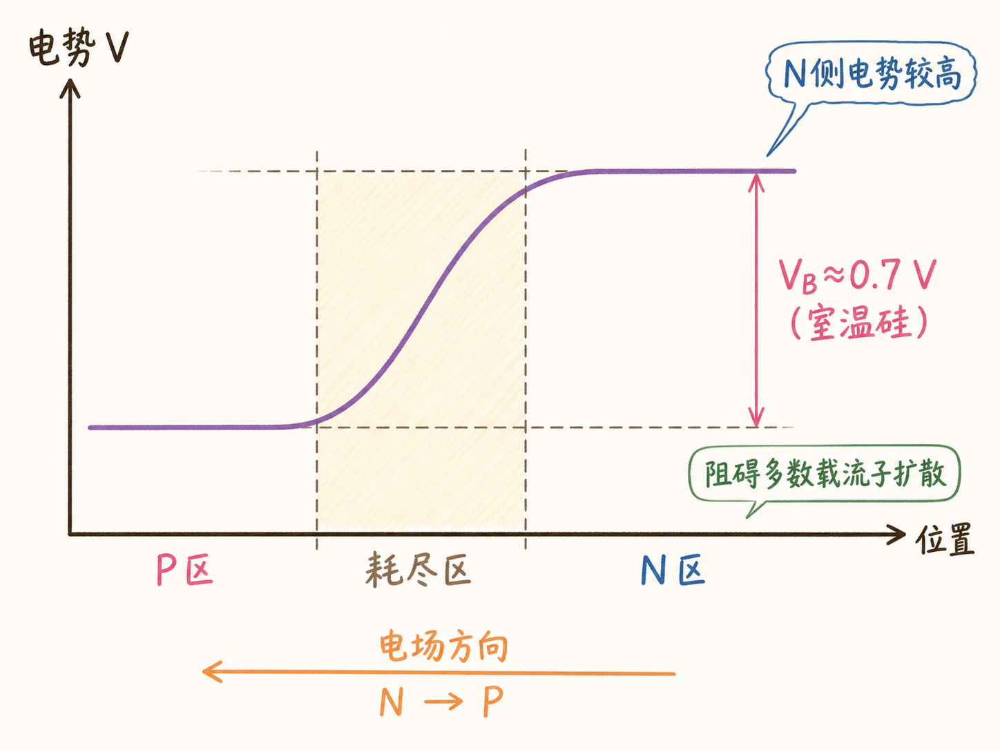

# PN 结没有接电池，为什么会自带约 0.7 V 电压？

一块没有接电池的 PN 结，内部却已经有电场和电势差。对室温硅，课程给出的势垒电压约为 0.7 V，而且 N 侧电势比 P 侧高。

这道电压不是凭空出现的。多数载流子先扩散、复合，留下不能移动的带电杂质离子；固定离子建立电场，电场既驱动少数载流子漂移，也让正电荷从 P 走向 N 时势能升高。势垒电压就是这串过程留下的能量台阶。

读完这篇，你会知道

- 为什么电子向左运动，产生的约定电流却向右
- 扩散电流和漂移电流各由谁产生、方向如何
- 耗尽区为什么带电，却几乎没有可移动载流子停留
- 怎样用正试探电荷的动能变化判断电势高低
- 为什么室温硅 PN 结的 N 侧比 P 侧高约 0.7 V

## 两种载流子都在运动，电流方向怎样判断？

判断电流方向只需要抓住一个约定：正电荷往哪边移动，电流就指向哪边；负电荷移动产生的电流方向与它自身的运动方向相反。

扩散时，P 区的空穴向 N 区移动。空穴按正电荷处理，所以它贡献 P→N 的电流。N 区的电子向 P 区移动，但电子带负电，它贡献的电流方向要反过来，仍然是 P→N。

所以，空穴与电子虽然向相反方向扩散，产生的扩散电流却方向相同，彼此相加。扩散电流由多数载流子形成，方向是

$$
I_\text{diffusion}:\quad P\rightarrow N。
$$

## 漂移电流为什么恰好反过来？

结附近的固定正负离子建立电场，方向从 N 侧的正离子指向 P 侧的负离子，也就是 N→P。带电载流子在电场作用下产生的定向运动称为漂移。

N 区的少数空穴被扫向 P 区，直接贡献 N→P 的电流。P 区的少数电子被扫向 N 区，但负电荷的约定电流方向与运动相反，所以它也贡献 N→P 的电流。漂移电流由少数载流子形成：

$$
I_\text{drift}:\quad N\rightarrow P。
$$

平衡时，扩散电流与漂移电流大小相等、方向相反，总电流为零。零电流不表示载流子停止运动，而是两个持续过程在宏观上正好抵消。

## 耗尽区究竟“耗尽”了什么？

远离结的 P 区近似电中性：固定负受主离子的电荷由可移动空穴补偿。远离结的 N 区也近似电中性：固定正施主离子由可移动电子补偿。

结附近发生过大量复合，可移动电子和空穴不会在这里大量停留，固定杂质离子却仍锁在晶格位置。这段区域因此缺少能够中和固定离子的可移动载流子，呈现出空间电荷，称为耗尽区。

“耗尽”不等于区内从此没有载流子经过。扩散与漂移仍在持续，只是载流子穿过后不会在这里积存。耗尽的是可移动载流子的稳定存量，不是所有微观运动。

## 电场怎样变成电势差？

把电势理解为单位正电荷的电势能。现在想象一个正试探电荷从 P 区向 N 区移动。

在左侧电中性的 P 区，它几乎不受净电作用，速度与动能保持不变，电势能也保持不变。进入耗尽区后，情况改变了：内建电场指向 N→P，与试探电荷的运动方向相反，电场力让它逐渐减速。

总机械能守恒。试探电荷的动能降低，电势能就升高。穿过耗尽区进入 N 区后，净电作用再次接近零，电势能停在一个更高的稳定值。

因此，电势在 P 区近似保持不变，在耗尽区内从 P 向 N 升高，到了 N 区又保持不变。结论是：N 侧电势高于 P 侧。

## 约 0.7 V 的势垒在阻挡什么？

对来源所讨论的室温硅 PN 结，N 侧与 P 侧的内建电势差约为

$$
V_B\approx0.7\,\text{V}。
$$

这就是势垒电压。多数空穴想从 P 区继续扩散到 N 区，多数电子想从 N 区继续扩散到 P 区，都必须克服这道能量台阶。最初的扩散越充分，结附近暴露的固定电荷越多，内建电场和势垒越强，后续扩散就越困难。

所以，PN 结即使没有外接电池，也不是内部“什么都没有”。它同时保持两股大小相等、方向相反的电流，并在耗尽区保存一道内建电势差。约 0.7 V 不是外部电源施加的电压，而是载流子扩散、复合和固定离子暴露后建立的平衡结果。
