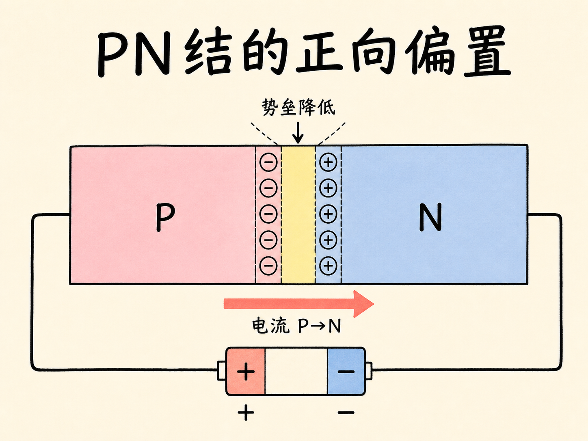
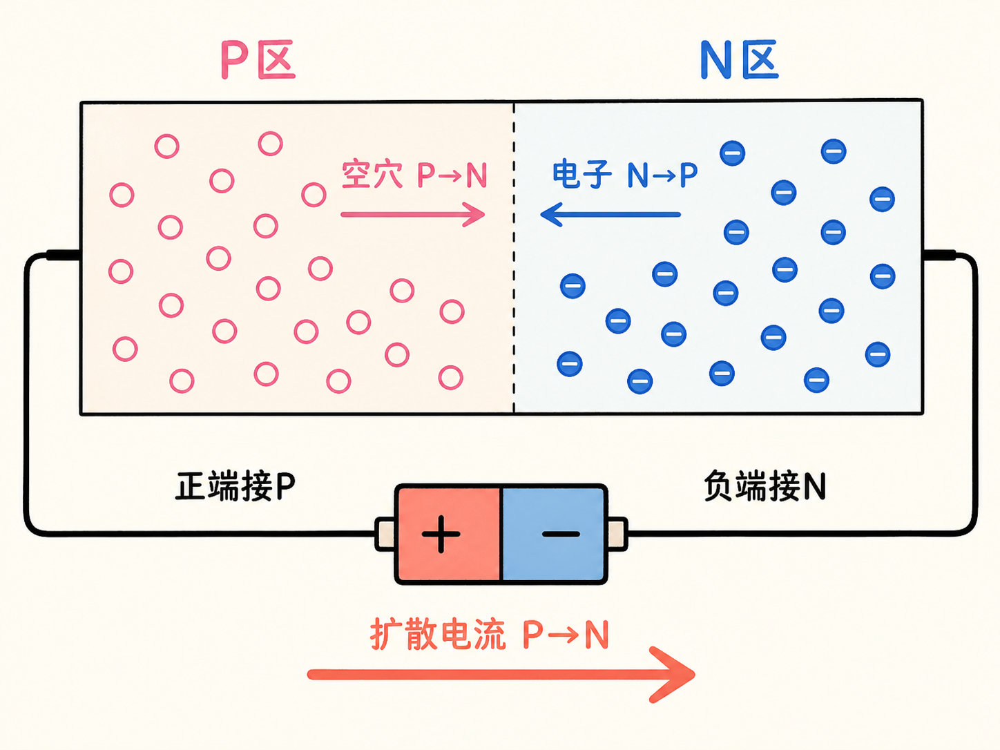
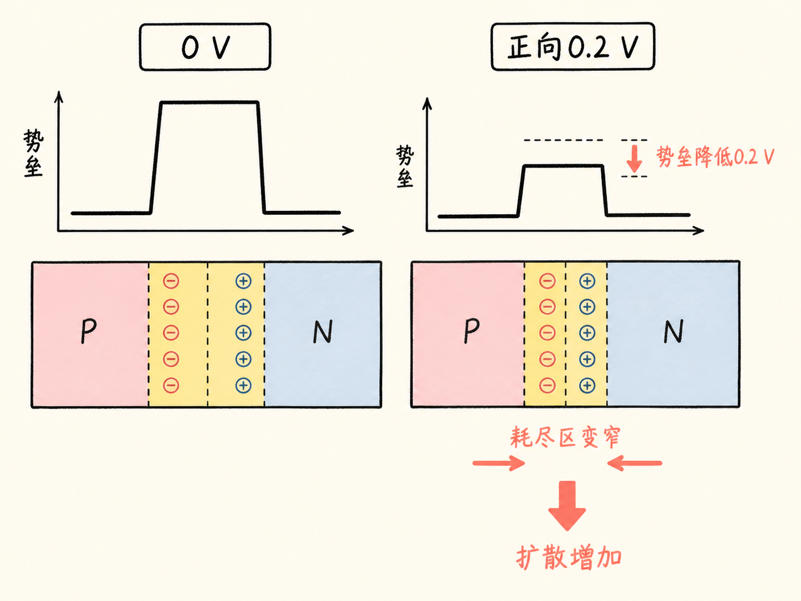
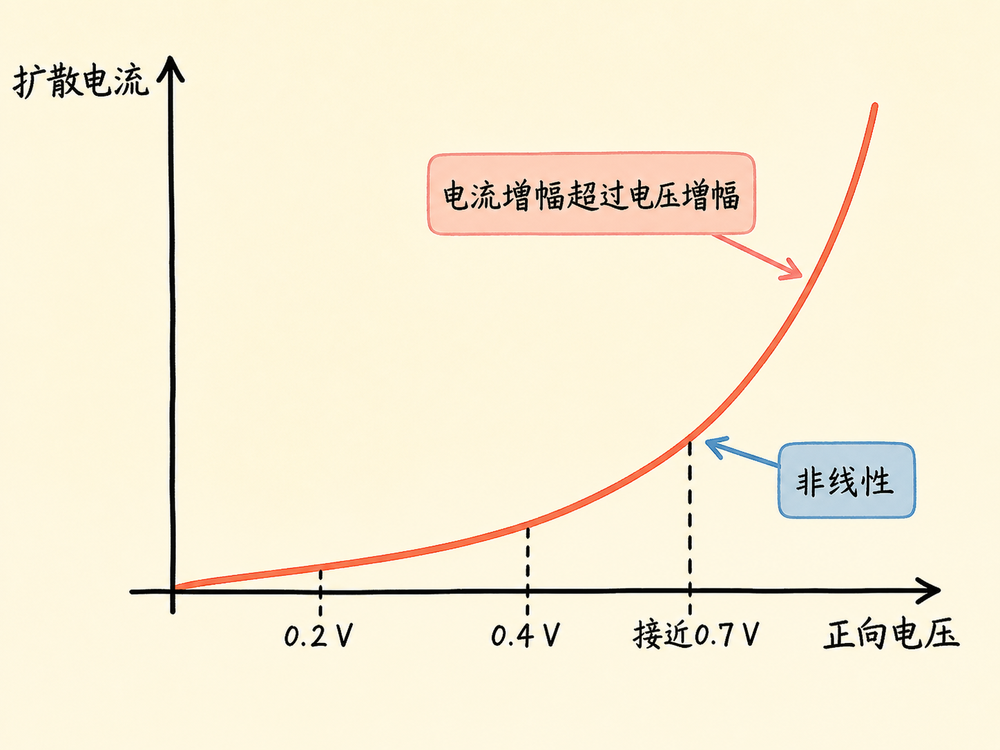
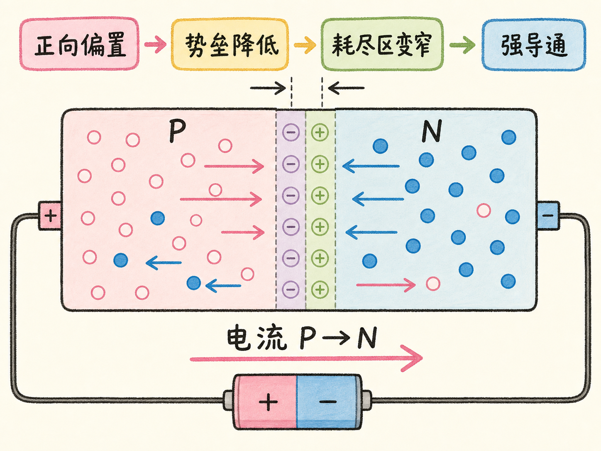

# 正向偏置为什么会让 PN 结突然导通？

没有外接电源时，PN 结内部的扩散电流和漂移电流大小相等、方向相反，总电流为零。把电源正端接到 P 区、负端接到 N 区后，只需逐渐提高电压，电流就会先缓慢增加，随后急剧上升。

电池没有凭空制造一条新通道。它做的是降低原有势垒，让多数载流子更容易跨过结区。

读完这篇，你会知道

- 正向偏置的电源正负端怎样连接
- 外加电压怎样推动空穴和电子靠近结区
- 为什么势垒降低时耗尽区也会变窄
- 为什么扩散电流不是随电压线性增加
- 为什么室温硅在接近约 $0.7\,\text{V}$ 时电流急剧上升

## 正向偏置怎样连接？

正向偏置把电源正端接到 P 区，负端接到 N 区。正端排斥 P 区的多数空穴，负端排斥 N 区的多数电子，两类载流子都被推向结区。

空穴更容易由 P 向 N 扩散，电子也更容易由 N 向 P 扩散。两者贡献的约定电流方向相同，都是 P→N，因此扩散电流增大，电流表开始出现读数。

## 外加电压怎样降低势垒？

平衡 PN 结原本有一道内建势垒。正向电压与这道势垒对抗。加上约 $0.2\,\text{V}$，可以把势垒高度近似看成降低了 $0.2\,\text{V}$；载流子越过结区所需克服的能量随之减少。

势垒降低时，结附近未被中和的固定离子范围也缩小，所以耗尽区变窄。漂移电流会略有变化，但在这套简化近似中可以视为几乎不变；净电流的增加主要来自扩散电流。

## 电压加倍，电流为什么不只加倍？

把正向电压从约 $0.2\,\text{V}$ 提高到 $0.4\,\text{V}$，势垒再次降低，耗尽区再次缩窄。能够越过势垒的多数载流子增加得很快，因此扩散电流会增加到两倍以上，而不是简单翻倍。

这里的核心是非线性：每降低一段势垒，能参与扩散的载流子数量都会明显增加。电压变化相同，越靠近势垒被抵消的位置，电流变化越剧烈。

## 接近约 $0.7\,\text{V}$ 时发生什么？

对课程讨论的室温硅，平衡势垒约为 $0.7\,\text{V}$。当正向电压接近这个数值时，势垒几乎被抵消，耗尽区显著缩窄，多数空穴和电子可以大量跨结扩散，电流急剧上升。

约 $0.7\,\text{V}$ 不是所有 PN 结都精确相同的机械开关点。它是本课室温硅模型中的近似量级。正向偏置的真正机制可以用一条链复述：正端接 P、负端接 N → 内建势垒降低 → 耗尽区变窄 → 扩散电流非线性增大 → PN 结强导通。
