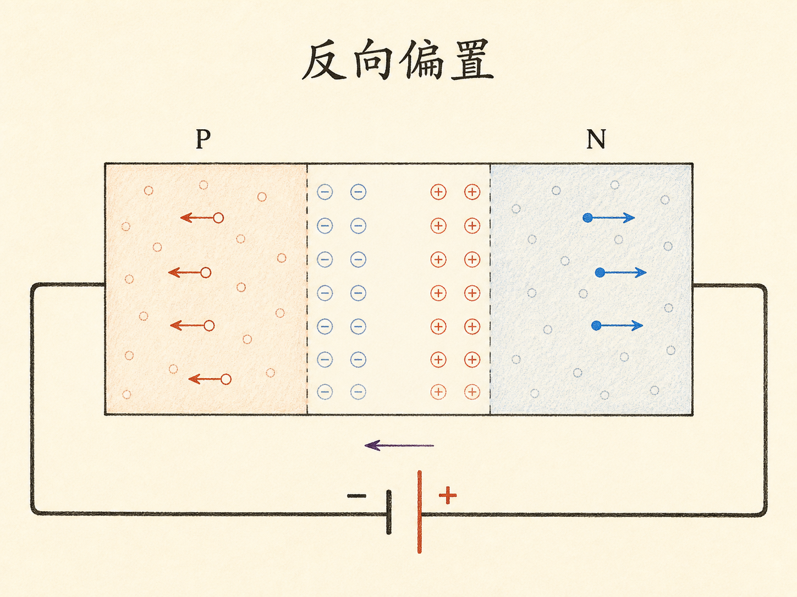
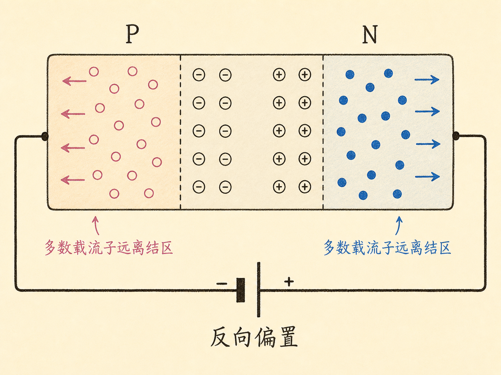
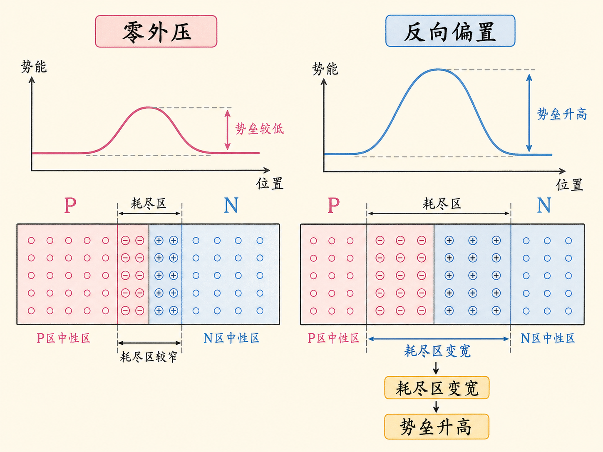
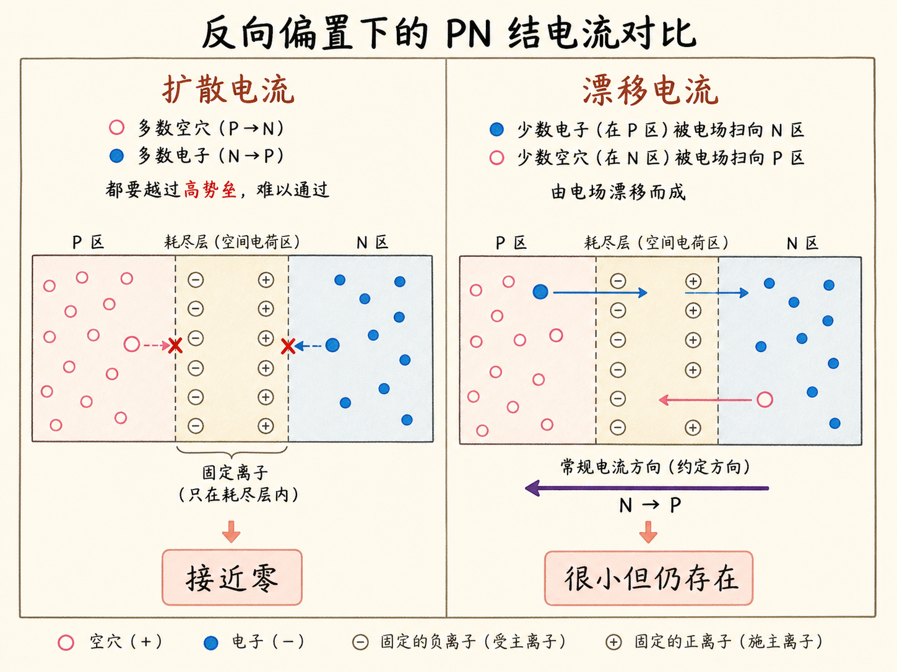
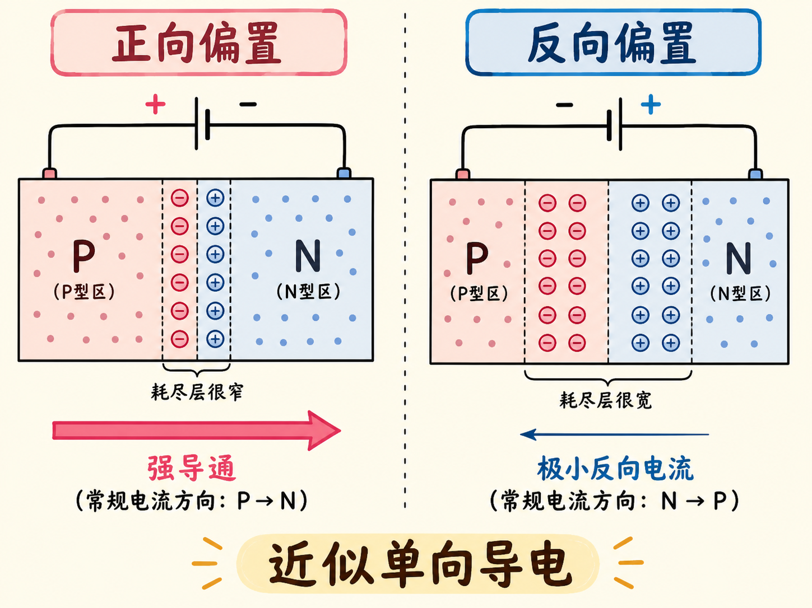

# 反向偏置为什么几乎切断 PN 结电流？

把电池负端接到 P 区、正端接到 N 区，PN 结并不会得到一堵凭空出现的新墙。电池只是把原有的墙加高、加宽：多数载流子更难跨过结区，原本的扩散通道几乎被切断。

但“几乎切断”不等于绝对没有电流。少数载流子仍会被结区电场扫过，留下很小的反向电流。

读完这篇，你会知道

- 反向偏置的正负端怎样连接
- 为什么多数载流子会远离 PN 结
- 耗尽区为什么会变宽、势垒为什么会升高
- 为什么扩散电流接近零而漂移电流仍存在
- PN 结为什么能实现近似单向导电

## 反向偏置怎样连接？

反向偏置把电源负端接 P 区，正端接 N 区。P 区多数载流子是空穴，负端会吸引它们；N 区多数载流子是电子，正端也会吸引它们。两类多数载流子都被拉离结区，而不是被推向结区。

结果是结附近更多受主离子和施主离子失去移动载流子的中和。没有自由载流子的区域向两侧扩展，耗尽区变宽。

## 势垒为什么随反向电压升高？

平衡 PN 结本来就有内建电场和势垒。反向电压与这道内建势垒同向叠加。课程用 $1\,\text{V}$ 举例：加上 $1\,\text{V}$ 的反向电压，可以把多数载流子需要克服的势垒近似理解为又升高了 $1\,\text{V}$。

同一件事有两个视角：空间上看，耗尽区变宽；能量上看，势垒升高。它们不是两个独立现象，而是反向偏置造成的同一结区变化。

## 为什么扩散电流几乎消失？

扩散依赖多数载流子跨过结区。反向偏置既把它们拉离结区，又提高跨结所需克服的势垒，因此空穴 P→N、电子 N→P 的扩散都被强烈压制。势垒足够高时，课程把扩散电流近似为零。

漂移电流却来自少数载流子。偶尔进入耗尽区的少数空穴和电子会被内建电场迅速扫到另一侧。在本节的正常反向偏置范围内，这股电流变化不大，所以当扩散几乎停下后，漂移电流反而成为净电流。

## 为什么说“截止”而不是“绝对断路”？

反向净电流方向是 N→P，与正向偏置的约定电流相反。它依靠的是数量很少的少数载流子，来源给出的量级约比正向电流小一千倍。因此普通观察中，电流表可能几乎不动，PN 结看起来像绝缘体。

准确说法是“几乎截止”：正向偏置降低势垒、增强多数载流子扩散；反向偏置升高势垒、压制多数载流子扩散，只剩很小的少数载流子漂移电流。正是这种强烈的不对称，让 PN 结可以近似只让电流沿一个方向通过。
