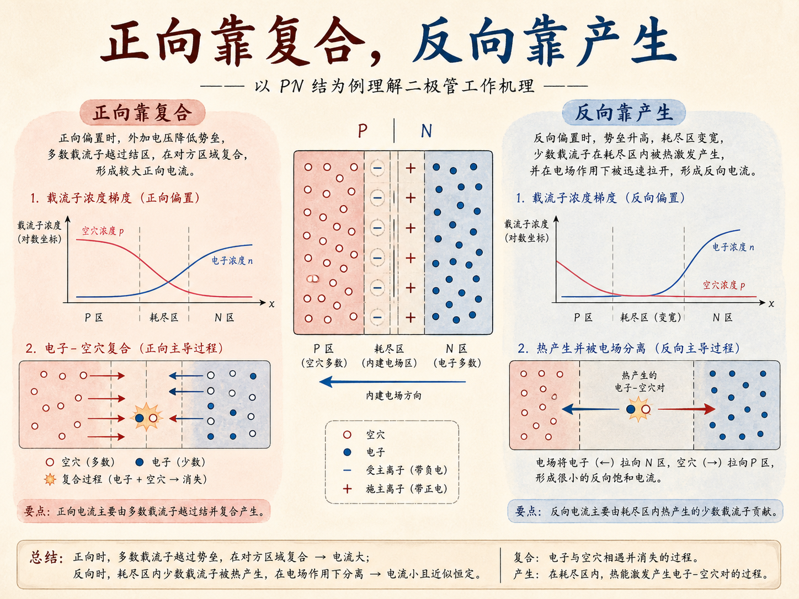
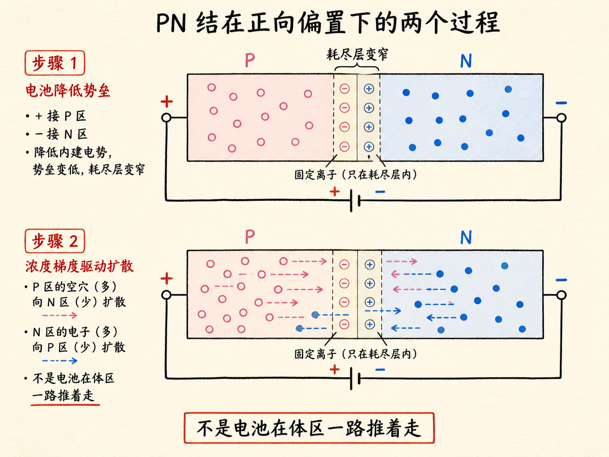
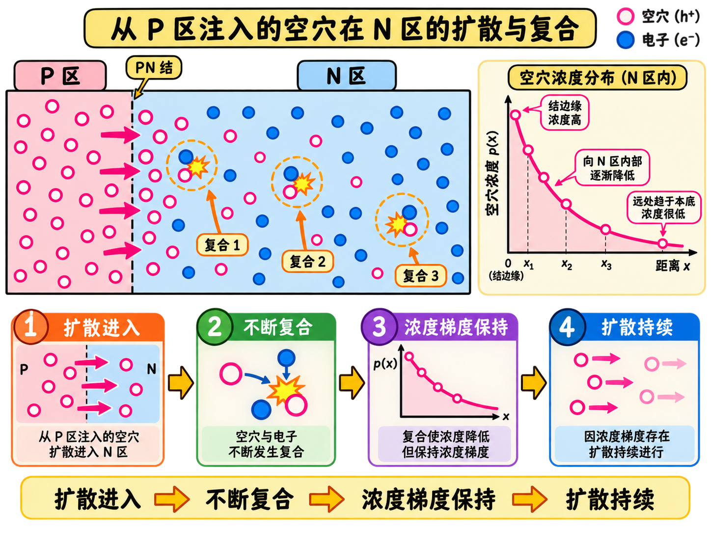
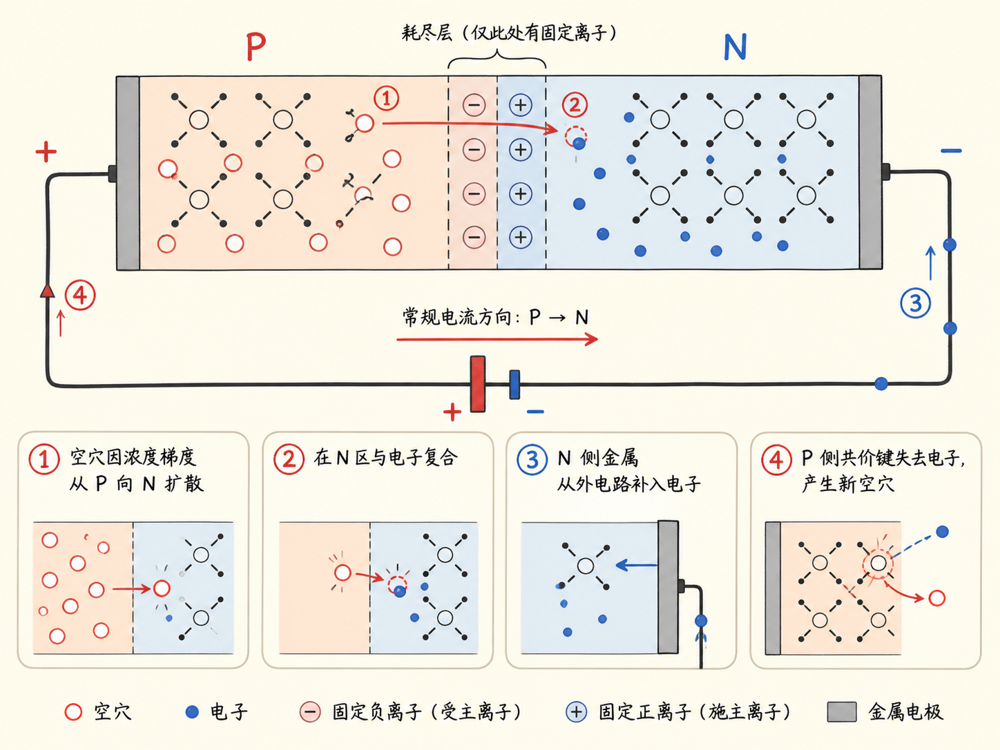
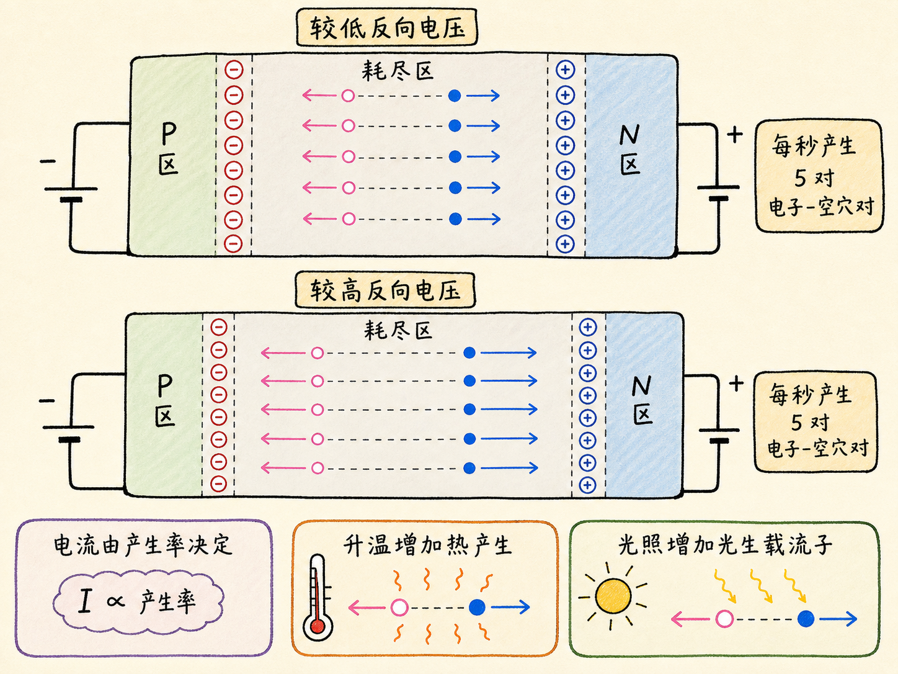

# 正向电流靠复合，反向电流靠产生，是什么意思？

正向偏置时，电池并不是隔着整个半导体一路推着空穴和电子前进。它主要负责降低结区势垒。载流子跨过势垒之后，真正让电流持续的，是“扩散—复合—外电路补充”这条循环。

反向偏置则换了一套限制条件：能被电场扫过的少数载流子，每秒产生多少，几乎就决定了反向电流有多大。

读完这篇，你会知道

- 正向电压在结区真正完成了什么
- 为什么正向扩散不会把浓度差耗尽
- 复合怎样维持持续的正向电流
- 反向电流为什么由耗尽区的载流子产生率控制
- 为什么升高反向电压通常不会明显增加反向电流

## 电池只是“帮忙翻墙”吗？

平衡 PN 结的耗尽区存在内建电场，它阻止多数载流子跨结。接近课程所用的室温硅约 $0.7\,\text{V}$ 正向电压时，外加电压主要是把这道势垒降到载流子能够越过的程度。

空穴越过结区进入 N 区后，那里空穴少、电子多；电子进入 P 区后也面对相反的浓度分布。空穴从高浓度 P 区向低浓度 N 区扩散，电子从高浓度 N 区向低浓度 P 区扩散。跨结后的输运主角是浓度梯度，而不是电池在体区持续推拉。

## 复合为什么没有让电流消失？

看似矛盾的是：复合会消灭电子—空穴对，怎么反而能维持电流？

空穴进入 N 区后，很容易与大量电子复合，所以它越深入 N 区，浓度越低；电子进入 P 区也一样。复合不断移除注入载流子，使结边缘保持较高注入浓度、接触端保持较低浓度。这个浓度梯度不会被扩散填平，扩散因而持续。

因此“复合电流”不是说复合在推着载流子走，而是说复合维持了驱动扩散所需的浓度差。没有复合，浓度最终会趋于均匀，扩散和正向电流都会停下。

## 外部导线怎样接上这条循环？

少量空穴到达 N 侧金属接触后，会得到金属电子并消失。金属少了一个电子，便从外部导线补入一个；这串电子移动一直延续到 P 侧，最终从共价键带走一个电子，等效地产生一个新空穴。

于是，一端消灭一个空穴，另一端补出一个空穴；半导体内部的扩散—复合与金属导线中的电子运动拼成闭合电流。载流子不是同一个粒子绕完整个回路，但电荷传递连续不断。

## 反向电流为什么由“产生”限流？

反向偏置让耗尽区变宽，多数载流子扩散几乎停止。只有少数载流子恰好在耗尽区热产生时，才会被强电场迅速扫到另一侧，形成极小的 N→P 约定电流。

假设耗尽区每秒只产生 5 个空穴。提高反向电压可以让这 5 个空穴通过得更快，却不会自动增加“每秒 5 个”这个数量。电流取决于每秒通过的电荷量，因此在本课的正常反向偏置范围内，它随电压变化很小。

要让反向电流变大，需要增加产生率。升温会增加热产生，光照也能产生更多载流子。可以把两种机制压缩成一句话：正向电流靠复合维持浓度梯度，反向电流靠产生提供可被电场扫走的载流子。
