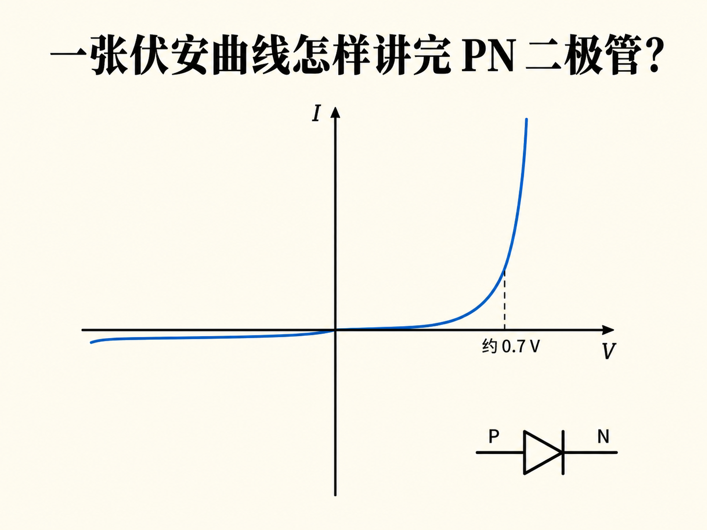
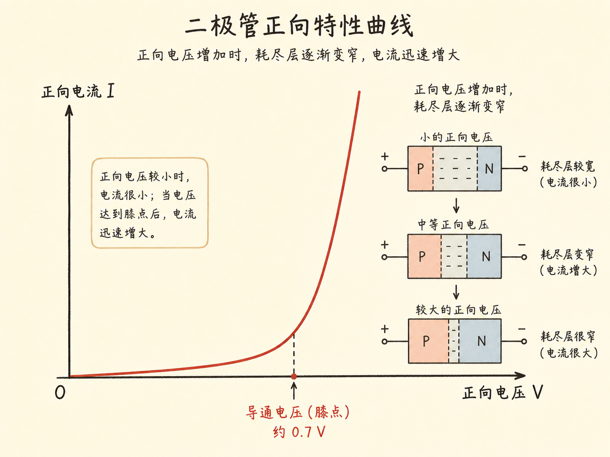
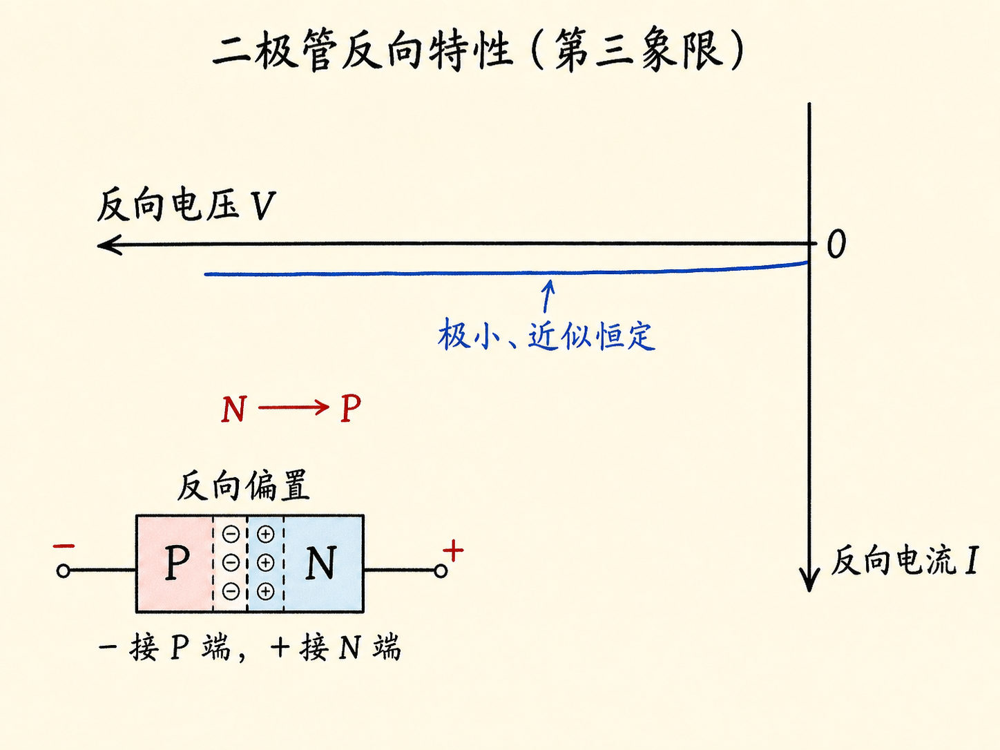
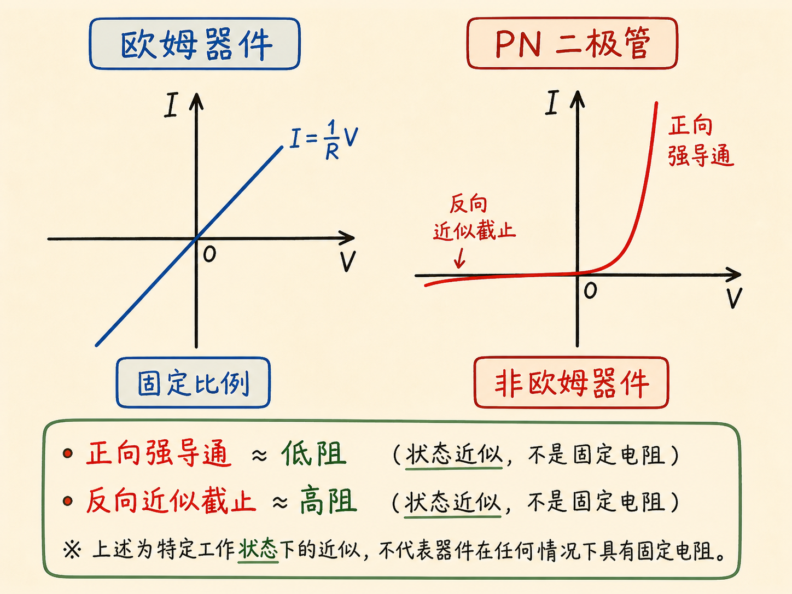
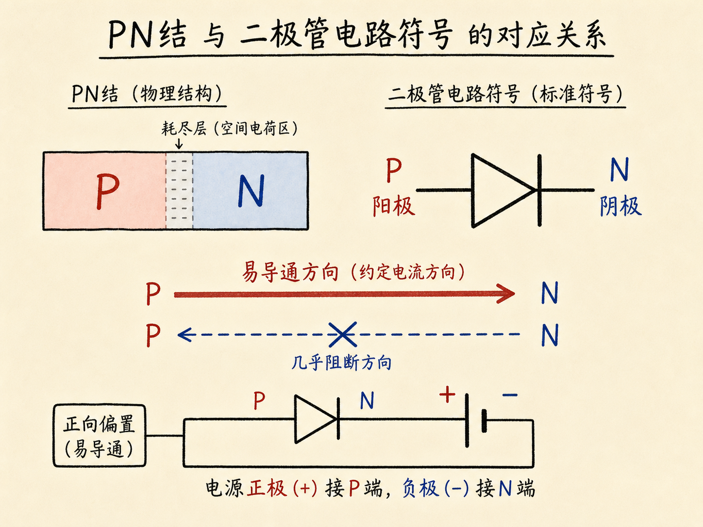

# 一张伏安曲线怎样讲完 PN 二极管？

PN 二极管的全部基础行为，可以压缩进一条 V–I 曲线：横轴是两端电压，纵轴是通过器件的电流。曲线右半边回答“正向加压会怎样”，左半边回答“反向加压会怎样”。

它不是一条直线。正是这种强烈不对称的弯曲，构成了二极管的单向导电性。

读完这篇，你会知道

- 伏安特性图的两个坐标轴分别表示什么
- 正向电流为何在膝点附近急剧上升
- 反向电流为何很小且近似恒定
- 为什么 PN 二极管不是欧姆器件
- 电路符号怎样提示易导通方向

## 正向曲线为什么有一个“膝盖”？

正向偏置把正端接 P、负端接 N，电压和 P→N 约定电流都画在正轴。电压很小时，耗尽区势垒仍明显，电流只缓慢增加。电压继续上升，势垒降低、耗尽区变窄，越来越多多数载流子跨结扩散。

当曲线到达某个拐点后，电流突然变得陡峭。这一位置称为导通电压或膝点电压。课程讨论的硅二极管近似为 $0.7\,\text{V}$：它不是绝对精确的机械开关点，而是曲线开始快速上升的典型量级。

## 反向曲线为什么贴着横轴？

反向偏置把负端接 P、正端接 N，反向电压画在横轴负向，N→P 的极小约定电流画在纵轴负向。多数载流子扩散被抑制，只有少数载流子形成很小的产生电流。

在本课所画的正常反向偏置范围内，提高电压主要让载流子被扫得更快，却不明显增加每秒产生的载流子数。因此曲线贴近零并近似水平。它不是绝对零，只是远小于正向电流。

## 为什么不能给二极管一个固定电阻？

欧姆器件的 V–I 图是直线，电压加倍时电流按同一比例变化。二极管曲线明显弯曲：同一个器件在小正向电压、膝点附近和反向偏置下，电压—电流比例完全不同。

因此 PN 二极管是非欧姆器件，不能用一个固定电阻概括全部工作状态。只能作状态近似：正向强导通时表现为低电阻，反向近似截止时表现为高电阻。

## 电路符号怎样压缩器件行为？

电路图用二极管符号代替完整的 P 区、N 区和耗尽区。P 侧是正向约定电流进入的一端，N 侧竖线像阻挡反向电流的屏障；易导通方向是 P→N。

记住符号时不要把二极管理解成理想单向阀。真实曲线更准确：正向要接近膝点后才出现大电流，反向也仍有极小电流。一张 V–I 曲线同时保留了方向、阈值量级和非线性。
