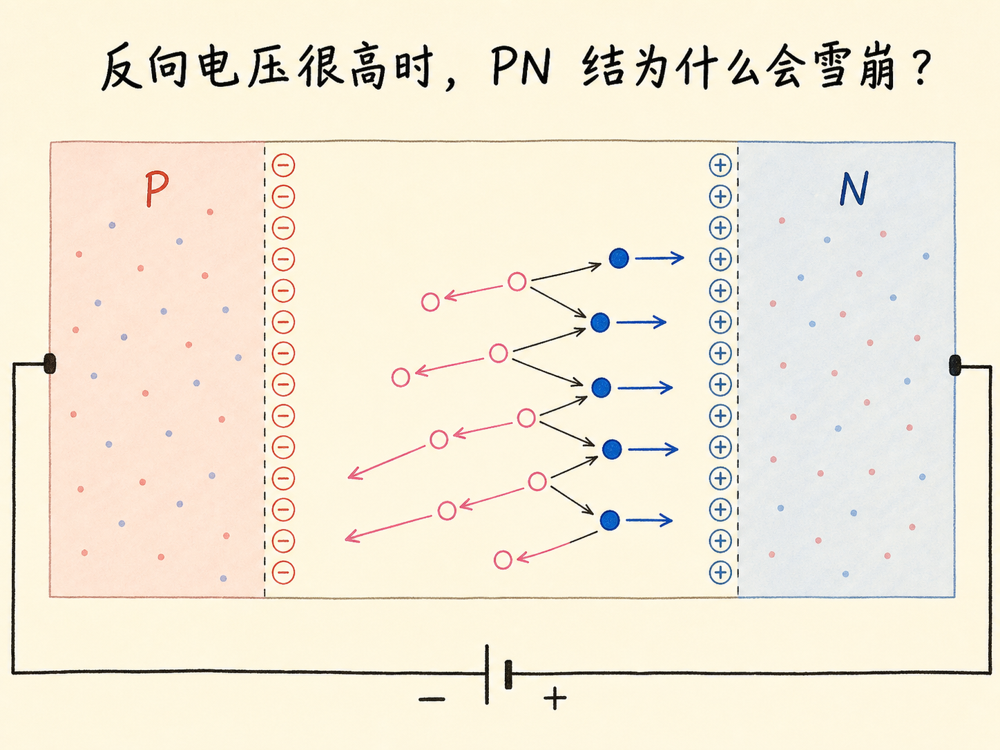
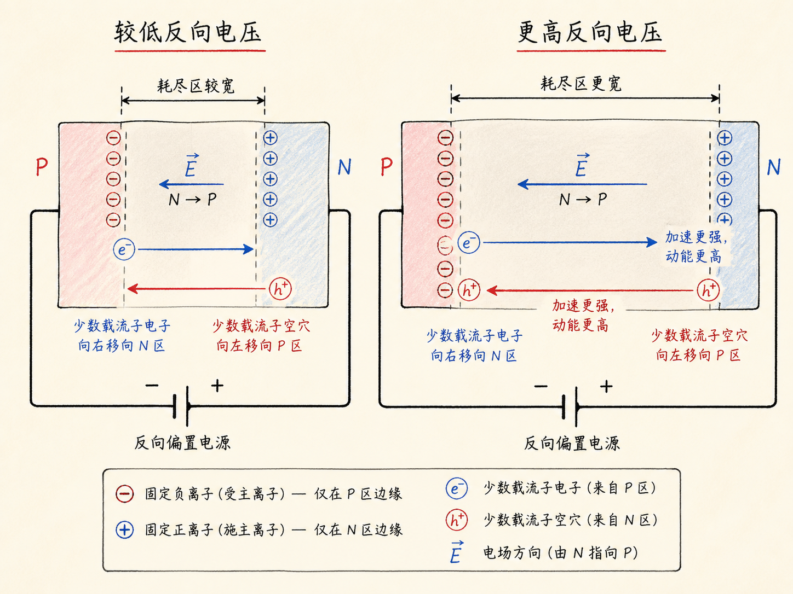
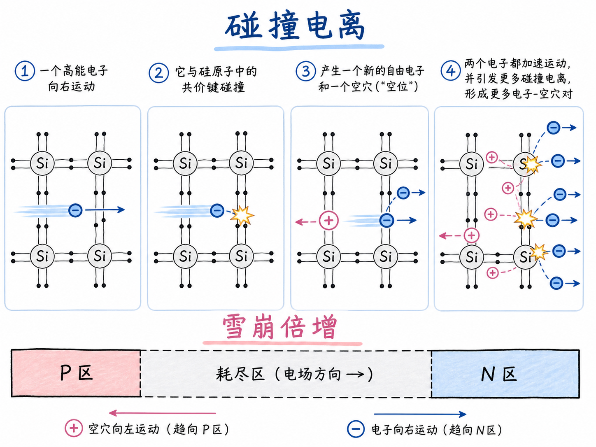
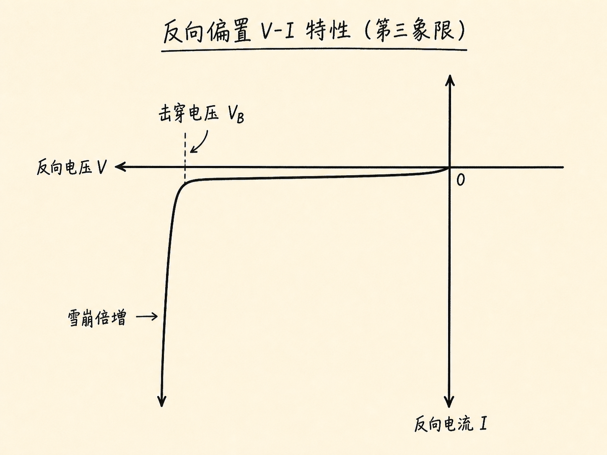
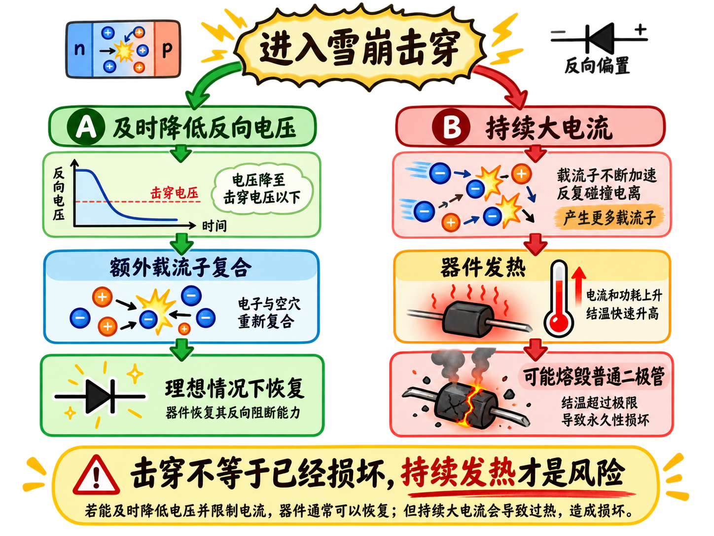

# 反向电压很高时，PN 结为什么会雪崩？

正常反向偏置下，PN 二极管几乎截止。但“几乎截止”有一个工作范围：反向电压继续升高到某个临界区域，原本极小的电流会突然急剧增加。

这不是多数载流子忽然翻过势垒，而是一连串碰撞把新的电子—空穴对成倍制造出来。

读完这篇，你会知道

- 反向电压升高怎样改变耗尽区电场
- 高能电子怎样碰撞产生电子—空穴对
- 为什么一个载流子能触发雪崩倍增
- 击穿电压在 V–I 曲线上怎样出现
- 击穿为什么不一定等于永久损坏

## 反向电场怎样给载流子加速？

反向偏置把负端接 P、正端接 N。电压不高时，耗尽区内偶尔产生的少数电子向 N 侧运动，少数空穴向 P 侧运动，只形成极小电流。

反向电压继续增加，耗尽区变宽，电场也增强。载流子穿过耗尽区时获得更多动能。电场没有直接创造更多载流子，但它把已有载流子加速成了能够触发碰撞的“种子”。

## 一次碰撞怎样变成连锁倍增？

高速自由电子撞上硅原子的共价键时，如果动能足够大，就能把键中的电子撞入导带，并留下一个空穴。一次碰撞于是增加一个自由电子和一个空穴。

两个自由电子继续被电场加速，再撞出新的电子—空穴对。载流子数可以由一变二、由二变四，短时间内成倍增长。它像小雪块滚落后带动更多积雪，因此称为雪崩效应；真实机制仍是电场加速后的碰撞电离。

## 击穿电压在曲线上意味着什么？

反向 V–I 曲线起初贴近横轴，电流很小且近似恒定。当反向电压达到某个值，雪崩倍增变得显著，反向电流突然陡增。这个转折对应击穿电压。

“击穿”表示原有反向截止状态被载流子倍增打破，不等于器件已经断裂。对普通二极管，额定击穿电压给出了必须回避的反向工作边界；来源中的 7 V 只是举例，不是通用数值。

## 为什么真正危险的是发热？

如果及时把反向电压降到击穿值以下，额外电子和空穴可以复合，理想情况下二极管会恢复原来的反向特性。雪崩过程本身不必然留下永久损伤。

危险在于击穿电流很大。大量载流子碰撞会产生热，持续工作可能使温度不断上升，最终熔毁普通二极管。机制链可以压缩为：反向电压升高 → 电场增强 → 碰撞产生载流子 → 雪崩倍增 → 电流陡增 → 持续大电流引发过热风险。
