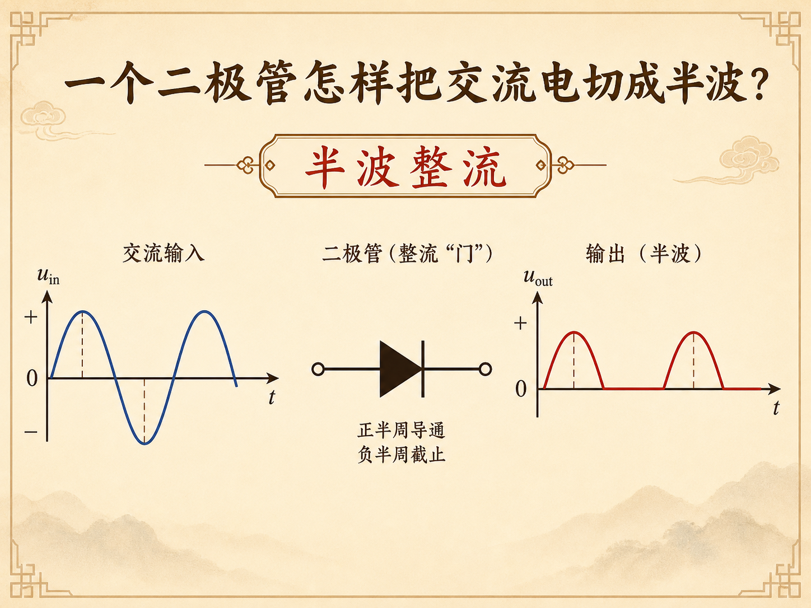
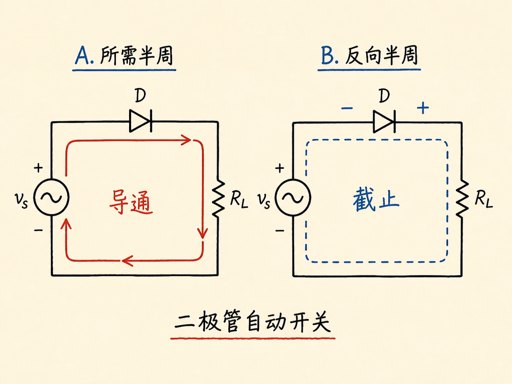
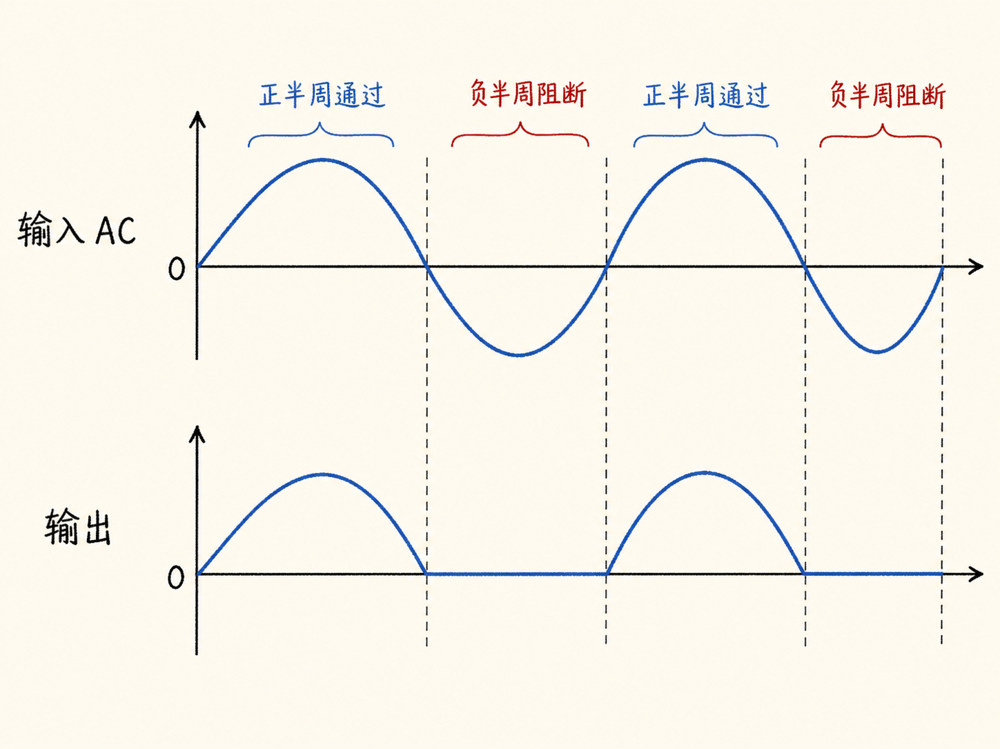
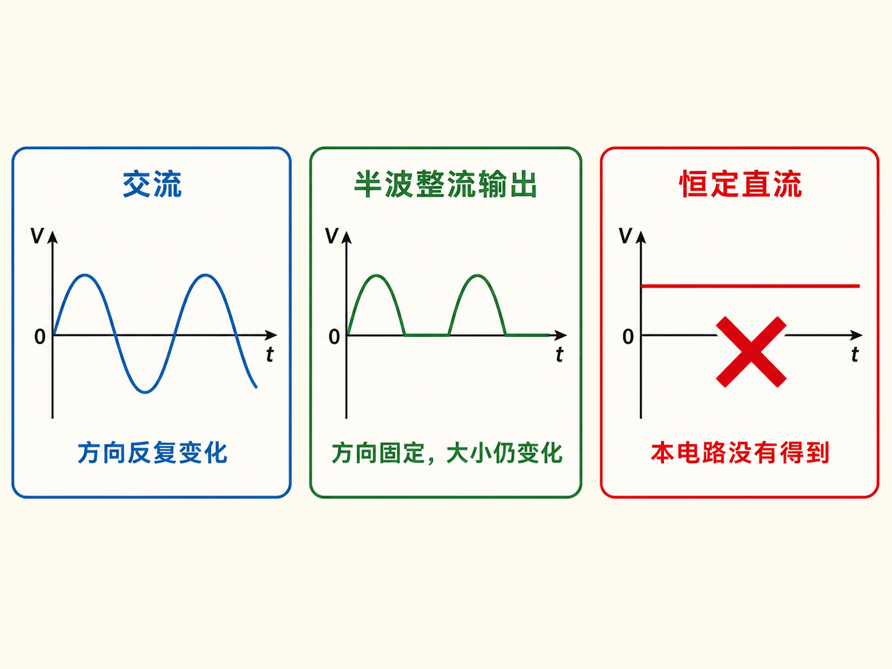
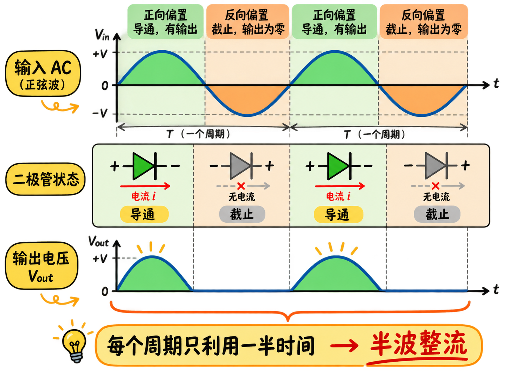

# 一个二极管怎样把交流电切成半波？

交流电的问题不只是电压可能太高。它的方向会周期性反转：一个半周给电池充电，另一个半周又沿相反方向流动。变压器可以降低电压，却不会把交流变成单向电流。

一个二极管能像自动开关一样，只放行所需的半个周期。

读完这篇，你会知道

- 为什么降压之后仍不能直接给电池充电
- 二极管怎样替代高速人工开关
- 哪个半周导通、哪个半周截止
- 半波整流后的波形长什么样
- 为什么半波整流只利用一半时间

## 二极管怎样变成自动开关？

假设我们只想保留顺时针电流。人工方案是在顺时针半周闭合开关，在逆时针半周断开，但交流变化太快，无法靠人操作。

把二极管沿所需电流方向串入回路后，顺时针半周使它正向偏置，二极管导通；电流反向时，二极管变成反向偏置，几乎截止。器件自身的伏安特性完成了自动开关，不需要外部控制信号。

## 输入和输出波形怎样对应？

没有二极管时，输入电流随时间在零线上下交替。把顺时针方向记为正，波形先出现正半周，再出现负半周，然后周期性重复。

加入二极管后，正半周仍沿正向通过，输出复制输入的正半个正弦；负半周试图反向流动，二极管截止，输出变成零。每个周期于是只留下一个同方向脉冲。

## 这已经是直流了吗？

从方向看，输出不再变号，可以称为整流后的直流输出；从大小看，它仍在“正脉冲—零—正脉冲—零”之间变化。因此更准确的名称是单向脉动电流，不是恒定平滑的直流。

把交流变成单向输出叫整流，这个单二极管电路就是整流器。

## 为什么叫“半波”整流？

每个交流周期有两个半周，电路只使用其中一个，另一个半周完全关闭，所以叫半波整流器。它结构简单，却让负载有一半时间得不到电流，来源用充电过程说明这种时间浪费。

完整适配器还包含降压与其他电路，但本节只抓住整流机制：交流换向 → 二极管正反偏交替 → 一个半周通过、另一个半周被阻断 → 输出成为同方向的半波脉冲。
