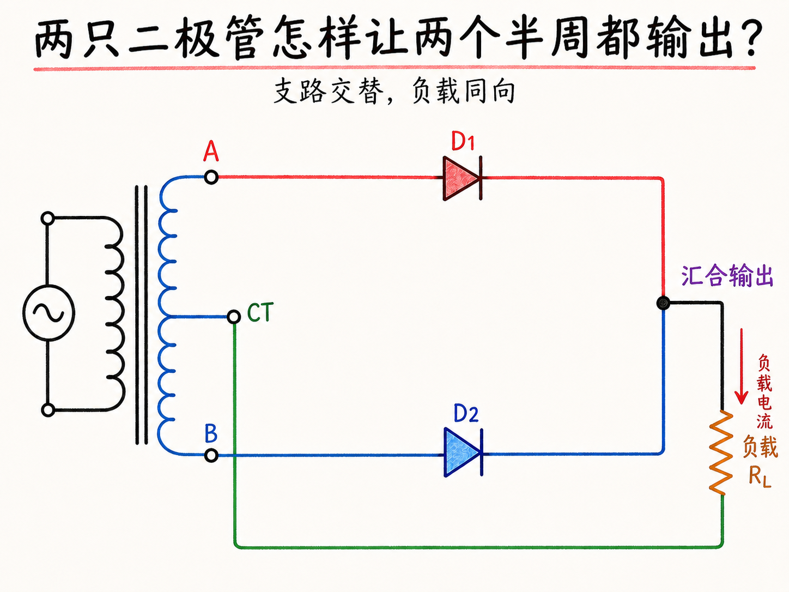
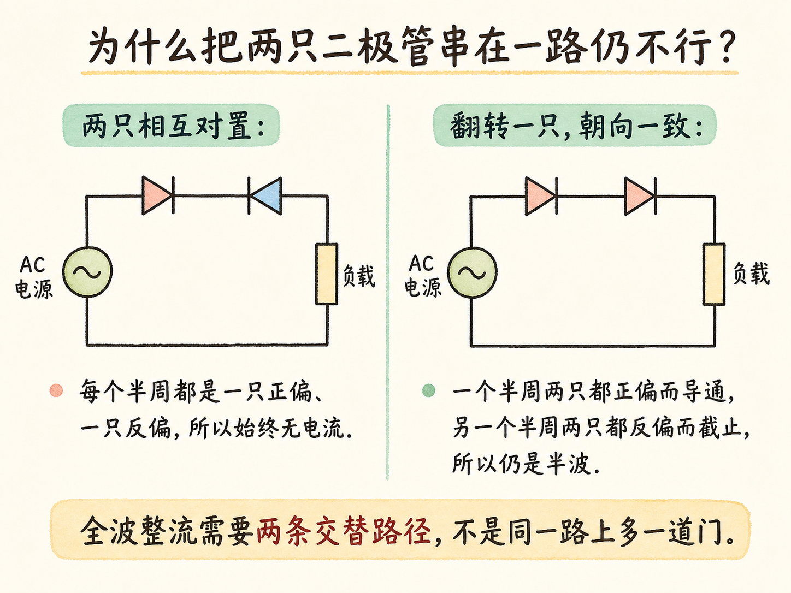
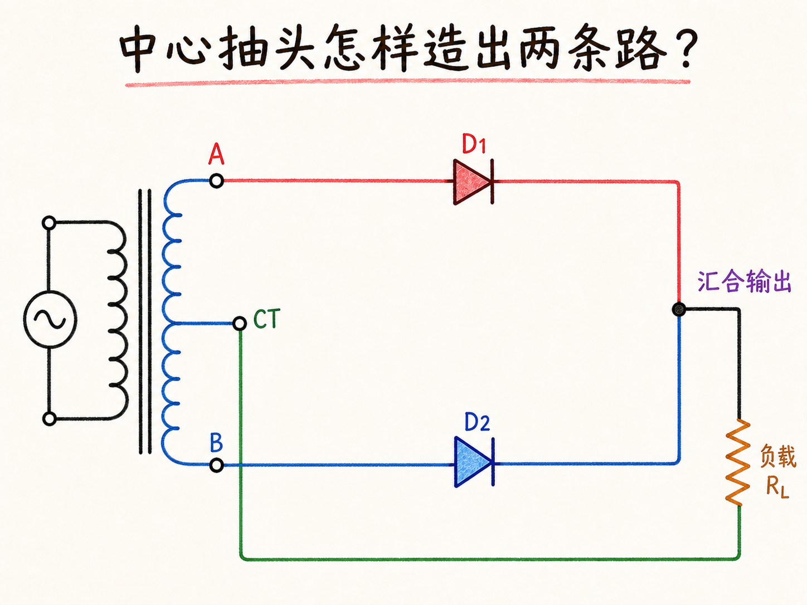
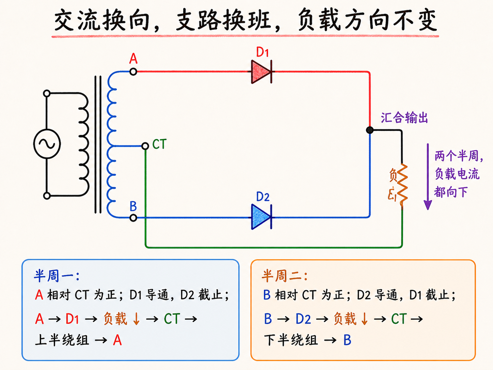
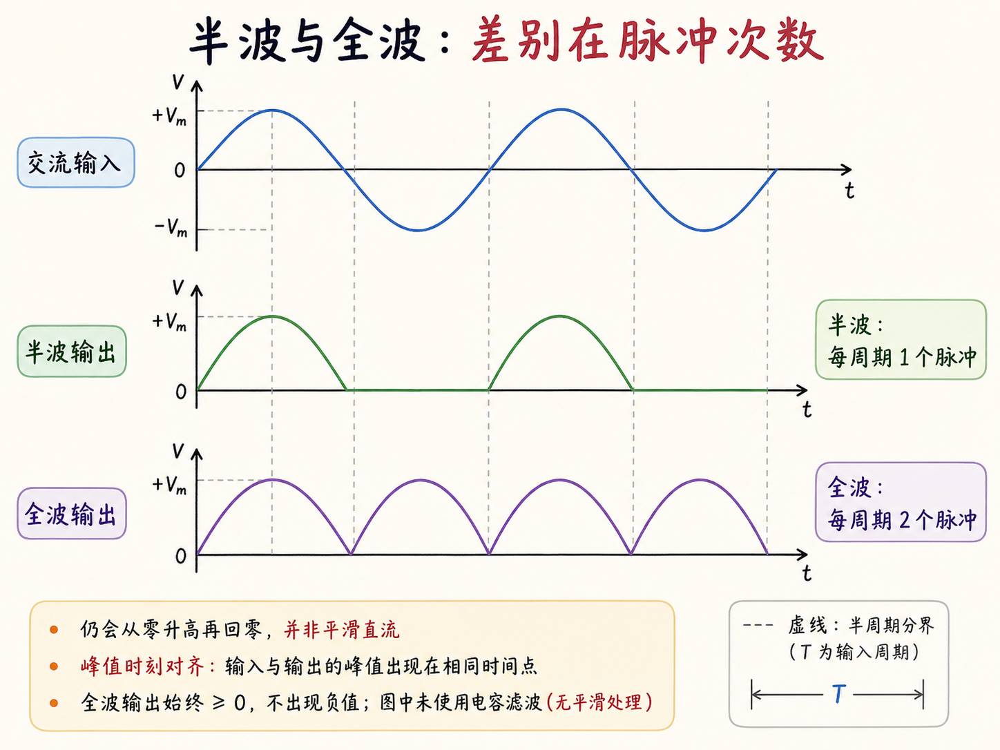

# 两只二极管怎样让两个半周都输出？

半波整流器只会把不需要的半周关掉。全波整流器更进一步：交流方向每次反转时，电路换一条路走，却仍让电流沿同一方向穿过负载。

关键不是简单多放一只二极管，而是把两个半周分配给两条不同支路。

读完这篇，你会知道

- 为什么两只二极管串联仍做不成全波整流
- 中心抽头怎样提供两条对称电流路径
- 两个半周分别由哪只二极管导通
- 负载电流为什么始终同向
- 全波输出与半波输出有何区别

## 为什么“再加一只”还不够？

两只二极管若在同一串联回路里相互对置，每个半周都是一只正偏、另一只反偏，电流始终被阻断；若把其中一只翻转，让两只朝向一致，两只会在一个半周同时正偏、另一个半周同时反偏，结果仍只利用一个半周。

全波整流需要的不是“同一路上两个门”，而是“两个半周各有一条路”。

## 中心抽头怎样造出两条路？

变压器次级线圈除了两端，再从中点引出一根线，这就是中心抽头。次级两端各接一只二极管，两只二极管的输出汇合后进入负载，负载再回到中心抽头。

这个接法把上半段线圈和下半段线圈变成两个交替使用的电源支路。每个半周只有其中一条支路满足正向导通条件。

## 两个半周怎样轮流工作？

第一个半周，上端相对中心抽头为正，上支路二极管导通，下支路截止；电流从汇合点沿固定方向穿过负载。交流反向后，下端相对中心抽头为正，下支路二极管导通，上支路截止；电流仍从同一个负载端进入。

交流源的方向反转了，导通支路也交换了，但负载中的方向没有改变。两只二极管像接力棒一样，每半周换一次班。

## 全波输出为什么更连续？

半波整流只留下输入的一个半周，另一个半周输出为零。全波整流把负半周也翻到正方向，因此每个半周都有一个正脉冲，输出脉冲出现得更频繁。

它仍然不是平滑直流，因为电流大小会周期性从零升高再回到零。本课两二极管方案还附带一个硬条件：必须使用有第三根中心抽头线的变压器。机制链是：交流换向 → 导通支路交替 → 负载方向不变 → 两个半周都成为正向输出。
