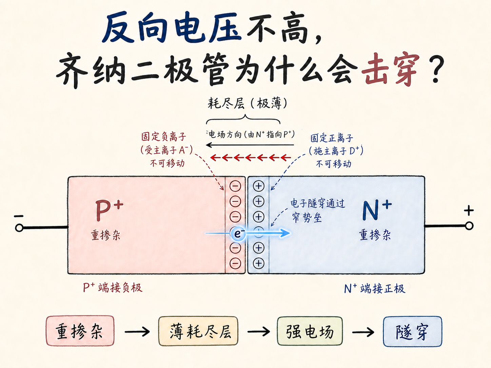
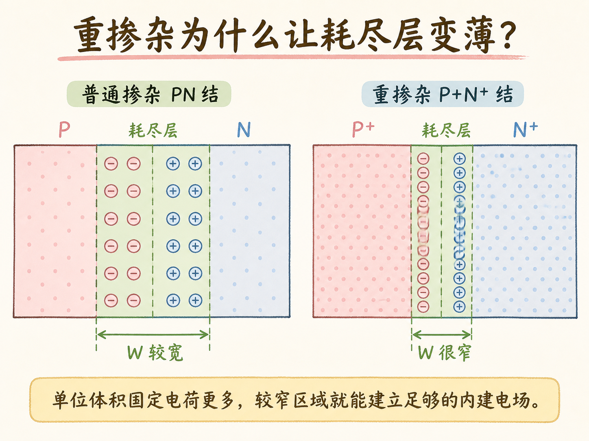
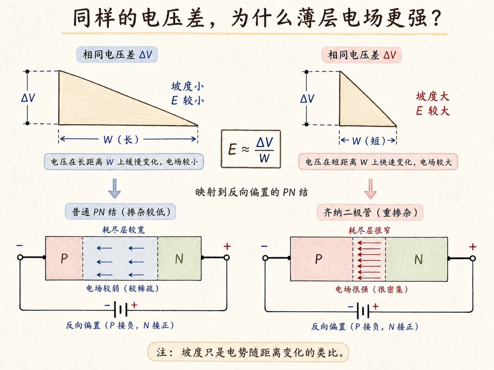
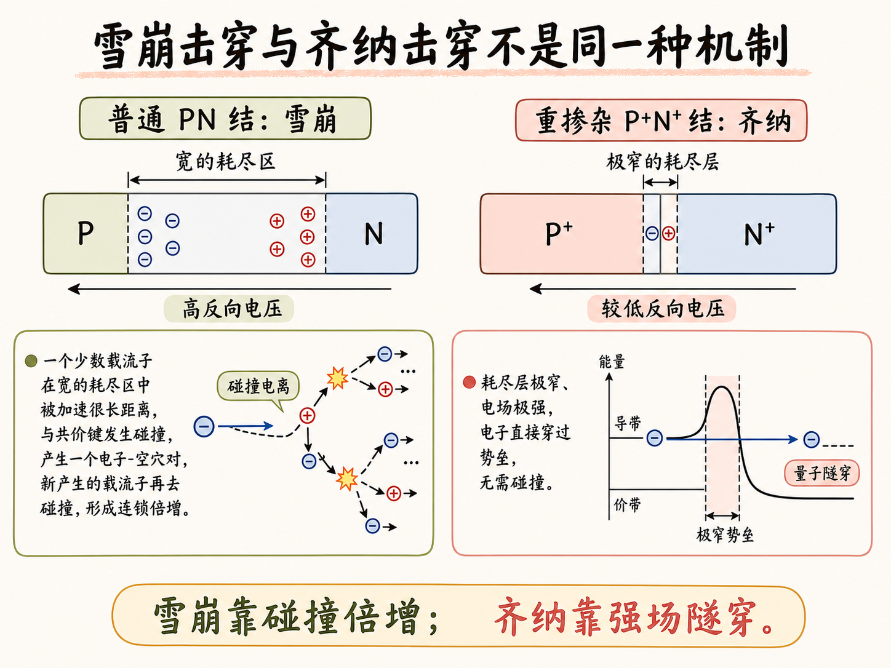
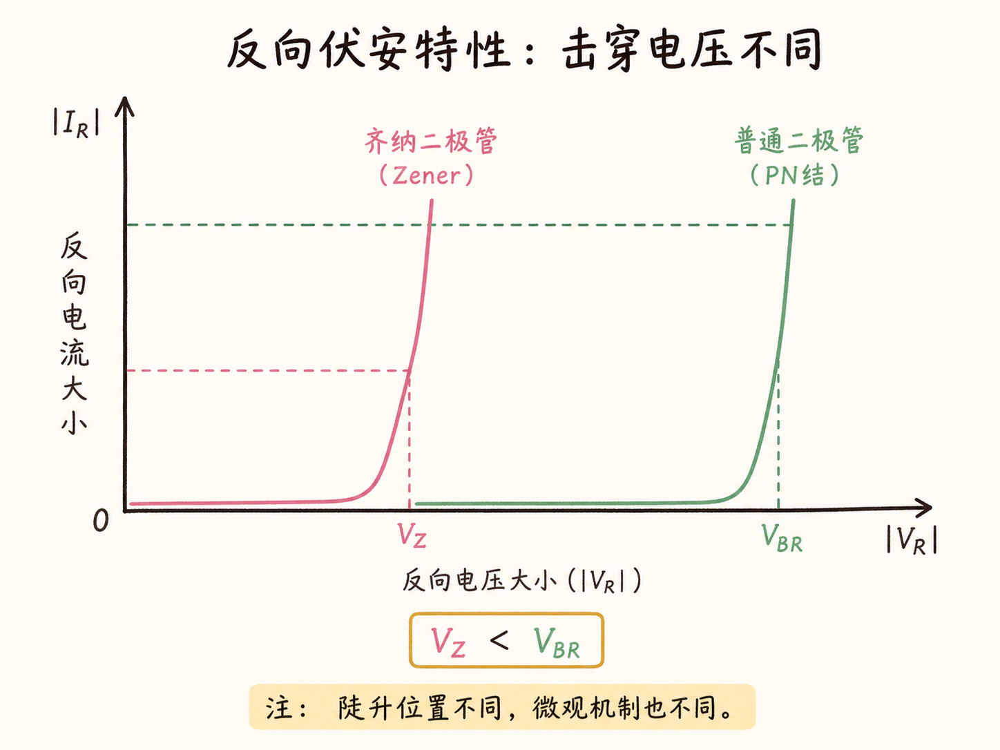

# 反向电压不高，齐纳二极管为什么会击穿？

普通二极管往往要承受很高的反向电压才会击穿。齐纳二极管却能在较低电压处突然出现很大的反向电流。差别不在“材料突然不耐压”，而在重掺杂把耗尽层压得很薄，强电场由此打开了一条量子隧穿通道。

读完这篇，你会知道

- 重掺杂为什么会让耗尽层变窄
- 同样的电压为什么能在薄层中产生更强电场
- 雪崩击穿和齐纳击穿各自怎样产生载流子
- 电子为什么能穿过经典上“过不去”的势垒

## 重掺杂先把耗尽层压薄

PN 结形成后，电子和空穴在结附近扩散并复合，留下不能移动的杂质离子：N 侧是带正电的施主离子，P 侧是带负电的受主离子。它们建立内建电场，阻止多数载流子继续越过结区，这片缺少自由载流子的区域就是耗尽层。

重掺杂意味着单位体积内的固定离子更多。于是，不必占据很宽的空间，较窄区域里的固定电荷就足以建立阻挡扩散所需的电场。结果是：掺杂越重，耗尽层越薄，结区电场越集中。

## 同样电压为何让薄层电场更强？

反向偏置把正端接 N 区、负端接 P 区，外加电场与内建电场同向。对普通二极管和重掺杂二极管施加相同反向电压时，这段电势变化在齐纳结中被压缩到更短距离内。

把电压差想成固定的高度差：水平距离很长，连接两点的坡就缓；水平距离缩短，坡就陡。电场对应电势随距离变化的坡度，可粗略记成 `E ≈ ΔV / W`。在相同 `ΔV` 下，耗尽层宽度 `W` 越小，电场 `E` 越大。

因此齐纳二极管不需要很高的反向电压，就能在极薄耗尽层内形成很强的局部电场。

## 齐纳击穿与雪崩究竟差在哪？

普通二极管的耗尽区较宽。反向电压足够高时，少数自由载流子能在其中加速较长距离，获得足够动能后撞击共价键电子，产生新的电子—空穴对。新载流子继续碰撞，数量像滚雪球一样倍增，这叫碰撞电离，也就是雪崩击穿的核心。

齐纳二极管的耗尽区很窄，载流子没有足够长的“助跑距离”去反复碰撞。它的突破口是极强电场：电场把电子面对的势垒压得又窄又斜，使束缚电子能以量子方式穿过势垒。反向电流因此在较低电压处陡增。

两种现象都叫击穿，也都会在反向伏安曲线上表现为电流突然增大；雪崩依靠碰撞产生更多载流子，齐纳机制依靠强场隧穿。不能只看“大电流”就把两者当成同一种过程。

## 电子怎样穿过“过不去”的势垒？

把受束缚的电子想成山谷里的小球。按经典力学，小球必须先获得足够能量越过山顶；一次有力的碰撞就可能提供这份能量。若山体非常窄，量子力学却允许电子以一定概率直接出现在势垒另一侧，这就是隧穿。

势垒越窄、倾斜越强，隧穿概率越高。重掺杂同时带来薄耗尽层和强电场，正好满足这两个条件。当反向电压升到特征值 `V_Z` 附近，大量电子开始隧穿，反向电流急剧上升，这个电压称为齐纳击穿电压。

整条机制链可以压缩成一句话：重掺杂 → 耗尽层变薄 → 同一反向电压产生更强电场 → 窄势垒中的隧穿概率上升 → 在较低的 `V_Z` 处出现齐纳击穿。
