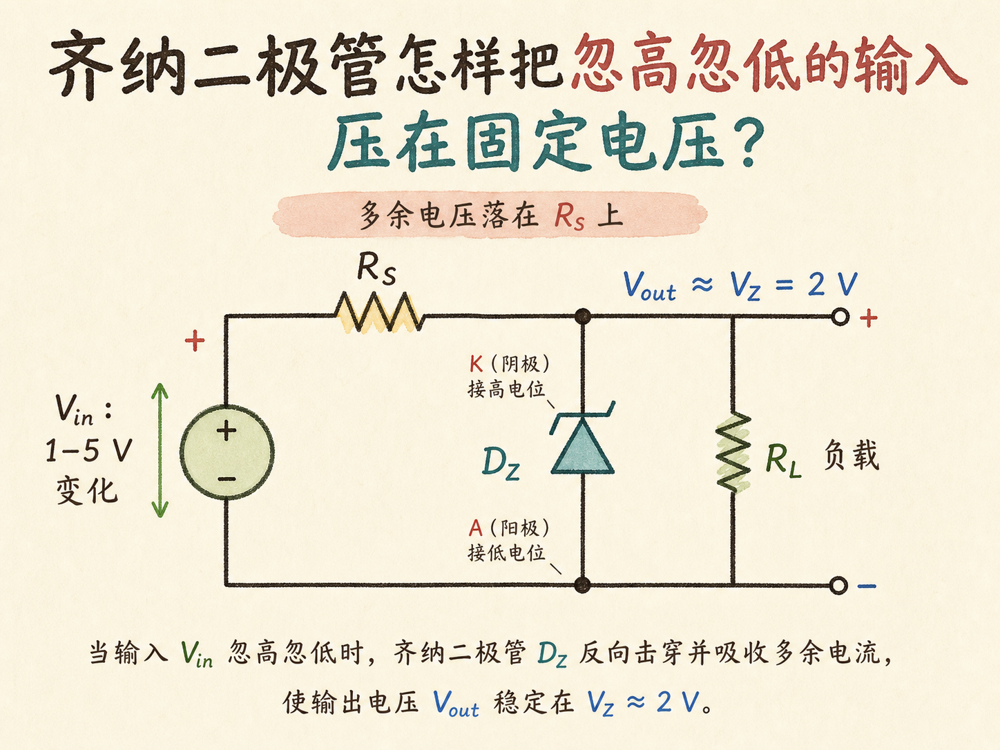
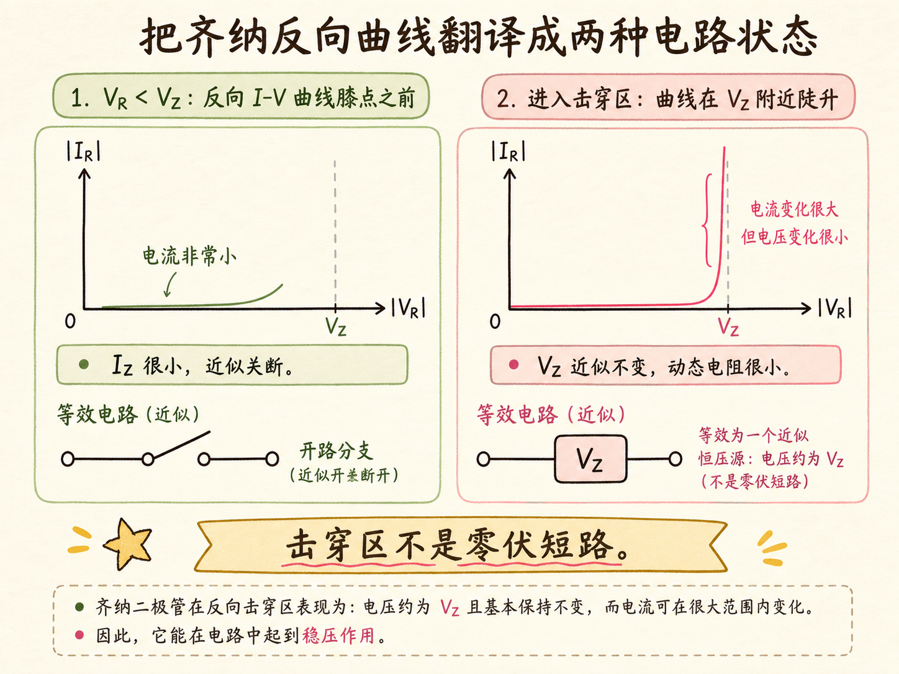
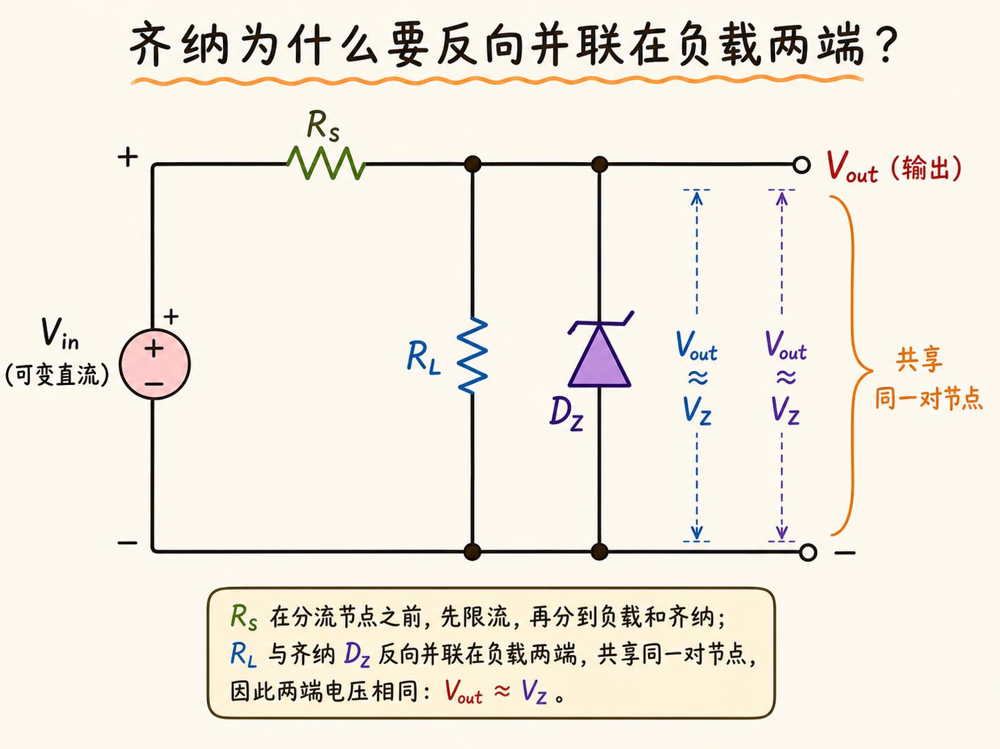
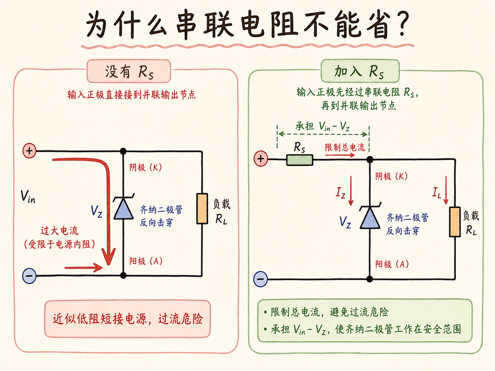
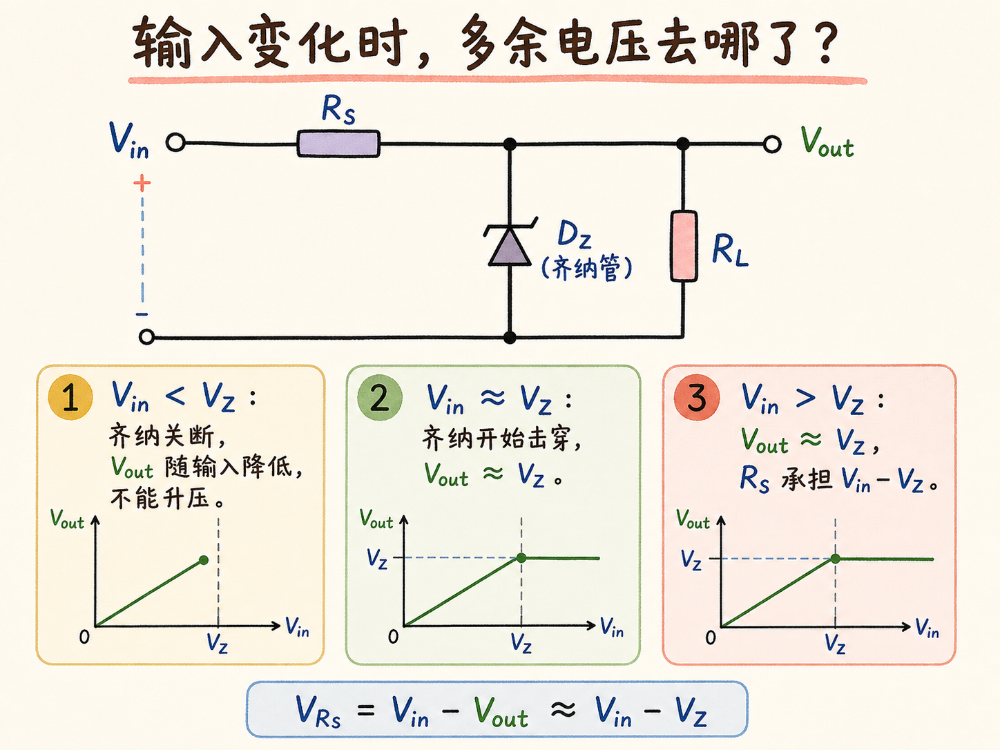

# 齐纳二极管怎样把忽高忽低的输入压在固定电压？

电源电压在变，负载却只想看到一个稳定值。齐纳稳压器的办法不是“消灭”多余电压，而是让齐纳二极管反向并联在负载两端，再用串联电阻接住多出的电压并限制电流。

读完这篇，你会知道

- 齐纳反向曲线怎样变成一个电路模型
- 齐纳二极管为什么必须反向并联
- 串联电阻为什么不是可有可无
- 输入低于或高于齐纳电压时，电路分别怎样工作

## 先把曲线翻译成两种状态

假设齐纳电压 `V_Z = 2 V`。反向电压低于 2 V 时，齐纳电流极小，电路分析时可近似把它看成断开的支路。反向电压到达 2 V 附近后，齐纳进入击穿区：电流能大幅变化，端电压却只略微变化。

因此，击穿区中的齐纳二极管不是“电压为零的短路”，而是一个把两端电压钳在 `V_Z` 附近的低动态电阻器件。这个区别很重要：稳压靠的是电压近似不变，不是把输出端直接连成零伏。

## 为什么齐纳必须反向并联？

并联元件共享同一对节点，也就共享同一个端电压。把齐纳二极管反向并联在负载两端后，只要齐纳进入击穿区，`V_Z` 就同时成为负载电压，所以 `V_out ≈ V_Z`。

方向不能接反。若电源正端使齐纳处于普通正向偏置，电路用到的只是普通二极管导通特性，不能利用设定好的齐纳击穿电压。正确接法是让齐纳阴极接输出高电位端、阳极接低电位端。

## 为什么少不了串联电阻？

先故意把串联电阻拿掉。输入一旦达到 `V_Z`，齐纳支路进入低动态电阻的击穿区；电源若继续抬高电压，就可能把很大的电流直接灌入齐纳支路。负载电压虽然被压住了，电源和齐纳却面临过流。

在电源与输出节点之间串入 `R_S`，电流就必须先经过电阻。`R_S` 一方面限制总电流，另一方面承担输入中超过输出的那一部分电压。它不是辅助装饰，而是让钳位动作能够安全发生的必要组成。

## 输入变化时，多余电压去哪了？

当 `V_in < V_Z`，齐纳尚未击穿，近似关断。此时它不会把输出“抬”到 `V_Z`，输出只能随输入降低。

当 `V_in` 使齐纳刚进入击穿区，输出开始被钳在 `V_Z` 附近。输入再升高，输出仍近似不变，多出的电压主要落在串联电阻上：

`V_Rs = V_in - V_out ≈ V_in - V_Z`

以 `V_Z = 2 V` 为例，输入为 3 V 时，电阻约承担 1 V；输入为 4 V 时，电阻约承担 2 V。实际伏安曲线不是完全竖直，所以 `V_out` 会随齐纳电流略有变化。本讲的近似结论有明确边界：只有齐纳反向进入击穿区时，才有 `V_out ≈ V_Z`；输入低于 `V_Z` 时，这个简单电路不能升压。
