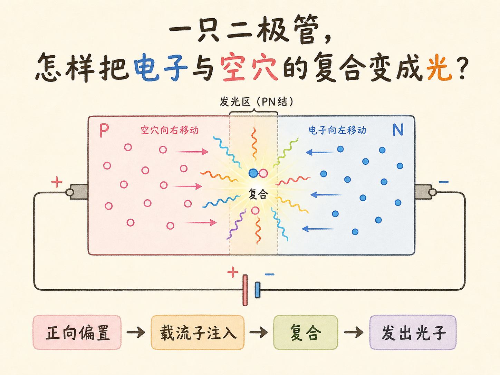
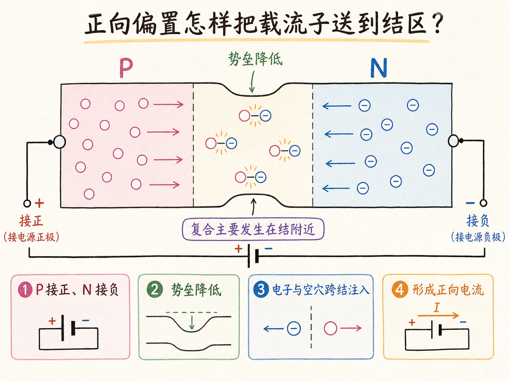
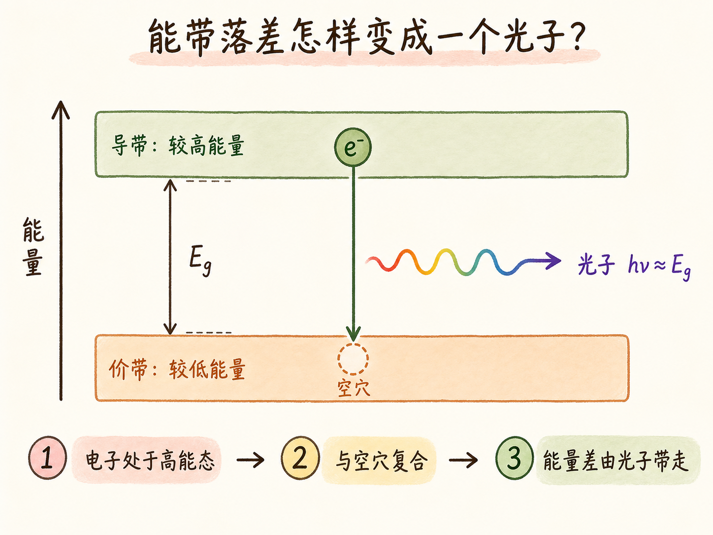
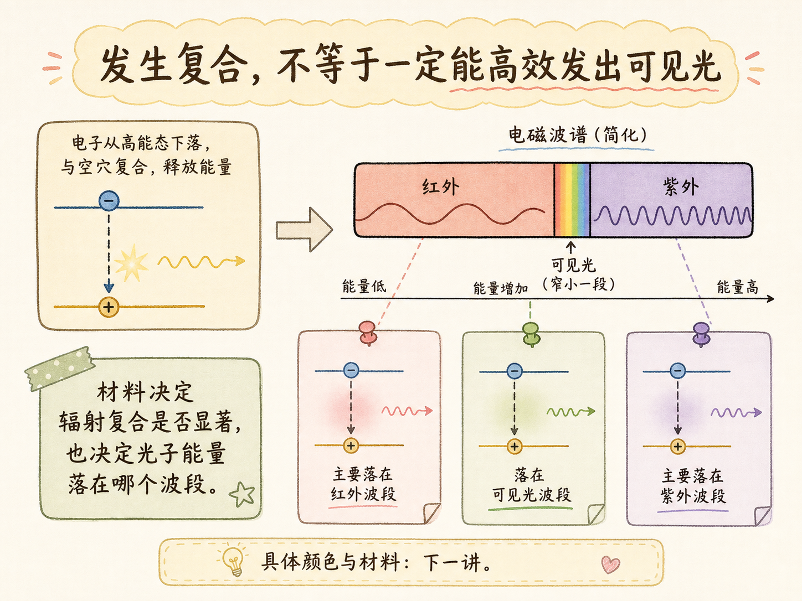
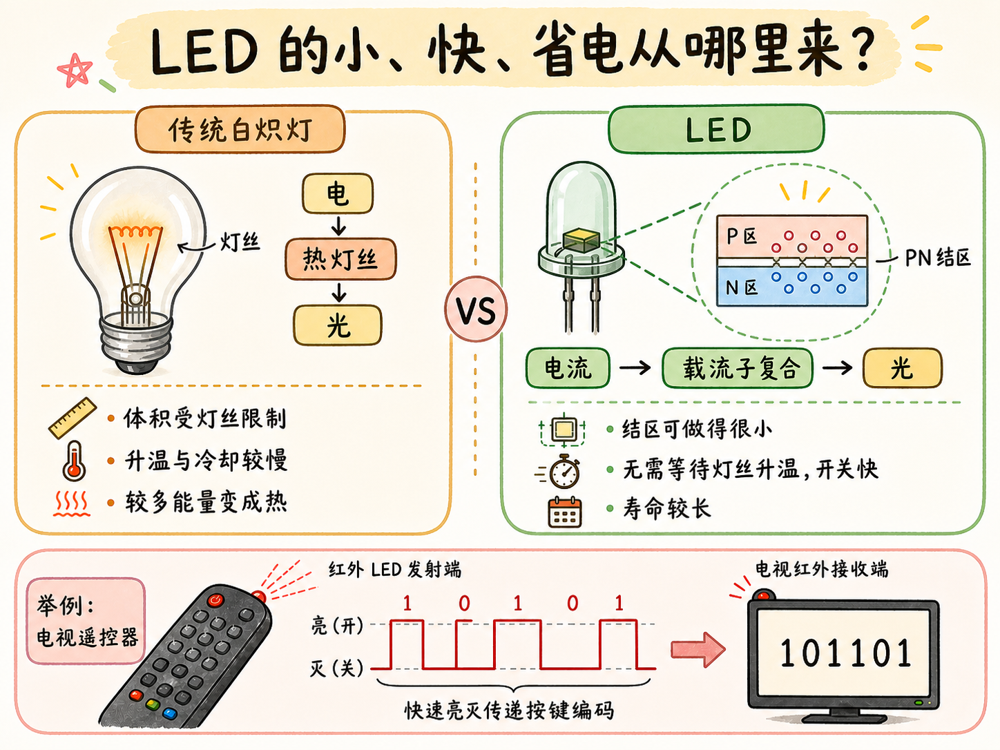

# 一只二极管，怎样把电子与空穴的复合变成光？

LED 不是在二极管旁边塞进一盏微型灯。它自己就是发光器件：正向电压把电子和空穴送到 PN 结附近，电子进入更低能态时释放光子，电流于是变成了光。

读完这篇，你会知道

- 正向偏置怎样把电子和空穴推向结区
- 一次复合为什么能释放一个光子
- 为什么“二极管会复合”不等于“都能高效发出可见光”
- LED 的小尺寸、高效率和快速开关从哪里来

## 正向偏置把两类载流子送到结区

LED 首先是一只 PN 结二极管。未加电压时，耗尽区与内建电场形成势垒，阻止 N 区多数电子和 P 区多数空穴继续跨结扩散。

把 P 侧接电源正端、N 侧接负端，外加电场削弱结区势垒。N 区电子被推向 P 区，P 区空穴被推向 N 区。载流子跨过结区后，在结附近大量相遇并复合，同时形成持续的正向电流。

## 能带落差怎样变成一个光子？

N 区电子处在较高能量、可以自由运动的状态；P 区空穴代表较低能带中的空位。当一个电子与空穴复合时，更准确的说法是：电子从较高能态进入较低能态，填上那个空位。

能量不能凭空消失。若材料允许辐射复合，电子跨越的能量差就由一个光子带走。能带间隔越像一道落差，光子就是电子“落下”时释放的那份能量。因为电子和空穴主要在 PN 结附近相遇，光也主要从结区产生。

## 为什么不是每只二极管都能当灯？

“发生复合”只说明能量需要释放，不保证大部分能量都会变成可用的可见光。材料决定复合更容易走发光通道还是其他通道，也决定光子能量是否落在人眼可见范围。

所以，普通二极管即使有电子—空穴复合，也不等于能像 LED 那样高效发出可见光。本讲把材料、颜色和制造问题留到下一讲；这里的边界是：LED 必须选用适合辐射复合的半导体材料。

## 小、快、省电这些优点从哪里来？

LED 不需要容纳一根被加热到白炽的灯丝，发光结可以做得很小，既能组成照明灯，也能成为设备上的微型指示灯。它通过载流子复合直接产生光，不必先把灯丝加热到高温，因此比传统白炽灯少走一次耗能的“电 → 热 → 光”转换。

它的开关也快。电流开始，载流子注入和复合随即发生；电流停止，发光也能迅速结束，不必等待灯丝升温或冷却。电视遥控器正是让红外 LED 快速亮灭，把不同按钮变成不同的光脉冲序列。

没有高温灯丝还减少了易损结构，因此 LED 通常比传统白炽灯寿命更长。整条发光机制链是：正向偏置 → 势垒降低 → 电子与空穴在结区复合 → 电子降低能量 → 光子带走能量差。
