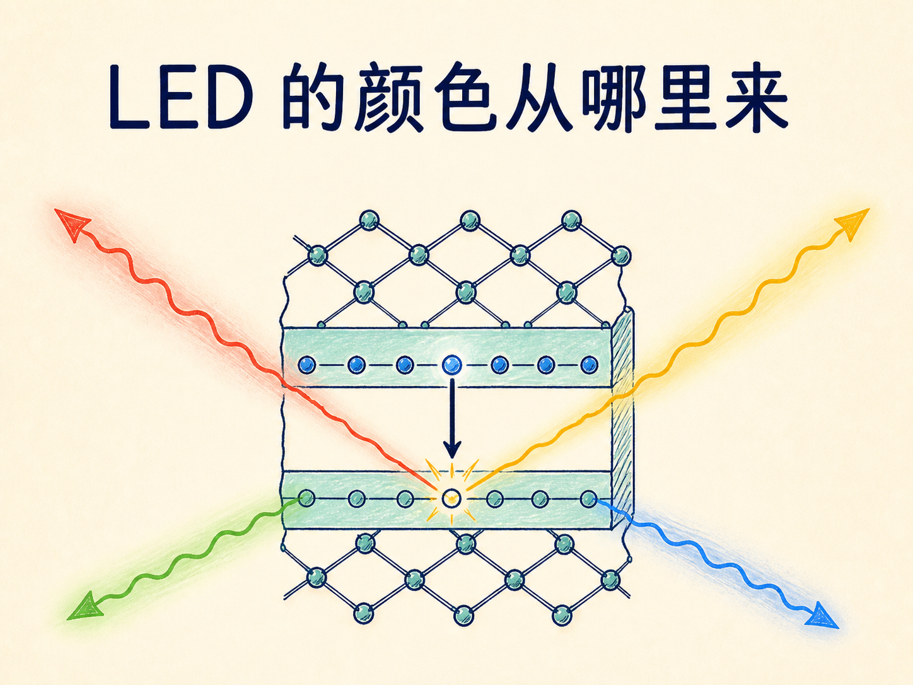
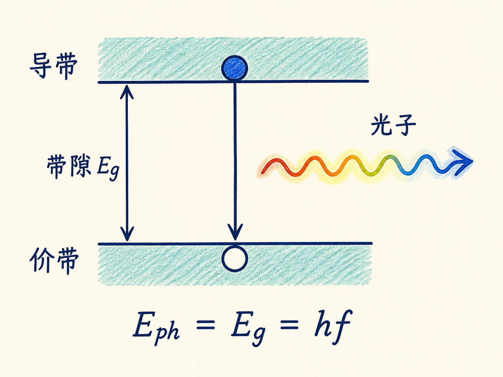
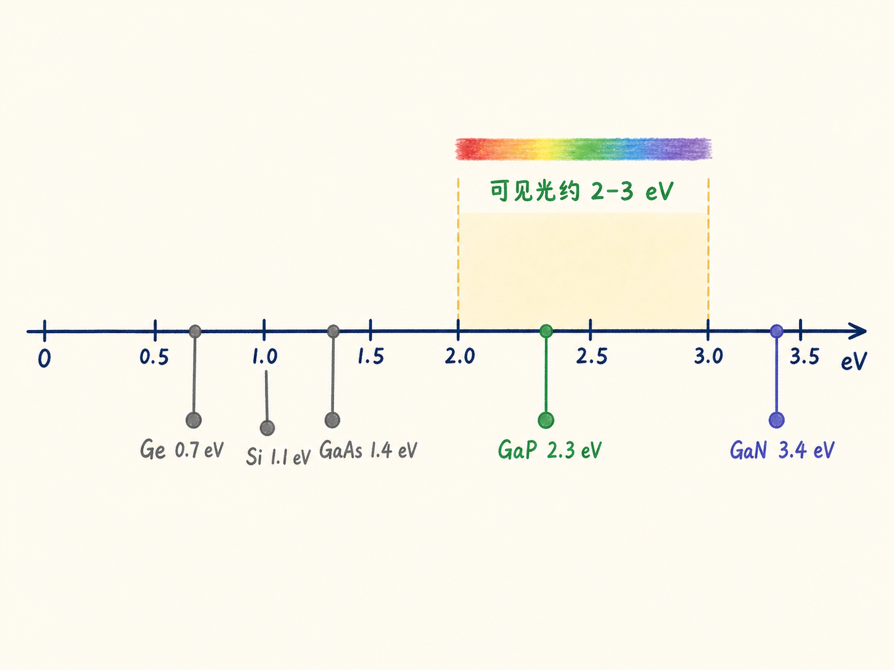
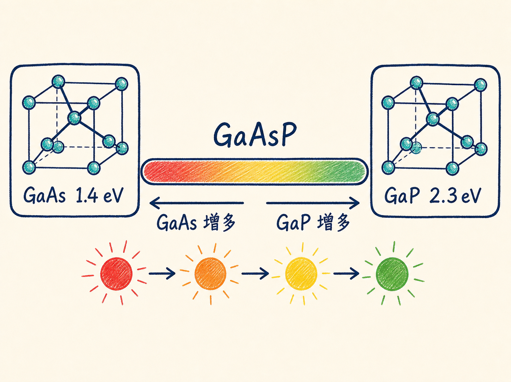
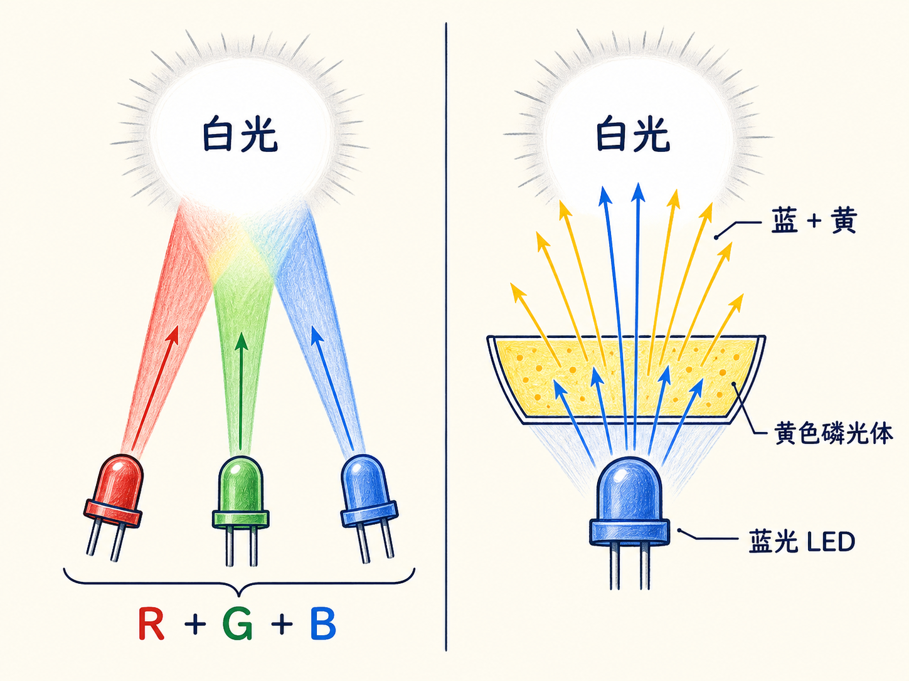

# LED 的颜色从哪里来：从带隙到白光

同样是一个正向偏置的 PN 结，为什么有的 LED 发红光，有的发绿光，还有的能成为白光灯的核心？答案不在外壳颜色，也不在电流“染”出了颜色，而在半导体内部两条能带之间的距离。

这个距离叫带隙。它既决定电子跃迁时能释放多少能量，也决定我们最终看到什么颜色。

读完这篇，你会知道

- 为什么 LED 的颜色由带隙决定
- 为什么硅和锗不适合制造可见光 LED
- 怎样通过化合物与合金调节 LED 颜色
- 蓝色 LED 为什么打开了白光照明的大门

## 电子落下多少，光子就带走多少

LED 本质上是 PN 结。给它加正向偏置，也就是 P 型一端接正、N 型一端接负，电子和空穴便更容易相遇并复合。电子从较高能量状态回到较低能量状态时，能量差以光子的形式释放。

在半导体的能带图里，这个能量差近似就是导带与价带之间的带隙 $E_g$。光子能量满足 $E_\mathrm{ph}=hf$，其中 $h$ 是普朗克常数，$f$ 是光的频率。因此可以把这条关系读成：带隙越大，光子能量越高，频率越高；带隙越小，光子能量越低，频率也越低。

频率决定颜色。较高频率向蓝、紫甚至紫外移动，较低频率向红和红外移动。所以，选择 LED 材料，其实是在选择带隙；选择带隙，也就是在选择发光颜色。

## 为什么硅和锗进不了可见光舞台

把可见光频率代入 $E=hf$，需要的带隙大约落在 2–3 eV。低于这个范围，发光会向红外方向移动；高于这个范围，则会向紫外方向移动。

硅的带隙约为 1.1 eV，锗约为 0.7 eV。它们都明显低于可见光 LED 所需的范围。即使电子与空穴发生复合，释放出的光子也不在我们希望看到的可见颜色区间。因此，熟悉的硅和锗并不是制造可见光 LED 的合适材料。

这里需要注意：问题不是硅和锗“不是半导体”，而是它们的带隙不合适。要得到可见光，必须寻找带隙更大的半导体。

## 把材料配方变成颜色旋钮

人们可以把第 13 族和第 15 族元素组合起来，制造新的化合物半导体。镓与砷形成砷化镓（GaAs），带隙约为 1.4 eV，适合红外；镓与磷形成磷化镓（GaP），带隙约为 2.3 eV，已经进入可见光范围，约对应绿色。

还可以把砷化镓和磷化镓继续混合，形成砷磷化镓（GaAsP）合金。改变两种成分的比例，带隙便能在约 1.4–2.3 eV 之间调节。增加磷化镓成分，带隙向 2.3 eV 靠近；增加砷化镓成分，带隙向 1.4 eV 靠近。

于是，材料比例就像一个“颜色旋钮”：调节合金成分，就能制造红、橙、黄到绿的 LED。这个类比只表示带隙可以随配比改变；真正发光的机制仍然是载流子复合与能量跃迁。

## 蓝光补上最后一块，白光才成为可能

蓝光需要更大的带隙。氮化镓（GaN）的带隙约为 3.4 eV，足以制造蓝色 LED。蓝光 LED 的实现意义很大，相关成果获得了 2014 年诺贝尔奖。

原因在于，单个 LED 的光接近单色，而照明需要白光。有了蓝色 LED，可以把红、绿、蓝三种光混合成白光；也可以在蓝色 LED 上覆盖黄色磷光体层，让一部分蓝光转成黄光。眼睛同时接收到剩余蓝光和转换出的黄光，就会感受到白光。

这条链路可以复述为：材料成分决定带隙，带隙决定光子能量，光子能量决定颜色；而蓝光的出现，又使颜色组合或磷光转换能够得到白光。LED 的制造因此不是简单换一种晶体，而是在用材料的带隙设计光。
