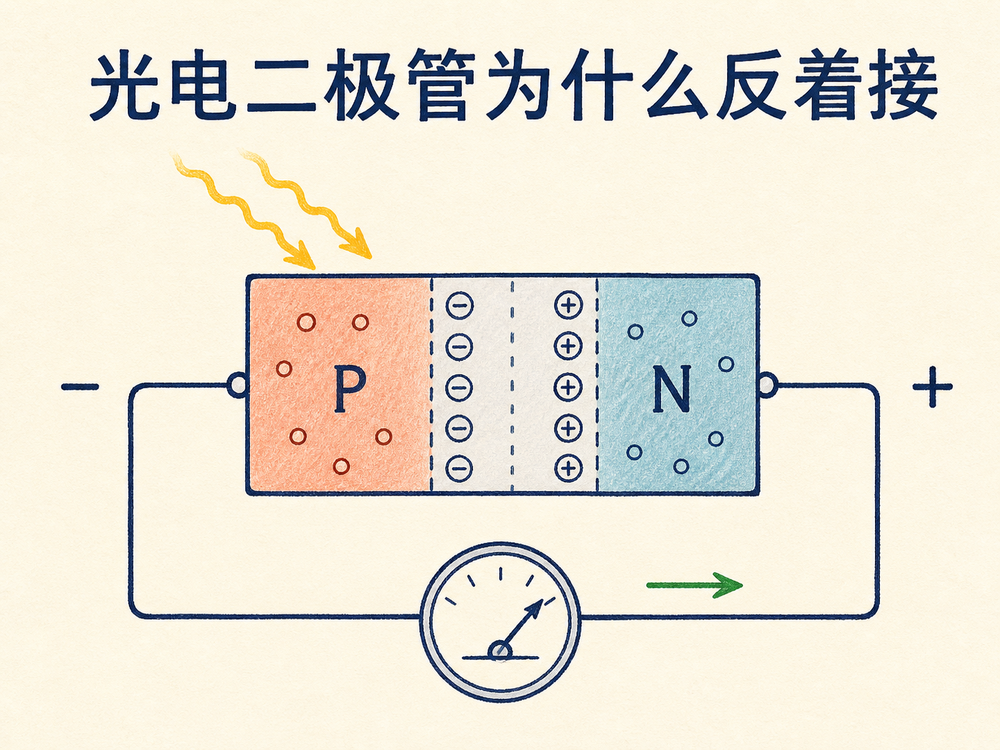
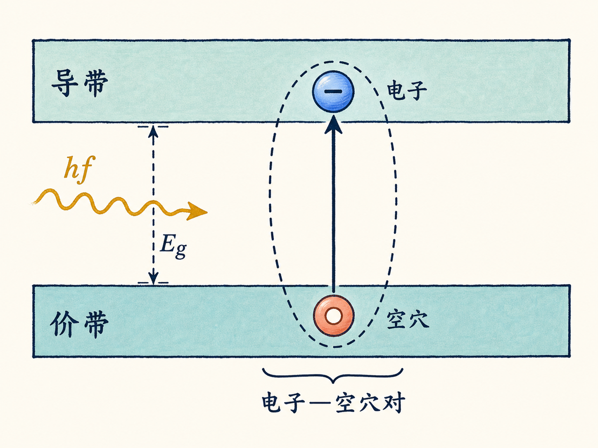
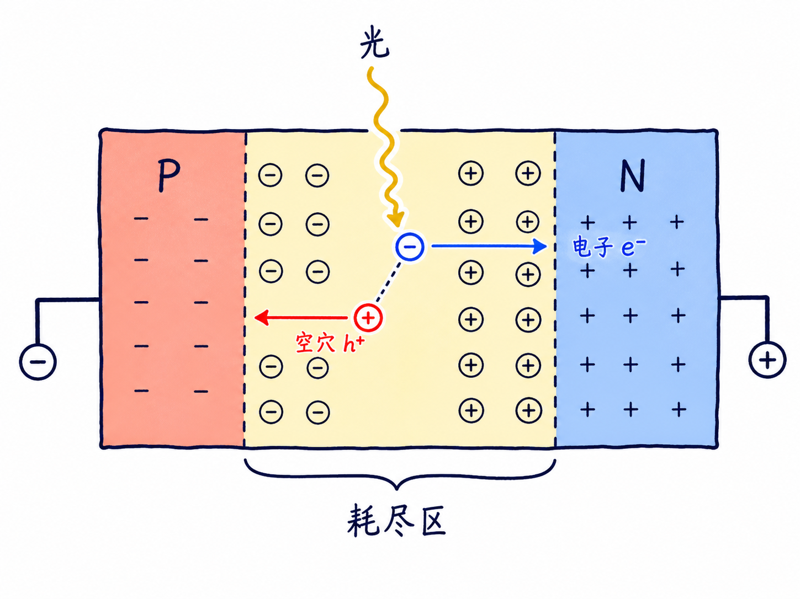
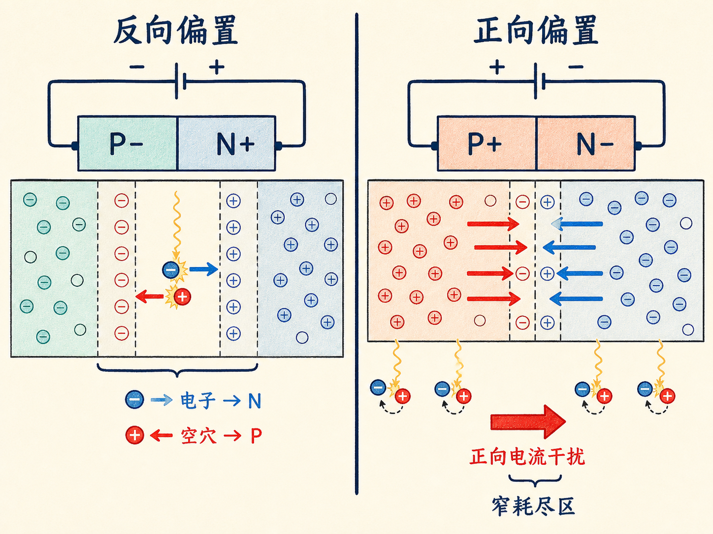
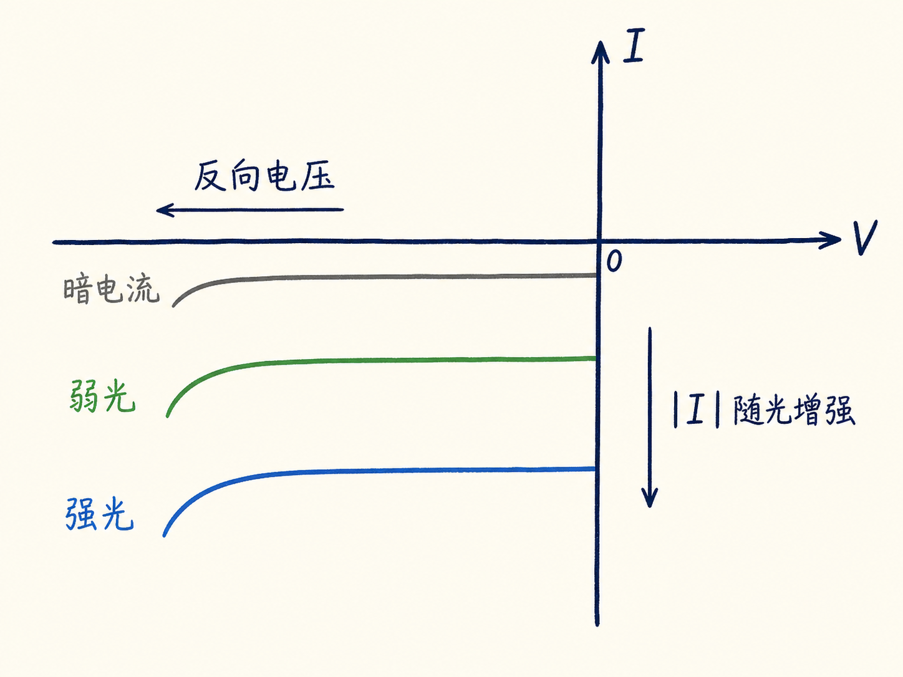

# 光电二极管为什么偏要反着接

普通二极管正向接通时更容易有电流，光电二极管却通常反向偏置：P 区接负，N 区接正。看起来像是把二极管接在“不导通”的方向，实际上这正是它能把亮度变成可测电流的关键。

它不是要让电源推动出大电流，而是要把光产生的微小电流单独分辨出来。

读完这篇，你会知道

- 光怎样在 PN 结里产生电子—空穴对
- 为什么耗尽区能把光生载流子变成电流
- 为什么光越亮，反向电流越大
- 反向偏置为什么比正向偏置更适合测光
- 暗电流和反向伏安曲线分别说明什么

## 光先产生一对载流子

光电二极管把光转换成电，工作方向与 LED 相反。LED 让电子与空穴复合并放出光；光电二极管则让光子把价带电子激发到导带，同时在价带留下一个空穴。

这个过程要满足一个条件：光子能量足以跨越带隙。条件满足后，一个光子可以产生一对可移动载流子——导带中的电子和价带中的空穴。但“产生”还不等于“被测到”。如果这对载流子很快复合，它们就不会对外电路留下明显贡献。

## 耗尽区把电子和空穴及时分开

PN 结中间的耗尽区几乎没有可移动载流子，却保留了固定空间电荷和相应电场。反向偏置时，P 区接负极、N 区接正极，两侧多数载流子被拉离结区，耗尽区随之变宽。

如果电子—空穴对恰好在耗尽区内产生，电场会在它们复合前把两者分开：电子被扫向 N 区，空穴被扫向 P 区。载流子定向移动，外电路中便出现光生电流。

光越亮，每秒到达并被吸收的光子越多，产生并被收集的电子—空穴对也越多，于是光生电流增大。光电二极管因此把“亮度”转换成“电流大小”。

## 为什么正向偏置反而不适合测光

正向偏置会缩窄耗尽区。有效收集区域变小后，更多电子—空穴对在耗尽区外产生并重新复合，能形成光生电流的比例降低。

还有第二个问题：正向偏置会让多数载流子大量扩散，形成与光照无关的正向电流。检测亮度时，我们希望电流变化主要来自光，而不是来自电源推动的载流子。反向偏置既扩大耗尽区，又压低了这种背景导通电流，因此更容易把光的影响分辨出来。

可以把耗尽区理解成一个“分拣区”：光生电子和空穴一旦在这里出现，就被电场迅速送往两边。这个类比只说明载流子分离；真正执行分离的是耗尽区电场。

## 曲线告诉我们：电流主要跟光走

按视频采用的电压和电流参考方向，反偏电压与反向电流都记为负值，所以曲线画在第三象限。超过一定反向电压后，光生电流对电压不太敏感，因为单位时间产生多少电子—空穴对，主要由入射光决定。反向电压继续增大时，耗尽区会略微变宽，因此电流仍可能小幅变化。

同一只光电二极管受到更强光照时，曲线会向更大的反向电流幅值移动。即使没有主动照光，热能也会产生少量载流子，留下很小的暗电流。因此真实读数的起点并不严格为零。

这套关系让光电二极管可以自动判断明暗：路灯控制电路能在电流降低时开灯，在电流升高时关灯；点钞机则用纸币遮断激光时产生的电流脉冲计数。两种应用虽然不同，读出的都是同一件事——光改变了单位时间内被收集的载流子数量。
