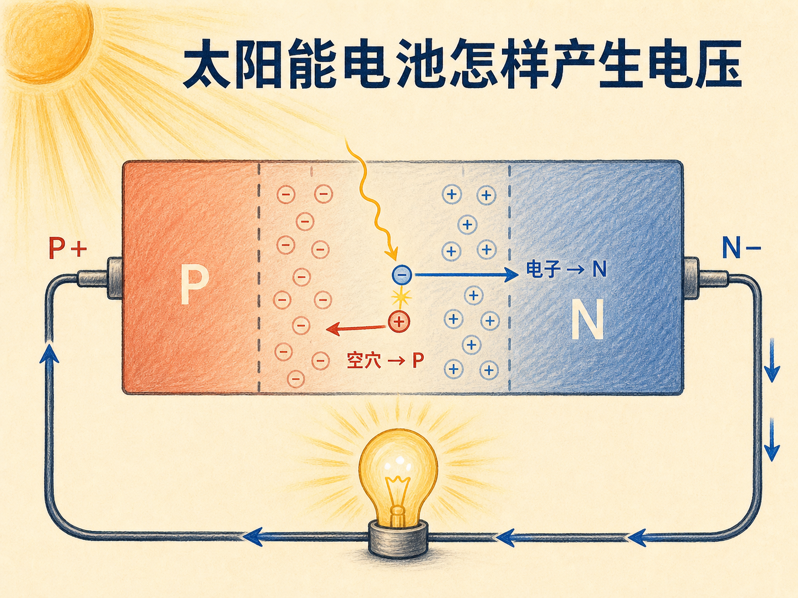
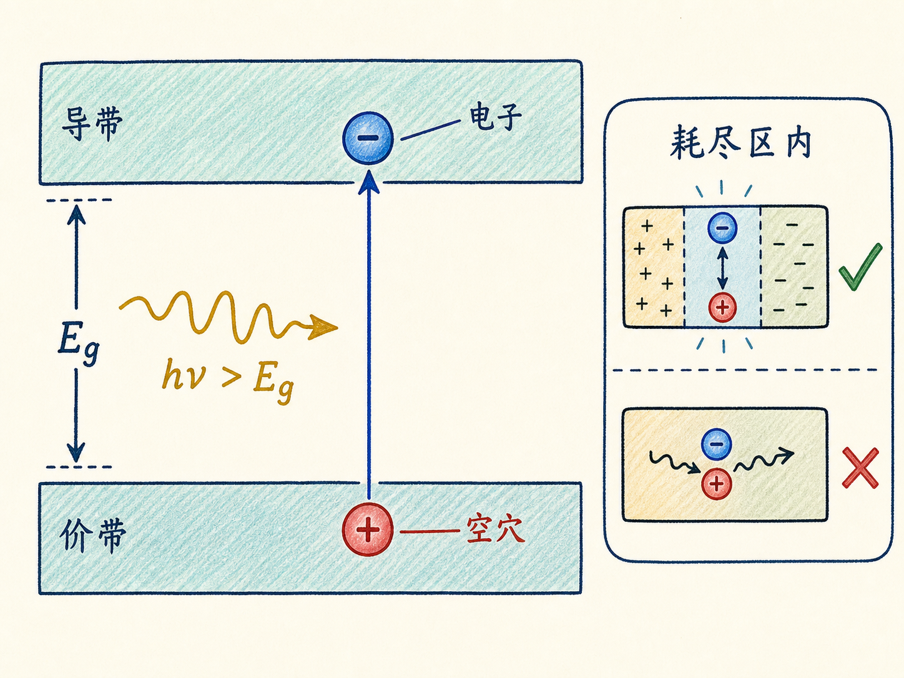
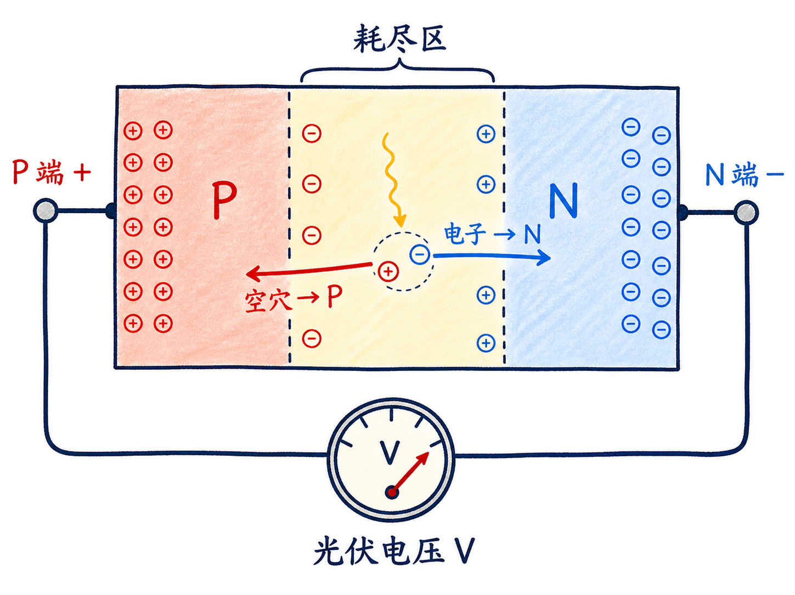
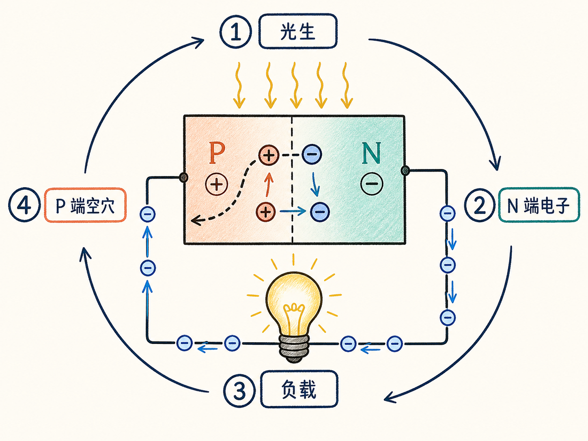
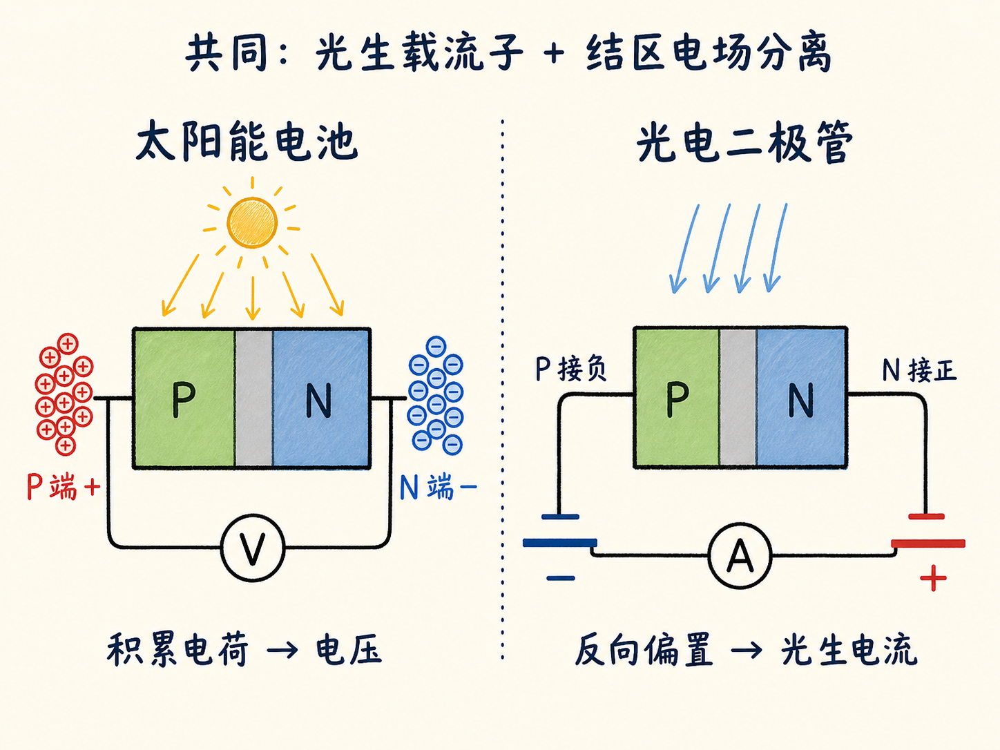

# 太阳能电池里没有电池，电压从哪里来

把灯泡接到一块受光的太阳能电池上，电路里没有普通电池，灯泡却能亮。能量来自光并不难理解，真正需要解释的是：光怎样先在 PN 结两端制造出电压，又怎样让外部电路持续有电流？

答案是一条连续机制：产生载流子、分开载流子、积累电荷，再让电荷通过负载重新汇合。

读完这篇，你会知道

- 光怎样在 PN 结中产生电子—空穴对
- 耗尽区电场为什么是发电的关键
- 电荷积累怎样形成光生电压
- 外接负载后为什么能持续供电
- 太阳能电池与光电二极管的用途有什么不同

## 第一步：光把电子推过带隙

太阳能电池的核心是 PN 结。P 区以空穴为多数载流子，N 区以电子为多数载流子，两者交界处形成耗尽区。这个区域几乎没有可移动载流子，却保留固定空间电荷及其电场。

光子进入半导体后，如果能量足以跨越带隙，价带电子就能跃迁到导带，并在价带留下一个空穴。这样便产生一对光生载流子：一个电子和一个空穴。

但产生位置很重要。在耗尽区外，电子和空穴可能很快复合，无法送到器件两端；在耗尽区内，电场会在复合前把它们分开。

## 第二步：电场把两种电荷送往两端

耗尽区电场把电子扫向 N 区，把空穴扫向 P 区。随着光不断产生载流子，N 端积累电子而呈负，P 端缺少电子、等效为空穴积累而呈正。

异号电荷分别积累在两端，PN 结两端便出现电势差，也就是电压。这个用光子产生电压的过程叫光伏效应。

太阳能电池并不是把光子直接变成一股已经流动的电流。它先利用结区电场分离载流子，建立正负两端；只有外部回路接通，积累的电荷才开始定向流动。

## 第三步：接上负载，电压推动电流

给 P、N 两端制作金属接触，再接入灯泡等负载，N 端电子会经过外部电路流向 P 端，与空穴复合。电子经过负载时传递能量，灯泡因此发光。

与此同时，新的光子继续产生电子—空穴对，耗尽区继续把它们分往两端。只要光照持续，这个“产生—分离—外流—复合”的循环就能持续，外部电路便有连续电流。没有额外电池，是因为受光 PN 结本身已经建立了电压。

## 与光电二极管相似，却在追求不同结果

太阳能电池和光电二极管都利用光生电子—空穴对，也都依靠耗尽区电场分离载流子。区别主要在应用目标。

太阳能电池允许异号电荷在两端积累，先建立光生电压，再向负载供电。光电二极管通常加反向偏置，光生载流子一出现就被外部电路带走，避免持续积累；它关注的是电流能否迅速、按比例地跟随光强变化。

因此，同一种“光生载流子+电场分离”机制可以服务两种任务：允许电荷积累，就得到可供电的光生电压；用反偏快速收集，就得到可检测亮度的光生电流。
