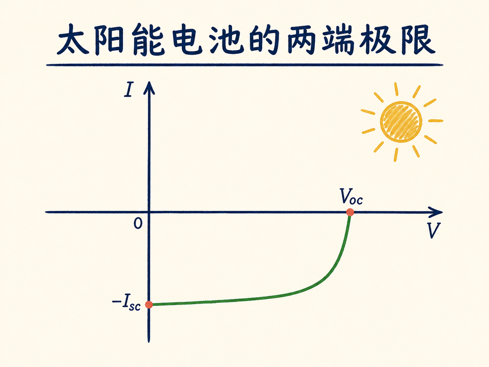
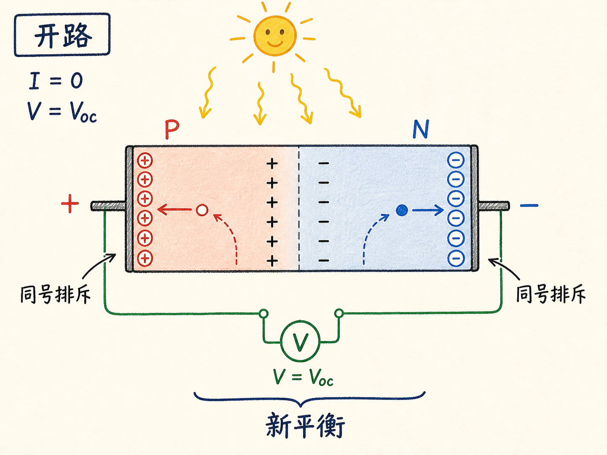
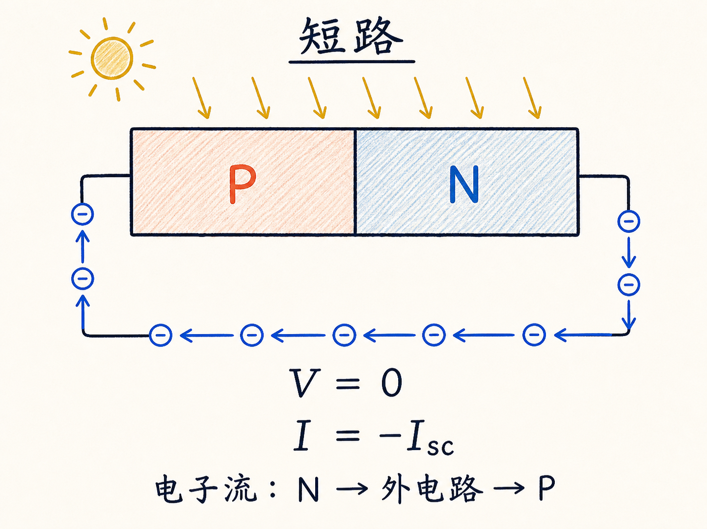
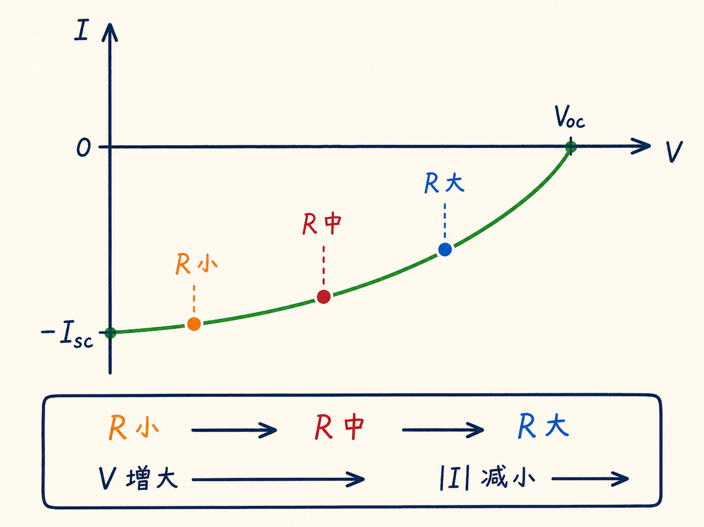
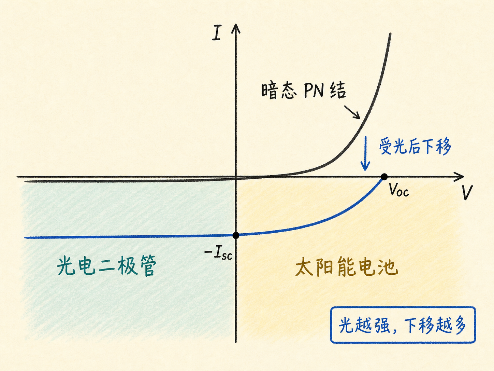

# 太阳能电池的两端极限：开路电压与短路电流

太阳能电池既能产生电压，也能输出电流，但两者不会同时各自达到最大。把外部电路完全断开，电压最大而电流为零；把两端直接短接，电流最大而电压为零。

理解这两个端点，整条伏安曲线就不再是一条需要死记的弯线，而是负载电阻改变后自然形成的一串工作状态。

读完这篇，你会知道

- 开路电压 $V_{OC}$ 为什么不会无限增长
- 短路时为什么电压为零而电流最大
- 负载电阻怎样决定电压和电流的取舍
- 太阳能电池为什么工作在第四象限
- 光照怎样把普通 PN 结曲线整体向下移动

## 开路：电荷积累到新的平衡

太阳能电池受光时，耗尽区内产生电子—空穴对。结区电场把电子送往 N 端、空穴送往 P 端，于是 N 端呈负、P 端呈正。

外部开路时，电荷无法离开两端，光生电压不断上升。但它不会无限增大：积累的电子会排斥后来到达 N 端的电子，积累的空穴也会排斥后来到达 P 端的空穴。排斥逐渐抵消结区电场的分离效果，新产生的载流子更容易返回并复合。

达到新平衡后，端电压停止增加。此时外部电流 $I=0$，电压为开路电压 $V_{OC}$。在给定条件下，它是曲线在电压轴上的最右端点。

## 短路：没有积累，就没有端电压

把两端用近似零电阻导线短接，N 端电子会立即沿外部导线流向 P 端并与空穴复合。电荷无法在两端保持积累，因此电势差为零，即 $V=0$。

没有积累电荷的排斥，光生载流子最容易被持续送入外部回路，所以电流幅值达到最大，称为短路电流 $I_{SC}$。按普通二极管的参考方向，把从 P 到 N 的正向电流记为正；太阳能电池输出电流的方向相反，因此短路点写成 $I=-I_{SC}$。

短路电流直接跟随光强。单位时间吸收的光子越多，产生并流过外电路的载流子越多，$|I_{SC}|$ 就越大。

## 接入负载：工作点在两个端点之间移动

开路相当于负载电阻趋于无穷，短路相当于负载电阻趋近零。接入有限电阻后，要推动电流通过负载，太阳能电池必须先保留一部分积累电荷，建立正的端电压。

积累电荷越多，对后来光生载流子的排斥越强，能进入外部电路的电流幅值就越小。于是增大负载电阻时，电压从零逐渐升高，电流幅值从 $I_{SC}$ 逐渐下降；工作点沿曲线从短路点走向开路点。

在本文的参考方向下，这些状态满足 $V>0$、$I<0$，位于第四象限。负号不是说太阳能电池“产生负能量”，而是表示它输出电流的方向与普通二极管的正向电流定义相反。

## 一条受光 PN 结曲线，连接三种工作方式

从短路点向负电压延伸，需要外加反向偏置。这时光生电流仍主要跟随光强，器件进入光电二极管的工作区域。向正电流方向延伸，则需要外加正向偏置，最终表现为普通 PN 结的正向导通。

因此可以用一个统一图像理解它们：黑暗中的 PN 结有自己的伏安曲线；光照产生一个方向相反的光生电流，使整条曲线向下移动。光越强，短路电流幅值越大，曲线下移得越多。太阳能电池只是选取这条受光曲线第四象限的一段来向负载供电。
