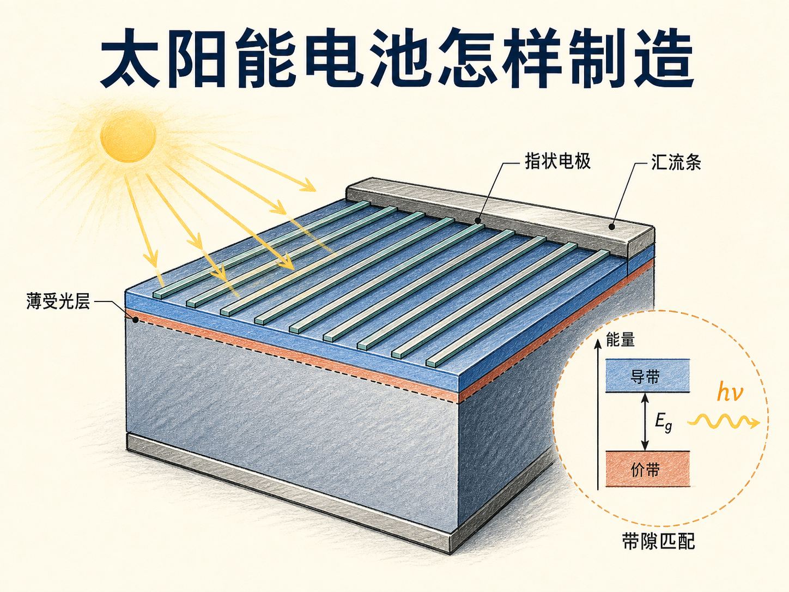
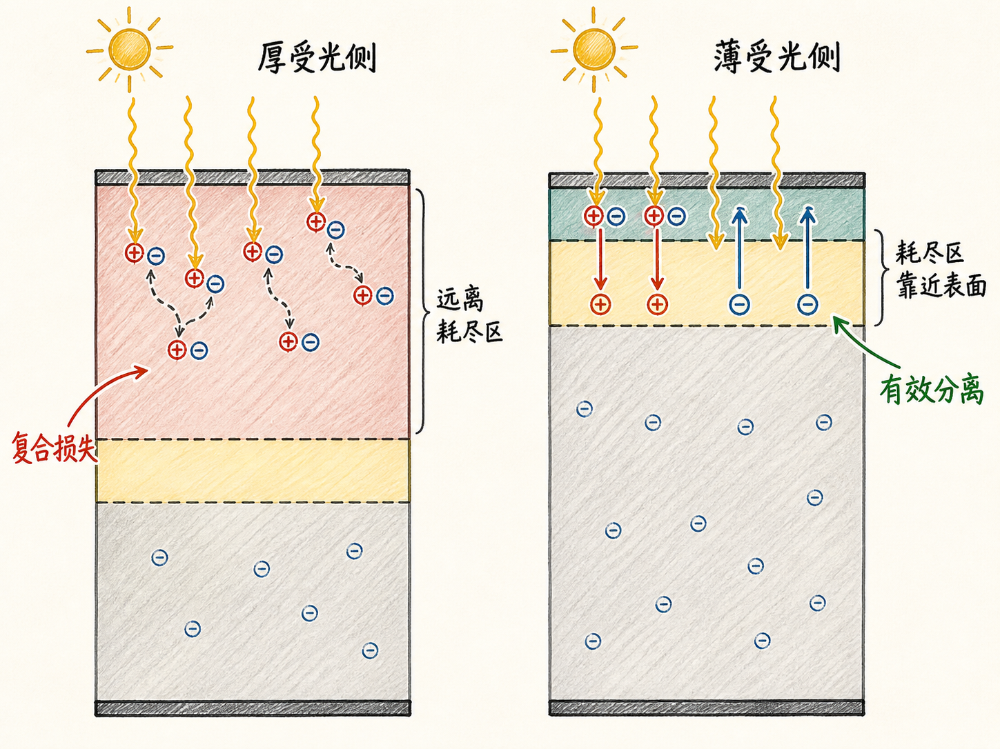
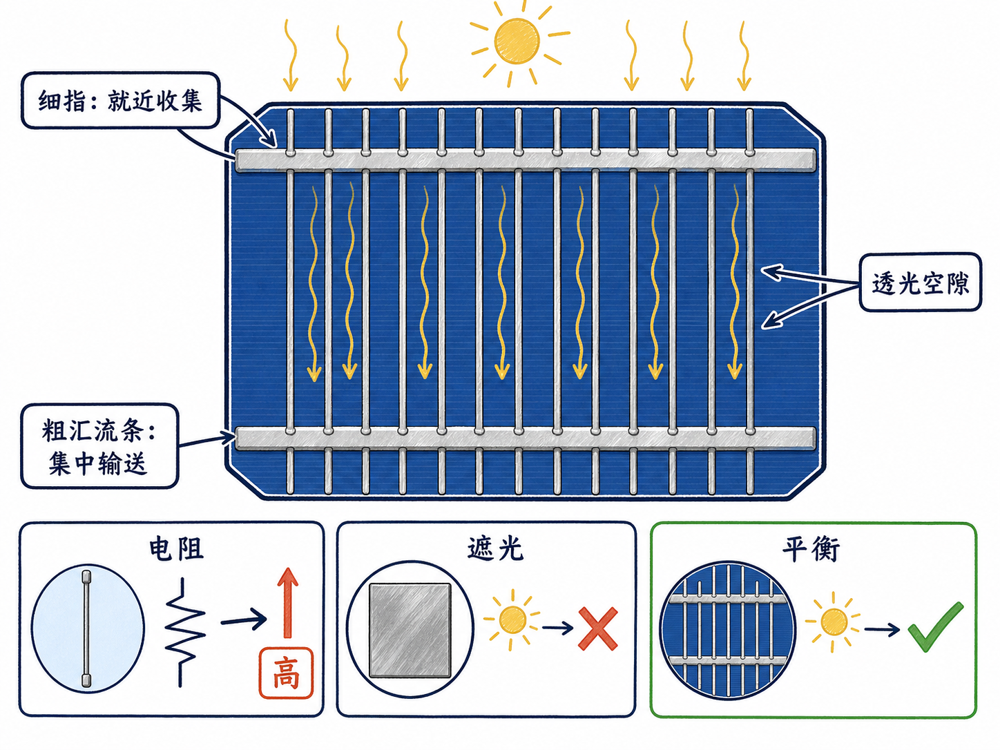
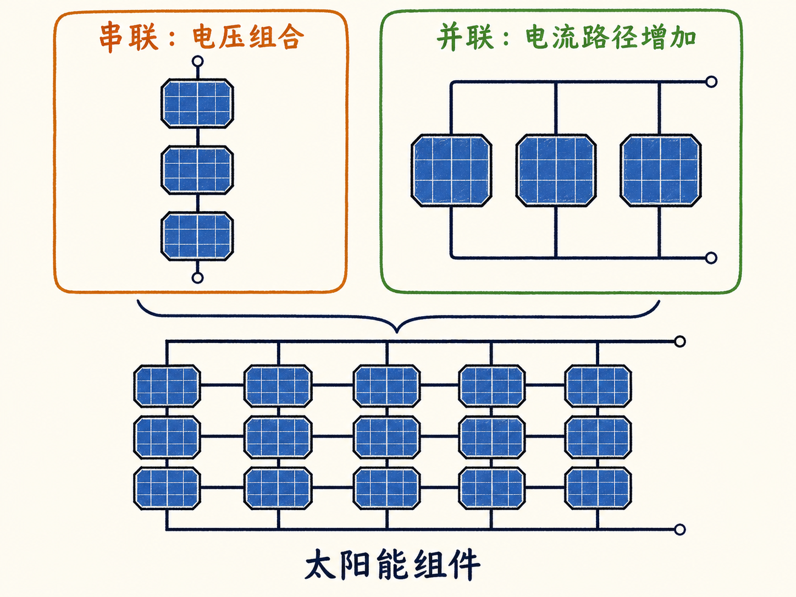
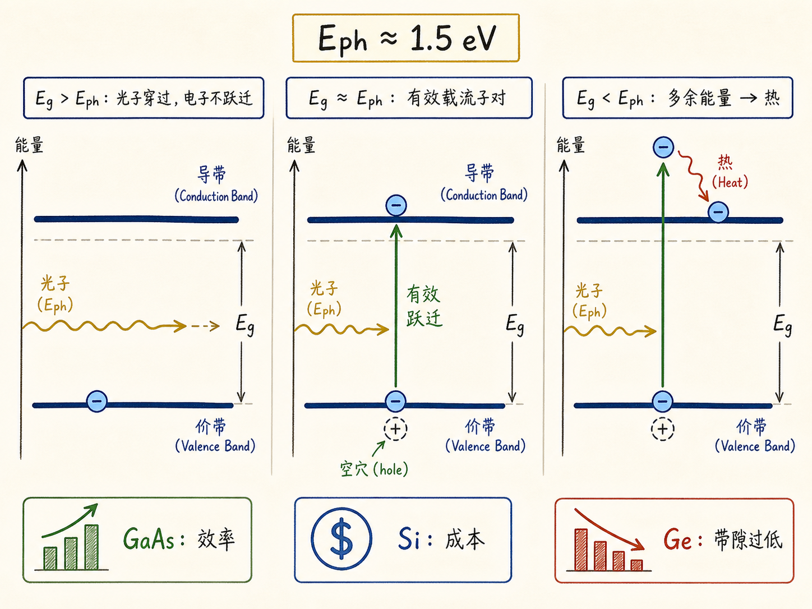

# 太阳能电池不是一块 PN 结：结构与材料都在减少损失

知道 PN 结能产生光伏电压，并不等于把一块 PN 结放在太阳下就能得到好用的太阳能电池。真实器件还要回答三个工程问题：光在哪里被吸收，金属怎样把电荷收出来，以及材料带隙怎样匹配太阳光。

这三个问题都在处理同一件事——别让已经到达器件的光能在变成外部电能之前损失掉。

读完这篇，你会知道

- 为什么受光侧半导体必须做薄
- 正面金属电极为什么不能只求越粗越好
- 指状电极和汇流条怎样兼顾透光与导电
- 多个太阳能电池怎样组成组件
- 为什么带隙过高或过低都会损失太阳光能

## 先让光生载流子出现在电场能管到的地方

光子能量大于带隙时，会产生电子—空穴对。只有载流子在耗尽区内产生，或能及时到达这个区域，结区电场才有机会在复合前把电子和空穴分开。

如果受光侧太厚，许多光子会在离耗尽区很远的位置被吸收。那里缺少把两种载流子迅速拉开的结区电场，电子和空穴更容易就地复合，光能没有形成可收集的电荷。

因此，受光的一侧要做得很薄，让耗尽区靠近表面；另一侧可以较厚。薄层的目的不是单纯少用材料，而是缩短光到结区、以及光生载流子到有效分离区域的距离。

## 正面电极要导电，也要给光让路

太阳能电池必须有金属接触才能接入外部电路。背面可以使用较厚的整面金属层，正面却存在直接冲突：金属越多，收集路径越宽、电阻越低；金属越多，也会遮住越多受光面积。

只放一根很细的线，遮光少，但大量载流子都要挤过这条高电阻路径。换成很宽的金属层，电阻降低，却让许多光根本进不了半导体。

解决办法是把正面电极做成许多指状细栅线。细指分布在表面，缩短电荷到金属的横向距离，同时在指间留下大量透光空隙；再用较粗的汇流条把各细指收集的电荷汇总。它不是消灭权衡，而是在遮光和电阻之间找到可用平衡。

## 从单电池到组件：连接方式决定输出组合

一块太阳能板由许多单独的太阳能电池组成。单电池之间既可以串联，也可以并联：串联把各单元的电压组合起来，并联提供多条电流路径。

因此，看到太阳能板表面的细线和粗线时，可以把它们分成两级：细指负责就近收集，粗汇流条负责集中输送；再往上，单电池的串并联形成整个组件的输出。

## 材料带隙要接住光子，又不能浪费太多能量

太阳光子的能量分布很宽，视频用约 1.5 eV 表示多数光子的粗略能量。若材料带隙高于光子能量，电子跨不过去，光子不能产生电子—空穴对；带隙接近时，光子能量能有效完成跃迁；带隙远低于光子能量时，电子虽然能跃迁，却会先到达较高能量，再降到导带底，多余能量以热散掉。

所以，“能吸收”还不够，还要尽量减少超出带隙的能量损失。在这个比较里，砷化镓的带隙更接近约 1.5 eV，适合追求较高效率；硅的效率低一些，但它便宜、容易获得，综合成本更有优势；锗的带隙太低，视频给出的选择是不使用。

太阳能电池的结构和材料选择由此连成一条线：薄受光层让光生载流子靠近结区，正面栅线兼顾透光与低电阻，组件连接组合电压和电流，合适带隙则决定多少光能真正留下来成为电能。
