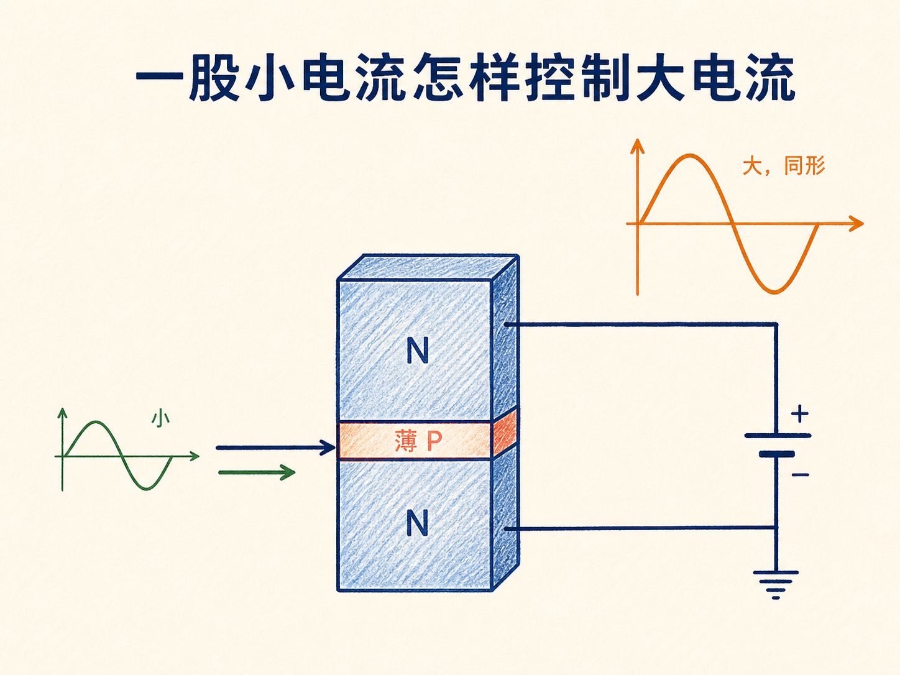
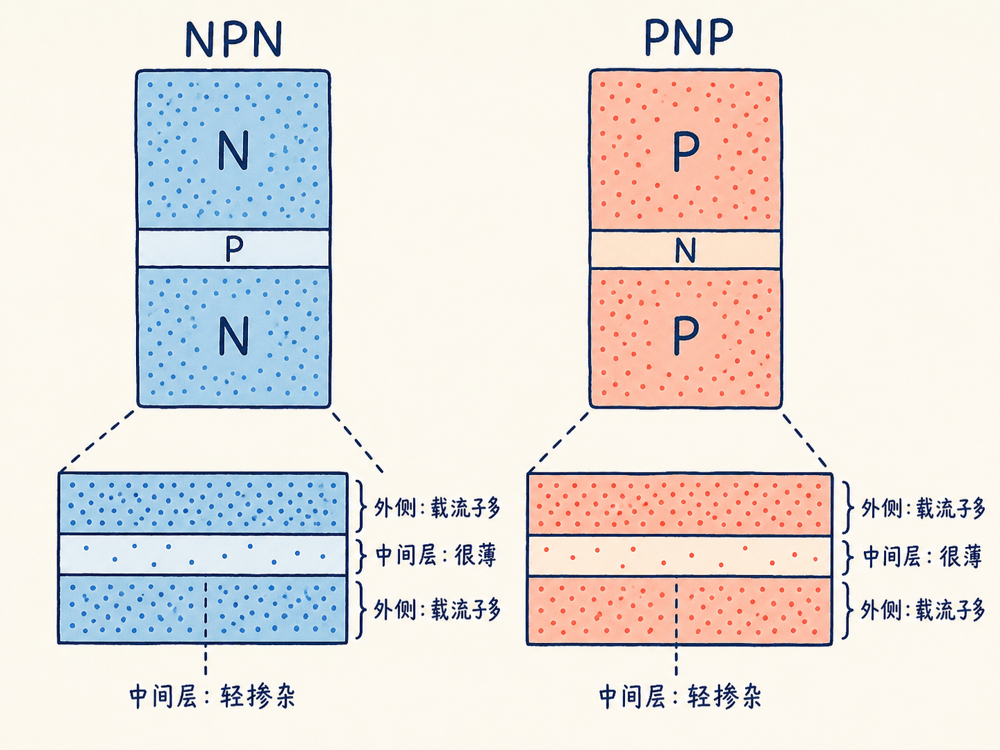
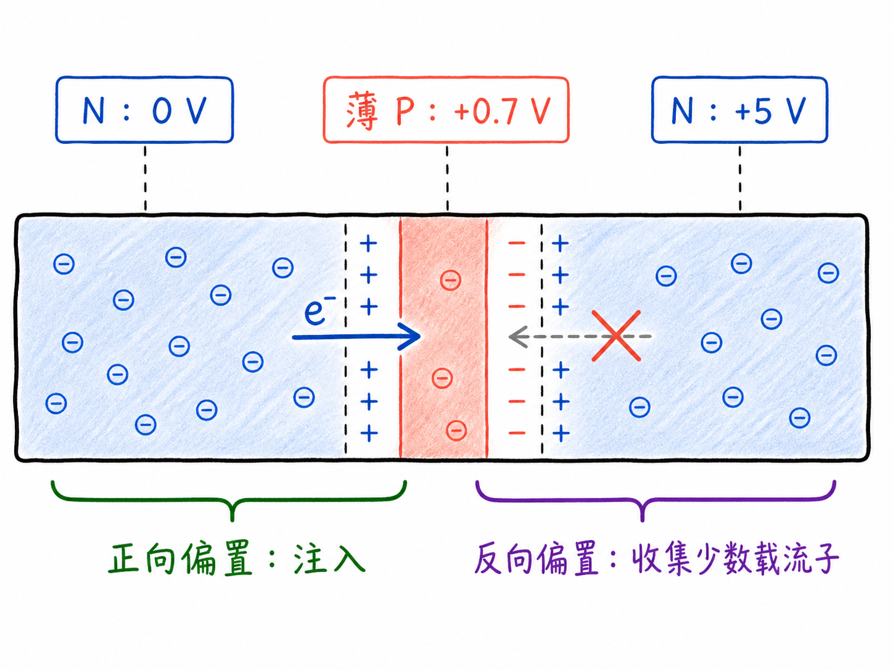
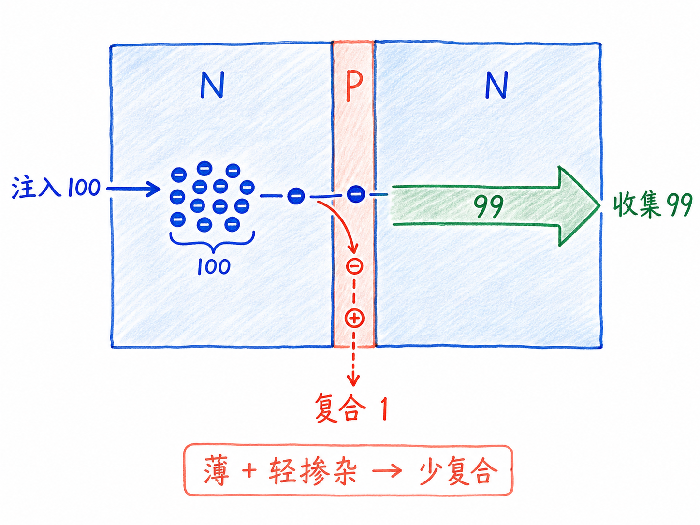
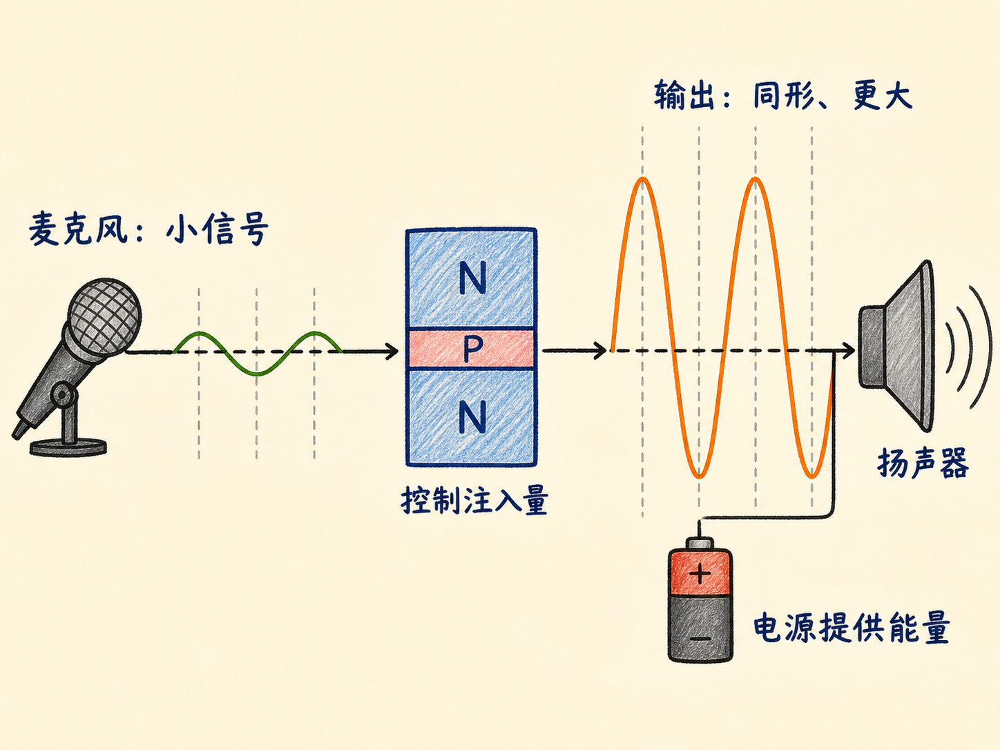

# 一股小电流，怎样控制一股大电流

麦克风产生的电流已经带着声音的变化图样，却小得无法直接推动扬声器。真正需要的不是把信号换成另一种形状，而是让每一次起伏都按原样保留，同时把幅度放大。

晶体管完成这件事的办法不是凭空制造电流，而是让中间端的一点变化，控制另一条由电源提供的更大电流。

读完这篇，你会知道

- NPN 和 PNP 晶体管由哪三层半导体组成
- 为什么中间区域必须薄且轻掺杂
- NPN 的两个 PN 结为什么要一正偏、一反偏
- 注入电子为什么大多能穿过中间 P 区
- 小电流怎样控制同形但更大的输出电流

## 三层材料中，最关键的是中间薄层

把 N 型、P 型、N 型半导体依次连接，就得到 NPN 结构；把顺序反过来，得到 PNP 结构。以 NPN 为例，左右两个 N 区有大量电子，中间 P 区的空穴较少。

中间 P 区必须同时满足两个条件：很薄，而且轻掺杂。轻掺杂意味着可供复合的空穴少；很薄意味着电子穿过这段区域需要走的距离短。两者共同降低电子在中间区域复合的机会。

## 只给两端加电压，电流通道仍被结挡住

先让左侧 N 区接地，右侧 N 区接较高正电压。右端虽然会吸引电子，但电子要形成连续流动，必须先从左 N 区跨进中间 P 区。

两层材料交界处都有耗尽区和势垒。没有驱动中间 P 区时，左侧结不允许大量电子注入，因此整条路径没有明显主电流。右端电源在等待载流子，却不能单独把势垒另一侧的电子拉过来。

## 一正偏负责注入，一反偏负责收集

把中间 P 区电位抬到约 +0.7 V，左 N—中 P 结获得正向偏置，电子开始从左 N 区注入薄 P 区。与此同时，中 P—右 N 结保持反向偏置。

进入 P 区的电子只有少数与空穴复合，因为空穴本来就少，路径又很短。大多数电子能到达右侧结；它们在 P 区属于少数载流子，会被反偏结电场迅速扫入右 N 区，再从右端流出。

于是两个结分工明确：正偏结决定注入多少电子，反偏结负责收集绝大多数已注入电子。中间薄层把这两个过程接在一起。

## 小支路的变化，复制成大支路的变化

假设每秒有 100 个电子注入，中间 P 区只有 1 个与空穴复合，约 99 个被右端收集。中间端只需补上这 1 个复合造成的电荷缺口，而右端却获得约 99 个电子对应的大电流。

如果中间端作用加倍，使每秒注入约 200 个电子，复合数和收集数也近似按同样比例变化。这样，右侧大电流的起伏图样跟随中间小电流，只是幅度大得多。

把麦克风信号接到中间控制端，声音让正向偏置随时间变化，进而改变电子注入量。右侧电源提供的大电流会复制这串变化，再去驱动扬声器。声音的图样被保留，幅度却被提高——这就是晶体管放大的核心链路。
