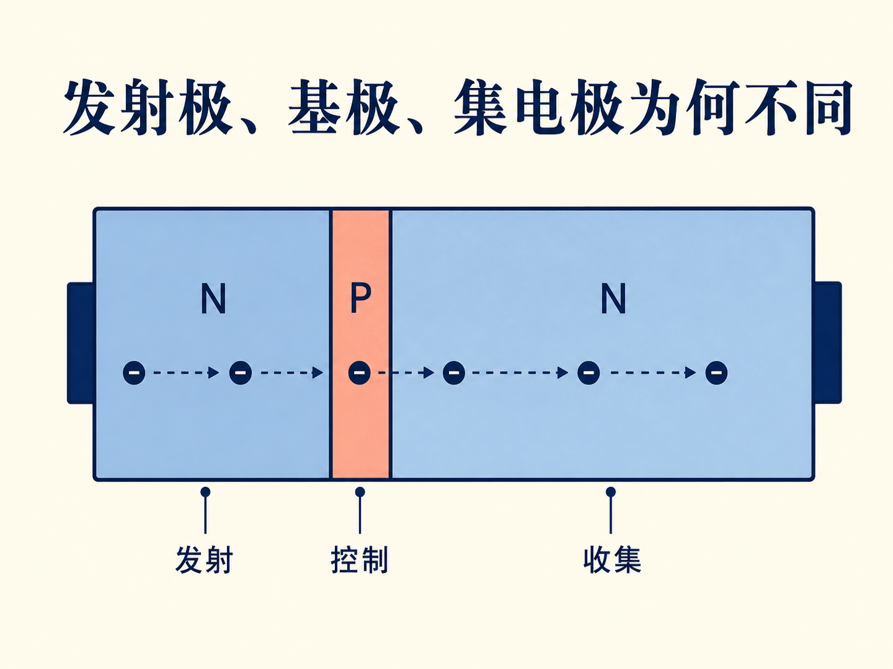
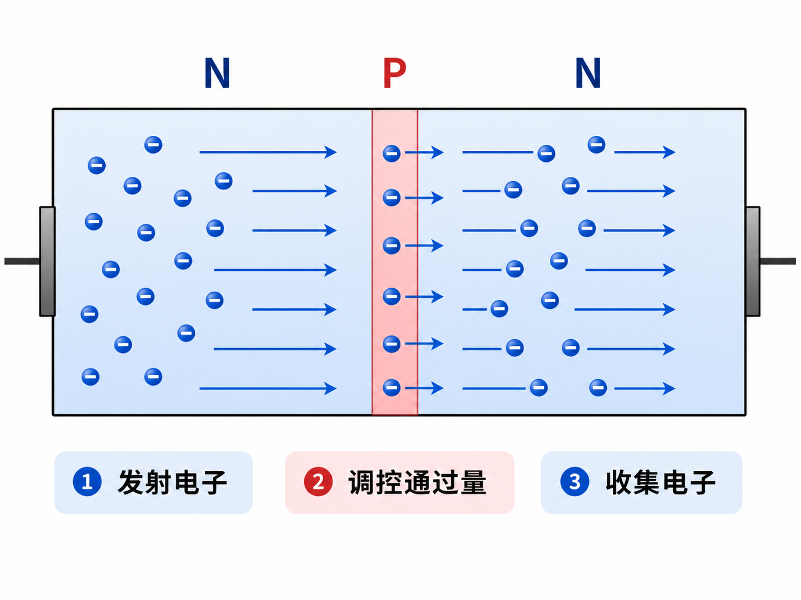
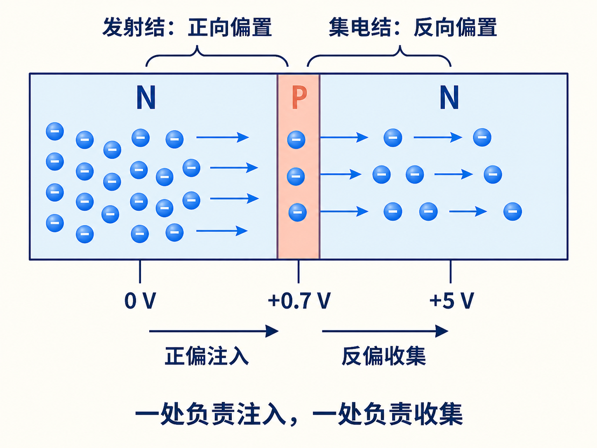
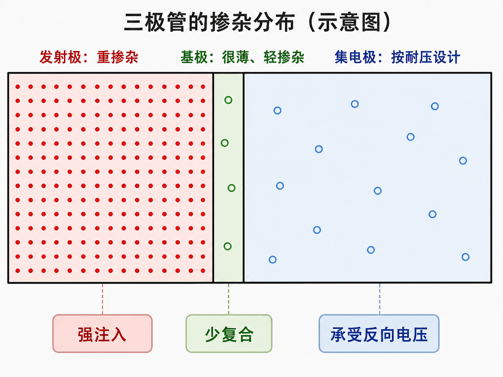
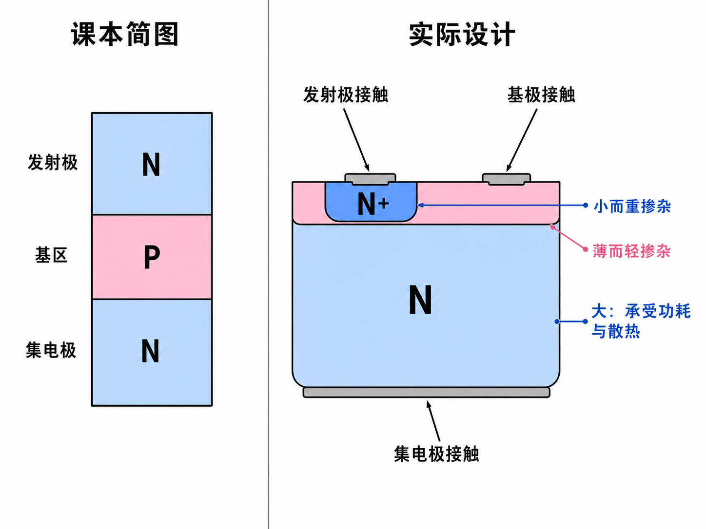

# 为什么发射极、基极和集电极长得不一样

把 NPN 晶体管画成三层材料时，它看起来像一块 N、一张薄 P、再一块 N。既然两边都是 N 型，为什么不能随便把左右两端互换？

因为“材料类型相同”只说明它们都有大量自由电子，并不说明它们承担相同任务。晶体管的三个名字，正是三种任务的标签。

## 三个名字，记录了电子一路经历的三件事

在放大状态下，电子先从一侧 N 区进入薄薄的 P 区，再穿过 P 区，被另一侧 N 区收走。

第一侧把电子“发射”出去，所以叫发射极；中间区域决定有多少电子能够通过，所以叫基极；最后一侧把电子“收集”起来，所以叫集电极。对于 PNP 晶体管，主要载流子换成空穴，但三个区域扮演的角色仍然对应发射、控制和收集。

## 两处 PN 结，一处要正偏，一处要反偏

发射极—基极结必须正向偏置。势垒降低后，发射极中的多数载流子才能大量注入基区。若这里反向偏置，注入通道被压住，后面自然没有多少载流子可供收集。

集电极—基极结则必须反向偏置。注入基区的电子在 P 型基区中属于少数载流子；反向结区的电场恰好能把这些电子扫进集电极。如果把这处结也正向偏置，集电极自身的电子会向基区扩散，抵消原来的净输运，放大过程就乱了。

## 掺杂不对称，是为了“多发射、少损失、能耐压”

发射极要重掺杂。它储备的电子越多，正偏时能够注入基区的电子就越多。

基区必须很薄，而且轻掺杂。薄让电子穿越距离短，轻掺杂意味着可供复合的空穴少；两者共同减少电子在途中消失的概率。

集电极的掺杂首先不是为了增加注入，而是要照顾反向偏置下的耐压。集电结若过早击穿，异常大电流会破坏正常放大，因此设计上常让集电极相对较轻掺杂，以提高反向击穿电压。不过，这里没有统一的浓度排序：不同晶体管的集电极可能是中等掺杂，也可能比基区更轻。固定不变的是发射极重掺杂，以及基区薄而轻掺杂。

## 集电极做得大，是因为它还要承担功耗

理想化三层图常把两侧画得一样大，真实器件却通常让集电极占据更大的体积。电流流过器件会产生热；较大的集电区域不容易在同样能量输入下迅速升温，也更适合承受器件工作时的功耗。

发射极为了实现强注入，可以做得较小而重掺杂；基区为了减少复合，本来就必须很薄；剩下的集电极既要收集载流子、承受反向电压，又要处理热。因此，三端看似只是三个接线点，背后其实是三种不同的材料与几何设计。
