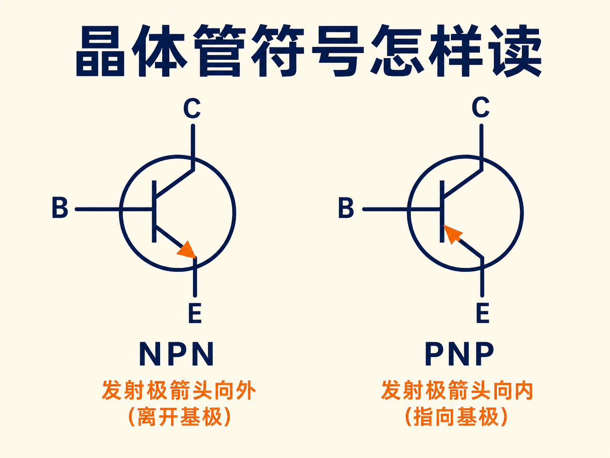
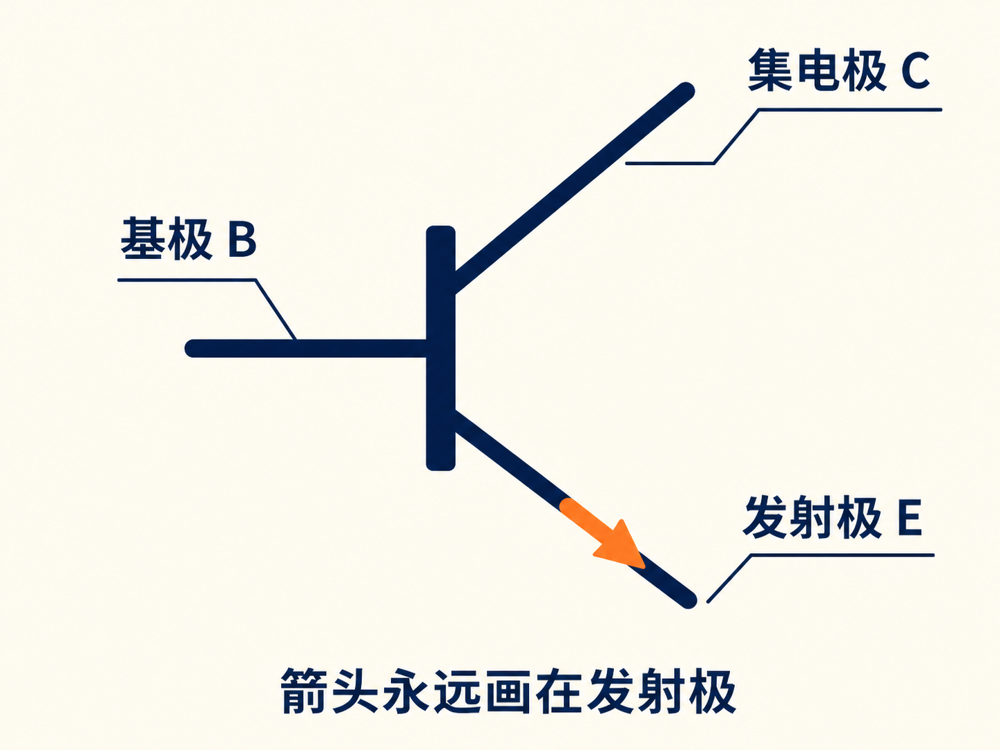
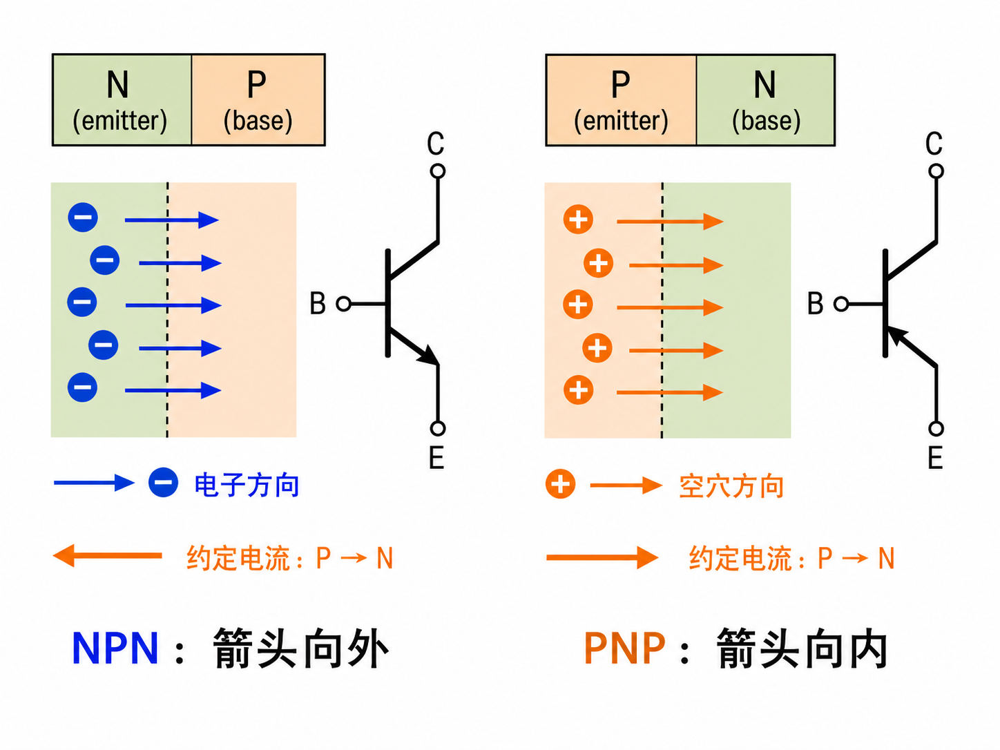
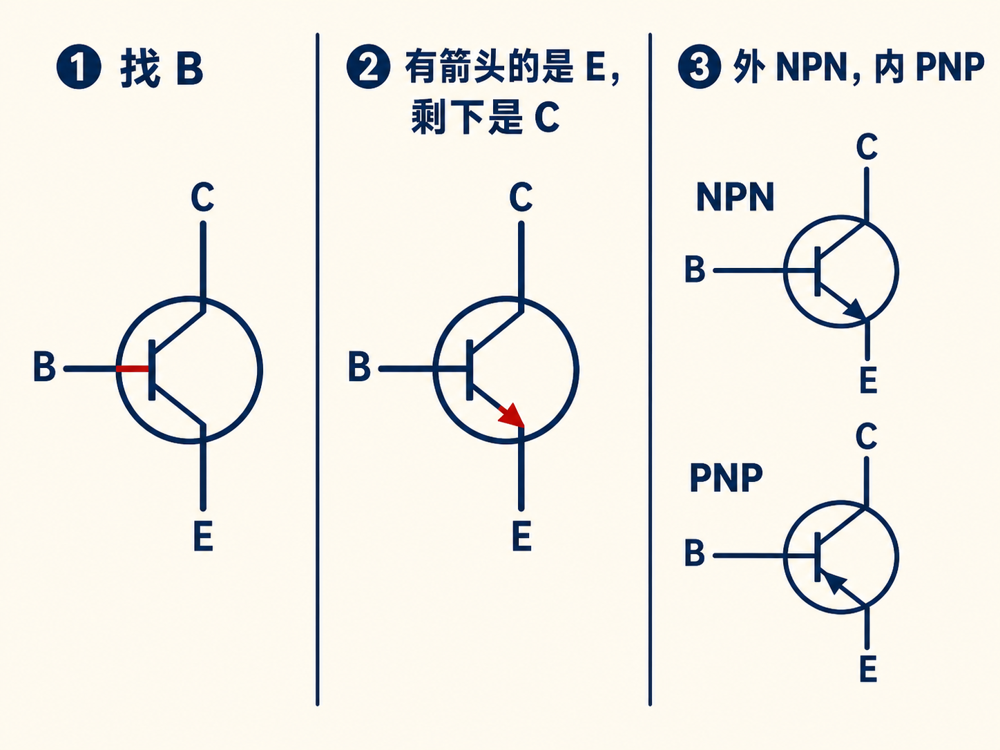
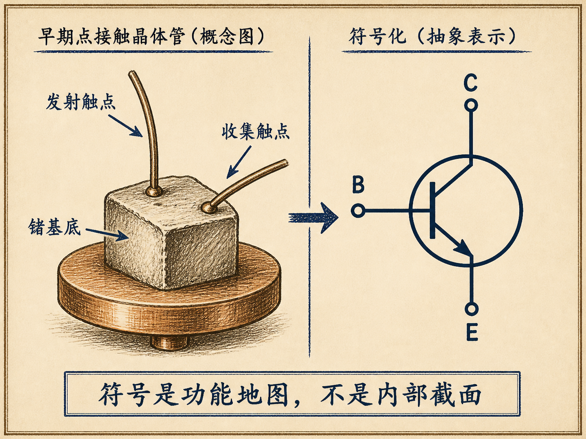

# 晶体管符号上的箭头，到底在告诉你什么

晶体管符号只有三根引线和一个小箭头，却要同时回答四个问题：哪根是基极？哪根是发射极？哪根是集电极？它又是 NPN 还是 PNP？

诀窍不是死背两幅图，而是按照同一个顺序解码。

## 先找基极，再用箭头锁定发射极

符号中连接中间直线的端子是基极 B。剩下两根斜线中，带箭头的那根永远是发射极 E，最后一根自然是集电极 C。

所以箭头的第一个任务不是区分 NPN 与 PNP，而是先告诉你“这里是发射极”。无论符号旋转成什么方向，这条规则都不变。

## 箭头画的是约定电流，不是电子运动

PN 结中的约定电流方向总是从 P 型一侧指向 N 型一侧。晶体管符号把发射结的这个方向画在发射极引线上。

在 NPN 中，电子从 N 型发射极进入 P 型基区，但电子带负电，所以约定电流与电子反向：从基区 P 指向发射极 N。箭头因此离开基极，指向外侧。

在 PNP 中，空穴从 P 型发射极进入 N 型基区，约定电流就是空穴运动方向：从发射极 P 指向基区 N。箭头因此指向基极，也就是向内。

## 一道符号题，可以固定用三步完成

第一步，找中间直线，标出 B。第二步，找箭头，把所在斜线标成 E，剩下的标成 C。第三步，看箭头相对基极是向外还是向内：向外是 NPN，向内是 PNP。

也可以反向检查：箭头必须从 P 指向 N。如果你给三个区域标完 N、P 后发现箭头从 N 指向 P，就说明判断错了。

## 这个奇怪形状，保留了早期器件的影子

早期点接触晶体管由两个金属触点压在一块锗半导体上。两个触点分别承担发射和收集作用，锗块像一块承托它们的“基底”。把它抽象成线条，确实很像两根斜线接到中间基极上。

现代晶体管的内部结构已经不是这副外形，但名称和电路符号延续了下来。符号不是器件截面的写实画，而是一张压缩过的功能地图：B 给出共同基准，E 上的箭头同时编码端子身份与发射结类型，剩下的一端就是 C。
